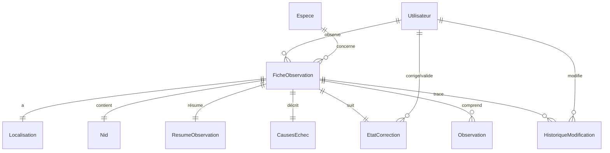
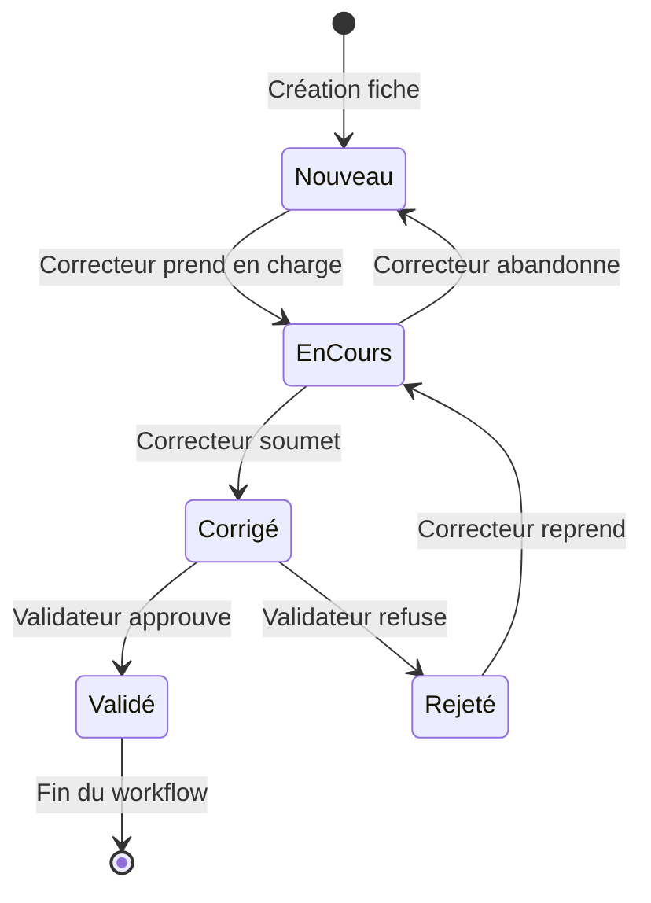
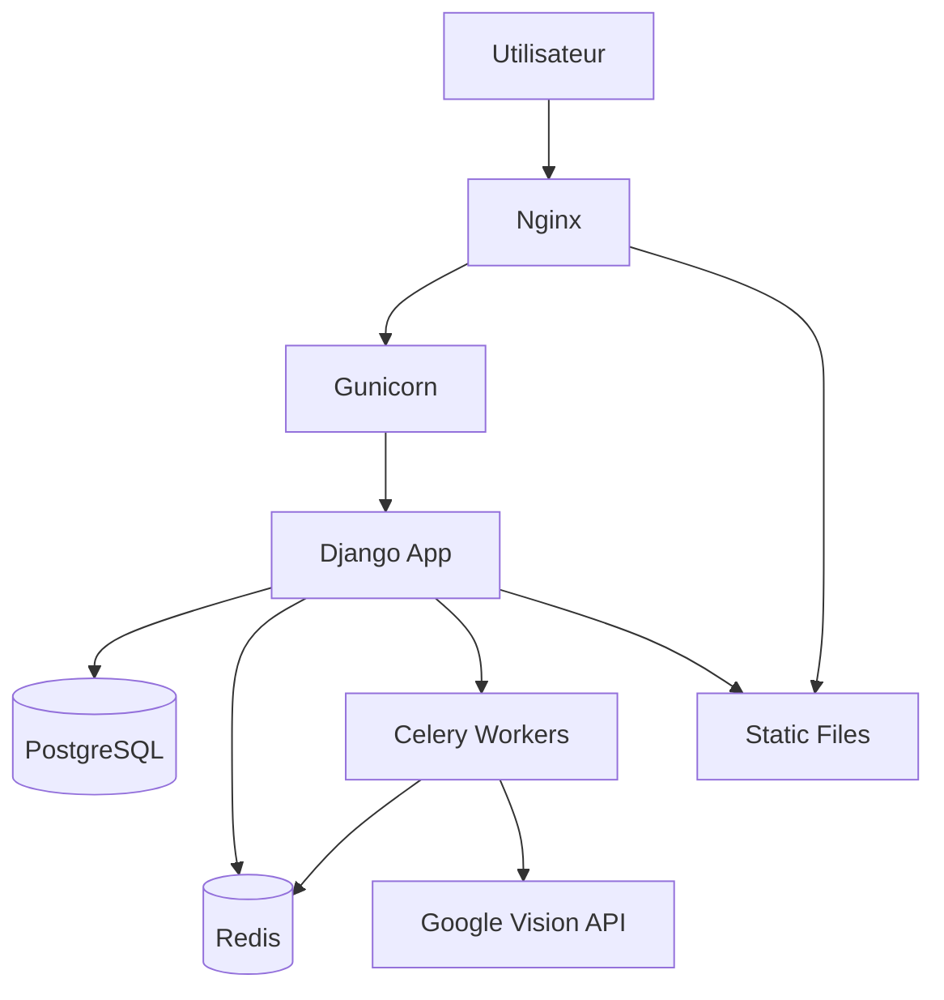

# Architecture du Projet

## Vue d'ensemble

**Observations Nids** est une application Django modulaire organisée en applications thématiques. Chaque application a une responsabilité claire et bien définie, suivant le principe de séparation des préoccupations (Separation of Concerns).

### Objectifs architecturaux

1. **Modularité** : Applications indépendantes et réutilisables
2. **Maintenabilité** : Code organisé logiquement et facile à comprendre
3. **Scalabilité** : Architecture permettant l'ajout de fonctionnalités sans refonte
4. **Traçabilité** : Historique complet de toutes les modifications
5. **Performance** : Optimisations au niveau de la base de données et des requêtes

---

## Structure des applications Django

```
observations_nids/
├── accounts/              # Authentification et gestion utilisateurs
├── audit/                 # Historique et traçabilité des modifications
├── core/                  # Fonctionnalités communes et utilitaires
├── geo/                   # Gestion des localisations géographiques
├── ingest/                # Ingestion et traitement de données externes
├── observations/          # Application principale - gestion des observations
├── review/                # Système de révision et validation
├── taxonomy/              # Classification taxonomique des espèces
└── observations_nids/     # Configuration Django principale
```

---

## Applications et responsabilités

### accounts/ - Gestion des utilisateurs

**Rôle** : Authentification, autorisation et gestion des profils utilisateurs.

**Modèles principaux :**
- `Utilisateur` (AUTH_USER_MODEL personnalisé)

**Fonctionnalités :**
- Authentification par email (au lieu de username)
- Système de rôles et permissions :
  - **Observateur** : peut créer et modifier ses propres fiches
  - **Correcteur** : peut corriger les fiches des autres
  - **Validateur** : peut valider ou rejeter les fiches
  - **Administrateur** : accès complet au système
- Gestion des profils utilisateurs
- Historique des connexions

**Fichiers clés :**
```
accounts/
├── models.py              # Modèle Utilisateur personnalisé
├── forms.py               # Formulaires d'inscription et profil
├── views.py               # Vues d'authentification
├── admin.py               # Interface admin personnalisée
└── permissions.py         # Decorateurs et mixins de permissions
```

**Particularités :**
- Utilise `AbstractBaseUser` et `PermissionsMixin` de Django
- Email comme identifiant unique
- Champs supplémentaires : nom, prénom, téléphone, organisation

---

### audit/ - Traçabilité

**Rôle** : Enregistrement automatique de toutes les modifications sur les données sensibles.

**Modèles principaux :**
- `HistoriqueModification`

**Fonctionnalités :**
- Tracking automatique via signaux Django (`post_save`, `post_delete`)
- Granularité au niveau du champ (enregistre chaque modification)
- Interface de consultation de l'historique
- Export de l'historique en CSV/JSON

**Structure HistoriqueModification :**
```python
class HistoriqueModification(models.Model):
    fiche = ForeignKey(FicheObservation)
    utilisateur = ForeignKey(Utilisateur)
    date_modification = DateTimeField(auto_now_add=True)
    champ_modifie = CharField(max_length=100)
    ancienne_valeur = TextField(blank=True, null=True)
    nouvelle_valeur = TextField(blank=True, null=True)
    type_modification = CharField(choices=['creation', 'modification', 'suppression'])
```

**Fichiers clés :**
```
audit/
├── models.py              # Modèle HistoriqueModification
├── signals.py             # Signaux pour tracking automatique
├── views.py               # Consultation de l'historique
└── utils.py               # Fonctions utilitaires (diff, export)
```

**Particularités :**
- Capture automatique sans intervention manuelle
- Stockage JSON des valeurs complexes
- Index sur `fiche` et `date_modification` pour performance
- Possibilité de filtrer par utilisateur, période, type de modification

---

### core/ - Utilitaires partagés

**Rôle** : Fonctions et classes réutilisables à travers toute l'application.

**Contenu :**
- Mixins de vues réutilisables
- Décorateurs personnalisés
- Fonctions utilitaires (formatage, validation, etc.)
- Classes de base personnalisées
- Constantes partagées

**Fichiers clés :**
```
core/
├── mixins.py              # Mixins pour les vues (permissions, etc.)
├── decorators.py          # Décorateurs personnalisés
├── utils.py               # Fonctions utilitaires
├── validators.py          # Validateurs personnalisés
└── constants.py           # Constantes de l'application
```

**Exemples de contenu :**
- `RequiredPermissionMixin` : contrôle d'accès basé sur les rôles
- `AuditMixin` : activation automatique de l'audit pour un modèle
- Fonctions de formatage de dates, coordonnées GPS
- Validateurs de codes postaux, emails, etc.

---

### geo/ - Données géographiques

**Rôle** : Gestion des localisations et données géographiques des sites d'observation.

**Modèles principaux :**
- `Localisation`

**Structure Localisation :**
```python
class Localisation(models.Model):
    fiche = OneToOneField(FicheObservation)
    commune = CharField(max_length=100)
    departement = CharField(max_length=100)
    lieu_dit = CharField(max_length=200, blank=True)
    coordonnees_gps = CharField(max_length=50)  # Format: "lat,lon"
    altitude = IntegerField(blank=True, null=True)
    paysage = CharField(max_length=100, choices=PAYSAGE_CHOICES)
    
    # Métadonnées
    precision_gps = IntegerField(default=10)  # Précision en mètres
    source_coordonnees = CharField(max_length=50)  # GPS, carte, etc.
```

**Fonctionnalités :**
- Validation des coordonnées GPS
- Calcul automatique du département depuis les coordonnées
- Géocodage inverse (coordonnées → commune)
- Support de différents formats de coordonnées
- Calcul de distance entre sites

**Fichiers clés :**
```
geo/
├── models.py              # Modèle Localisation
├── forms.py               # Formulaires avec validation géographique
├── utils.py               # Fonctions de géocodage, calcul de distance
└── validators.py          # Validateurs de coordonnées GPS
```

**Choix de paysage :**
- Forêt
- Bocage
- Prairie
- Zone urbaine
- Zone humide
- Montagne
- Littoral

---

### ingest/ - Traitement des données externes

**Rôle** : Import et normalisation de données depuis des sources externes.

**Fonctionnalités :**
- Import depuis fichiers JSON structurés
- Parsing et normalisation des données
- Gestion des candidats (données non validées)
- Matching intelligent (espèces, observateurs)
- Validation et déduplication

**Modèles :**
- `CandidatEspece` : espèces potentielles non validées
- `CandidatObservateur` : observateurs potentiels non validés
- `ImportLog` : historique des imports

**Processus d'import :**
1. Lecture du fichier source (JSON, CSV, Excel)
2. Parsing et extraction des données
3. Validation de la structure
4. Création de candidats (données temporaires)
5. Matching avec les données existantes
6. Validation manuelle si nécessaire
7. Création des objets définitifs

**Fichiers clés :**
```
ingest/
├── models.py              # Modèles de candidats et logs
├── parsers.py             # Parsers pour différents formats
├── matchers.py            # Algorithmes de matching
├── validators.py          # Validation des données importées
└── management/commands/   # Commandes d'import
    └── import_data.py
```

---

### observations/ - Application principale

**Rôle** : Cœur de l'application, gestion des observations ornithologiques.

**Modèles principaux :**

#### FicheObservation
Le modèle central représentant une fiche d'observation complète.

```python
class FicheObservation(models.Model):
    # Identifiants
    num_fiche = AutoField(primary_key=True)
    
    # Relations
    observateur = ForeignKey(Utilisateur, on_delete=CASCADE)
    espece = ForeignKey(Espece, on_delete=PROTECT)
    
    # Données temporelles
    annee = IntegerField()
    date_creation = DateTimeField(auto_now_add=True)
    date_modification = DateTimeField(auto_now=True)
    
    # Données de transcription
    chemin_image = CharField(max_length=500, blank=True)
    chemin_json = CharField(max_length=500, blank=True)
    transcription = BooleanField(default=False)
    
    # Relations OneToOne (créées automatiquement)
    # - localisation (Localisation)
    # - nid (Nid)
    # - resume_observation (ResumeObservation)
    # - causes_echec (CausesEchec)
    # - etat_correction (EtatCorrection)
```

**Relations OneToOne expliquées :**

Ces modèles sont liés 1:1 avec FicheObservation et sont créés automatiquement lors de la sauvegarde d'une nouvelle fiche (via la méthode `save()` surchargée).

#### Observation
Observations individuelles au sein d'une fiche (relation OneToMany).

```python
class Observation(models.Model):
    fiche = ForeignKey(FicheObservation, related_name='observations')
    date_observation = DateField()
    heure_observation = TimeField(blank=True, null=True)
    nombre_oeufs = IntegerField(default=0)
    nombre_poussins = IntegerField(default=0)
    notes = TextField(blank=True)
    
    class Meta:
        ordering = ['date_observation', 'heure_observation']
```

#### Nid
Caractéristiques physiques du nid observé.

```python
class Nid(models.Model):
    fiche = OneToOneField(FicheObservation)
    hauteur = DecimalField(max_digits=5, decimal_places=2)  # en mètres
    support = CharField(max_length=100, choices=SUPPORT_CHOICES)
    orientation = CharField(max_length=2, choices=ORIENTATION_CHOICES)
    couverture_vegetale = CharField(max_length=100, blank=True)
    remarques = TextField(blank=True)
```

**Choix de support :**
- Arbre
- Arbuste
- Pylône
- Bâtiment
- Falaise
- Sol
- Autre

**Orientations :** N, NE, E, SE, S, SW, W, NW

#### ResumeObservation
Synthèse des données de reproduction.

```python
class ResumeObservation(models.Model):
    fiche = OneToOneField(FicheObservation)
    nombre_oeufs_pondus = IntegerField(default=0)
    nombre_oeufs_eclos = IntegerField(default=0)
    nombre_poussins_envoles = IntegerField(default=0)
    succes_reproduction = BooleanField(default=False)
    date_ponte = DateField(blank=True, null=True)
    date_envol = DateField(blank=True, null=True)
```

#### CausesEchec
Causes d'échec de la nidification.

```python
class CausesEchec(models.Model):
    fiche = OneToOneField(FicheObservation)
    echec = BooleanField(default=False)
    cause_principale = CharField(max_length=100, choices=CAUSE_CHOICES, blank=True)
    details = TextField(blank=True)
    date_constat_echec = DateField(blank=True, null=True)
```

**Causes possibles :**
- Prédation
- Conditions météorologiques
- Dérangement humain
- Abandon
- Destruction du nid
- Maladie
- Autre

**Structure des vues :**
```
observations/views/
├── views_observation.py           # CRUD des observations
├── saisie_observation_view.py     # Interface de correction
├── view_transcription.py          # Workflow de transcription OCR
└── api_views.py                   # APIs pour AJAX
```

**Templates :**
```
observations/templates/
├── observations/
│   ├── liste_fiches.html
│   ├── fiche_observation.html
│   └── saisie_observation_optimise.html  # Interface principale de correction
└── transcription/
    ├── demarrer.html
    ├── selection_repertoire.html
    └── resultats.html
```

**Fonctionnalités clés :**
- Transcription OCR automatique via Google Vision API
- Saisie et correction manuelle avec formsets Django
- Validation en temps réel
- Système de remarques avec AJAX
- Export des données (CSV, JSON, Excel)

---

### review/ - Révision et validation

**Rôle** : Workflow de correction et validation des fiches d'observation.

**Modèles principaux :**
- `EtatCorrection`

**Structure EtatCorrection :**
```python
class EtatCorrection(models.Model):
    fiche = OneToOneField(FicheObservation)
    statut = CharField(max_length=20, choices=STATUT_CHOICES)
    pourcentage_completion = IntegerField(default=0)
    correcteur = ForeignKey(Utilisateur, related_name='fiches_en_correction', null=True)
    validateur = ForeignKey(Utilisateur, related_name='fiches_validees', null=True)
    date_debut_correction = DateTimeField(null=True, blank=True)
    date_fin_correction = DateTimeField(null=True, blank=True)
    date_validation = DateTimeField(null=True, blank=True)
    commentaires_correcteur = TextField(blank=True)
    commentaires_validateur = TextField(blank=True)
```

**Workflow de statuts :**

1. **nouveau** : Fiche créée (par transcription ou saisie manuelle)
2. **en_cours** : En cours de correction par un correcteur
3. **corrige** : Correction terminée, soumise pour validation
4. **valide** : Approuvée par un validateur
5. **rejete** : Refusée, retour en correction avec commentaires

**Transitions autorisées :**
```
nouveau → en_cours (correcteur prend en charge)
en_cours → corrige (correcteur soumet)
en_cours → nouveau (correcteur abandonne)
corrige → valide (validateur approuve)
corrige → rejete (validateur refuse)
rejete → en_cours (correcteur reprend)
```

**Permissions :**
- `nouveau` → `en_cours` : Correcteur ou Validateur
- `en_cours` → `corrige` : Correcteur assigné uniquement
- `corrige` → `valide/rejete` : Validateur uniquement

**Fichiers clés :**
```
review/
├── models.py              # Modèle EtatCorrection
├── views.py               # Vues de workflow
├── forms.py               # Formulaires de validation
└── utils.py               # Logique métier du workflow
```

---

### taxonomy/ - Taxonomie

**Rôle** : Classification scientifique des espèces d'oiseaux.

**Modèles principaux :**
- `Espece`

**Structure Espece :**
```python
class Espece(models.Model):
    code = CharField(max_length=10, unique=True)  # Code normalisé
    nom_scientifique = CharField(max_length=200)
    nom_francais = CharField(max_length=200)
    nom_anglais = CharField(max_length=200, blank=True)
    ordre = CharField(max_length=100)
    famille = CharField(max_length=100)
    genre = CharField(max_length=100)
    
    # Statut de conservation
    statut_uicn = CharField(max_length=2, choices=STATUT_UICN_CHOICES)
    protection_france = BooleanField(default=False)
    
    # Métadonnées
    description = TextField(blank=True)
    photo = ImageField(upload_to='especes/', blank=True)
    
    class Meta:
        ordering = ['nom_francais']
        verbose_name_plural = 'Espèces'
```

**Statuts UICN :**
- LC : Préoccupation mineure (Least Concern)
- NT : Quasi menacé (Near Threatened)
- VU : Vulnérable (Vulnerable)
- EN : En danger (Endangered)
- CR : En danger critique (Critically Endangered)

**Fonctionnalités :**
- Recherche multi-critères (nom français, scientifique, code)
- Filtrage par famille, ordre, statut de conservation
- Interface admin avec import/export CSV
- API pour autocomplétion dans les formulaires

---

## Relations entre modèles

### Diagramme des relations principales

```
Utilisateur (accounts)
    │
    ├──→ FicheObservation (observations) [observateur]
    ├──→ EtatCorrection (review) [correcteur, validateur]
    └──→ HistoriqueModification (audit) [utilisateur]

Espece (taxonomy)
    │
    └──→ FicheObservation (observations) [espece]

FicheObservation (observations)
    │
    ├──→ Localisation (geo) [OneToOne]
    ├──→ Nid (observations) [OneToOne]
    ├──→ ResumeObservation (observations) [OneToOne]
    ├──→ CausesEchec (observations) [OneToOne]
    ├──→ EtatCorrection (review) [OneToOne]
    ├──→ Observation (observations) [OneToMany]
    └──→ HistoriqueModification (audit) [OneToMany]
```

### Création automatique des objets liés

Lors de la création d'une `FicheObservation`, les objets liés suivants sont automatiquement créés avec des valeurs par défaut :

```python
def save(self, *args, **kwargs):
    is_new = self.pk is None
    super().save(*args, **kwargs)
    
    if is_new:
        # Création automatique des objets liés
        Localisation.objects.create(fiche=self)
        Nid.objects.create(fiche=self)
        ResumeObservation.objects.create(fiche=self)
        CausesEchec.objects.create(fiche=self)
        EtatCorrection.objects.create(fiche=self, statut='nouveau')
```

**Avantages :**
- Simplifie la logique métier
- Garantit l'intégrité des données
- Évite les vérifications `if hasattr(fiche, 'localisation')`
- Permet d'accéder directement à `fiche.localisation` sans risque

---

## Configuration Django principale

### observations_nids/ - Configuration

**Structure :**
```
observations_nids/
├── __init__.py
├── settings.py            # Configuration principale
├── urls.py                # Routing principal
├── wsgi.py                # Point d'entrée WSGI
├── asgi.py                # Point d'entrée ASGI
├── config.py              # Configuration Pydantic
└── celery.py              # Configuration Celery
```

### Configuration Pydantic (config.py)

Le projet utilise **Pydantic Settings** pour valider et typer les variables d'environnement.

```python
from pydantic_settings import BaseSettings

class Settings(BaseSettings):
    # Django
    SECRET_KEY: str
    DEBUG: bool = False
    ALLOWED_HOSTS: list[str] = ['localhost']
    
    # Database
    DATABASE_ENGINE: str = 'sqlite3'
    DATABASE_NAME: str = 'db.sqlite3'
    DATABASE_USER: str = ''
    DATABASE_PASSWORD: str = ''
    DATABASE_HOST: str = ''
    DATABASE_PORT: str = ''
    
    # Session
    SESSION_COOKIE_AGE: int = 3600
    
    # Celery
    CELERY_BROKER_URL: str = 'redis://127.0.0.1:6379/0'
    
    # Google Vision
    GOOGLE_APPLICATION_CREDENTIALS: str = ''
    
    class Config:
        env_file = '.env'
        case_sensitive = True

settings = Settings()
```

**Avantages :**
- Validation stricte des types
- Documentation automatique
- Valeurs par défaut
- Autocomplétition dans l'IDE
- Erreurs explicites si configuration manquante

### Configuration Celery (celery.py)

Celery est utilisé pour le traitement asynchrone des transcriptions OCR.

```python
from celery import Celery
import os

os.environ.setdefault('DJANGO_SETTINGS_MODULE', 'observations_nids.settings')

app = Celery('observations_nids')
app.config_from_object('django.conf:settings', namespace='CELERY')
app.autodiscover_tasks()
```

**Configuration dans settings.py :**
```python
CELERY_BROKER_URL = 'redis://127.0.0.1:6379/0'
CELERY_RESULT_BACKEND = 'redis://127.0.0.1:6379/0'
CELERY_ACCEPT_CONTENT = ['json']
CELERY_TASK_SERIALIZER = 'json'
CELERY_RESULT_SERIALIZER = 'json'
CELERY_TIMEZONE = 'Europe/Paris'
```

---

## Base de données

### Développement : SQLite

**Configuration :**
```python
DATABASES = {
    'default': {
        'ENGINE': 'django.db.backends.sqlite3',
        'NAME': BASE_DIR / 'db.sqlite3',
    }
}
```

**Avantages :**
- Pas de serveur à installer
- Fichier unique, facile à sauvegarder
- Parfait pour le développement

**Limites :**
- Pas de concurrence élevée
- Pas recommandé pour la production

### Production : PostgreSQL

**Configuration recommandée :**
```python
DATABASES = {
    'default': {
        'ENGINE': 'django.db.backends.postgresql',
        'NAME': 'observations_nids',
        'USER': 'postgres_user',
        'PASSWORD': 'secure_password',
        'HOST': 'localhost',
        'PORT': '5432',
        'OPTIONS': {
            'connect_timeout': 10,
        },
    }
}
```

**Avantages :**
- Performance supérieure
- Support avancé des transactions
- Fonctionnalités PostGIS pour le géographique (futur)
- Scalabilité

### Migrations

Les migrations Django gèrent l'évolution du schéma de base de données.

**Workflow :**
```bash
# 1. Modifier les modèles dans models.py
# 2. Créer la migration
python manage.py makemigrations

# 3. Voir le SQL qui sera exécuté (optionnel)
python manage.py sqlmigrate app_name 0001

# 4. Appliquer la migration
python manage.py migrate

# 5. Vérifier l'état
python manage.py showmigrations
```

**Règles importantes :**
- ✅ Toujours créer une migration après modification d'un modèle
- ✅ Commiter les migrations avec le code
- ✅ Ne jamais modifier une migration déjà appliquée en production
- ✅ Tester les migrations sur des données de test
- ❌ Ne jamais supprimer une migration appliquée

### Index et optimisations

**Index importants définis dans les modèles :**

```python
class FicheObservation(models.Model):
    # ...
    
    class Meta:
        indexes = [
            models.Index(fields=['observateur', 'date_creation']),
            models.Index(fields=['espece', 'annee']),
            models.Index(fields=['date_creation']),
        ]
```

**Requêtes optimisées :**
```python
# ❌ N+1 queries
fiches = FicheObservation.objects.all()
for fiche in fiches:
    print(fiche.observateur.nom)  # Query à chaque itération

# ✅ Optimisé avec select_related
fiches = FicheObservation.objects.select_related('observateur', 'espece').all()
for fiche in fiches:
    print(fiche.observateur.nom)  # Pas de query supplémentaire

# ✅ Optimisé avec prefetch_related pour les relations Many
fiches = FicheObservation.objects.prefetch_related('observations').all()
```

---

## Technologies frontend

### Bootstrap 5

Framework CSS utilisé pour l'interface utilisateur.

**Composants utilisés :**
- Grid system (responsive)
- Cards pour l'organisation du contenu
- Forms et validation
- Modals pour les popups
- Alerts pour les messages
- Tables responsives
- Buttons et badges

**Personnalisation :**
- Variables CSS surchargées dans `static/css/custom.css`
- Thème personnalisé avec couleurs de l'organisation

### JavaScript

**Bibliothèques :**
- **JavaScript vanilla** : interactions de base
- **Pas de jQuery** : préférence pour le JavaScript moderne

**Fonctionnalités AJAX :**
- Ajout de remarques sans rechargement de page
- Vérification de progression de transcription
- Autocomplétion des espèces
- Validation en temps réel des formulaires

**Exemple d'AJAX (ajout de remarque) :**
```javascript
fetch('/api/remarque/ajouter/', {
    method: 'POST',
    headers: {
        'Content-Type': 'application/json',
        'X-CSRFToken': getCookie('csrftoken')
    },
    body: JSON.stringify({
        observation_id: observationId,
        texte: remarque
    })
})
.then(response => response.json())
.then(data => {
    if (data.success) {
        // Mise à jour de l'interface
    }
});
```

### Font Awesome

Bibliothèque d'icônes utilisée dans toute l'interface.

**Icônes courantes :**
- `fa-plus` : Ajouter
- `fa-edit` : Modifier
- `fa-trash` : Supprimer
- `fa-check` : Valider
- `fa-times` : Annuler
- `fa-search` : Rechercher
- `fa-download` : Télécharger

---

## Sécurité

### Authentification

**Configuration :**
```python
AUTH_USER_MODEL = 'accounts.Utilisateur'
LOGIN_URL = '/auth/login/'
LOGIN_REDIRECT_URL = '/'
LOGOUT_REDIRECT_URL = '/auth/login/'
```

**Session :**
- Expiration après 1 heure d'inactivité (`SESSION_COOKIE_AGE = 3600`)
- Cookies sécurisés en production (`SESSION_COOKIE_SECURE = True`)
- Protection CSRF activée

### Permissions

**Système de permissions basé sur les rôles :**

```python
from django.contrib.auth.decorators import user_passes_test

def est_correcteur(user):
    return user.role in ['correcteur', 'validateur', 'administrateur']

@user_passes_test(est_correcteur)
def vue_correction(request):
    # ...
```

**Mixin pour les vues basées sur les classes :**
```python
from django.contrib.auth.mixins import UserPassesTestMixin

class CorrectionView(UserPassesTestMixin, UpdateView):
    def test_func(self):
        return self.request.user.role in ['correcteur', 'validateur', 'administrateur']
```

### Protection des données

- **CSRF Protection** : activée par défaut
- **XSS Protection** : autoescaping dans les templates
- **SQL Injection** : utilisation exclusive de l'ORM
- **Secrets** : jamais dans le code, toujours dans `.env`
- **Validation** : toujours côté serveur, même si validation côté client

---

## Performance et optimisation

### Stratégies d'optimisation

1. **Requêtes de base de données**
   - Utiliser `select_related()` pour les ForeignKey
   - Utiliser `prefetch_related()` pour les relations Many
   - Ajouter des index sur les champs filtrés fréquemment
   - Éviter les requêtes dans les boucles (N+1 problem)

2. **Caching**
   - Cache des données de référence (espèces, utilisateurs)
   - Cache des vues peu changeantes
   - Configuration Redis pour le cache en production

3. **Pagination**
   - Toutes les listes sont paginées (25 éléments par page)
   - Utilisation de `Paginator` de Django

4. **Chargement asynchrone**
   - Celery pour les tâches longues (transcription OCR)
   - Messages de progression en temps réel

### Monitoring

**Django Debug Toolbar** (développement uniquement) :
```python
if DEBUG:
    INSTALLED_APPS += ['debug_toolbar']
    MIDDLEWARE += ['debug_toolbar.middleware.DebugToolbarMiddleware']
```

**Informations disponibles :**
- Nombre et durée des requêtes SQL
- Templates rendus
- Variables de contexte
- Cache hits/misses
- Signaux déclenchés

---

## Points techniques notables

### Création automatique des objets liés

**Avantages :**
- Simplifie la logique métier
- Garantit l'intégrité référentielle
- Permet d'accéder aux objets liés sans vérification préalable
- Réduit les bugs potentiels

**Implémentation :**
```python
class FicheObservation(models.Model):
    # ...
    
    def save(self, *args, **kwargs):
        is_new = self.pk is None
        super().save(*args, **kwargs)
        
        if is_new:
            # Création automatique avec valeurs par défaut
            from geo.models import Localisation
            from review.models import EtatCorrection
            
            Localisation.objects.get_or_create(fiche=self)
            Nid.objects.get_or_create(fiche=self)
            ResumeObservation.objects.get_or_create(fiche=self)
            CausesEchec.objects.get_or_create(fiche=self)
            EtatCorrection.objects.get_or_create(
                fiche=self,
                defaults={'statut': 'nouveau'}
            )
```

**Utilisation dans le code :**
```python
# Pas besoin de vérifier l'existence
fiche = FicheObservation.objects.get(pk=1)
print(fiche.localisation.commune)  # Toujours accessible
print(fiche.nid.hauteur)           # Toujours accessible
```

### Django Formsets pour les observations multiples

Les formsets permettent de gérer plusieurs formulaires d'observation sur une seule page.

**Définition du formset :**
```python
from django.forms import modelformset_factory

ObservationFormSet = modelformset_factory(
    Observation,
    form=ObservationForm,
    extra=1,        # Formulaire vide supplémentaire
    can_delete=True # Permet la suppression
)
```

**Utilisation dans la vue :**
```python
def modifier_fiche(request, fiche_id):
    fiche = get_object_or_404(FicheObservation, pk=fiche_id)
    
    if request.method == 'POST':
        formset = ObservationFormSet(
            request.POST,
            queryset=fiche.observations.all()
        )
        if formset.is_valid():
            instances = formset.save(commit=False)
            for instance in instances:
                instance.fiche = fiche
                instance.save()
            # Gestion des suppressions
            for obj in formset.deleted_objects:
                obj.delete()
    else:
        formset = ObservationFormSet(
            queryset=fiche.observations.all()
        )
    
    return render(request, 'template.html', {'formset': formset})
```

**Dans le template :**
```django
<form method="post">
    
    {{ formset.management_form }}
    
    
        <div class="observation-form">
            {{ form.as_p }}
            
                {{ form.DELETE }}
            
        </div>
    
    
    <button type="submit">Enregistrer</button>
</form>
```

**Points d'attention :**
- Toujours inclure `{{ formset.management_form }}`
- Utiliser `commit=False` pour modifier avant sauvegarde
- Gérer explicitement `formset.deleted_objects`
- Valider avec `formset.is_valid()` ET le formulaire parent

### Signaux Django pour l'audit automatique

Les signaux permettent d'intercepter les événements du modèle (save, delete) pour l'audit.

**Implémentation (audit/signals.py) :**
```python
from django.db.models.signals import post_save, pre_save
from django.dispatch import receiver
from observations.models import FicheObservation
from .models import HistoriqueModification

@receiver(pre_save, sender=FicheObservation)
def capture_old_values(sender, instance, **kwargs):
    """Capture les anciennes valeurs avant modification"""
    if instance.pk:
        try:
            instance._old_instance = FicheObservation.objects.get(pk=instance.pk)
        except FicheObservation.DoesNotExist:
            instance._old_instance = None

@receiver(post_save, sender=FicheObservation)
def log_modifications(sender, instance, created, **kwargs):
    """Enregistre les modifications dans l'historique"""
    if created:
        HistoriqueModification.objects.create(
            fiche=instance,
            utilisateur=instance.observateur,
            type_modification='creation',
            champ_modifie='__all__',
            nouvelle_valeur='Création de la fiche'
        )
    elif hasattr(instance, '_old_instance') and instance._old_instance:
        old = instance._old_instance
        for field in instance._meta.fields:
            field_name = field.name
            old_value = getattr(old, field_name, None)
            new_value = getattr(instance, field_name, None)
            
            if old_value != new_value:
                HistoriqueModification.objects.create(
                    fiche=instance,
                    utilisateur=get_current_user(),  # Depuis middleware
                    type_modification='modification',
                    champ_modifie=field_name,
                    ancienne_valeur=str(old_value),
                    nouvelle_valeur=str(new_value)
                )
```

**Enregistrement des signaux (audit/__init__.py) :**
```python
default_app_config = 'audit.apps.AuditConfig'
```

**Configuration de l'app (audit/apps.py) :**
```python
from django.apps import AppConfig

class AuditConfig(AppConfig):
    name = 'audit'
    
    def ready(self):
        import audit.signals  # Enregistre les signaux
```

### Celery pour le traitement asynchrone

**Définition d'une tâche (observations/tasks.py) :**
```python
from celery import shared_task
from google.cloud import vision
import json

@shared_task(bind=True, max_retries=3)
def transcrire_fiche(self, image_path):
    """Transcrit une fiche papier via Google Vision API"""
    try:
        # Initialiser le client Vision
        client = vision.ImageAnnotatorClient()
        
        # Lire l'image
        with open(image_path, 'rb') as image_file:
            content = image_file.read()
        
        image = vision.Image(content=content)
        
        # OCR
        response = client.text_detection(image=image)
        texts = response.text_annotations
        
        if texts:
            # Parser le texte extrait
            donnees = parser_texte_fiche(texts[0].description)
            
            # Créer la fiche en base
            fiche = creer_fiche_depuis_ocr(donnees, image_path)
            
            return {
                'success': True,
                'fiche_id': fiche.num_fiche,
                'message': 'Transcription réussie'
            }
        else:
            return {
                'success': False,
                'message': 'Aucun texte détecté'
            }
            
    except Exception as exc:
        # Retry avec backoff exponentiel
        raise self.retry(exc=exc, countdown=60 * (2 ** self.request.retries))
```

**Lancement d'une tâche (observations/views/view_transcription.py) :**
```python
from observations.tasks import transcrire_fiche

def lancer_transcription(request):
    images = request.POST.getlist('images')
    
    # Lancer les tâches asynchrones
    task_ids = []
    for image_path in images:
        task = transcrire_fiche.delay(image_path)
        task_ids.append(task.id)
    
    # Stocker les IDs en session pour suivi
    request.session['transcription_tasks'] = task_ids
    
    return redirect('transcription_progress')
```

**Suivi de progression (API AJAX) :**
```python
from celery.result import AsyncResult

def verifier_progression(request):
    task_ids = request.session.get('transcription_tasks', [])
    
    results = []
    for task_id in task_ids:
        task = AsyncResult(task_id)
        results.append({
            'task_id': task_id,
            'status': task.state,
            'result': task.result if task.ready() else None
        })
    
    return JsonResponse({
        'tasks': results,
        'total': len(task_ids),
        'completed': len([r for r in results if r['status'] == 'SUCCESS'])
    })
```

### Validation personnalisée

**Validateur de coordonnées GPS (geo/validators.py) :**
```python
from django.core.exceptions import ValidationError
import re

def valider_coordonnees_gps(value):
    """
    Valide le format des coordonnées GPS.
    Formats acceptés: "48.8566,2.3522" ou "48°51'23.88"N 2°21'7.92"E"
    """
    # Format décimal simple
    pattern_decimal = r'^-?\d{1,3}\.\d+,-?\d{1,3}\.\d+
    
    # Format degrés-minutes-secondes
    pattern_dms = r'^\d{1,3}°\d{1,2}\'\d{1,2}(\.\d+)?"[NS]\s+\d{1,3}°\d{1,2}\'\d{1,2}(\.\d+)?"[EW]
    
    if not (re.match(pattern_decimal, value) or re.match(pattern_dms, value)):
        raise ValidationError(
            'Format de coordonnées invalide. '
            'Utilisez "latitude,longitude" (ex: 48.8566,2.3522)'
        )
    
    # Validation des plages
    if ',' in value:
        lat, lon = value.split(',')
        lat, lon = float(lat), float(lon)
        
        if not (-90 <= lat <= 90):
            raise ValidationError('La latitude doit être entre -90 et 90')
        
        if not (-180 <= lon <= 180):
            raise ValidationError('La longitude doit être entre -180 et 180')
```

**Utilisation dans un modèle :**
```python
from geo.validators import valider_coordonnees_gps

class Localisation(models.Model):
    coordonnees_gps = CharField(
        max_length=50,
        validators=[valider_coordonnees_gps]
    )
```

---

## Bonnes pratiques architecturales appliquées

### Séparation des préoccupations (SoC)

Chaque application a une responsabilité unique et bien définie :
- ✅ `accounts` : Uniquement l'authentification
- ✅ `audit` : Uniquement la traçabilité
- ✅ `observations` : Uniquement les observations
- ❌ Pas de mélange des responsabilités

### DRY (Don't Repeat Yourself)

**Code réutilisable dans `core/` :**
```python
# core/mixins.py
class RequiredPermissionMixin:
    required_permission = None
    
    def dispatch(self, request, *args, **kwargs):
        if not self.request.user.has_perm(self.required_permission):
            raise PermissionDenied
        return super().dispatch(request, *args, **kwargs)

# Utilisation
class CorrectionView(RequiredPermissionMixin, UpdateView):
    required_permission = 'observations.change_ficheobservation'
```

### Principe d'ouverture/fermeture

**Extensible via héritage :**
```python
# Base générique
class BaseObservationView(LoginRequiredMixin, View):
    def get_queryset(self):
        return FicheObservation.objects.all()

# Spécialisations
class MesObservationsView(BaseObservationView):
    def get_queryset(self):
        return super().get_queryset().filter(
            observateur=self.request.user
        )

class ObservationsAValiderView(BaseObservationView):
    def get_queryset(self):
        return super().get_queryset().filter(
            etat_correction__statut='corrige'
        )
```

### Injection de dépendances

**Via les settings :**
```python
# settings.py
EMAIL_BACKEND = 'django.core.mail.backends.smtp.EmailBackend'  # Production
# EMAIL_BACKEND = 'django.core.mail.backends.console.EmailBackend'  # Dev

# Dans le code
from django.core.mail import send_mail
send_mail(...)  # Utilise automatiquement le backend configuré
```

### Tests unitaires et d'intégration

**Structure recommandée :**
```python
# observations/tests/test_models.py
import pytest
from observations.models import FicheObservation

@pytest.mark.django_db
class TestFicheObservation:
    def test_creation_objets_lies(self):
        """Vérifie que les objets liés sont créés automatiquement"""
        fiche = FicheObservation.objects.create(
            observateur=user,
            espece=espece,
            annee=2025
        )
        
        assert hasattr(fiche, 'localisation')
        assert hasattr(fiche, 'nid')
        assert hasattr(fiche, 'resume_observation')
        assert hasattr(fiche, 'causes_echec')
        assert hasattr(fiche, 'etat_correction')
        assert fiche.etat_correction.statut == 'nouveau'
```

---

## Évolutions futures possibles

### Fonctionnalités planifiées

1. **Support PostGIS**
   - Champs géographiques natifs (`PointField`, `PolygonField`)
   - Requêtes spatiales avancées
   - Calcul de distance, zones tampons, etc.

2. **API REST complète**
   - Django REST Framework
   - Endpoints pour applications mobiles
   - Authentification par token/JWT

3. **Export de données avancé**
   - Export GPX pour les localisations
   - Export PDF des fiches avec mise en page
   - Export vers formats scientifiques (Darwin Core)

4. **Analyse statistique**
   - Tableaux de bord avec graphiques
   - Analyse de tendances par espèce/région
   - Cartes de chaleur des observations

5. **Notifications**
   - Emails automatiques pour validation
   - Rappels pour fiches non corrigées
   - Alertes pour espèces rares

### Améliorations techniques

1. **Cache Redis**
   - Cache des espèces et utilisateurs
   - Cache des vues liste
   - Session Redis pour scalabilité

2. **Elasticsearch**
   - Recherche full-text performante
   - Facettes et filtres avancés
   - Suggestions intelligentes

3. **WebSockets**
   - Notifications en temps réel
   - Collaboration simultanée
   - Progression de tâches live

4. **Tests de charge**
   - Locust ou Artillery
   - Optimisation des requêtes lentes
   - Monitoring de performance

---

## Schémas et diagrammes

### Diagramme de la base de données



### Workflow de validation



### Architecture technique



---

## Ressources et références

### Documentation Django
- [Documentation officielle](https://docs.djangoproject.com/)
- [Django Models](https://docs.djangoproject.com/en/stable/topics/db/models/)
- [Django Views](https://docs.djangoproject.com/en/stable/topics/http/views/)
- [Django Forms](https://docs.djangoproject.com/en/stable/topics/forms/)
- [Django Signals](https://docs.djangoproject.com/en/stable/topics/signals/)

### Celery
- [Documentation Celery](https://docs.celeryproject.org/)
- [Django + Celery](https://docs.celeryproject.org/en/stable/django/)

### Base de données
- [PostgreSQL](https://www.postgresql.org/docs/)
- [Django Database Optimization](https://docs.djangoproject.com/en/stable/topics/db/optimization/)

### API externes
- [Google Vision API](https://cloud.google.com/vision/docs)

### Outils de développement
- [Django Debug Toolbar](https://django-debug-toolbar.readthedocs.io/)
- [pytest-django](https://pytest-django.readthedocs.io/)
- [Pydantic Settings](https://docs.pydantic.dev/latest/concepts/pydantic_settings/)

---

## Glossaire

**OCR (Optical Character Recognition)** : Reconnaissance optique de caractères, technologie permettant de convertir des images de texte en texte numérique.

**Formset** : Ensemble de formulaires Django permettant de gérer plusieurs instances d'un modèle sur une seule page.

**Signal** : Mécanisme Django permettant d'exécuter du code en réponse à des événements du framework (save, delete, etc.).

**Task** : Tâche asynchrone Celery exécutée en arrière-plan.

**Fixture** : Données de test au format JSON/YAML pour initialiser la base de données.

**Migration** : Fichier Python décrivant les modifications à apporter au schéma de base de données.

**ORM (Object-Relational Mapping)** : Couche d'abstraction permettant de manipuler la base de données avec des objets Python.

**CSRF (Cross-Site Request Forgery)** : Attaque web, protection activée par défaut dans Django.

**XSS (Cross-Site Scripting)** : Attaque par injection de scripts malveillants, Django protège via l'autoescaping.

---

## Résumé de l'architecture

### Points clés

✅ **8 applications Django** avec responsabilités clairement séparées  
✅ **Modèle central `FicheObservation`** avec relations OneToOne et OneToMany  
✅ **Création automatique des objets liés** pour garantir l'intégrité  
✅ **Workflow de validation** avec 5 états (nouveau → validé)  
✅ **Audit automatique** via signaux Django  
✅ **Traitement asynchrone** avec Celery pour l'OCR  
✅ **Validation stricte** à tous les niveaux  
✅ **Performance optimisée** avec index et requêtes optimisées  
✅ **Sécurité** : CSRF, XSS, permissions, sessions  
✅ **Tests** : structure pytest avec fixtures  

### Philosophie du projet

1. **Simplicité** : Architecture claire et compréhensible
2. **Robustesse** : Validation et traçabilité à tous les niveaux
3. **Performance** : Optimisations dès la conception
4. **Extensibilité** : Facile d'ajouter de nouvelles fonctionnalités
5. **Maintenabilité** : Code bien organisé et documenté

---

*Documentation générée pour le projet Observations Nids*  
*Dernière mise à jour : 2025-10-03*  
*Version : 1.0*