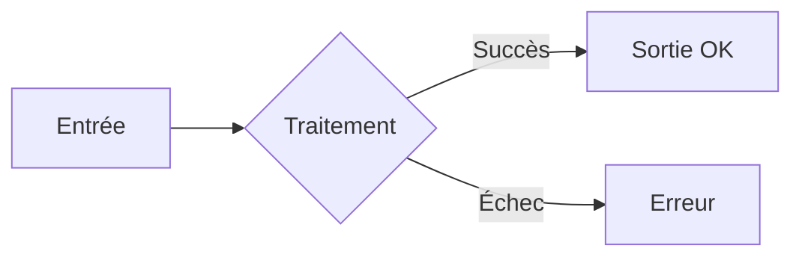

# 📄 Template de Documentation - Observations Nids

*Ce fichier définit le template standard pour 80-90% des documents du projet.*

---

## 🎯 Principes Généraux

### Style d'écriture

- **Professionnel mais accessible** : éviter le jargon inutile
- **Concis** : aller droit au but, pas de phrases superflues
- **Actionnable** : le lecteur doit savoir quoi faire après lecture

### Formatage

- **Listes à puces** : privilégiées pour la lisibilité
- **Titres H2 et H3** : structure claire, pas de H4+ sauf exception
- **Emojis** : utilisés avec parcimonie pour guider visuellement

### Emojis standardisés

| Emoji | Usage |
|-------|-------|
| 🟠 | En attente / À faire |
| 🔵 | En cours |
| 🟢 | Terminé / Actif |
| ⚠️ | Attention / Avertissement |
| ❌ | Erreur / Non disponible |
| ✅ | Validé / Recommandé |
| 📌 | Important / À retenir |
| 💡 | Astuce / Conseil |

---

## 📋 Structure Standard d'un Document

```markdown
# 📦 Titre du Document

> **Résumé** : Description en 1-2 phrases du contenu.

---

## 🎯 Objectif

[Pourquoi ce document existe, ce qu'il couvre]

---

## 📖 Contenu Principal

### Sous-section 1

- Point clé 1
- Point clé 2
- Point clé 3

### Sous-section 2

[Contenu détaillé avec exemples si nécessaire]

---

## ⚠️ Points d'Attention

!!! warning "Titre de l'avertissement"
    Contenu de l'avertissement.

---

## 🔗 Voir Aussi

- [Lien vers document connexe 1](./autre_doc.md)
- [Lien vers document connexe 2](./autre_doc2.md)
```

---

## 🏗️ Template : Application Django

Pour documenter une application Django (`accounts`, `observations`, etc.) :

```markdown
# 📦 Application [NOM]

> **Résumé** : [Description en 1-2 phrases]

---

## 🎯 Objectif

- [But principal de l'application]
- [Fonctionnalités clés]

---

## 📊 Modèles

### `NomDuModele`

| Champ | Type | Description |
|-------|------|-------------|
| `champ_1` | CharField | Description |
| `champ_2` | ForeignKey | Lien vers... |

**Relations** :

- 🔗 Lié à `AutreModele` via `foreign_key`

---

## 🌐 Vues & URLs

| URL | Vue | Description |
|-----|-----|-------------|
| `/path/` | `NomVue` | Action réalisée |
| `/path/<id>/` | `DetailVue` | Détail de... |

---

## 📝 Formulaires

- **`NomFormulaire`** : [Usage principal]

---

## 🔐 Permissions

| Rôle | Droits |
|------|--------|
| Utilisateur | Lecture seule |
| Validateur | Lecture + Modification |
| Admin | Tous droits |

---

## ⚠️ Points d'Attention

!!! warning "Titre"
    Description du point critique.

!!! tip "Astuce"
    Conseil utile pour les développeurs.

---

## 🔗 Voir Aussi

- [Application connexe](./autre_app.md)
```

---

## 🚀 Template : Guide Procédural

Pour les guides "Comment faire X" :

```markdown
# 🚀 [Action à réaliser]

> **Résumé** : Guide pas-à-pas pour [objectif].

---

## 📋 Prérequis

- ✅ Condition 1
- ✅ Condition 2

---

## 📖 Étapes

### 1. Première étape

Description de l'action.

```bash
# Commande exemple
commande_a_executer
```

### 2. Deuxième étape

Description de l'action.

!!! note "Note"
    Information complémentaire utile.

### 3. Troisième étape

Description de l'action.

---

## ✅ Vérification

Comment vérifier que tout fonctionne :

- [ ] Vérification 1
- [ ] Vérification 2

---

## 🐛 Dépannage

| Problème | Solution |
|----------|----------|
| Erreur X | Faire Y |
| Erreur Z | Vérifier W |
```

---

## 🏛️ Template : Architecture / Flux

Pour documenter un flux ou une architecture :

```markdown
# 🏗️ [Nom du Flux / Architecture]

> **Résumé** : Description du flux ou composant.

---

## 🎯 Vue d'Ensemble

[Description générale]

---

## 📊 Diagramme



---

## 🔄 Étapes du Flux

### 1. Étape initiale

- **Entrée** : Description
- **Traitement** : Ce qui se passe
- **Sortie** : Résultat attendu

### 2. Étape suivante

[Idem]

---

## 📦 Composants Impliqués

| Composant | Rôle |
|-----------|------|
| `ModeleA` | Stockage des données |
| `VueB` | Interface utilisateur |
| `ServiceC` | Logique métier |

---

## ⚠️ Cas Limites

- **Cas 1** : Comment il est géré
- **Cas 2** : Comment il est géré
```

---

## 🎨 Utilisation des Admonitions MkDocs

Les admonitions disponibles :

```markdown
!!! note "Titre optionnel"
    Information complémentaire.

!!! tip "Astuce"
    Conseil pratique.

!!! warning "Attention"
    Point de vigilance.

!!! danger "Danger"
    Risque critique.

!!! example "Exemple"
    Illustration concrète.

!!! info "Information"
    Détail utile.

??? note "Note repliable (fermée par défaut)"
    Contenu détaillé qui peut être masqué.
```

---

## 📊 Utilisation des Tableaux

Format recommandé :

```markdown
| Colonne 1 | Colonne 2 | Colonne 3 |
|-----------|-----------|-----------|
| Valeur 1  | Valeur 2  | Valeur 3  |
```

---

## 🔄 Utilisation des Onglets

Pour comparer plusieurs options :

```markdown
=== "Option 1"
    Contenu de l'option 1.

=== "Option 2"
    Contenu de l'option 2.
```

---

## ✅ Checklist Avant Publication

- [ ] Résumé présent en haut du document
- [ ] Structure H2/H3 cohérente
- [ ] Liens internes fonctionnels
- [ ] Code formaté et testé
- [ ] Pas de fautes d'orthographe
- [ ] Emojis utilisés de façon cohérente
