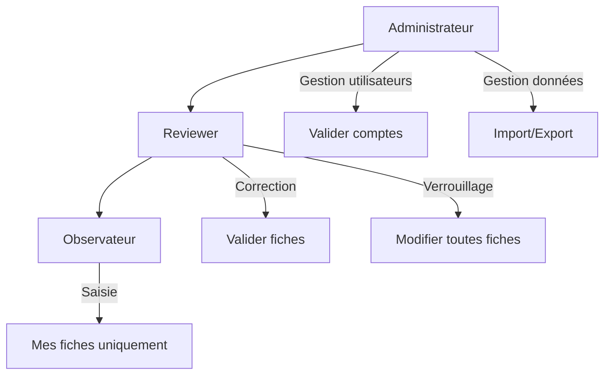
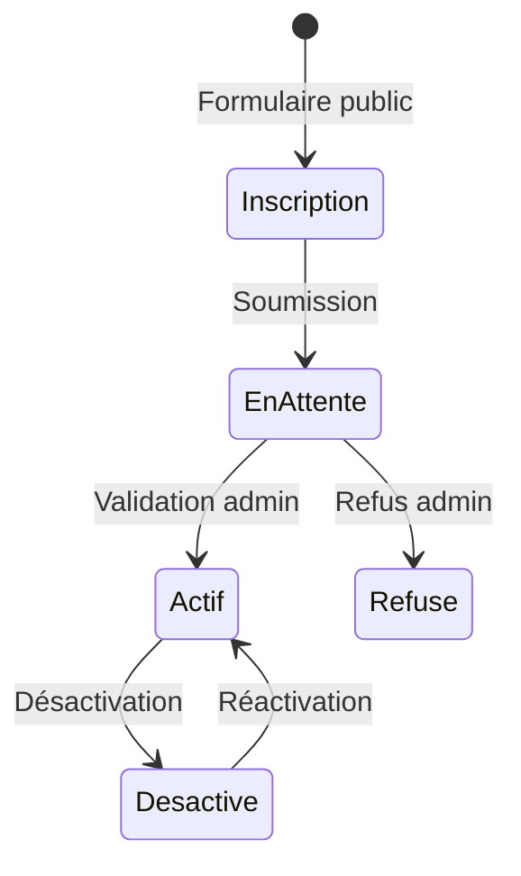

# 📦 Application Accounts

> **Résumé** : Gestion des utilisateurs, authentification, rôles et notifications internes.

---

## 🎯 Objectif

- Gérer les **utilisateurs** et leurs comptes
- Implémenter un système de **rôles** (observateur, reviewer, administrateur)
- Gérer le **workflow de validation** des nouveaux comptes
- Fournir un système de **notifications internes**
- Permettre l'**inscription publique** avec validation par un administrateur

---

## 📊 Modèles

### `Utilisateur`

Modèle utilisateur personnalisé (hérite de `AbstractUser`).

| Champ | Type | Description |
|-------|------|-------------|
| `username` | CharField | Identifiant unique (hérité) |
| `email` | EmailField | Email (unique, obligatoire) |
| `first_name` | CharField | Prénom (hérité) |
| `last_name` | CharField | Nom de famille (hérité) |
| `role` | CharField | Rôle de l'utilisateur |
| `est_valide` | BooleanField | Compte validé par un admin (défaut: False) |
| `est_refuse` | BooleanField | Inscription refusée (défaut: False) |
| `est_transcription` | BooleanField | Créé par transcription OCR (défaut: False) |
| `is_active` | BooleanField | Compte actif (hérité, défaut: True) |

---

### 🎭 Rôles Disponibles

| Rôle | Code | Description |
|------|------|-------------|
| 🔵 **Observateur** | `observateur` | Peut créer et modifier ses propres fiches |
| 🟠 **Reviewer** | `reviewer` | Peut corriger et valider toutes les fiches |
| 🟢 **Administrateur** | `administrateur` | Tous les droits |

**Hiérarchie des droits** :

---

### 🏷️ États d'un Compte

| État | `is_active` | `est_valide` | `est_refuse` | Description |
|------|-------------|--------------|--------------|-------------|
| 🟡 En attente | True | False | False | Inscription en attente de validation |
| 🟢 Actif | True | True | False | Compte validé et actif |
| 🔴 Refusé | False | False | True | Inscription refusée |
| ⚫ Désactivé | False | True | False | Compte désactivé par admin |

---

### 🤖 Utilisateurs OCR

Les utilisateurs avec `est_transcription=True` sont créés automatiquement lors de la transcription OCR :

- Username généré : `prenom.nom` ou avec suffixe numérique
- Email : `username@observateur.local`
- Rôle : `observateur`
- Statut : `is_active=True`, `est_valide=True`

📖 **Voir le guide** : [Correction de l'observateur](./observations_saisie_formulaires.md#-correction-de-lobservateur)

!!! warning "Nettoyage des comptes OCR"
    Ces comptes doivent être fusionnés ou supprimés après correction. Un compte OCR sans fiche associée peut être supprimé.

---

### `Notification`

Système de notifications internes.

| Champ | Type | Description |
|-------|------|-------------|
| `destinataire` | ForeignKey | Utilisateur destinataire |
| `type_notification` | CharField | Type de notification |
| `titre` | CharField | Titre de la notification |
| `message` | TextField | Contenu détaillé |
| `lien` | CharField | URL relative vers la ressource |
| `est_lue` | BooleanField | Notification lue (défaut: False) |
| `date_creation` | DateTimeField | Date de création |
| `date_lecture` | DateTimeField | Date de lecture (nullable) |
| `utilisateur_concerne` | ForeignKey | Utilisateur concerné (optionnel) |

**Types de notifications** :

| Type | Description |
|------|-------------|
| `demande_compte` | Nouvelle demande d'inscription |
| `compte_valide` | Compte validé par admin |
| `compte_refuse` | Compte refusé par admin |
| `info` | Information générale |
| `warning` | Avertissement |

---

## 🌐 Vues & URLs

### Gestion des Utilisateurs (Admin)

| URL | Vue | Description |
|-----|-----|-------------|
| `/accounts/utilisateurs/` | `ListeUtilisateursView` | Liste paginée des utilisateurs |
| `/accounts/utilisateurs/creer/` | `creer_utilisateur` | Création d'un utilisateur |
| `/accounts/utilisateurs/<id>/modifier/` | `modifier_utilisateur` | Modification |
| `/accounts/utilisateurs/<id>/detail/` | `detail_utilisateur` | Fiche détaillée |
| `/accounts/utilisateurs/<id>/desactiver/` | `desactiver_utilisateur` | Désactivation |
| `/accounts/utilisateurs/<id>/activer/` | `activer_utilisateur` | Réactivation |

### Validation des Comptes

| URL | Vue | Description |
|-----|-----|-------------|
| `/accounts/utilisateurs/<id>/validation/` | `page_validation_utilisateur` | Page de validation |
| `/accounts/utilisateurs/<id>/valider/` | `valider_utilisateur` | Valider l'inscription |
| `/accounts/utilisateurs/<id>/refuser/` | `refuser_utilisateur` | Refuser l'inscription |
| `/accounts/utilisateurs/<id>/envoyer-rappel/` | `envoyer_email_rappel_utilisateur` | Rappel par email |

### Profil Utilisateur

| URL | Vue | Description |
|-----|-----|-------------|
| `/accounts/mon-profil/` | `mon_profil` | Page de profil personnel |

### Inscription Publique

| URL | Vue | Description |
|-----|-----|-------------|
| `/accounts/inscription-publique/` | `inscription_publique` | Formulaire d'inscription |
| `/accounts/inscription-completee/` | `inscription_completee` | Page de confirmation |
| `/accounts/compte-en-attente/<id>/` | `compte_en_attente` | Page d'attente de validation |
| `/accounts/renvoyer-notification/<id>/` | `renvoyer_notification_admin` | Renvoyer notification aux admins |

### Mot de Passe

| URL | Vue | Description |
|-----|-----|-------------|
| `/accounts/mot-de-passe-oublie/` | `mot_de_passe_oublie` | Demande de réinitialisation |
| `/accounts/reinitialiser-mot-de-passe/<uidb64>/<token>/` | `reinitialiser_mot_de_passe` | Réinitialisation |

### Urgence

| URL | Vue | Description |
|-----|-----|-------------|
| `/accounts/urgence/promouvoir-administrateur/` | `promouvoir_administrateur` | Créer un admin d'urgence |

---

## 🔄 Workflow d'Inscription

**Étapes détaillées** :

1. **Inscription** : L'utilisateur remplit le formulaire public
2. **En attente** : Notification envoyée aux administrateurs
3. **Validation** :
   - ✅ **Validé** : `est_valide=True`, email de confirmation envoyé
   - ❌ **Refusé** : `est_refuse=True`, `is_active=False`, email de refus envoyé

---

## 🔐 Permissions par Rôle

### Observateur

| Fonctionnalité | Accès |
|----------------|-------|
| Créer une fiche | ✅ |
| Modifier ses fiches | ✅ |
| Voir toutes les fiches | ✅ (lecture seule) |
| Modifier fiches d'autres | ❌ |
| Valider des fiches | ❌ |
| Gérer les utilisateurs | ❌ |

### Reviewer

| Fonctionnalité | Accès |
|----------------|-------|
| Créer une fiche | ✅ |
| Modifier ses fiches | ✅ |
| Modifier toutes les fiches | ✅ |
| Valider des fiches | ✅ |
| Corriger l'observateur | ✅ |
| Fusionner des observateurs | ✅ |
| Gérer les utilisateurs | ❌ |

### Administrateur

| Fonctionnalité | Accès |
|----------------|-------|
| Toutes les fonctionnalités reviewer | ✅ |
| Gérer les utilisateurs | ✅ |
| Valider les inscriptions | ✅ |
| Import/export de données | ✅ |
| Débloquer les fiches verrouillées | ✅ |
| Supprimer des fiches | ✅ |

---

## ⚠️ Points d'Attention

!!! warning "Email unique"
    L'email est unique dans le système. Deux utilisateurs ne peuvent pas avoir le même email.

!!! warning "Comptes OCR"
    Les comptes avec `est_transcription=True` ont un email en `@observateur.local`. Ils doivent être fusionnés avec des comptes réels ou supprimés.

!!! danger "Admin d'urgence"
    La page `/accounts/urgence/promouvoir-administrateur/` permet de créer un admin sans authentification. Elle doit être protégée ou désactivée en production.

!!! tip "Notifications"
    Les notifications non lues sont affichées dans l'interface. Elles sont automatiquement créées lors des événements importants (nouvelle inscription, validation...).

---

## 🔗 Voir Aussi

- [📦 Application Observations](./observations.md) - Utilisation des utilisateurs
- [📝 Guide de Saisie](./observations_saisie_formulaires.md#-correction-de-lobservateur) - Gestion des observateurs OCR
