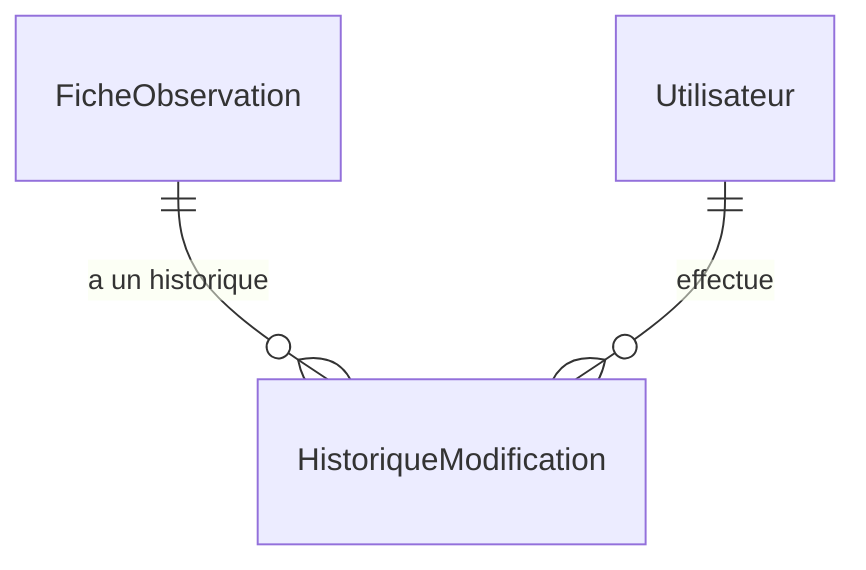

# 📦 Application Audit

> **Résumé** : Traçabilité et historique des modifications apportées aux fiches d'observation.

---

## 🎯 Objectif

- Enregistrer **toutes les modifications** apportées aux fiches d'observation
- Permettre la **consultation de l'historique** par fiche
- Assurer la **traçabilité** (qui a modifié quoi et quand)
- Catégoriser les modifications par **type de données**

---

## 📊 Modèles

### `HistoriqueModification`

Enregistrement d'une modification sur une fiche.

| Champ | Type | Description |
|-------|------|-------------|
| `fiche` | ForeignKey | Fiche d'observation concernée |
| `champ_modifie` | CharField | Nom du champ modifié |
| `ancienne_valeur` | TextField | Valeur avant modification |
| `nouvelle_valeur` | TextField | Valeur après modification |
| `date_modification` | DateTimeField | Date et heure (automatique) |
| `modifie_par` | ForeignKey | Utilisateur ayant effectué la modification |
| `categorie` | CharField | Catégorie de la modification |

---

### 🏷️ Catégories de Modification

| Code | Libellé | Description |
|------|---------|-------------|
| `fiche` | Fiche Observation | Champs de la fiche principale |
| `observation` | Observation | Observations individuelles (visites) |
| `validation` | Validation | Changements de statut de validation |
| `localisation` | Localisation | Commune, département, coordonnées |
| `nid` | Nid | Informations sur le nid |
| `resume_observation` | Résumé Observation | Bilan de nidification |
| `causes_echec` | Causes d'échec | Causes d'échec de la nidification |
| `remarque` | Remarque | Remarques ajoutées/modifiées |

---

## 🔗 Relations



---

## 🌐 Vues & URLs

L'application `audit` n'expose **pas d'URLs dédiées**. L'historique est consulté via l'application `observations` :

| URL | Vue | Description |
|-----|-----|-------------|
| `/observations/historique/<id>/` | `historique_modifications` | Historique d'une fiche |

---

## 📝 Utilisation dans le Code

### Création d'un Enregistrement

```python
from audit.models import HistoriqueModification

HistoriqueModification.objects.create(
    fiche=fiche_observation,
    champ_modifie='espece',
    ancienne_valeur='Mésange bleue',
    nouvelle_valeur='Mésange charbonnière',
    modifie_par=request.user,
    categorie='fiche'
)
```

### Points d'Appel

L'historique est créé automatiquement dans les vues de saisie :

| Fichier | Contexte |
|---------|----------|
| `saisie_observation_view.py` | Modification de fiche, observations, nid, résumé... |
| `api_observateurs.py` | Fusion d'observateurs |

---

## 📊 Exemple d'Historique

```
┌─────────────────────────────────────────────────────────────────────┐
│  📋 Historique de la Fiche #1234                                    │
├─────────────────────────────────────────────────────────────────────┤
│  📅 2026-01-18 14:32 │ 👤 admin │ 🏷️ localisation                  │
│     commune: "Saint-Lô" → "Saint-Lo"                                │
├─────────────────────────────────────────────────────────────────────┤
│  📅 2026-01-18 14:30 │ 👤 reviewer1 │ 🏷️ fiche                     │
│     espece: "Mesange bleue" → "Mésange bleue"                       │
├─────────────────────────────────────────────────────────────────────┤
│  📅 2026-01-17 10:15 │ 👤 observateur1 │ 🏷️ observation            │
│     nombre_oeufs: "3" → "4"                                         │
└─────────────────────────────────────────────────────────────────────┘
```

---

## 🔐 Permissions

| Rôle | Droits |
|------|--------|
| **Observateur** | Consulter l'historique de ses fiches |
| **Reviewer** | Consulter l'historique de toutes les fiches |
| **Administrateur** | Tous droits + accès Django Admin |

---

## ⚠️ Points d'Attention

!!! warning "Pas de suppression"
    L'historique ne doit **jamais être supprimé** manuellement. Il constitue la trace légale des modifications.

!!! tip "Catégorisation"
    Toujours spécifier la `categorie` pour faciliter le filtrage dans l'interface d'historique.

!!! info "Valeurs textuelles"
    Les champs `ancienne_valeur` et `nouvelle_valeur` sont des `TextField`. Pour les relations (ForeignKey), stocker l'ID ou le nom lisible selon le besoin.

!!! note "Indexation"
    Le champ `categorie` est indexé (`db_index=True`) pour accélérer les filtres par type de modification.

---

## 🔗 Voir Aussi

- [📦 Application Observations](./observations.md) - Fiches auditées
- [📦 Application Accounts](./accounts.md) - Utilisateurs (modifie_par)
- [📦 Application Core](./core.md) - Constantes CATEGORIE_MODIFICATION_CHOICES
