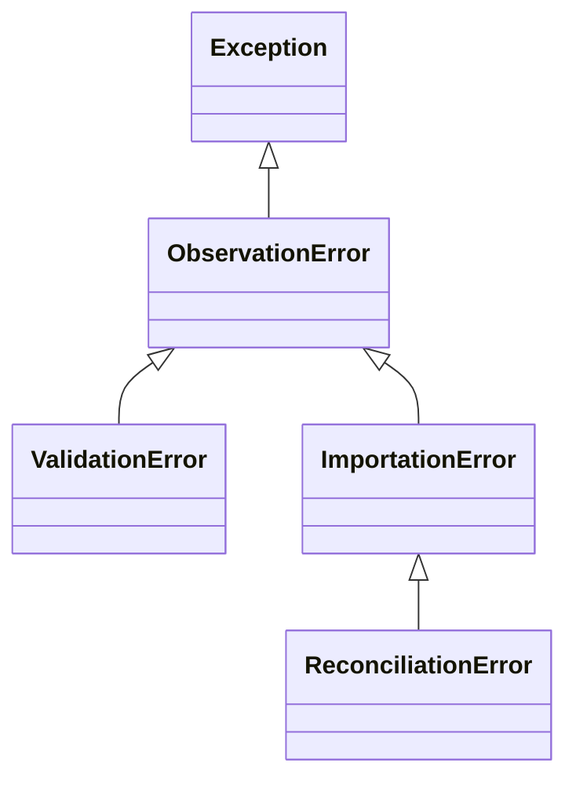

# 📦 Application Core

> **Résumé** : Utilitaires partagés, constantes, modèles abstraits et exceptions personnalisées.

---

## 🎯 Objectif

- Centraliser les **constantes** utilisées dans plusieurs applications
- Fournir des **modèles abstraits** réutilisables
- Définir les **exceptions personnalisées** du projet
- Éviter la duplication de code entre applications

---

## 📋 Constantes

Fichier : `core/constants.py`

### ROLE_CHOICES

Rôles des utilisateurs (utilisé dans `accounts.Utilisateur`).

```python
ROLE_CHOICES = [
    ('observateur', 'Observateur'),
    ('reviewer', 'Reviewer'),
    ('administrateur', 'Administrateur'),
]
```

| Code | Libellé | Usage |
|------|---------|-------|
| `observateur` | Observateur | Utilisateur standard, saisie de ses fiches |
| `reviewer` | Reviewer | Correction et validation des fiches |
| `administrateur` | Administrateur | Tous les droits |

---

### STATUT_VALIDATION_CHOICES

Statuts de validation (utilisé dans `review.Validation`).

```python
STATUT_VALIDATION_CHOICES = [
    ('en_cours', 'En cours'),
    ('validee', 'Validée'),
    ('rejete', 'Rejetée'),
]
```

| Code | Libellé | Description |
|------|---------|-------------|
| `en_cours` | 🔵 En cours | Validation en cours d'examen |
| `validee` | 🟢 Validée | Fiche validée |
| `rejete` | 🔴 Rejetée | Fiche rejetée |

---

### STATUT_IMPORTATION_CHOICES

Statuts d'importation (utilisé dans `ingest.ImportationEnCours`).

```python
STATUT_IMPORTATION_CHOICES = [
    ('en_attente', 'En attente de validation'),
    ('erreur', 'Erreur détectée'),
    ('complete', 'Importation complétée'),
]
```

| Code | Libellé | Description |
|------|---------|-------------|
| `en_attente` | 🟡 En attente | Import en attente de validation |
| `erreur` | 🔴 Erreur | Erreur détectée lors de l'import |
| `complete` | 🟢 Complétée | Import finalisé avec succès |

---

### CATEGORIE_MODIFICATION_CHOICES

Catégories de modifications (utilisé dans `audit.HistoriqueModification`).

```python
CATEGORIE_MODIFICATION_CHOICES = [
    ('fiche', 'Fiche Observation'),
    ('observation', 'Observation'),
    ('validation', 'Validation'),
    ('localisation', 'Localisation'),
    ('nid', 'Nid'),
    ('resume_observation', 'Résumé Observation'),
    ('causes_echec', "Causes d'échec"),
    ('remarque', 'Remarque'),
]
```

---

## 🏗️ Modèles Abstraits

Fichier : `core/models.py`

### `TimeStampedModel`

Ajoute automatiquement les dates de création et modification.

```python
class TimeStampedModel(models.Model):
    created_at = models.DateTimeField(auto_now_add=True)
    updated_at = models.DateTimeField(auto_now=True)

    class Meta:
        abstract = True
```

**Usage** :
```python
class MonModele(TimeStampedModel):
    nom = models.CharField(max_length=100)
    # created_at et updated_at sont automatiquement ajoutés
```

---

### `UUIDModel`

Utilise un UUID comme clé primaire au lieu d'un entier auto-incrémenté.

```python
class UUIDModel(models.Model):
    id = models.UUIDField(primary_key=True, default=uuid.uuid4, editable=False)

    class Meta:
        abstract = True
```

**Avantages** :
- IDs non séquentiels (sécurité)
- Pas de collision lors de fusions de bases
- Génération côté client possible

---

### `SoftDeleteModel`

Suppression logique (soft delete) au lieu de suppression physique.

```python
class SoftDeleteModel(models.Model):
    is_deleted = models.BooleanField(default=False)
    deleted_at = models.DateTimeField(null=True, blank=True)

    class Meta:
        abstract = True

    def soft_delete(self):
        self.is_deleted = True
        self.deleted_at = timezone.now()
        self.save()
```

**Usage** :
```python
# Au lieu de obj.delete()
obj.soft_delete()

# Filtrer les objets non supprimés
MonModele.objects.filter(is_deleted=False)
```

---

## ⚠️ Exceptions Personnalisées

Fichier : `core/exceptions.py`

### Hiérarchie des Exceptions



### Définitions

```python
class ObservationError(Exception):
    """Exception de base pour le projet"""
    pass

class ValidationError(ObservationError):
    """Erreur de validation des données"""
    pass

class ImportationError(ObservationError):
    """Erreur lors de l'importation"""
    pass

class ReconciliationError(ImportationError):
    """Erreur de réconciliation lors de l'import"""
    pass
```

### Usage

```python
from core.exceptions import ValidationError, ImportationError

def valider_fiche(fiche):
    if not fiche.espece:
        raise ValidationError("L'espèce est obligatoire")

def importer_json(data):
    try:
        # ...
    except KeyError as e:
        raise ImportationError(f"Champ manquant: {e}")
```

---

## 🔗 Utilisation par Application

| Application | Constantes utilisées |
|-------------|---------------------|
| `accounts` | `ROLE_CHOICES` |
| `review` | `STATUT_VALIDATION_CHOICES` |
| `ingest` | `STATUT_IMPORTATION_CHOICES` |
| `audit` | `CATEGORIE_MODIFICATION_CHOICES` |

---

## 🌐 Vues & URLs

L'application `core` n'expose **aucune URL**. C'est une application utilitaire uniquement.

---

## ⚠️ Points d'Attention

!!! warning "Ne pas modifier les constantes"
    Les constantes sont utilisées dans les migrations Django. Modifier les valeurs `code` peut casser les données existantes.

!!! tip "Ajout de nouvelles valeurs"
    Pour ajouter une nouvelle valeur à un `CHOICES`, ajouter à la fin de la liste pour éviter les problèmes de migration.

!!! info "Modèles abstraits"
    Les modèles abstraits (`abstract = True`) ne créent pas de table en base de données. Ils sont uniquement hérités.

---

## 🔗 Voir Aussi

- [📦 Application Accounts](./accounts.md) - Utilise ROLE_CHOICES
- [📦 Application Review](./review.md) - Utilise STATUT_VALIDATION_CHOICES
- [📦 Application Ingest](./ingest.md) - Utilise STATUT_IMPORTATION_CHOICES
- [📦 Application Audit](./audit.md) - Utilise CATEGORIE_MODIFICATION_CHOICES
