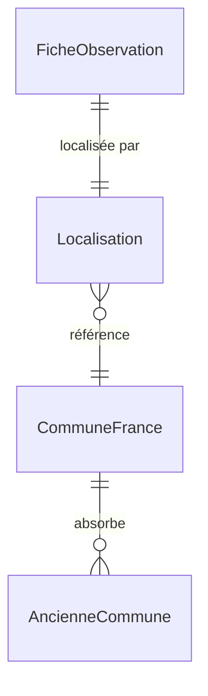

# 📦 Application Geo

> **Résumé** : Gestion des communes françaises, géocodage et localisation des observations de nidification.

---

## 🎯 Objectif

- Maintenir un référentiel des **communes françaises** avec coordonnées GPS
- Gérer les **anciennes communes** (fusionnées) avec rattachement aux communes actuelles
- Stocker les **localisations** des fiches d'observation
- Fournir une **API d'autocomplétion** pour la saisie des communes
- Permettre le **géocodage** automatique et manuel

---

## 📊 Modèles

### `CommuneFrance`

Référentiel des communes françaises actives.

| Champ | Type | Description |
|-------|------|-------------|
| `nom` | CharField | Nom de la commune |
| `code_insee` | CharField | Code INSEE (unique) |
| `code_postal` | CharField | Code postal |
| `departement` | CharField | Nom du département |
| `code_departement` | CharField | Code département (01-95, 2A, 2B, 971-976) |
| `region` | CharField | Nom de la région |
| `latitude` | DecimalField | Latitude du centre (6 décimales) |
| `longitude` | DecimalField | Longitude du centre (6 décimales) |
| `altitude` | IntegerField | Altitude moyenne en mètres |
| `population` | IntegerField | Population (optionnel) |
| `superficie` | DecimalField | Superficie en km² (optionnel) |
| `source_ajout` | CharField | Source des données |
| `autres_noms` | TextField | Alias et anciens noms (séparés par virgule) |
| `commentaire` | TextField | Notes diverses |
| `ajoutee_par` | ForeignKey | Utilisateur ayant ajouté manuellement |
| `date_maj` | DateTimeField | Dernière mise à jour |

**Sources possibles** :
- `api_geo` : API Découpage administratif (data.gouv.fr)
- `nominatim` : OpenStreetMap
- `manuel` : Ajout manuel par administrateur

**Propriétés calculées** :
- `coordonnees_gps` : Format "lat,lon"
- `tous_les_noms` : Liste nom principal + alias

---

### `AncienneCommune`

Communes ayant fusionné avec d'autres communes (communes nouvelles).

| Champ | Type | Description |
|-------|------|-------------|
| `nom` | CharField | Nom de l'ancienne commune |
| `code_insee` | CharField | Ancien code INSEE (inactif) |
| `code_postal` | CharField | Ancien code postal |
| `departement` | CharField | Département |
| `code_departement` | CharField | Code département |
| `latitude` | DecimalField | Latitude du centre (optionnel) |
| `longitude` | DecimalField | Longitude du centre (optionnel) |
| `altitude` | IntegerField | Altitude (optionnel) |
| `commune_actuelle` | ForeignKey | Commune de rattachement actuelle |
| `date_fusion` | DateField | Date de la fusion |
| `commentaire` | TextField | Notes sur la fusion |

!!! info "Coordonnées de fallback"
    Si les coordonnées de l'ancienne commune ne sont pas renseignées, celles de la commune actuelle sont utilisées.

---

### `Localisation`

Localisation d'une fiche d'observation (OneToOne avec FicheObservation).

| Champ | Type | Description |
|-------|------|-------------|
| `fiche` | OneToOneField | Fiche d'observation liée |
| `commune_saisie` | CharField | Nom saisi par l'observateur (peut être ancienne commune) |
| `commune` | CharField | Nom de la commune actuelle (normalisé) |
| `lieu_dit` | CharField | Lieu-dit précis |
| `departement` | CharField | Code département (défaut: "00") |
| `coordonnees` | CharField | Format "lat,lon" (défaut: "0,0") |
| `latitude` | CharField | Latitude en string |
| `longitude` | CharField | Longitude en string |
| `altitude` | IntegerField | Altitude en mètres (défaut: 0) |
| `paysage` | TextField | Description du paysage |
| `alentours` | TextField | Description des alentours |
| `precision_gps` | IntegerField | Précision en mètres (défaut: 5000) |
| `source_coordonnees` | CharField | Origine des coordonnées |
| `code_insee` | CharField | Code INSEE de la commune |

**Sources de coordonnées** :
- `gps_terrain` : GPS de terrain (précision ~10m)
- `geocodage_auto` : Géocodage automatique
- `geocodage_manuel` : Géocodage manuel
- `carte` : Pointé sur carte
- `base_locale` : Base locale des communes
- `nominatim` : Nominatim (OpenStreetMap)

---

## 🔗 Relations



---

## 🌐 Vues & URLs

### API AJAX

| URL | Vue | Description |
|-----|-----|-------------|
| `/geo/rechercher-communes/` | `rechercher_communes` | Autocomplétion des communes |
| `/geo/geocoder/` | `geocoder_commune_manuelle` | Géocodage manuel d'une fiche |

### Gestion des Communes (Admin)

| URL | Vue | Description |
|-----|-----|-------------|
| `/geo/communes/` | `liste_communes` | Liste paginée des communes |
| `/geo/communes/<id>/` | `detail_commune` | Détail d'une commune |
| `/geo/communes/creer/` | `creer_commune` | Création manuelle |
| `/geo/communes/<id>/modifier/` | `modifier_commune` | Modification |
| `/geo/communes/<id>/supprimer/` | `supprimer_commune` | Suppression |
| `/geo/communes/rechercher-nominatim/` | `rechercher_nominatim` | Recherche via Nominatim |

### Administration des Données

| URL | Vue | Description |
|-----|-----|-------------|
| `/geo/communes/administration/` | `administration_donnees` | Page d'administration |
| `/geo/communes/charger-api/` | `charger_communes_api` | Import depuis API Géo |
| `/geo/communes/importer-anciennes/` | `importer_anciennes_communes_view` | Import des communes fusionnées |
| `/geo/communes/verifier-deleguees/` | `verifier_communes_deleguees_view` | Vérification des communes déléguées |

---

## 🔍 API Recherche de Communes

### Endpoint : `/geo/rechercher-communes/`

**Méthode** : GET

**Paramètres** :

| Param | Type | Description |
|-------|------|-------------|
| `q` | string | Terme de recherche (min 2 caractères) |
| `lat` | float | Latitude GPS (optionnel) |
| `lon` | float | Longitude GPS (optionnel) |
| `limit` | int | Nombre max de résultats (défaut: 20) |

**Réponse** :
```json
{
  "communes": [
    {
      "id": 12345,
      "nom": "Paris",
      "departement": "Paris",
      "code_departement": "75",
      "code_postal": "75001",
      "code_insee": "75056",
      "label": "Paris (75) - Paris",
      "latitude": "48.856614",
      "longitude": "2.352222",
      "altitude": 35,
      "est_fusionnee": false
    }
  ]
}
```

**Logique de recherche** :

1. **Priorité haute** : Communes dont le nom **commence par** le terme
2. **Priorité basse** : Communes dont le nom **contient** le terme
3. **Anciennes communes** : Recherchées avec la même logique, marquées `est_fusionnee: true`

**Filtrage géographique** :

Si `lat` et `lon` sont fournis (et différents de 0,0) :
- Filtrage par bounding box (~11 km)
- Calcul de distance exacte (Haversine)
- Exclusion des communes > 10 km
- Tri par distance croissante

📖 **Voir le guide** : [Sélection de commune](./observations_saisie_formulaires.md#-sélection-de-commune)

---

## 🗺️ Géocodage

### Géocodage Automatique

Lors de l'import ou de la saisie, les coordonnées sont obtenues automatiquement :
1. Recherche dans `CommuneFrance` par nom exact
2. Recherche dans `AncienneCommune` si non trouvé
3. Fallback vers Nominatim (OpenStreetMap)

### Géocodage Manuel

Via l'endpoint `/geo/geocoder/` (POST) :
- Permet de corriger les coordonnées d'une fiche
- Met à jour `Localisation.source_coordonnees` = `geocodage_manuel`
- Gère les anciennes communes (enregistre nom saisi + commune actuelle)

---

## 🔐 Permissions

| Rôle | Droits |
|------|--------|
| **Utilisateur** | Autocomplétion uniquement |
| **Reviewer** | Autocomplétion + géocodage manuel |
| **Administrateur** | CRUD complet, import de données |

---

## ⚠️ Points d'Attention

!!! warning "Coordonnées par défaut"
    Les coordonnées "0,0" ou "0.0" sont considérées comme non renseignées et ignorées dans les calculs de distance.

!!! warning "Communes fusionnées"
    Lors de la sélection d'une ancienne commune, le système enregistre :
    - `commune_saisie` : nom de l'ancienne commune (ce que l'utilisateur a saisi)
    - `commune` : nom de la commune actuelle (normalisé)

!!! tip "Précision GPS"
    La précision est stockée en mètres :
    - GPS terrain : ~10m
    - Géocodage commune : ~5000m
    - Pointé sur carte : variable

!!! info "Code INSEE"
    Le code INSEE de la commune actuelle est stocké dans `Localisation.code_insee` pour permettre des analyses géographiques.

---

## 🔗 Voir Aussi

- [📦 Application Observations](./observations.md) - Utilisation des localisations
- [📝 Guide de Saisie](./observations_saisie_formulaires.md#-sélection-de-commune) - Autocomplétion communes
