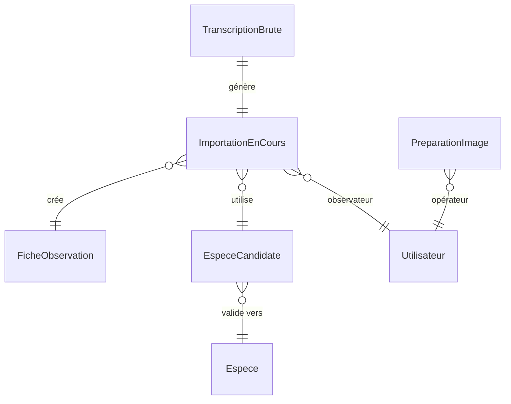
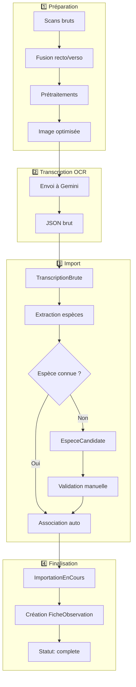
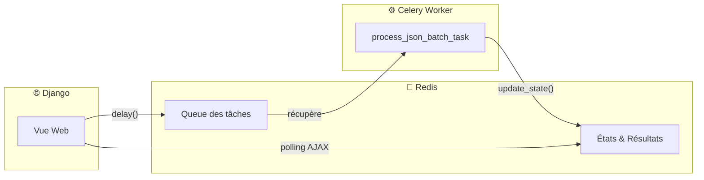

# 📦 Application Ingest

> **Résumé** : Import et traitement des fichiers JSON issus de la transcription OCR, gestion des espèces candidates et workflow d'importation.

---

## 🎯 Objectif

- **Importer** les fichiers JSON générés par la transcription OCR
- **Préparer** les images (fusion recto/verso, prétraitements)
- **Gérer** les espèces candidates (matching avec le référentiel)
- **Piloter** le workflow d'importation vers les fiches d'observation
- **Traiter** les imports en batch via Celery

---

## 📊 Modèles

### `PreparationImage`

Historique de préparation des images avant OCR.

| Champ | Type | Description |
|-------|------|-------------|
| `fichier_brut_recto` | CharField | Chemin du scan brut recto |
| `fichier_brut_verso` | CharField | Chemin du scan brut verso (optionnel) |
| `fichier_fusionne` | ImageField | Image fusionnée optimisée pour OCR |
| `operations_effectuees` | JSONField | Liste des opérations (rotation, crop, contraste...) |
| `operateur` | ForeignKey | Utilisateur ayant effectué la préparation |
| `date_preparation` | DateTimeField | Date de préparation |
| `notes` | TextField | Notes sur la préparation |

---

### `TranscriptionBrute`

Stockage des fichiers JSON bruts de transcription.

| Champ | Type | Description |
|-------|------|-------------|
| `fichier_source` | CharField | Chemin du fichier (unique) |
| `json_brut` | JSONField | Contenu JSON de la transcription |
| `date_importation` | DateTimeField | Date d'import |
| `traite` | BooleanField | JSON déjà traité ? |

---

### `EspeceCandidate`

Espèces extraites des transcriptions en attente de validation.

| Champ | Type | Description |
|-------|------|-------------|
| `nom_transcrit` | CharField | Nom tel qu'extrait par OCR (unique) |
| `code_gonm_transcrit` | CharField | Code GONM extrait du champ `n_espece` |
| `espece_validee` | ForeignKey | Espèce du référentiel associée |
| `validation_manuelle` | BooleanField | Validé manuellement ? |
| `score_similarite` | FloatField | Score de similarité (0-100%) |

!!! info "Matching automatique"
    Le système calcule automatiquement un score de similarité entre le nom transcrit et les espèces du référentiel. Au-delà d'un seuil, l'association est proposée à l'utilisateur.

---

### `ImportationEnCours`

Suivi d'une importation de transcription vers une fiche.

| Champ | Type | Description |
|-------|------|-------------|
| `transcription` | OneToOneField | TranscriptionBrute source |
| `fiche_observation` | OneToOneField | Fiche créée (nullable) |
| `espece_candidate` | ForeignKey | Espèce candidate associée |
| `observateur` | ForeignKey | Observateur assigné |
| `statut` | CharField | Statut de l'importation |
| `date_creation` | DateTimeField | Date de création |

**Statuts** (définis dans `core.constants.STATUT_IMPORTATION_CHOICES`) :

| Code | Libellé | Description |
|------|---------|-------------|
| `en_attente` | 🟡 En attente | En attente de validation |
| `erreur` | 🔴 Erreur | Erreur détectée |
| `complete` | 🟢 Complétée | Importation finalisée |

---

## 🔗 Relations



---

## 🌐 Vues & URLs

### Accueil et Navigation

| URL | Vue | Description |
|-----|-----|-------------|
| `/ingest/` | `accueil_importation` | Page d'accueil du module |
| `/ingest/resume/` | `resume_importation` | Résumé des importations |

### Préparation des Images

| URL | Vue | Description |
|-----|-----|-------------|
| `/ingest/preparer-images/` | `preparer_images_view` | Interface de préparation |
| `/ingest/liste-preparations/` | `liste_preparations_view` | Liste des préparations |

### Import JSON

| URL | Vue | Description |
|-----|-----|-------------|
| `/ingest/importer-json/` | `importer_json` | Navigation arborescente + import |
| `/ingest/importer-json-batch/` | `importer_json_batch` | Import batch via Celery |
| `/ingest/batch-progress/` | `batch_progress` | Page de progression |
| `/ingest/check-batch-progress/` | `check_batch_progress` | API AJAX progression |
| `/ingest/preparer/` | `preparer_importations` | Préparer les importations |
| `/ingest/extraire-candidats/` | `extraire_candidats` | Extraire les espèces candidates |

### Gestion des Espèces Candidates

| URL | Vue | Description |
|-----|-----|-------------|
| `/ingest/especes/` | `liste_especes_candidates` | Liste des espèces candidates |
| `/ingest/especes/<id>/valider/` | `valider_espece` | Valider une espèce |
| `/ingest/especes/valider-multiples/` | `valider_especes_multiples` | Validation groupée |
| `/ingest/especes/creer/` | `creer_nouvelle_espece` | Créer une nouvelle espèce |

### Gestion des Importations

| URL | Vue | Description |
|-----|-----|-------------|
| `/ingest/liste/` | `liste_importations` | Liste des importations |
| `/ingest/detail/<id>/` | `detail_importation` | Détail d'une importation |
| `/ingest/finaliser/<id>/` | `finaliser_importation` | Finaliser une importation |
| `/ingest/finaliser-multiples/` | `finaliser_importations_multiples` | Finalisation groupée |
| `/ingest/reinitialiser/<id>/` | `reinitialiser_importation` | Réinitialiser une importation |
| `/ingest/reinitialiser-toutes/` | `reinitialiser_toutes_importations` | Réinitialiser tout |

---

## 🔄 Workflow d'Importation



---

## ⚙️ Traitement Batch (Celery + Redis)

L'import peut être exécuté en batch via **Celery** avec **Redis** comme infrastructure :

### Architecture



### Rôle de Redis

| Fonction | Description |
|----------|-------------|
| **Broker** | File d'attente des tâches Celery (`CELERY_BROKER_URL`) |
| **Result Backend** | Stockage des états et résultats (`CELERY_RESULT_BACKEND`) |
| **Progression** | États personnalisés via `update_state()` |

**Configuration** (dans `settings.py`) :
```python
CELERY_BROKER_URL = 'redis://127.0.0.1:6379/0'
CELERY_RESULT_BACKEND = 'redis://127.0.0.1:6379/0'
```

### Tâche Celery

```python
# Lancement
process_json_batch_task.delay(directory_path, user_id)

# La tâche met à jour sa progression dans Redis
task_self.update_state(
    state='PROGRESS',
    meta={'current': i, 'total': total, 'results': [...]}
)
```

!!! info "Limitation Redis"
    Les résultats sont limités à 200 entrées pour ne pas surcharger Redis.

### Suivi de Progression

| Endpoint | Description |
|----------|-------------|
| `/ingest/batch-progress/` | Page de suivi avec barre de progression |
| `/ingest/check-batch-progress/` | API JSON pour polling AJAX |

**États Celery** : `PENDING` → `STARTED` → `PROGRESS` → `SUCCESS` / `FAILURE`

---

## 🔐 Permissions

| Rôle | Droits |
|------|--------|
| **Observateur** | Aucun accès |
| **Reviewer** | Import, validation espèces, finalisation |
| **Administrateur** | Tous droits + réinitialisation |

!!! warning "Décorateur personnalisé"
    Les vues utilisent `@user_passes_test(peut_transcrire)` pour vérifier les droits de transcription.

---

## 📁 Structure des Répertoires

```
media/
├── transcription_results/     # JSON issus de l'OCR
│   ├── 2024/
│   │   ├── fiche_001.json
│   │   └── fiche_002.json
│   └── 2025/
│       └── ...
└── prepared_images/           # Images fusionnées
    └── 2025/
        └── fiche_001_merged.jpg
```

---

## ⚠️ Points d'Attention

!!! warning "Fichiers uniques"
    Le champ `fichier_source` de `TranscriptionBrute` est unique. Un même fichier JSON ne peut pas être importé deux fois.

!!! tip "Score de similarité"
    Le score de similarité pour les espèces utilise l'algorithme `difflib.SequenceMatcher`. Un score ≥ 80% suggère une correspondance probable.

!!! info "Celery + Redis requis"
    Le traitement batch nécessite :
    - **Redis** actif sur `127.0.0.1:6379`
    - **Worker Celery** lancé (`celery -A observations_nids worker`)

    Sans cette infrastructure, utiliser l'import unitaire.

---

## 🔗 Voir Aussi

- [📦 Application Observations](./observations.md) - Fiches créées par import
- [📦 Application Taxonomy](./taxonomy.md) - Référentiel des espèces
- [📦 Application OCR](./ocr.md) - Transcription OCR Gemini
