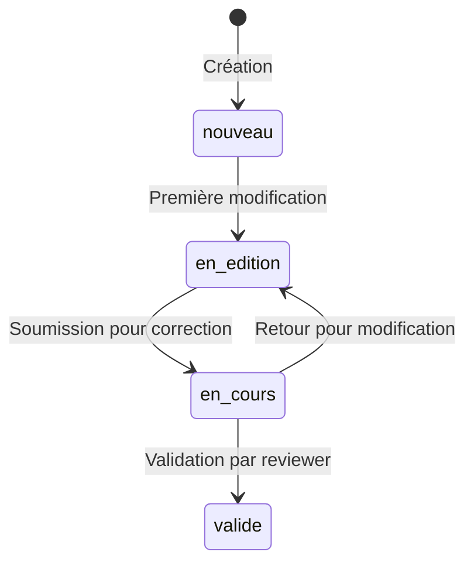

# 📦 Application Observations

> **Résumé** : Application centrale du projet, gère les fiches d'observation de nidification, leur saisie, modification et le workflow de correction/validation.

---

## 🎯 Objectif

- Permettre aux observateurs de créer et modifier des fiches d'observation de nidification
- Gérer le cycle de vie complet d'une fiche : saisie → correction → validation
- Assurer la traçabilité de toutes les modifications
- Gérer le téléversement d'images sources pour transcription OCR

---

## 📊 Modèles

### `FicheObservation` - Modèle Principal

| Champ | Type | Description |
|-------|------|-------------|
| `num_fiche` | AutoField (PK) | Numéro unique de la fiche |
| `date_creation` | DateTimeField | Date de création automatique |
| `observateur` | ForeignKey | Lien vers l'utilisateur observateur |
| `espece` | ForeignKey | Espèce observée |
| `annee` | IntegerField | Année d'observation |
| `numero_personnel` | IntegerField | Numéro attribué par l'observateur (optionnel) |
| `chemin_image` | CharField | Chemin vers l'image de la fiche |
| `chemin_json` | CharField | Chemin vers le fichier JSON de transcription |
| `transcription` | BooleanField | Indique si la fiche provient d'une transcription OCR |

**Relations** :

- 🔗 `observateur` → [📦 Application Accounts](./accounts.md)
  - 📖 [Correction de l'observateur OCR](./observations_saisie_formulaires.md#correction-de-lobservateur)
- 🔗 `espece` → [📦 Application Taxonomy](./taxonomy.md)
  - 📖 [Sélection d'espèce avec autocomplétion](./observations_saisie_formulaires.md#selection-despece)

**Comportement automatique** :

À la création d'une fiche, les objets liés suivants sont créés automatiquement :
- `Localisation` (via l'app geo)
- `Nid`
- `ResumeObservation`
- `CausesEchec`
- `EtatCorrection`

---

### `Observation` - Observations Individuelles

Une fiche peut contenir plusieurs observations (visites du nid).

| Champ | Type | Description |
|-------|------|-------------|
| `fiche` | ForeignKey | Fiche parente |
| `date_observation` | DateTimeField | Date et heure de l'observation |
| `heure_connue` | BooleanField | L'heure est-elle connue ? (défaut: True) |
| `nombre_oeufs` | IntegerField | Nombre d'œufs observés (null si non observé) |
| `nombre_poussins` | IntegerField | Nombre de poussins observés (null si non observé) |
| `observations` | TextField | Notes textuelles |

---

### `Nid` - Informations sur le Nid

| Champ | Type | Description |
|-------|------|-------------|
| `fiche` | OneToOneField | Fiche associée |
| `nid_prec_t_meme_couple` | BooleanField | Nid précédent du même couple ? |
| `fiche_precedente` | ForeignKey | Lien vers la fiche précédente (optionnel) |
| `hauteur_nid` | IntegerField | Hauteur du nid en cm |
| `hauteur_couvert` | IntegerField | Hauteur du couvert végétal en cm |
| `details_nid` | TextField | Description détaillée du nid |

---

### `ResumeObservation` - Bilan de la Nidification

| Champ | Type | Description |
|-------|------|-------------|
| `premier_oeuf_pondu_jour/mois` | SmallIntegerField | Date du premier œuf |
| `premier_poussin_eclos_jour/mois` | SmallIntegerField | Date de la première éclosion |
| `premier_poussin_volant_jour/mois` | SmallIntegerField | Date du premier envol |
| `nombre_oeufs_pondus` | SmallIntegerField | Total d'œufs pondus |
| `nombre_oeufs_eclos` | SmallIntegerField | Nombre d'œufs éclos |
| `nombre_oeufs_non_eclos` | SmallIntegerField | Nombre d'œufs non éclos |
| `nombre_poussins` | SmallIntegerField | Nombre de poussins à l'envol |

!!! note "Convention NULL"
    `NULL` = non observé, `0` = observé et valeur zéro.

**Contraintes de cohérence** :
- `nombre_oeufs_eclos` ≤ `nombre_oeufs_pondus`
- `nombre_oeufs_non_eclos` ≤ `nombre_oeufs_pondus`
- `nombre_poussins` ≤ `nombre_oeufs_eclos`

---

### `CausesEchec` - Causes d'Échec de Nidification

| Champ | Type | Description |
|-------|------|-------------|
| `fiche` | OneToOneField | Fiche associée |
| `description` | TextField | Description des causes d'échec |

---

### `Remarque` - Remarques sur la Fiche

| Champ | Type | Description |
|-------|------|-------------|
| `fiche` | ForeignKey | Fiche parente (plusieurs remarques possibles) |
| `remarque` | TextField | Texte de la remarque |
| `date_remarque` | DateTimeField | Date d'ajout automatique |

---

### `EtatCorrection` - Workflow de Correction

| Champ | Type | Description |
|-------|------|-------------|
| `fiche` | OneToOneField | Fiche associée |
| `statut` | CharField | Statut actuel (voir ci-dessous) |
| `pourcentage_completion` | IntegerField | 0-100%, calculé automatiquement |
| `date_derniere_modification` | DateTimeField | Mise à jour automatique |
| `validee_par` | ForeignKey | Utilisateur ayant validé |
| `date_validation` | DateTimeField | Date de validation |
| `en_correction_par` | ForeignKey | Reviewer ayant verrouillé la fiche |
| `date_debut_correction` | DateTimeField | Date du verrouillage |

#### 🔄 Statuts et Workflow

| Statut | Libellé | Badge | Description |
|--------|---------|-------|-------------|
| `nouveau` | 🔵 Nouvelle fiche | `badge-info` | Fiche venant d'être créée |
| `en_edition` | 🔵 En cours de saisie | `badge-info` | L'observateur complète sa fiche |
| `en_cours` | 🟠 En attente de correction | `badge-warning` | Soumise, pas encore prise en charge |
| `en_cours` + verrouillée | 🔵 En cours de correction | `badge-info` | Un reviewer travaille dessus |
| `valide` | 🟢 Validée | `badge-success` | Correction terminée et validée |

#### 📊 Calcul du Pourcentage de Complétion

Le pourcentage est calculé automatiquement selon 8 critères (12.5% chacun) :

1. ✅ Observateur renseigné
2. ✅ Espèce renseignée
3. ✅ Localisation complète (commune + département ≠ '00')
4. ✅ Au moins une observation avec date
5. ✅ Résumé avec données d'œufs pondus > 0
6. ✅ Détails du nid renseignés
7. ✅ Hauteur du nid renseignée
8. ✅ Image associée

---

### `ConfigurationVerrouillage` - Configuration Singleton

| Champ | Type | Description |
|-------|------|-------------|
| `duree_verrouillage_jours` | IntegerField | Durée avant déblocage auto (0 = jamais) |

Options : 1, 2, 5, 10 jours ou permanent (0).

!!! tip "Pattern Singleton"
    Un seul enregistrement existe (PK forcé à 1). Utiliser `ConfigurationVerrouillage.get_instance()`.

---

### `ImageSource` - Images en Attente de Transcription

| Champ | Type | Description |
|-------|------|-------------|
| `observateur` | ForeignKey | Utilisateur ayant uploadé |
| `image` | ImageField | Fichier image |
| `est_transcrite` | BooleanField | Transcription effectuée ? |
| `date_televersement` | DateTimeField | Date d'upload |
| `fiche_observation` | OneToOneField | Fiche créée (optionnel) |

---

## 🌐 Vues & URLs

### Pages Principales

| URL | Vue | Description |
|-----|-----|-------------|
| `/` | `home` | Page d'accueil |
| `/tableau-de-bord/` | `default_view` | Tableau de bord utilisateur |
| `/aide/` | `aide_view` | Documentation d'aide |
| `/statistiques/` | `statistiques_view` | Page de statistiques globales |

### Gestion des Fiches

| URL | Vue | Description |
|-----|-----|-------------|
| `/observations/` | `saisie_observation` | Liste des fiches (avec création) |
| `/observations/liste/` | `liste_fiches_observations` | Liste paginée avec filtres |
| `/observations/<id>/` | `fiche_observation_view` | Vue détaillée (lecture seule) |
| `/observations/modifier/<id>/` | `saisie_observation` | Modification d'une fiche |
| `/observations/ajouter/<id>/` | `ajouter_observation` | Ajouter une observation |
| `/observations/historique/<id>/` | `historique_modifications` | Historique des modifications |

### Workflow de Correction

| URL | Vue | Description |
|-----|-----|-------------|
| `/observations/soumettre/<id>/` | `soumettre_pour_correction` | Passer en mode correction |
| `/observations/valider/<id>/` | `valider_correction` | Valider la correction |
| `/observations/<id>/liberer-verrou/` | `liberer_verrou_fiche` | Libérer le verrouillage |

### Téléversement d'Images

| URL | Vue | Description |
|-----|-----|-------------|
| `/upload-image/` | `upload_image_source` | Uploader une image |
| `/upload-success/` | `upload_success` | Page de confirmation |
| `/mes-images/` | `mes_images_sources` | Liste des images uploadées |

### API & AJAX

| URL | Vue | Description |
|-----|-----|-------------|
| `/observations/rechercher/` | `rechercher_fiches` | Recherche AJAX de fiches |
| `/api/observateurs/similaires/` | `rechercher_observateurs_similaires` | Recherche d'observateurs similaires |
| `/api/observateurs/rechercher/` | `rechercher_observateurs` | Autocomplétion observateurs |
| `/api/observateurs/fusionner/` | `fusionner_observateurs` | Fusion de doublons |
| `/api/observateurs/creer/` | `creer_observateur` | Création d'observateur |

### Transcription OCR

| URL | Vue | Description |
|-----|-----|-------------|
| `/transcription/` | `redirect_to_pilot_ocr` | Redirection vers Pilot |
| `/transcription/selection-repertoire/` | `select_directory` | Sélection du répertoire |
| `/transcription/demarrer/` | `start_transcription_view` | Lancer la transcription |

---

## 📝 Formulaires

| Formulaire | Modèle | Usage |
|------------|--------|-------|
| `FicheObservationForm` | FicheObservation | Informations de base de la fiche |
| `LocalisationForm` | Localisation | Données géographiques |
| `ObservationForm` | Observation | Une observation individuelle |
| `ResumeObservationForm` | ResumeObservation | Bilan de nidification |
| `NidForm` | Nid | Informations sur le nid |
| `CausesEchecForm` | CausesEchec | Causes d'échec |
| `RemarqueForm` | Remarque | Ajout de remarque |
| `ImageSourceForm` | ImageSource | Upload d'image |

**Formsets** :
- `ObservationFormSet` : Gestion de plusieurs observations
- `RemarqueFormSet` : Gestion de plusieurs remarques

📖 **Guide détaillé** : [Saisie et Formulaires](./observations_saisie_formulaires.md)

---

## 📖 Guides de Saisie

Ces fonctionnalités avancées sont documentées dans le guide annexe :

| Fonctionnalité | Description |
|----------------|-------------|
| [👤 Correction de l'Observateur](./observations_saisie_formulaires.md#correction-de-lobservateur) | Gestion des noms OCR mal transcrits, suggestions, fusion |
| [🐦 Sélection d'Espèce](./observations_saisie_formulaires.md#selection-despece) | Recherche intelligente avec autocomplétion |
| [🏘️ Sélection de Commune](./observations_saisie_formulaires.md#selection-de-commune) | Autocomplétion avec remplissage automatique |

---

## 🔐 Permissions

| Rôle | Droits |
|------|--------|
| **Utilisateur** | Créer/modifier ses propres fiches, consulter en lecture seule les autres |
| **Reviewer** | Modifier les fiches en mode correction, valider les corrections |
| **Administrateur** | Tous droits, débloquer les fiches verrouillées |

### Règles de Verrouillage

- Une fiche en statut `en_cours` est verrouillée dès qu'un reviewer la modifie
- Le verrouillage est automatiquement libéré après X jours (configurable)
- Un administrateur peut débloquer manuellement n'importe quelle fiche
- Un reviewer peut libérer le verrou de ses propres fiches

---

## ⚠️ Points d'Attention

!!! warning "Création automatique d'objets liés"
    À chaque création de `FicheObservation`, les objets `Localisation`, `Nid`, `ResumeObservation`, `CausesEchec` et `EtatCorrection` sont créés automatiquement. Ne pas les créer manuellement.

!!! warning "Calcul du pourcentage"
    Le pourcentage de complétion est recalculé automatiquement à chaque sauvegarde de `EtatCorrection`. Utiliser `skip_auto_calculation=True` pour le désactiver ponctuellement.

!!! tip "Historique des modifications"
    Toutes les modifications sont tracées dans `HistoriqueModification` (app audit). Consulter via `/observations/historique/<id>/`.

!!! danger "Fiches validées"
    Une fiche avec statut `valide` ne peut plus être modifiée. Seul un administrateur peut la remettre en mode édition.

---

## 🔗 Voir Aussi

### Guides Annexes

- [📝 Guide de Saisie - Formulaires](./observations_saisie_formulaires.md) - Observateur, espèces, communes

### Applications Liées

- [📦 Application Accounts](./accounts.md) - Gestion des utilisateurs
- [📦 Application Taxonomy](./taxonomy.md) - Espèces et codes GONM
- [📦 Application Geo](./geo.md) - Localisation et communes
- [📦 Application Audit](./audit.md) - Historique des modifications
- [📦 Application Review](./review.md) - Workflow de validation
