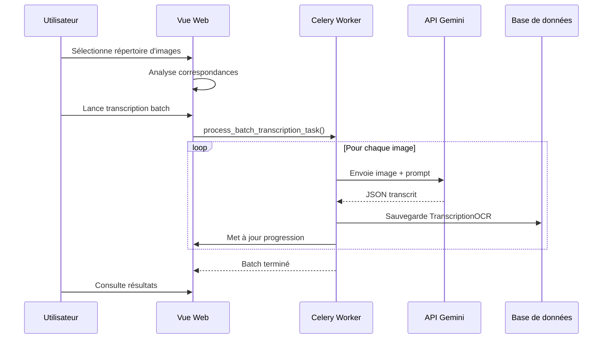
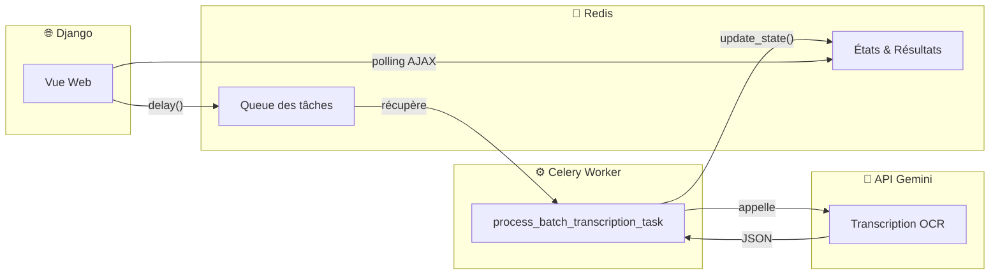

# 📦 Application OCR

> **Résumé** : Transcription OCR des fiches papier via Gemini et évaluation de la qualité des modèles.

---

## 🎯 Objectif

- **Transcrire** les images de fiches papier en JSON structuré via l'API Gemini
- **Évaluer** la qualité des différents modèles OCR (Gemini 3 Flash, Pro, etc.)
- **Comparer** les résultats OCR avec les transcriptions de référence corrigées
- **Piloter** les transcriptions batch avec suivi de progression

!!! warning "Application Pilote"
    Cette application est conçue pour l'**expérimentation et l'évaluation** des modèles OCR. Elle peut être retirée de `INSTALLED_APPS` en production si seule l'app `ingest` est utilisée.

---

## 📊 Modèles

### `TranscriptionOCR`

Métadonnées et évaluation d'une transcription OCR.

| Champ | Type | Description |
|-------|------|-------------|
| `fiche` | ForeignKey | Fiche de référence (vérité terrain) |
| `chemin_json` | CharField | Chemin du fichier JSON brut |
| `chemin_image` | CharField | Chemin de l'image source |
| `type_image` | CharField | Type de traitement appliqué |
| `modele_ocr` | CharField | Modèle d'IA utilisé |
| `date_transcription` | DateTimeField | Date de transcription |

#### Types d'Image

| Code | Description |
|------|-------------|
| `brute` | Image brute (scan original) |
| `optimisee` | Image optimisée pour OCR (contraste, nettoyage...) |

#### Modèles OCR Disponibles

| Code | Nom |
|------|-----|
| `gemini_3_flash` | Gemini 3 Flash |
| `gemini_3_pro` | Gemini 3 Pro |
| `gemini_2.5_pro` | Gemini 2.5 Pro |
| `gemini_2.5_flash_lite` | Gemini 2.5 Flash-Lite |

---

### Champs d'Évaluation

| Champ | Type | Description |
|-------|------|-------------|
| `statut_evaluation` | CharField | Statut (non_evaluee, en_cours, evaluee, erreur) |
| `date_evaluation` | DateTimeField | Date de l'évaluation |
| `score_global` | FloatField | Score de similarité global (0-100%) |
| `nombre_champs_corrects` | IntegerField | Nombre de champs corrects |
| `nombre_champs_total` | IntegerField | Nombre total de champs |
| `temps_traitement_secondes` | FloatField | Durée du traitement OCR |

### Compteurs d'Erreurs

| Champ | Description |
|-------|-------------|
| `nombre_erreurs_dates` | Erreurs sur les champs de date |
| `nombre_erreurs_nombres` | Erreurs sur les champs numériques |
| `nombre_erreurs_texte` | Erreurs sur les champs textuels |
| `nombre_erreurs_especes` | Erreurs sur les noms d'espèces |
| `nombre_erreurs_lieux` | Erreurs sur les lieux/communes |

### Détails de Comparaison

| Champ | Type | Description |
|-------|------|-------------|
| `details_comparaison` | JSONField | Détails champ par champ au format JSON |
| `notes_evaluation` | TextField | Notes et observations manuelles |

---

### Propriétés Calculées

```python
@property
def taux_precision(self):
    """Calcule le taux de précision (champs corrects / total)"""
    return (nombre_champs_corrects / nombre_champs_total) * 100

@property
def nombre_erreurs_total(self):
    """Somme de toutes les erreurs par type"""
    return (erreurs_dates + erreurs_nombres + erreurs_texte
            + erreurs_especes + erreurs_lieux)
```

---

## 🌐 Vues & URLs

| URL | Vue | Description |
|-----|-----|-------------|
| `/ocr/` | `optimisation_ocr_home` | Page d'accueil OCR |
| `/ocr/selection-repertoire/` | `selection_repertoire_ocr` | Navigation dans les répertoires d'images |
| `/ocr/analyser-correspondances/` | `analyser_correspondances` | Analyse correspondances images/fiches |
| `/ocr/lancer-transcription-batch/` | `lancer_transcription_batch` | Lancer une transcription batch |
| `/ocr/verifier-progression/` | `check_batch_progress` | API AJAX progression |
| `/ocr/resultats/` | `batch_results` | Résultats du traitement batch |

---

## 🔄 Workflow de Transcription



---

## 📁 Structure des Répertoires

L'arborescence des images permet de déduire automatiquement les métadonnées :

```
media/
├── Ancienne_fiche/           # type_fiche = "Ancienne_fiche"
│   ├── Sans_traitement/      # type_traitement = "Sans_traitement"
│   │   ├── fiche_001.jpg
│   │   └── fiche_002.jpg
│   └── Traitement_optimise/  # type_traitement = "Traitement_optimise"
│       └── ...
└── Nouvelle_fiche/           # type_fiche = "Nouvelle_fiche"
    └── ...
```

---

## ⚙️ Traitement Batch (Celery + Redis)

### Architecture



### Rôle de Redis

| Fonction | Description |
|----------|-------------|
| **Broker** | File d'attente des tâches Celery |
| **Result Backend** | Stockage des états et résultats des transcriptions |
| **Progression** | États personnalisés via `update_state()` |

**Configuration** :
```python
CELERY_BROKER_URL = 'redis://127.0.0.1:6379/0'
CELERY_RESULT_BACKEND = 'redis://127.0.0.1:6379/0'
```

### Tâche Celery

```python
# Lancement de la transcription batch
process_batch_transcription_task.delay(
    directory_path,     # Chemin du répertoire d'images
    model_name,         # Modèle Gemini à utiliser
    image_type,         # 'brute' ou 'optimisee'
    user_id             # ID de l'utilisateur
)

# La tâche met à jour sa progression dans Redis
task_self.update_state(
    state='PROGRESS',
    meta={'current': i, 'total': total, 'results': [...]}
)
```

!!! info "Limitation Redis"
    Les résultats sont limités à 150 entrées pour ne pas surcharger Redis.

### Suivi de Progression

| Endpoint | Description |
|----------|-------------|
| `/ocr/verifier-progression/` | API JSON pour polling AJAX |
| `/ocr/resultats/` | Page des résultats du batch |

**États Celery** : `PENDING` → `STARTED` → `PROGRESS` → `SUCCESS` / `FAILURE`

---

## 📊 Évaluation des Modèles

### Comparaison avec Vérité Terrain

Le système permet de comparer les transcriptions OCR avec des fiches de référence corrigées manuellement :

1. **Fiche de référence** : `FicheObservation` corrigée et validée
2. **Transcription OCR** : Résultat brut de l'API Gemini
3. **Comparaison** : Champ par champ avec calcul de similarité

### Métriques Calculées

| Métrique | Description |
|----------|-------------|
| **Score global** | Pourcentage de similarité globale |
| **Taux de précision** | Champs corrects / Total |
| **Erreurs par type** | Répartition dates, nombres, texte, espèces, lieux |
| **Temps de traitement** | Performance du modèle |

---

## 🔐 Permissions

| Rôle | Droits |
|------|--------|
| **Observateur** | Aucun accès |
| **Reviewer** | Lancer transcriptions, consulter résultats |
| **Administrateur** | Tous droits |

!!! info "Décorateur personnalisé"
    Les vues utilisent `@transcription_required` pour vérifier les droits.

---

## ⚠️ Points d'Attention

!!! danger "Clé API Gemini"
    L'accès à l'API Gemini nécessite une clé API valide configurée dans les settings (`GEMINI_API_KEY`).

!!! warning "Application pilote"
    Cette app est destinée à l'évaluation. Pour la production, utiliser directement l'app `ingest` qui intègre la transcription.

!!! tip "Choix du modèle"
    - **Gemini 3 Flash** : Rapide, bon rapport qualité/prix
    - **Gemini 3 Pro** : Plus précis, plus lent
    - **Gemini 2.5 Flash-Lite** : Économique, qualité réduite

!!! info "Celery + Redis requis"
    Le traitement batch nécessite :
    - **Redis** actif sur `127.0.0.1:6379`
    - **Worker Celery** lancé (`celery -A observations_nids worker`)

    Vérification : la fonction `is_celery_operational()` teste la connexion aux workers.

---

## 🔗 Voir Aussi

- [📦 Application Ingest](./ingest.md) - Import des JSON transcrits
- [📦 Application Observations](./observations.md) - Fiches créées
