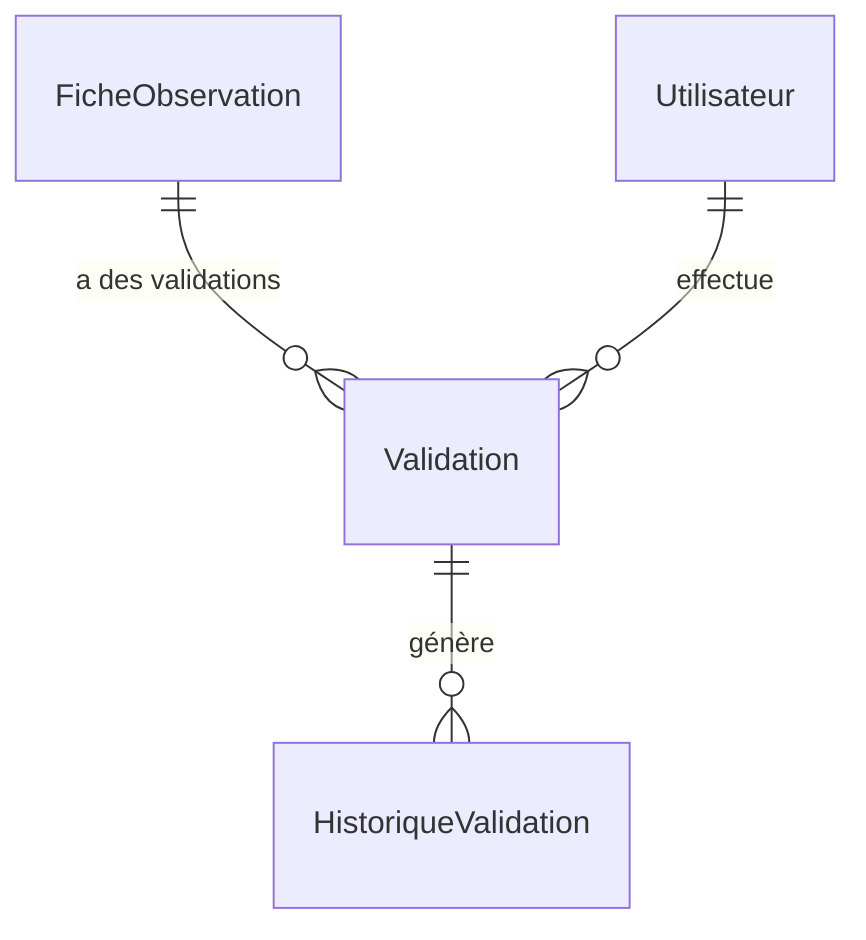
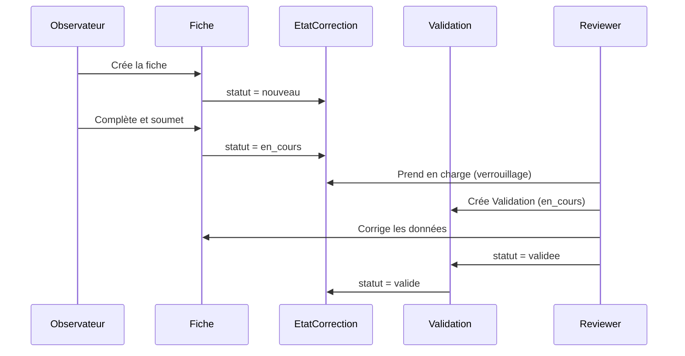

# 📦 Application Review

> **Résumé** : Gestion des validations de fiches par les reviewers et historique des changements de statut.

---

## 🎯 Objectif

- Enregistrer les **validations** effectuées par les reviewers sur les fiches
- Conserver un **historique** des changements de statut de validation
- Permettre le **suivi** des actions de correction par reviewer

---

## 📊 Modèles

### `Validation`

Enregistrement d'une action de validation par un reviewer.

| Champ | Type | Description |
|-------|------|-------------|
| `fiche` | ForeignKey | Fiche d'observation concernée |
| `reviewer` | ForeignKey | Utilisateur reviewer (filtré par rôle) |
| `statut` | CharField | Statut de la validation |
| `date_modification` | DateTimeField | Date de création automatique |

**Statuts possibles** (définis dans `core.constants.STATUT_VALIDATION_CHOICES`) :

| Code | Libellé | Description |
|------|---------|-------------|
| `en_cours` | 🔵 En cours | Validation en cours d'examen |
| `validee` | 🟢 Validée | Fiche validée par le reviewer |
| `rejete` | 🔴 Rejetée | Fiche rejetée (corrections nécessaires) |

**Contrainte** : Le champ `reviewer` est filtré pour n'accepter que les utilisateurs ayant le rôle `reviewer`.

---

### `HistoriqueValidation`

Trace automatique des changements de statut de validation.

| Champ | Type | Description |
|-------|------|-------------|
| `validation` | ForeignKey | Validation parente |
| `ancien_statut` | CharField | Statut avant modification |
| `nouveau_statut` | CharField | Nouveau statut |
| `date_modification` | DateTimeField | Date du changement |
| `modifie_par` | ForeignKey | Utilisateur ayant effectué le changement |

!!! info "Création automatique"
    L'historique est créé automatiquement via la méthode `save()` de `Validation` lorsque le statut change.

---

## 🔗 Relations

---

## 🔄 Relation avec EtatCorrection

L'application `review` fonctionne **en complément** du système `EtatCorrection` de l'application `observations` :

| Système | Rôle | Modèle |
|---------|------|--------|
| **EtatCorrection** | Workflow principal de la fiche | `observations.EtatCorrection` |
| **Validation** | Enregistrement des actions reviewer | `review.Validation` |

### Différences clés

| Aspect | EtatCorrection | Validation |
|--------|----------------|------------|
| **Unicité** | Une seule instance par fiche (OneToOne) | Multiples validations possibles par fiche |
| **Verrouillage** | Gère le verrouillage par reviewer | Pas de verrouillage |
| **Statuts** | nouveau → en_edition → en_cours → valide | en_cours → validee/rejete |
| **Historique** | Via app `audit` | Via `HistoriqueValidation` intégré |

### Workflow combiné

---

## 🌐 Vues & URLs

L'application `review` n'expose **pas d'URLs dédiées**. Les actions de validation sont gérées via :

| Fonctionnalité | Application | URL |
|----------------|-------------|-----|
| Valider une fiche | observations | `/observations/valider/<id>/` |
| Soumettre pour correction | observations | `/observations/soumettre/<id>/` |
| Libérer le verrou | observations | `/observations/<id>/liberer-verrou/` |

---

## 🔐 Permissions

| Rôle | Droits |
|------|--------|
| **Observateur** | Aucun accès aux validations |
| **Reviewer** | Créer/modifier ses propres validations |
| **Administrateur** | Tous droits via Django Admin |

---

## 🛠️ Administration

Les modèles sont accessibles via **Django Admin** :

- `/admin/review/validation/` - Liste des validations
- `/admin/review/historiquevalidation/` - Historique des changements

---

## ⚠️ Points d'Attention

!!! warning "Reviewer uniquement"
    Le champ `reviewer` de `Validation` est filtré avec `limit_choices_to={'role': 'reviewer'}`. Seuls les utilisateurs avec ce rôle peuvent être assignés.

!!! tip "Historique automatique"
    L'historique est créé automatiquement à chaque changement de statut. Il n'est pas nécessaire de créer manuellement des entrées `HistoriqueValidation`.

!!! info "Système complémentaire"
    Ce système est complémentaire à `EtatCorrection`. Pour le workflow principal, référez-vous à la documentation de l'application observations.

---

## 🔗 Voir Aussi

- [📦 Application Observations](./observations.md) - Workflow principal (EtatCorrection)
- [📦 Application Accounts](./accounts.md) - Gestion des rôles (reviewer)
- [📦 Application Audit](./audit.md) - Historique global des modifications
