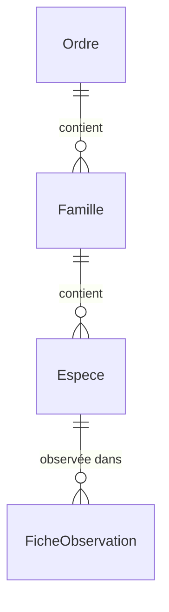

# 📦 Application Taxonomy

> **Résumé** : Gestion de la classification des espèces d'oiseaux : ordres, familles, espèces et codes GONM.

---

## 🎯 Objectif

- Maintenir le référentiel des espèces d'oiseaux observables
- Organiser les espèces selon la classification taxonomique (Ordre → Famille → Espèce)
- Gérer les codes GONM (Groupe Ornithologique Normand) pour la saisie rapide
- Permettre l'import depuis des sources officielles (LOF, TAXREF)

---

## 📊 Modèles

### `Ordre`

Classification de haut niveau des oiseaux.

| Champ | Type | Description |
|-------|------|-------------|
| `nom` | CharField | Nom de l'ordre (unique) |
| `description` | TextField | Description de l'ordre |

**Exemples** : Passeriformes, Accipitriformes, Anseriformes...

---

### `Famille`

Regroupement d'espèces au sein d'un ordre.

| Champ | Type | Description |
|-------|------|-------------|
| `nom` | CharField | Nom de la famille (unique) |
| `ordre` | ForeignKey | Ordre parent |
| `description` | TextField | Description de la famille |

**Exemples** : Paridae (mésanges), Accipitridae (rapaces), Anatidae (canards)...

---

### `Espece`

Espèce d'oiseau pouvant être observée.

| Champ | Type | Description |
|-------|------|-------------|
| `nom` | CharField | Nom vernaculaire français (unique) |
| `nom_anglais` | CharField | Nom vernaculaire anglais |
| `nom_scientifique` | CharField | Nom scientifique (genre + espèce) |
| `code_gonm` | CharField | Code GONM pour saisie rapide (max 10 car.) |
| `statut` | CharField | Statut de conservation |
| `famille` | ForeignKey | Famille parente (nullable) |
| `commentaire` | TextField | Notes et informations complémentaires |
| `lien_oiseau_net` | URLField | Lien vers la fiche oiseaux.net |
| `valide_par_admin` | BooleanField | Validée par un administrateur |

**Exemple** :
```
nom: "Mésange bleue"
nom_anglais: "Eurasian Blue Tit"
nom_scientifique: "Cyanistes caeruleus"
code_gonm: "MESBLE"
famille: Paridae
```

---

## 🔗 Relations



---

## 🌐 Vues & URLs

### Pages Publiques

| URL | Vue | Description |
|-----|-----|-------------|
| `/taxonomy/especes/` | `liste_especes` | Liste paginée des espèces |
| `/taxonomy/especes/<id>/` | `detail_espece` | Fiche détaillée d'une espèce |

### Gestion (CRUD)

| URL | Vue | Description |
|-----|-----|-------------|
| `/taxonomy/especes/creer/` | `creer_espece` | Formulaire de création |
| `/taxonomy/especes/<id>/modifier/` | `modifier_espece` | Modification d'une espèce |
| `/taxonomy/especes/<id>/supprimer/` | `supprimer_espece` | Suppression d'une espèce |
| `/taxonomy/importer/` | `importer_especes` | Import manuel (ancienne interface) |

### Administration des Données

| URL | Vue | Description |
|-----|-----|-------------|
| `/taxonomy/administration/` | `administration_donnees` | Page d'administration |
| `/taxonomy/charger-lof/` | `charger_especes_lof_view` | Import depuis LOF |
| `/taxonomy/charger-taxref/` | `charger_especes_taxref_view` | Import depuis TAXREF |
| `/taxonomy/recuperer-liens-oiseaux-net/` | `recuperer_liens_oiseaux_net_view` | Récupérer les liens oiseaux.net |

---

## 📥 Sources de Données

### LOF (Liste Officielle des Oiseaux de France)

- Source principale pour les espèces françaises
- Contient les noms vernaculaires et scientifiques
- Mise à jour régulière par la LPO/CRBPO

### TAXREF

- Référentiel taxonomique national (MNHN)
- Utilisé pour la classification (ordres, familles)
- Contient les statuts de conservation

### Oiseaux.net

- Fiches descriptives avec photos
- Liens récupérés automatiquement pour enrichir les espèces

---

## 📖 Utilisation dans les Formulaires

L'espèce est sélectionnée dans le formulaire de saisie via une **autocomplétion intelligente**.

📖 **Voir le guide** : [Sélection d'espèce avec autocomplétion](./observations_saisie_formulaires.md#selection-despece)

**Fonctionnement** :
- Recherche sur le nom français, anglais ou scientifique
- Debounce de 800ms pour éviter les requêtes excessives
- Navigation au clavier (↑↓ + Entrée)

---

## 🔐 Permissions

| Rôle | Droits |
|------|--------|
| **Utilisateur** | Consultation uniquement |
| **Reviewer** | Consultation uniquement |
| **Administrateur** | CRUD complet, import depuis sources officielles |

---

## ⚠️ Points d'Attention

!!! warning "Code GONM unique"
    Le code GONM doit être unique pour chaque espèce. Il est utilisé pour la saisie rapide et l'import depuis les fiches papier.

!!! tip "Validation administrative"
    Le champ `valide_par_admin` permet de distinguer les espèces validées des espèces en attente de vérification (créées automatiquement lors de l'import).

!!! info "Famille nullable"
    Une espèce peut ne pas avoir de famille assignée (cas des espèces importées sans classification complète).

---

## 🔗 Voir Aussi

- [📦 Application Observations](./observations.md) - Utilisation des espèces
- [📝 Guide de Saisie](./observations_saisie_formulaires.md#selection-despece) - Autocomplétion espèces
