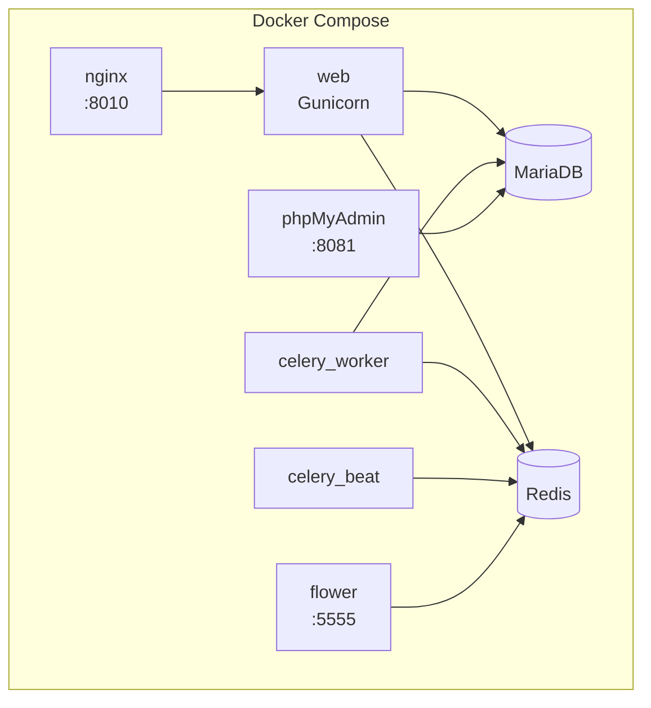

# 🐳 Déploiement Docker

> **Résumé** : Installation et configuration via Docker Compose.

---

## 🎯 Vue d'Ensemble



| Service | Port | Rôle |
|---------|------|------|
| nginx | 8010 | Reverse proxy + fichiers statiques |
| web | 8000 (interne) | Application Django/Gunicorn |
| celery_worker | - | Tâches asynchrones |
| celery_beat | - | Tâches planifiées |
| flower | 5555 | Monitoring Celery |
| db | 3306 (interne) | Base de données MariaDB |
| redis | 6379 (interne) | Cache + broker Celery |
| phpmyadmin | 8081 | Administration BDD |

---

## 📋 Prérequis

| Composant | Version Minimum |
|-----------|-----------------|
| Docker | 20.10+ |
| Docker Compose | 2.0+ |
| Espace disque | 5 Go minimum |
| RAM | 2 Go minimum |

### Vérification

```bash
docker --version
docker compose version
```

---

## 🚀 Installation Rapide

### 1. Cloner le Projet

```bash
git clone <repository-url>
cd observations_nids
```

### 2. Configurer l'Environnement

```bash
cd docker
cp .env.example .env
```

Éditer `.env` avec vos paramètres (voir section Configuration).

### 3. Construire et Démarrer

```bash
# Construction des images
docker compose build

# Démarrage des services
docker compose up -d

# Vérifier le statut
docker compose ps
```

### 4. Créer le Superutilisateur

```bash
docker compose exec web python manage.py createsuperuser
```

### 5. Accéder à l'Application

| URL | Service |
|-----|---------|
| http://localhost:8010 | Application principale |
| http://localhost:8081 | phpMyAdmin |
| http://localhost:5555 | Flower (monitoring) |

---

## ⚙️ Configuration

### Variables d'Environnement

**Fichier** : `docker/.env`

#### Django

```bash
# Clé secrète (générer une nouvelle pour la production)
SECRET_KEY=votre-cle-secrete-unique-et-longue

# Mode debug (False en production)
DEBUG=False

# Hôtes autorisés (format JSON)
ALLOWED_HOSTS='["localhost","127.0.0.1","votre-domaine.com"]'

# Origins CSRF (format JSON)
CSRF_TRUSTED_ORIGINS='["http://localhost:8010","https://votre-domaine.com"]'
```

#### Base de Données

```bash
DB_NAME=observations_nids
DB_USER=observations_user
DB_PASSWORD=mot-de-passe-fort
DB_ROOT_PASSWORD=mot-de-passe-root-fort
DB_HOST=db
DB_PORT=3306
```

#### Superutilisateur (création auto)

```bash
DJANGO_SUPERUSER_USERNAME=admin
DJANGO_SUPERUSER_EMAIL=admin@exemple.com
DJANGO_SUPERUSER_PASSWORD=mot-de-passe-admin
```

#### Services Externes

```bash
# API Gemini pour OCR
GEMINI_API_KEY=AIzaSy...

# Email (Brevo SMTP)
EMAIL_HOST=smtp-relay.brevo.com
EMAIL_PORT=587
EMAIL_USE_TLS=True
EMAIL_HOST_USER=votre-utilisateur
EMAIL_HOST_PASSWORD=votre-mot-de-passe
```

#### Environnement

```bash
ENVIRONMENT=production  # development, pilote, production
VERSION=1.0.0
LOG_LEVEL=INFO
```

---

## 📁 Structure des Fichiers

```
docker/
├── docker-compose.yml      # Configuration principale
├── docker-compose.dev.yml  # Override développement
├── Dockerfile              # Image Django
├── docker-entrypoint.sh    # Script d'initialisation
├── .env.example            # Template variables
├── .env                    # Variables (non versionné)
├── .dockerignore           # Exclusions build
├── Makefile                # Commandes raccourcies
├── nginx/
│   ├── nginx.conf          # Config Nginx globale
│   ├── conf.d/
│   │   └── default.conf    # Config site
│   └── ssl/                # Certificats (optionnel)
└── mariadb/
    └── conf.d/             # Config MariaDB custom
```

---

## 🗄️ Volumes

### Volumes Nommés (Persistants)

| Volume | Contenu | Sauvegarde |
|--------|---------|------------|
| `db_data` | Données MariaDB | Critique |
| `redis_data` | Données Redis (AOF) | Important |
| `static_volume` | Fichiers statiques | Régénérable |

### Montages Bind

| Chemin Hôte | Chemin Container | Usage |
|-------------|------------------|-------|
| `/opt/.../media` | `/app/media` | Images uploadées |
| `../logs` | `/app/logs` | Logs application |

---

## 🔧 Commandes Utiles

### Makefile

Le projet inclut un `Makefile` avec des raccourcis :

```bash
# Production
make build          # Construire les images
make up             # Démarrer les services
make down           # Arrêter les services
make restart        # Redémarrer
make logs           # Voir les logs

# Django
make shell          # Shell Django
make bash           # Bash dans le container
make migrate        # Appliquer migrations
make collectstatic  # Collecter fichiers statiques

# Base de données
make db-shell       # Shell MySQL
make db-backup      # Sauvegarde BDD
make db-restore     # Restauration BDD

# Celery
make celery-logs    # Logs Celery
make celery-status  # Statut workers

# Maintenance
make clean          # Nettoyer containers
make clean-volumes  # Nettoyer volumes (attention!)
make rebuild        # Reconstruction complète
```

### Commandes Docker Directes

```bash
# Logs d'un service
docker compose logs -f web
docker compose logs -f celery_worker

# Shell dans un container
docker compose exec web bash
docker compose exec db mysql -u root -p

# Redémarrer un service
docker compose restart celery_worker

# Mise à jour
docker compose pull
docker compose up -d --build
```

---

## 🔄 Mise à Jour

### Mise à Jour Standard

```bash
cd docker

# Récupérer les changements
git pull

# Reconstruire et redémarrer
docker compose down
docker compose build --no-cache
docker compose up -d

# Appliquer les migrations
docker compose exec web python manage.py migrate
```

### Mise à Jour avec Sauvegarde

```bash
# 1. Sauvegarder la base
make db-backup

# 2. Sauvegarder les médias
tar -czvf media_backup.tar.gz /opt/observations_nids_pilote/media

# 3. Mettre à jour
git pull
docker compose down
docker compose build
docker compose up -d
docker compose exec web python manage.py migrate

# 4. Vérifier
docker compose ps
curl http://localhost:8010/health/
```

---

## 📚 Déploiement de la Documentation

La documentation MkDocs doit être compilée puis collectée avec les fichiers statiques Django.

### Compilation et Déploiement

```bash
# 1. Compiler la documentation MkDocs
docker compose exec web mkdocs build -f docs/mkdocs.yml

# 2. Collecter les fichiers statiques (inclut la doc)
docker compose exec web python manage.py collectstatic --noinput
```

### Commande Combinée

```bash
docker compose exec web bash -c "mkdocs build -f docs/mkdocs.yml && python manage.py collectstatic --noinput"
```

### Accès à la Documentation

| Environnement | URL |
|---------------|-----|
| Local (dev) | http://127.0.0.1:8001/ (serveur MkDocs) |
| Pilote | https://pilote.observation-nids.meteo-poelley50.fr/static/docs/index.html |
| Production | https://votre-domaine.com/static/docs/index.html |

### Lien dans l'Application

Le menu latéral contient un lien "Aide" qui redirige automatiquement :
- **En développement** : vers le serveur MkDocs (port 8001)
- **En production** : vers `/static/docs/index.html`

Pour forcer l'utilisation des fichiers statiques en développement :
```bash
# Dans .env
MKDOCS_USE_STATIC=True
```

### Mise à Jour de la Documentation

Après modification des fichiers `.md` :

```bash
# Recompiler et redéployer
docker compose exec web bash -c "mkdocs build -f docs/mkdocs.yml && python manage.py collectstatic --noinput"

# Redémarrer nginx pour vider le cache (optionnel)
docker compose restart nginx
```

---

## 🔒 SSL/HTTPS

### Configuration Nginx pour SSL

1. Placer les certificats dans `docker/nginx/ssl/` :
   - `certificate.crt`
   - `private.key`

2. Modifier `docker/nginx/conf.d/default.conf` :

```nginx
server {
    listen 80;
    server_name votre-domaine.com;
    return 301 https://$server_name$request_uri;
}

server {
    listen 443 ssl;
    server_name votre-domaine.com;

    ssl_certificate /etc/nginx/ssl/certificate.crt;
    ssl_certificate_key /etc/nginx/ssl/private.key;

    # ... reste de la config
}
```

3. Activer dans `.env` :

```bash
SECURE_SSL_REDIRECT=True
SESSION_COOKIE_SECURE=True
CSRF_COOKIE_SECURE=True
```

---

## 🔍 Dépannage

### Container ne démarre pas

```bash
# Voir les logs
docker compose logs web

# Vérifier la santé
docker compose ps

# Recréer le container
docker compose up -d --force-recreate web
```

### Erreur de connexion BDD

```bash
# Vérifier que MariaDB est prêt
docker compose logs db

# Tester la connexion
docker compose exec db mysql -u root -p -e "SHOW DATABASES;"
```

### Erreur CSRF 403

Vérifier dans `.env` :
```bash
CSRF_TRUSTED_ORIGINS='["http://localhost:8010"]'
```

**Note** : Format JSON avec guillemets doubles à l'intérieur.

### Fichiers statiques manquants

```bash
docker compose exec web python manage.py collectstatic --noinput
docker compose restart nginx
```

### Celery ne traite pas les tâches

```bash
# Vérifier les workers
docker compose logs celery_worker

# Redémarrer
docker compose restart celery_worker celery_beat
```

### Reconstruire complètement

```bash
docker compose down -v  # Attention: supprime les volumes!
docker compose build --no-cache
docker compose up -d
```

---

## 📊 Monitoring

### Flower (Celery)

**URL** : http://localhost:5555

- Tâches en cours et terminées
- État des workers
- Graphiques de performance

### Logs

```bash
# Tous les logs
docker compose logs -f

# Service spécifique
docker compose logs -f web
docker compose logs -f celery_worker
```

### Health Check

```bash
curl http://localhost:8010/health/
```

---

## 🚀 Production

### Checklist

- [ ] `DEBUG=False`
- [ ] `SECRET_KEY` unique et fort
- [ ] Mots de passe forts pour BDD
- [ ] SSL/HTTPS configuré
- [ ] `SECURE_SSL_REDIRECT=True`
- [ ] `SESSION_COOKIE_SECURE=True`
- [ ] `CSRF_COOKIE_SECURE=True`
- [ ] Sauvegardes automatisées
- [ ] Monitoring configuré
- [ ] Logs centralisés

### Performances

| Paramètre | Développement | Production |
|-----------|---------------|------------|
| Gunicorn workers | 2 | 4+ |
| Celery concurrency | 1 | 2+ |
| Redis maxmemory | 100mb | 512mb+ |
| Nginx worker_connections | 512 | 1024+ |

---

## 🔗 Voir Aussi

- [🖥️ Déploiement Linux/Windows](./deploiement_linux_windows.md) - Installation native
- [🏗️ Architecture](../architecture.md) - Vue d'ensemble technique
- [🤖 OCR Gemini](../guides/ocr_gemini.md) - Configuration transcription
