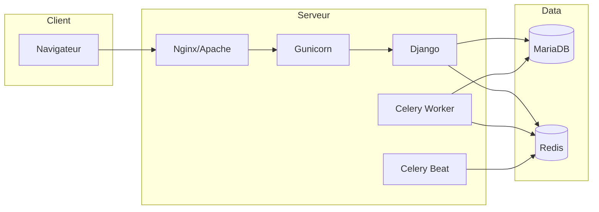

# 🖥️ Déploiement Linux et Windows

> **Résumé** : Installation native sur Linux (Ubuntu/Debian/Raspberry Pi) et Windows.

---

## 🎯 Vue d'Ensemble



---

## 📋 Prérequis

### Composants Requis

| Composant | Version | Linux | Windows |
|-----------|---------|-------|---------|
| Python | 3.12+ | `apt install python3.12` | python.org |
| MariaDB | 10.11+ | `apt install mariadb-server` | mariadb.org |
| Redis | 7+ | `apt install redis-server` | Redis pour Windows |
| Git | - | `apt install git` | git-scm.com |

### Vérification Python

```bash
python --version  # ou python3 --version
# Python 3.12.x
```

---

## 🐧 Installation Linux

### 1. Dépendances Système

```bash
# Ubuntu/Debian
sudo apt update
sudo apt install -y \
    python3.12 python3.12-venv python3.12-dev \
    mariadb-server mariadb-client libmariadb-dev \
    redis-server \
    build-essential pkg-config \
    libjpeg-dev zlib1g-dev \
    nginx
```

### 2. Configuration MariaDB

```bash
# Sécuriser l'installation
sudo mysql_secure_installation

# Créer la base et l'utilisateur
sudo mysql -u root -p
```

```sql
CREATE DATABASE observations_nids CHARACTER SET utf8mb4 COLLATE utf8mb4_unicode_ci;
CREATE USER 'observations_user'@'localhost' IDENTIFIED BY 'mot_de_passe_fort';
GRANT ALL PRIVILEGES ON observations_nids.* TO 'observations_user'@'localhost';
FLUSH PRIVILEGES;
EXIT;
```

### 3. Configuration Redis

```bash
# Vérifier que Redis fonctionne
sudo systemctl status redis-server
sudo systemctl enable redis-server

# Test
redis-cli ping
# PONG
```

### 4. Installation de l'Application

```bash
# Créer le répertoire
sudo mkdir -p /var/www/html/Observations_Nids
sudo chown $USER:www-data /var/www/html/Observations_Nids
cd /var/www/html/Observations_Nids

# Cloner le projet
git clone <repository-url> .

# Environnement virtuel
python3.12 -m venv .venv
source .venv/bin/activate

# Dépendances
pip install -r requirements-prod.txt
```

### 5. Configuration de l'Application

```bash
# Copier et éditer .env
cp .env.example .env
nano .env
```

**Variables essentielles** :

```bash
SECRET_KEY=generer-une-cle-unique-longue
DEBUG=False
ALLOWED_HOSTS='["localhost","votre-domaine.com"]'

DB_NAME=observations_nids
DB_USER=observations_user
DB_PASSWORD=mot_de_passe_fort
DB_HOST=localhost
DB_PORT=3306

CELERY_BROKER_URL=redis://localhost:6379/0
CELERY_RESULT_BACKEND=redis://localhost:6379/0

GEMINI_API_KEY=votre-cle-api
```

### 6. Initialisation Django

```bash
# Activer l'environnement
source .venv/bin/activate

# Migrations
python manage.py migrate

# Superutilisateur
python manage.py createsuperuser

# Fichiers statiques
python manage.py collectstatic --noinput

# Créer les répertoires
mkdir -p logs media
sudo chown -R www-data:www-data logs media
```

### 7. Services Celery (systemd)

**Fichier** : `/etc/systemd/system/celery-worker.service`

```ini
[Unit]
Description=Celery Worker - Observations Nids
After=network.target redis-server.service mariadb.service

[Service]
Type=forking
User=www-data
Group=www-data
WorkingDirectory=/var/www/html/Observations_Nids
Environment="PATH=/var/www/html/Observations_Nids/.venv/bin"
ExecStart=/var/www/html/Observations_Nids/.venv/bin/celery \
    -A observations_nids worker \
    --loglevel=info \
    --concurrency=2 \
    --logfile=/var/www/html/Observations_Nids/logs/celery-worker.log \
    --detach

Restart=always
RestartSec=10
MemoryMax=512M
CPUQuota=150%

[Install]
WantedBy=multi-user.target
```

**Fichier** : `/etc/systemd/system/celery-beat.service`

```ini
[Unit]
Description=Celery Beat - Observations Nids
After=celery-worker.service mariadb.service

[Service]
Type=forking
User=www-data
Group=www-data
WorkingDirectory=/var/www/html/Observations_Nids
Environment="PATH=/var/www/html/Observations_Nids/.venv/bin"
ExecStart=/var/www/html/Observations_Nids/.venv/bin/celery \
    -A observations_nids beat \
    --loglevel=info \
    --scheduler django_celery_beat.schedulers:DatabaseScheduler \
    --logfile=/var/www/html/Observations_Nids/logs/celery-beat.log \
    --detach

Restart=always
RestartSec=10
MemoryMax=256M

[Install]
WantedBy=multi-user.target
```

**Activation** :

```bash
sudo systemctl daemon-reload
sudo systemctl enable celery-worker celery-beat
sudo systemctl start celery-worker celery-beat
sudo systemctl status celery-worker celery-beat
```

### 8. Configuration Nginx

**Fichier** : `/etc/nginx/sites-available/observations_nids`

```nginx
server {
    listen 80;
    server_name votre-domaine.com;

    client_max_body_size 100M;

    location /static/ {
        alias /var/www/html/Observations_Nids/staticfiles/;
        expires 30d;
    }

    location /media/ {
        alias /var/www/html/Observations_Nids/media/;
        expires 7d;
    }

    location / {
        proxy_pass http://127.0.0.1:8000;
        proxy_set_header Host $host;
        proxy_set_header X-Real-IP $remote_addr;
        proxy_set_header X-Forwarded-For $proxy_add_x_forwarded_for;
        proxy_set_header X-Forwarded-Proto $scheme;
        proxy_connect_timeout 120s;
        proxy_read_timeout 120s;
    }
}
```

**Activation** :

```bash
sudo ln -s /etc/nginx/sites-available/observations_nids /etc/nginx/sites-enabled/
sudo nginx -t
sudo systemctl reload nginx
```

### 9. Service Gunicorn (systemd)

**Fichier** : `/etc/systemd/system/gunicorn.service`

```ini
[Unit]
Description=Gunicorn - Observations Nids
After=network.target

[Service]
User=www-data
Group=www-data
WorkingDirectory=/var/www/html/Observations_Nids
Environment="PATH=/var/www/html/Observations_Nids/.venv/bin"
ExecStart=/var/www/html/Observations_Nids/.venv/bin/gunicorn \
    observations_nids.wsgi:application \
    --bind 127.0.0.1:8000 \
    --workers 4 \
    --timeout 120 \
    --access-logfile /var/www/html/Observations_Nids/logs/gunicorn-access.log \
    --error-logfile /var/www/html/Observations_Nids/logs/gunicorn-error.log

Restart=always
RestartSec=10

[Install]
WantedBy=multi-user.target
```

**Activation** :

```bash
sudo systemctl daemon-reload
sudo systemctl enable gunicorn
sudo systemctl start gunicorn
```

---

## 🪟 Installation Windows

### 1. Prérequis

1. **Python 3.12** : Télécharger depuis python.org
2. **MariaDB** : Télécharger depuis mariadb.org
3. **Redis** : Utiliser Memurai ou Redis pour Windows
4. **Git** : Télécharger depuis git-scm.com

### 2. Configuration MariaDB

```sql
-- Via HeidiSQL ou mysql CLI
CREATE DATABASE observations_nids CHARACTER SET utf8mb4 COLLATE utf8mb4_unicode_ci;
CREATE USER 'observations_user'@'localhost' IDENTIFIED BY 'mot_de_passe_fort';
GRANT ALL PRIVILEGES ON observations_nids.* TO 'observations_user'@'localhost';
FLUSH PRIVILEGES;
```

### 3. Installation de l'Application

```powershell
# Cloner le projet
cd C:\Projets
git clone <repository-url> observations_nids
cd observations_nids

# Environnement virtuel
python -m venv .venv
.venv\Scripts\activate

# Dépendances
pip install -r requirements-dev.txt
```

### 4. Configuration

**Fichier** : `observations_nids/settings_local.py`

```python
DATABASES = {
    'default': {
        'ENGINE': 'django.db.backends.mysql',
        'NAME': 'observations_nids',
        'USER': 'observations_user',
        'PASSWORD': 'mot_de_passe_fort',
        'HOST': 'localhost',
        'PORT': '3306',
        'OPTIONS': {
            'init_command': "SET sql_mode='STRICT_TRANS_TABLES'",
            'charset': 'utf8mb4',
        },
    }
}

CELERY_BROKER_URL = 'redis://localhost:6379/0'
CELERY_RESULT_BACKEND = 'redis://localhost:6379/0'

DEBUG = True
ALLOWED_HOSTS = ['localhost', '127.0.0.1']
```

### 5. Initialisation

```powershell
# Migrations
python manage.py migrate

# Superutilisateur
python manage.py createsuperuser

# Fichiers statiques
python manage.py collectstatic --noinput
```

### 6. Lancement (Développement)

**Terminal 1 - Django** :
```powershell
.venv\Scripts\activate
python manage.py runserver
```

**Terminal 2 - Celery Worker** :
```powershell
.venv\Scripts\activate
celery -A observations_nids worker --loglevel=info --pool=solo
```

**Terminal 3 - Celery Beat** (optionnel) :
```powershell
.venv\Scripts\activate
celery -A observations_nids beat --loglevel=info
```

### 7. Accès

- Application : http://localhost:8000
- Admin : http://localhost:8000/admin/

---

## 🍇 Raspberry Pi

### Optimisations Spécifiques

**Celery Worker** (ressources limitées) :

```bash
# Concurrence réduite
celery -A observations_nids worker --concurrency=1 --loglevel=info
```

**MariaDB** :

```ini
# /etc/mysql/mariadb.conf.d/99-raspberry.cnf
[mysqld]
innodb_buffer_pool_size = 128M
max_connections = 20
```

**Swap** (si peu de RAM) :

```bash
sudo dphys-swapfile swapoff
sudo nano /etc/dphys-swapfile
# CONF_SWAPSIZE=1024
sudo dphys-swapfile setup
sudo dphys-swapfile swapon
```

---

## 🔄 Mise à Jour

### Linux

```bash
cd /var/www/html/Observations_Nids
source .venv/bin/activate

# Récupérer les changements
git pull

# Dépendances
pip install -r requirements-prod.txt

# Migrations
python manage.py migrate

# Fichiers statiques
python manage.py collectstatic --noinput

# Redémarrer les services
sudo systemctl restart gunicorn celery-worker celery-beat
```

### Windows

```powershell
cd C:\Projets\observations_nids
.venv\Scripts\activate

git pull
pip install -r requirements-dev.txt
python manage.py migrate
python manage.py collectstatic --noinput

# Redémarrer les terminaux manuellement
```

---

## 🔍 Dépannage

### Erreur de connexion MySQL

```bash
# Vérifier le service
sudo systemctl status mariadb

# Tester la connexion
mysql -u observations_user -p observations_nids
```

### Celery ne démarre pas

```bash
# Vérifier Redis
redis-cli ping

# Logs Celery
sudo journalctl -u celery-worker -f
```

### Permissions fichiers

```bash
sudo chown -R www-data:www-data /var/www/html/Observations_Nids/logs
sudo chown -R www-data:www-data /var/www/html/Observations_Nids/media
sudo chmod -R 755 /var/www/html/Observations_Nids/staticfiles
```

### Page blanche / Erreur 500

```bash
# Activer DEBUG temporairement dans .env
DEBUG=True

# Voir les logs
tail -f /var/www/html/Observations_Nids/logs/gunicorn-error.log
tail -f /var/www/html/Observations_Nids/logs/django_debug.log
```

---

## 📊 Structure des Répertoires

```
/var/www/html/Observations_Nids/
├── .venv/                 # Environnement virtuel
├── .env                   # Configuration
├── manage.py
├── observations_nids/     # Projet Django
├── observations/          # Application principale
├── accounts/              # Authentification
├── ...                    # Autres applications
├── staticfiles/           # Fichiers statiques (collectstatic)
├── media/                 # Fichiers uploadés
├── logs/                  # Logs application
│   ├── django_debug.log
│   ├── celery-worker.log
│   ├── celery-beat.log
│   ├── gunicorn-access.log
│   └── gunicorn-error.log
└── deployment/            # Scripts de déploiement
```

---

## 🔗 Voir Aussi

- [🐳 Déploiement Docker](./deploiement_docker.md) - Alternative containerisée
- [🏗️ Architecture](../architecture.md) - Vue d'ensemble technique
- [🔐 Permissions](../guides/permissions.md) - Gestion des accès
