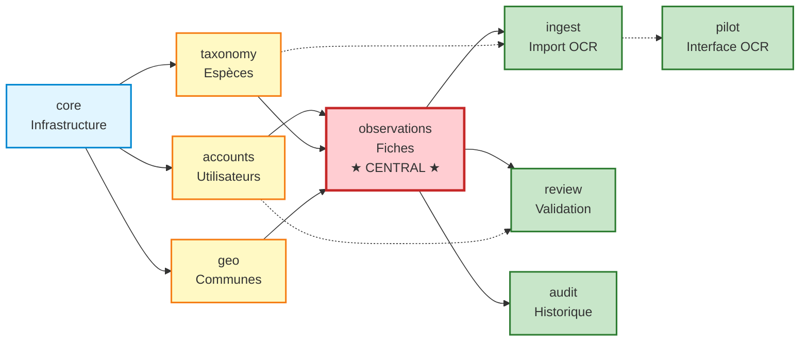

# Applications Django - Vue d'ensemble

Ce répertoire contient la **documentation opérationnelle** de chaque application Django du projet Observations Nids.

## Objectif

Permettre une **reprise rapide** du développement en documentant :
- Le rôle et les responsabilités de chaque application
- Les modèles, vues, formulaires et templates clés
- Les **pièges à éviter** (gotchas) basés sur l'expérience réelle
- Les interactions entre applications
- Des exemples de code de référence

## Architecture générale du projet

```
observations_nids/
├── accounts/           # Gestion des utilisateurs et authentification
├── core/              # Modèles et utilitaires de base (SoftDelete, etc.)
├── taxonomy/          # Espèces, familles, codes GONM
├── geo/               # Géolocalisation, communes, départements
├── observations/      # Fiches d'observation (modèle central)
├── ingest/            # Pipeline d'import et transcription OCR
├── pilot/             # Interface Pilote : sélection et traitement OCR
├── review/            # Workflow de validation des fiches
├── audit/             # Traçabilité et historique des modifications
└── helpdesk_custom/   # Système de tickets (personnalisation)
```

## Applications par domaine fonctionnel

### 🔐 Authentification et comptes
- **[accounts](accounts/index.md)** - Utilisateurs, rôles, permissions
  - Modèle `Utilisateur` personnalisé
  - Gestion des profils observateurs
  - Import/export d'utilisateurs

### 📊 Données de base (référentiels)
- **[taxonomy](taxonomy/index.md)** - Espèces d'oiseaux, familles, codes GONM
  - Référentiel taxonomique
  - Matching fuzzy pour l'OCR
  - Import depuis sources externes

- **[geo](geo/index.md)** - Communes, départements, géocodage
  - Référentiel géographique
  - Validation des coordonnées GPS
  - Import depuis INSEE/data.gouv.fr

### 🦜 Cœur métier : Observations
- **[observations](observations/index.md)** - **Modèle central : FicheObservation**
  - Fiches de nidification
  - Relations 1:1 (Localisation, Nid, ResumeObservation, etc.)
  - Relations 1:N (Observations, Remarques)
  - Formulaires de saisie et correction

### 🔄 Workflow OCR et validation
- **[pilot](pilot/index.md)** - **Interface Pilote** (environnement de test)
  - Sélection des scans à traiter
  - Déclenchement des traitements OCR par lot
  - ⚠️ **Points critiques** : gestion des chemins de fichiers

- **[ingest](ingest/index.md)** - Pipeline d'import et transcription
  - OCR → TranscriptionBrute (JSON)
  - Matching d'espèces (EspeceCandidate)
  - Création de FicheObservation depuis transcription

- **[review](review/index.md)** - Validation et correction des fiches
  - Workflow de validation (nouveau → en_edition → valide)
  - Interface de correction
  - Commentaires des valideurs

### 🔧 Infrastructure
- **[core](core/index.md)** - Modèles et utilitaires de base
  - SoftDeleteModel (suppression logique)
  - Mixins et helpers
  - Constantes globales

- **[audit](audit/index.md)** - Traçabilité
  - HistoriqueModification
  - Suivi des changements sur les fiches

- **[helpdesk_custom](helpdesk_custom/index.md)** - Système de tickets
  - Personnalisation de django-helpdesk
  - Support utilisateurs

## Structure de documentation par application

Chaque application suit le même pattern :

```
[app_name]/
├── index.md              # Vue d'ensemble et responsabilités
├── models.md             # Modèles de données détaillés
├── views.md              # Vues et logique métier
├── forms.md              # Formulaires (le cas échéant)
├── templates.md          # Organisation des templates (le cas échéant)
├── [specific].md         # Fichiers spécifiques à l'app
└── gotchas.md            # ⚠️ Pièges à éviter et points d'attention
```

### Le fichier `gotchas.md` ⚠️

**Le plus important** pour éviter de reproduire des erreurs.

Chaque piège documenté suit ce format :
```markdown
## ⚠️ Problème : [Titre]
**Contexte** : Quand/où ça se produit
**Symptôme** : Ce qu'on observe
**Cause** : Pourquoi ça arrive
**Solution** : Comment le résoudre
**Prévention** : Comment l'éviter à l'avenir
**Fichiers concernés** : Localisation dans le code
```

## Dépendances entre applications



### Légende
- **Flèches pleines** (→) : Dépendances directes principales
- **Flèches pointillées** (-.→) : Dépendances secondaires
- 🔵 **Infrastructure** (core) : Modèles abstraits, utilitaires de base
- 🟡 **Référentiels** (accounts, taxonomy, geo) : Données de référence
- 🔴 **Central** (observations) : Modèle pivot du projet
- 🟢 **Workflows** (ingest, review, audit, pilot) : Processus métier

## Ordre de lecture recommandé

Pour comprendre le projet :

1. **[core](core/index.md)** - Comprendre les modèles de base
2. **[accounts](accounts/index.md)** - Système d'utilisateurs
3. **[taxonomy](taxonomy/index.md)** + **[geo](geo/index.md)** - Référentiels
4. **[observations](observations/index.md)** - Modèle central
5. **[ingest](ingest/index.md)** → **[pilot](pilot/index.md)** - Pipeline OCR
6. **[review](review/index.md)** - Validation

## Applications critiques (à documenter en priorité)

### Priorité 1 : Cœur métier
- ✅ **pilot** - Interface OCR (template de référence créé)
- ⏳ **observations** - Modèle central
- ⏳ **ingest** - Pipeline d'import

### Priorité 2 : Référentiels
- ⏳ **taxonomy** - Espèces
- ⏳ **geo** - Communes

### Priorité 3 : Workflow
- ⏳ **review** - Validation
- ⏳ **accounts** - Utilisateurs

### Priorité 4 : Infrastructure
- ⏳ **core** - Modèles de base
- ⏳ **audit** - Historique
- ⏳ **helpdesk_custom** - Support

## Conventions de documentation

### Liens vers le code source
Toujours indiquer la localisation précise :
```markdown
**Fichier** : `observations/models.py:107-115`
```

### Exemples de code
Privilégier les **exemples concrets** et **testés** :
```python
# ✅ BON : Exemple concret avec contexte
fiche = FicheObservation.objects.select_related('observateur').get(num_fiche=123)

# ❌ MAUVAIS : Exemple générique sans contexte
obj = Model.objects.get(pk=1)
```

### Notes d'alerte
```markdown
⚠️ **Attention** : Description du risque
🔥 **Critique** : Point d'attention majeur
✅ **Bonne pratique** : Recommandation
❌ **À éviter** : Anti-pattern
```

## Mises à jour

Cette documentation est un **document vivant**. Lors de chaque modification importante :
1. Mettre à jour la section concernée
2. Ajouter un piège dans `gotchas.md` si erreur rencontrée
3. Mettre à jour la date en bas de fichier

---

## Checklist de documentation d'une application

Lorsque vous documentez une nouvelle application :

- [ ] Créer `index.md` avec vue d'ensemble
- [ ] Lister tous les modèles dans `models.md`
- [ ] Documenter les vues principales dans `views.md`
- [ ] Documenter les formulaires dans `forms.md` (si applicable)
- [ ] Créer `gotchas.md` avec les pièges connus
- [ ] Ajouter des exemples de code testés
- [ ] Vérifier les liens entre fichiers
- [ ] Mettre à jour ce README.md avec le lien vers l'app

---

*Dernière mise à jour : 2025-12-27*
