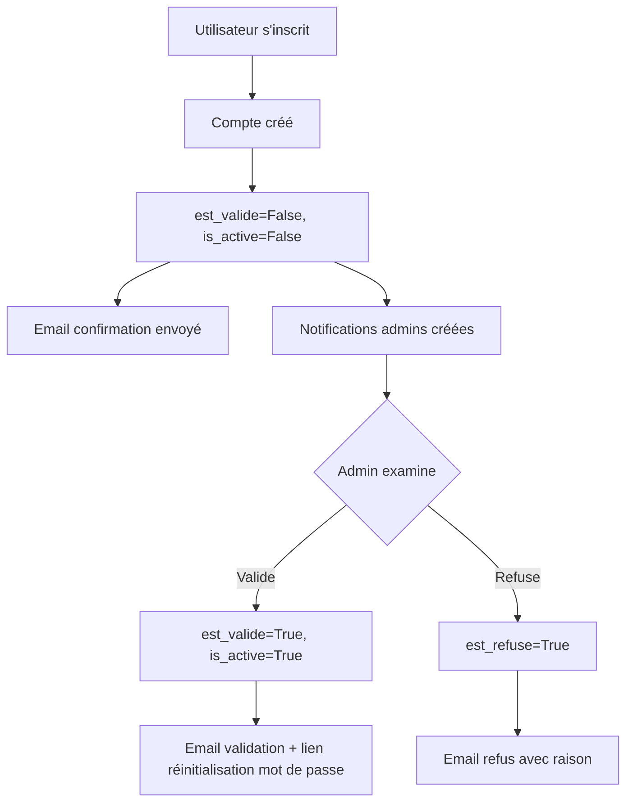

# Accounts - Vue d'ensemble

> Gestion des utilisateurs, authentification, notifications et workflow de validation de compte

## Responsabilité

L'application **accounts** gère le **cycle de vie complet des utilisateurs** :

1. **Inscription publique** : Utilisateurs créent leurs comptes (sans accès immédiat)
2. **Validation administrateur** : Workflow de validation/refus des demandes
3. **Notifications** : Système de notifications internes pour admins et utilisateurs
4. **Gestion des utilisateurs** : CRUD, recherche, soft delete, promotion admin
5. **Authentification** : Login, logout, mot de passe oublié
6. **Permissions** : Rôles (observateur / reviewer / administrateur)
7. **Import/Export** : Transfert d'utilisateurs entre environnements

## Position dans l'architecture

```
accounts/
  ├── Utilisateur (AUTH_USER_MODEL) - Modèle central de tout le projet
  │       └── Relations : observations, review, ingest, audit, etc.
  ├── Notification - Système de notifications internes
  ├── EmailService - Envoi d'emails (validation, refus, rappels)
  └── Management commands - Import/export users
```

**Utilisé par** : Toutes les applications (AUTH_USER_MODEL global)

---

## Modèles principaux

| Modèle | Description | Fichier |
|--------|-------------|---------|
| **[Utilisateur](models.md#modele-utilisateur)** | Modèle utilisateur personnalisé (extends AbstractUser) | `accounts/models.py:8-29` |
| **[Notification](models.md#modele-notification)** | Notifications internes (demandes compte, validations) | `accounts/models.py:31-97` |

---

## Workflow de validation de compte

### Inscription → Validation



**États possibles** :

| est_valide | is_active | est_refuse | État |
|------------|-----------|------------|------|
| False | False | False | **En attente** (nouveau compte) |
| True | True | False | **Actif** (validé et actif) |
| False | False | True | **Refusé** (demande rejetée) |
| True | False | False | **Désactivé** (soft delete) |

---

## Vues principales

### `views/auth.py` - Authentification et workflow

| Vue | Route | Rôle | Permission |
|-----|-------|------|------------|
| `CustomLoginView` | `/login/` | Connexion avec détection compte en attente | Public |
| `inscription_publique` | `/inscription/` | Formulaire d'inscription publique | Public |
| `inscription_completee` | `/inscription/completee/` | Page de confirmation après inscription | Public |
| `compte_en_attente` | `/comptes/<id>/attente/` | Statut compte en attente | Public |
| `renvoyer_notification_admin` | `/comptes/<id>/renvoyer/` | Relancer notification admin (anti-spam 24h) | Public (POST) |
| `valider_utilisateur` | `/utilisateurs/<id>/valider/` | Valider un compte | Admin |
| `refuser_utilisateur` | `/utilisateurs/<id>/refuser/` | Refuser un compte (avec raison) | Admin |
| `mot_de_passe_oublie` | `/mot-de-passe/oublie/` | Demander réinitialisation mot de passe | Public |
| `reinitialiser_mot_de_passe` | `/mot-de-passe/reset/<uidb64>/<token>/` | Réinitialiser mot de passe | Public (token) |
| `promouvoir_administrateur` | `/promouvoir-admin/` | Promouvoir un utilisateur admin | Superuser |
| `mon_profil` | `/mon-profil/` | Voir son propre profil | Authenticated |

### `views/admin_views.py` - Gestion administrateur

| Vue | Route | Rôle | Permission |
|-----|-------|------|------------|
| `liste_utilisateurs` | `/utilisateurs/` | Liste filtrée et paginée | Admin |
| `creer_utilisateur` | `/utilisateurs/creer/` | Créer utilisateur manuellement | Admin |
| `modifier_utilisateur` | `/utilisateurs/<id>/modifier/` | Modifier utilisateur | Admin |
| `detail_utilisateur` | `/utilisateurs/<id>/detail/` | Détails + fiches de l'utilisateur | Admin |
| `desactiver_utilisateur` | `/utilisateurs/<id>/desactiver/` | Soft delete (is_active=False) | Admin |
| `activer_utilisateur` | `/utilisateurs/<id>/activer/` | Réactiver compte désactivé | Admin |
| `envoyer_email_rappel_utilisateur` | `/utilisateurs/<id>/email-rappel/` | Envoyer rappel compte | Admin |

---

## Fonctionnalités principales

### 1. Inscription publique avec validation

**Fichier** : `accounts/views/auth.py:275-312`

```python
def inscription_publique(request):
    # 1. Créer utilisateur (inactif, non validé)
    utilisateur = form.save(commit=False)
    utilisateur.est_valide = False
    utilisateur.is_active = False
    utilisateur.role = 'observateur'
    utilisateur.save()

    # 2. Créer notifications pour tous les admins
    for admin in administrateurs:
        Notification.objects.create(
            destinataire=admin,
            type_notification='demande_compte',
            titre=f"Nouvelle demande de compte : {utilisateur.username}",
            message=f"{utilisateur.first_name} {utilisateur.last_name} a demandé un compte.",
            lien=f"/accounts/utilisateurs/{utilisateur.id}/detail/",
            utilisateur_concerne=utilisateur
        )

    # 3. Envoyer emails
    EmailService.envoyer_email_nouvelle_demande_compte(utilisateur)  # Admin
    EmailService.envoyer_email_demande_enregistree(utilisateur)      # Utilisateur
```

### 2. Validation par administrateur

**Fichier** : `accounts/views/auth.py:345-386`

```python
def valider_utilisateur(request, user_id):
    # 1. Activer le compte
    utilisateur.est_valide = True
    utilisateur.is_active = True
    utilisateur.est_refuse = False  # Réinitialiser si précédemment refusé
    utilisateur.save()

    # 2. Créer notification utilisateur
    Notification.objects.create(
        destinataire=utilisateur,
        type_notification='compte_valide',
        titre="Votre compte a été validé",
        message="Vous pouvez maintenant vous connecter."
    )

    # 3. Envoyer email avec lien réinitialisation mot de passe
    EmailService.envoyer_email_compte_valide(utilisateur, message_personnalise)

    # 4. Marquer notifications admins comme lues
    Notification.objects.filter(
        type_notification='demande_compte',
        utilisateur_concerne=utilisateur,
        est_lue=False
    ).update(est_lue=True)
```

### 3. Refus de compte

**Fichier** : `accounts/views/auth.py:389-435`

```python
def refuser_utilisateur(request, user_id):
    raison = request.POST.get('raison', '').strip()

    # Marquer comme refusé
    utilisateur.est_valide = False
    utilisateur.is_active = False
    utilisateur.est_refuse = True
    utilisateur.save()

    # Notifier l'utilisateur
    EmailService.envoyer_email_compte_refuse(utilisateur, raison)
```

### 4. Soft delete (désactivation)

**Fichier** : `accounts/views/auth.py:201-217`

```python
def desactiver_utilisateur(request, user_id):
    utilisateur.is_active = False
    utilisateur.save()
    # ✅ Utilisateur ne peut plus se connecter
    # ✅ Toutes ses données sont conservées (fiches, validations, etc.)
```

### 5. Mot de passe oublié

**Workflow complet** :

1. Utilisateur saisit son email (`mot_de_passe_oublie`)
2. Email avec token envoyé (Django token generator)
3. Utilisateur clique lien → `reinitialiser_mot_de_passe(uidb64, token)`
4. Token validé → nouveau mot de passe saisi
5. Mot de passe hashé et sauvegardé

### 6. Anti-spam relance notification

**Fichier** : `accounts/views/auth.py:547-590`

```python
def renvoyer_notification_admin(request, user_id):
    # Limite : 1 renvoi toutes les 24 heures
    last_sent_time_str = request.session.get(f'last_resend_{user_id}')
    if last_sent_time_str:
        last_sent_time = datetime.fromisoformat(last_sent_time_str)
        if datetime.now() - last_sent_time < timedelta(hours=24):
            messages.warning(request, "Une notification a déjà été renvoyée il y a moins de 24 heures.")
            return redirect('accounts:compte_en_attente', user_id=user_id)
```

---

## Service email

**Fichier** : `accounts/utils/email_service.py`

**Méthodes principales** :

```python
class EmailService:
    @staticmethod
    def envoyer_email_nouvelle_demande_compte(utilisateur):
        """Notifie admin d'une nouvelle demande"""

    @staticmethod
    def envoyer_email_demande_enregistree(utilisateur):
        """Confirme à l'utilisateur que sa demande est enregistrée"""

    @staticmethod
    def envoyer_email_compte_valide(utilisateur, message_personnalise=''):
        """Notifie utilisateur de validation + lien mot de passe"""

    @staticmethod
    def envoyer_email_compte_refuse(utilisateur, raison=''):
        """Notifie utilisateur du refus avec raison"""

    @staticmethod
    def envoyer_email_reinitialisation_mdp(utilisateur, uid, token):
        """Envoie lien de réinitialisation de mot de passe"""

    @staticmethod
    def envoyer_email_rappel_compte(utilisateur, uid, token, message_personnalise=''):
        """Rappel informations compte existant"""
```

---

## Commandes management

### Export d'utilisateurs

**Fichier** : `accounts/management/commands/export_users.py`

```bash
python manage.py export_users
```

**Fonctionnalité** : Exporte les utilisateurs en JSON pour transfert vers un autre environnement.

### Import d'utilisateurs

**Fichier** : `accounts/management/commands/import_users.py`

```bash
python manage.py import_users fichier.json
```

**Fonctionnalité** : Importe les utilisateurs depuis un fichier JSON (gestion conflits d'email).

**Voir** : [gotchas.md - Gestion conflits email](gotchas.md#probleme-gestion-conflits-demail-lors-de-limport)

---

## Permissions et sécurité

### Fonctions de test

**Fichier** : `accounts/views/auth.py:29-36`

```python
def est_admin(user):
    """Vérifie si l'utilisateur est un administrateur"""
    return user.is_authenticated and user.role == 'administrateur'

def est_superuser(user):
    """Vérifie si l'utilisateur est un superuser"""
    return user.is_superuser
```

**Utilisation** :

```python
from django.contrib.auth.decorators import user_passes_test

@user_passes_test(est_admin)
def ma_vue_admin(request):
    # Uniquement accessible aux administrateurs
    pass
```

### Hiérarchie des permissions

```
Superuser (is_superuser=True)
    └── Peut promouvoir des administrateurs
        └── Administrateur (role='administrateur')
            └── Peut valider/refuser comptes, gérer utilisateurs
                └── Reviewer (role='reviewer')
                    └── Peut valider des fiches
                        └── Observateur (role='observateur')
                            └── Peut créer et modifier ses fiches
```

---

## Configuration

### Settings Django

```python
# settings.py

# Modèle utilisateur personnalisé
AUTH_USER_MODEL = 'accounts.Utilisateur'

# Redirection après login
LOGIN_REDIRECT_URL = '/'
LOGIN_URL = '/login/'

# Session
SESSION_COOKIE_AGE = 3600  # 1 heure

# Email (pour notifications)
EMAIL_BACKEND = 'django.core.mail.backends.smtp.EmailBackend'
EMAIL_HOST = 'smtp.example.com'
EMAIL_PORT = 587
EMAIL_USE_TLS = True
```

---

## Dépendances

### Applications Django

- **core** - `ROLE_CHOICES`
- **observations** - `FicheObservation` (pour afficher fiches utilisateur)
- **review** - `Validation` (reviewers)
- **ingest** - `ImportationEnCours` (observateurs créés depuis OCR)

### Bibliothèques Python

- `django.contrib.auth` - Modèle `AbstractUser`, tokens, hashers
- `django.core.mail` - Envoi d'emails
- `django.utils.encoding` - Base64 encoding pour tokens
- `django.contrib.auth.tokens` - Token generator pour réinitialisation mot de passe

---

## Fichiers critiques

| Fichier | Sensibilité | Raison |
|---------|-------------|--------|
| `models.py` | 🔥 **Critique** | AUTH_USER_MODEL (changement = migration complexe) |
| `views/auth.py` | 🔥 **Critique** | Workflow validation, sécurité (tokens, anti-spam) |
| `utils/email_service.py` | ⚠️ Sensible | Envoi d'emails (credentials, templates) |
| `management/commands/import_users.py` | ⚠️ Sensible | Gestion conflits email unique |

---

## Documentation existante

- **[docs/developpeurs/guides/gestion_utilisateurs_transferts.md](../../guides/gestion_utilisateurs_transferts.md)** - Guide export/import users
- **[Gestion conflits email](../../guides/INTEGRATION_UTILISATEURS.md)** - Résolution conflits lors import

---

## Voir aussi

- **[Modèles détaillés](models.md)** - Documentation complète des modèles
- **[Pièges à éviter](gotchas.md)** - Erreurs courantes
- **[Observations](../observations/index.md)** - Application utilisant le modèle Utilisateur
- **[Review](../review/index.md)** - Application utilisant le rôle reviewer

---

*Dernière mise à jour : 2025-12-27*
