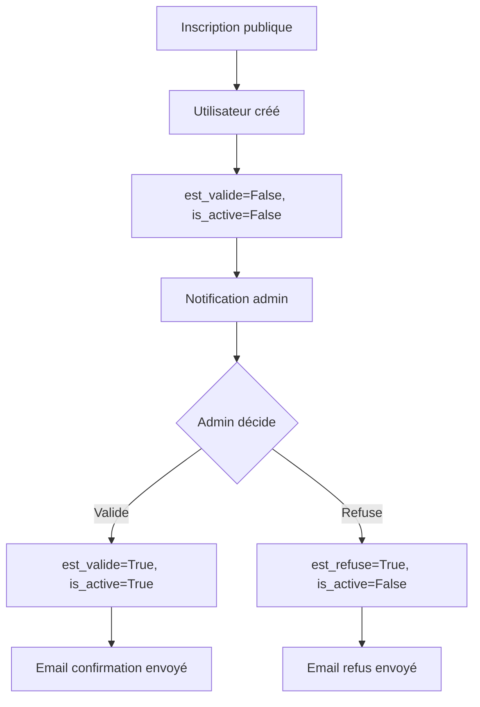

# Accounts - Modèles de données

Ce fichier documente les modèles de l'application **accounts**, qui gère les utilisateurs et les notifications.

**Fichier source** : `accounts/models.py`

---

## Architecture de gestion des utilisateurs

```
Utilisateur (extends AbstractUser)
    ├── Attributs Django : username, email, password, first_name, last_name, is_active, is_staff, is_superuser
    ├── Attributs custom : role, est_valide, est_refuse, est_transcription
    └── Relations :
            ├── Notification (N) - Notifications reçues
            ├── Notification (N) - Notifications le concernant
            ├── FicheObservation (N) - Fiches créées (observateur)
            ├── Validation (N) - Validations effectuées (reviewer)
            └── ... (autres relations dans le projet)
```

---

## Modèle : Utilisateur

**Fichier** : `accounts/models.py:8-29`

### Responsabilité

Représente un **utilisateur de l'application** avec gestion de rôles et validation de compte. Étend le modèle `AbstractUser` de Django pour ajouter des fonctionnalités spécifiques.

### Champs Django natifs (AbstractUser)

| Champ | Type | Description |
|-------|------|-------------|
| `username` | CharField(150) | Nom d'utilisateur (unique) |
| `first_name` | CharField(150) | Prénom |
| `last_name` | CharField(150) | Nom |
| `email` | EmailField | Adresse email (**UNIQUE**, voir override) |
| `password` | CharField(128) | Mot de passe hashé |
| `is_active` | BooleanField | Compte actif (peut se connecter) |
| `is_staff` | BooleanField | Accès admin Django |
| `is_superuser` | BooleanField | Superutilisateur (tous droits) |
| `date_joined` | DateTimeField | Date d'inscription |
| `last_login` | DateTimeField | Dernière connexion |

### Champs custom

| Champ | Type | Description | Défaut |
|-------|------|-------------|--------|
| `role` | CharField(15) | Rôle de l'utilisateur | 'observateur' |
| `est_valide` | BooleanField | Compte validé par un admin | False |
| `est_refuse` | BooleanField | Compte refusé par un admin | False |
| `est_transcription` | BooleanField | Utilisateur créé depuis transcription OCR | False |

### Roles disponibles

**Source** : `core/constants.py:13-17`

```python
ROLE_CHOICES = [
    ('observateur', 'Observateur'),
    ('reviewer', 'Reviewer'),
    ('administrateur', 'Administrateur'),
]
```

| Rôle | Description | Permissions |
|------|-------------|-------------|
| `observateur` | Utilisateur standard | Créer et modifier ses propres fiches |
| `reviewer` | Validateur | Valider les fiches, droits étendus |
| `administrateur` | Administrateur | Tous les droits (sauf promotion admin) |

**Note** : Les `is_superuser` peuvent promouvoir des administrateurs (voir `accounts/views/auth.py:315-333`).

### Override : Email unique et obligatoire

**Fichier** : `accounts/models.py:15-21`

```python
email = models.EmailField(
    "adresse email",
    unique=True,  # ⚠️ Contraint unique
    error_messages={
        'unique': "Un utilisateur avec cette adresse email existe déjà.",
    },
)
```

**Comportement** :
- ✅ L'email est **obligatoire** (contrairement à AbstractUser où il est optionnel)
- ✅ L'email est **unique** (un seul compte par email)
- ⚠️ Peut causer des erreurs si on tente de créer deux comptes avec le même email

**Voir** : [gotchas.md - Conflit d'email unique](gotchas.md#probleme-conflit-demail-unique)

### Méthode : `__str__()`

```python
def __str__(self):
    return f"{self.first_name} {self.last_name} ({self.get_role_display()})"
```

**Exemple de sortie** : `"Jean Dupont (Observateur)"`

### Workflow de validation de compte



**États** :

| est_valide | is_active | est_refuse | Signification |
|------------|-----------|------------|---------------|
| False | False | False | **En attente de validation** (nouveau compte) |
| True | True | False | **Compte actif** (validé) |
| False | False | True | **Compte refusé** (rejeté par admin) |
| True | False | - | **Compte désactivé** (soft delete) |

---

## Modèle : Notification

**Fichier** : `accounts/models.py:31-97`

### Responsabilité

Gère les **notifications internes** de l'application, principalement pour :
- Notifier les administrateurs des **demandes de compte**
- Notifier les utilisateurs des **validations/refus**
- Notifications générales (info, avertissements)

### Champs

| Champ | Type | Description | Contraintes |
|-------|------|-------------|-------------|
| `destinataire` | ForeignKey | Utilisateur destinataire | → `Utilisateur`, CASCADE |\
| `type_notification` | CharField(20) | Type de notification | Choix: TYPE_CHOICES |
| `titre` | CharField(255) | Titre de la notification | - |
| `message` | TextField | Contenu du message | - |
| `lien` | CharField(255) | URL relative vers la ressource | Optionnel |
| `est_lue` | BooleanField | Notification lue ou non | Défaut: False |
| `date_creation` | DateTimeField | Date de création | Défaut: timezone.now |
| `date_lecture` | DateTimeField | Date de lecture | Nullable |
| `utilisateur_concerne` | ForeignKey | Utilisateur concerné (optionnel) | → `Utilisateur`, CASCADE, nullable |

### Types de notification

**Source** : `accounts/models.py:37-43`

```python
TYPE_CHOICES = [
    ('demande_compte', 'Demande de compte'),
    ('compte_valide', 'Compte validé'),
    ('compte_refuse', 'Compte refusé'),
    ('info', 'Information'),
    ('warning', 'Avertissement'),
]
```

| Type | Utilisation | Destinataire |
|------|-------------|--------------|
| `demande_compte` | Nouvelle demande d'inscription | Administrateurs |
| `compte_valide` | Compte validé | Utilisateur (nouveau compte) |
| `compte_refuse` | Compte refusé | Utilisateur (demande rejetée) |
| `info` | Information générale | Variable |
| `warning` | Avertissement | Variable |

### Relations

#### ForeignKey

```python
destinataire = models.ForeignKey(
    Utilisateur,
    on_delete=models.CASCADE,  # Si utilisateur supprimé → notifications supprimées
    related_name='notifications'
)

utilisateur_concerne = models.ForeignKey(
    Utilisateur,
    on_delete=models.CASCADE,
    related_name='notifications_le_concernant',
    blank=True,
    null=True
)
```

**Différence** :
- `destinataire` : Qui **reçoit** la notification
- `utilisateur_concerne` : Qui est **concerné** par la notification (ex: nouvel utilisateur)

#### Reverse relations

```python
# Notifications reçues par un utilisateur
user = Utilisateur.objects.get(username='admin')
notifications = user.notifications.all()

# Notifications concernant un utilisateur
new_user = Utilisateur.objects.get(username='jean.dupont')
notifications_a_propos = new_user.notifications_le_concernant.all()
```

### Index

```python
indexes = [
    models.Index(fields=['destinataire', 'est_lue']),  # Requêtes notifications non lues
    models.Index(fields=['type_notification']),        # Filtres par type
]
```

### Tri

```python
class Meta:
    ordering = ['-date_creation']  # Plus récentes en premier
```

### Méthode : `marquer_comme_lue()`

**Fichier** : `accounts/models.py:91-96`

```python
def marquer_comme_lue(self):
    """Marque la notification comme lue"""
    if not self.est_lue:
        self.est_lue = True
        self.date_lecture = timezone.now()
        self.save()
```

**Comportement** :
- ✅ Idempotent (ne fait rien si déjà lue)
- ✅ Met à jour `date_lecture` automatiquement

### Exemple d'utilisation

```python
# Créer une notification de demande de compte
admins = Utilisateur.objects.filter(role='administrateur', is_active=True)

for admin in admins:
    Notification.objects.create(
        destinataire=admin,
        type_notification='demande_compte',
        titre=f"Nouvelle demande de compte : {nouvel_utilisateur.username}",
        message=f"{nouvel_utilisateur.first_name} {nouvel_utilisateur.last_name} a demandé un compte.",
        lien=f"/accounts/utilisateurs/{nouvel_utilisateur.id}/detail/",
        utilisateur_concerne=nouvel_utilisateur
    )

# Récupérer les notifications non lues d'un admin
notifs_non_lues = Notification.objects.filter(
    destinataire=admin,
    est_lue=False
).select_related('utilisateur_concerne')

# Marquer comme lue
for notif in notifs_non_lues:
    notif.marquer_comme_lue()
```

---

## Relations avec autres applications

### Utilisateur dans le projet

```
Utilisateur
    ├── FicheObservation (N) - observateur, validee_par (observations/)
    ├── Validation (N) - reviewer (review/)
    ├── ImportationEnCours (N) - observateur (ingest/)
    ├── EspeceCandidate (N) - validé_par (ingest/)
    ├── PreparationImage (N) - operateur (ingest/)
    ├── HistoriqueModification (N) - modifie_par (audit/)
    └── ... (autres relations)
```

### Cascade behaviors

| Relation | on_delete | Justification |
|----------|-----------|---------------|
| `Notification.destinataire` → `Utilisateur` | **CASCADE** | Notifications supprimées si utilisateur supprimé |
| `Notification.utilisateur_concerne` → `Utilisateur` | **CASCADE** | Notifications supprimées si utilisateur concerné supprimé |

**Note** : La plupart des relations vers `Utilisateur` dans le projet utilisent `SET_NULL` pour conserver la traçabilité.

---

## Requêtes ORM courantes

### Utilisateurs par rôle

```python
# Tous les observateurs
observateurs = Utilisateur.objects.filter(role='observateur', is_active=True)

# Tous les reviewers
reviewers = Utilisateur.objects.filter(role='reviewer', is_active=True)

# Tous les administrateurs
admins = Utilisateur.objects.filter(role='administrateur', is_active=True)
```

### Utilisateurs en attente de validation

```python
# Nouveaux comptes non validés (exclus les refusés)
en_attente = Utilisateur.objects.filter(
    est_valide=False,
    est_refuse=False
).order_by('date_joined')
```

### Notifications non lues

```python
# Notifications non lues d'un utilisateur
notifs = Notification.objects.filter(
    destinataire=user,
    est_lue=False
).select_related('utilisateur_concerne')

# Compter les notifications non lues
nb_non_lues = user.notifications.filter(est_lue=False).count()
```

### Statistiques par utilisateur

```python
from django.db.models import Count

# Nombre de fiches par utilisateur
stats = Utilisateur.objects.annotate(
    nb_fiches=Count('ficheobservation')
).filter(nb_fiches__gt=0).order_by('-nb_fiches')

# Reviewers avec nombre de validations
reviewers_stats = Utilisateur.objects.filter(
    role='reviewer'
).annotate(
    nb_validations=Count('validation')
)
```

### Recherche d'utilisateurs

```python
from django.db.models import Q

recherche = "dupont"

utilisateurs = Utilisateur.objects.filter(
    Q(username__icontains=recherche) |
    Q(first_name__icontains=recherche) |
    Q(last_name__icontains=recherche) |
    Q(email__icontains=recherche)
)
```

---

## Permissions et authentification

### Fonction de test : `est_admin()`

**Fichier** : `accounts/views/auth.py:29-31`

```python
def est_admin(user):
    """Vérifie si l'utilisateur est un administrateur"""
    return user.is_authenticated and user.role == 'administrateur'
```

**Utilisation** :

```python
from django.contrib.auth.decorators import user_passes_test

@user_passes_test(est_admin)
def ma_vue_admin(request):
    # Uniquement accessible aux administrateurs
    pass
```

### Soft delete pattern

**Fichier** : `accounts/views/auth.py:201-217`

```python
# Désactiver un utilisateur (soft delete)
utilisateur.is_active = False
utilisateur.save()
# ✅ L'utilisateur ne peut plus se connecter
# ✅ Ses données sont conservées (fiches, etc.)

# Réactiver un utilisateur
utilisateur.is_active = True
utilisateur.save()
```

---

## Voir aussi

- **[Vue d'ensemble](index.md)** - Architecture globale
- **[Pièges à éviter](gotchas.md)** - Erreurs courantes
- **[Workflow de validation](../../architecture/domaines/10_authentification.md)** - Documentation complète

---

*Dernière mise à jour : 2025-12-27*
