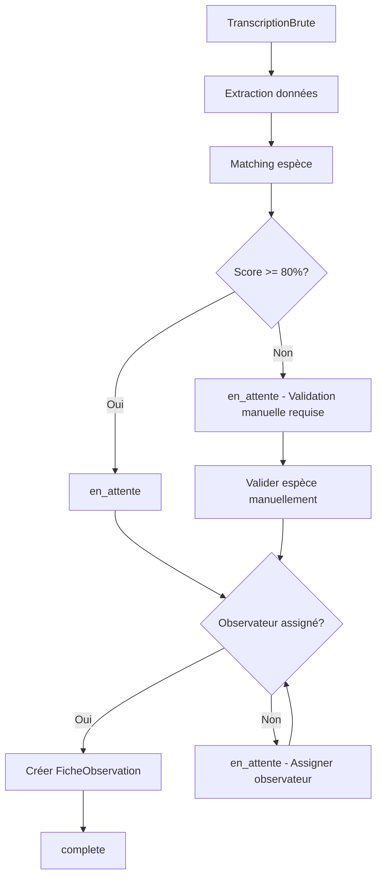

# Ingest - Modèles de données

Ce fichier documente les modèles de l'application **ingest**, qui gère le pipeline d'import des fiches scannées via OCR.

**Fichier source** : `ingest/models.py`

---

## Architecture du pipeline d'import

```
1. PreparationImage      → Fusion recto/verso, prétraitement
         ↓
2. TranscriptionBrute    → JSON brut de l'OCR (Gemini)
         ↓
3. EspeceCandidate       → Matching fuzzy avec référentiel Espece
         ↓
4. ImportationEnCours    → Workflow d'import (en_attente/erreur/complete)
         ↓
   FicheObservation      → Création de la fiche finale
```

---

## Modèle : PreparationImage

**Fichier** : `ingest/models.py:8-59`

### Responsabilité

Stocke l'**historique de préparation des images** avant OCR. Permet de tracer les opérations effectuées sur les scans bruts (fusion recto/verso, rotation, prétraitements, etc.).

### Champs

#### Fichiers sources

| Champ | Type | Description | Contraintes |
|-------|------|-------------|-------------|
| `fichier_brut_recto` | CharField(255) | Chemin du scan brut recto | **Obligatoire** |
| `fichier_brut_verso` | CharField(255) | Chemin du scan brut verso | Optionnel (si fiche recto seulement) |

#### Fichier résultat

| Champ | Type | Description | Contraintes |
|-------|------|-------------|-------------|
| `fichier_fusionne` | ImageField | Image fusionnée recto+verso optimisée pour OCR | **UNIQUE**, upload_to='prepared_images/%Y/' |

#### Métadonnées de traitement

| Champ | Type | Description | Défaut |
|-------|------|-------------|--------|
| `operations_effectuees` | JSONField | Liste des opérations de traitement | `dict` (vide) |

**Structure JSON typique** :
```json
{
  "operations": [
    {"type": "fusion", "recto": "scan_001_r.jpg", "verso": "scan_001_v.jpg"},
    {"type": "rotation", "angle": -2.5},
    {"type": "crop", "x": 50, "y": 100, "width": 2000, "height": 2800},
    {"type": "contraste", "valeur": 1.2},
    {"type": "denoise", "niveau": "moyen"}
  ],
  "duree_traitement_sec": 3.5,
  "qualite_finale": "haute"
}
```

#### Traçabilité

| Champ | Type | Description | Contraintes |
|-------|------|-------------|-------------|
| `operateur` | ForeignKey | Utilisateur ayant effectué la préparation | → `Utilisateur`, SET_NULL, nullable |
| `date_preparation` | DateTimeField | Date et heure de la préparation | Auto (auto_now_add) |
| `notes` | TextField | Notes ou remarques sur cette préparation | Optionnel |

### Index

```python
indexes = [
    models.Index(fields=['date_preparation']),
    models.Index(fields=['operateur']),
]
```

### Exemple d'utilisation

```python
# Créer une préparation
preparation = PreparationImage.objects.create(
    fichier_brut_recto='scans_bruts/2025/scan_001_r.jpg',
    fichier_brut_verso='scans_bruts/2025/scan_001_v.jpg',
    fichier_fusionne='prepared_images/2025/scan_001_fusionne.jpg',
    operations_effectuees={
        'operations': [
            {'type': 'fusion', 'recto': 'scan_001_r.jpg', 'verso': 'scan_001_v.jpg'},
            {'type': 'rotation', 'angle': -2.5},
            {'type': 'contraste', 'valeur': 1.2}
        ]
    },
    operateur=utilisateur,
    notes="Légère rotation nécessaire, verso peu lisible"
)
```

---

## Modèle : TranscriptionBrute

**Fichier** : `ingest/models.py:62-69`

### Responsabilité

Stocke le **JSON brut** produit par l'OCR (Gemini) pour chaque fiche scannée.

### Champs

| Champ | Type | Description | Contraintes |
|-------|------|-------------|-------------|
| `fichier_source` | CharField(255) | Nom du fichier JSON source | **UNIQUE** |
| `json_brut` | JSONField | Données OCR brutes (JSON) | - |
| `date_importation` | DateTimeField | Date d'importation | Auto (auto_now_add) |
| `traite` | BooleanField | Transcription traitée ou non | Défaut: False |

### Structure JSON typique

```json
{
  "espece": "Mésange bleue",
  "commune": "Grenoble",
  "departement": "38",
  "annee": 2023,
  "observateur": "Jean Dupont",
  "numero_personnel": 42,
  "date_ponte": {
    "jour": 15,
    "mois": 4
  },
  "nombre_oeufs_pondus": 4,
  "nombre_oeufs_eclos": 3,
  "nombre_poussins": 2,
  "hauteur_nid": 250,
  "details_nid": "Nid dans un chêne",
  "observations": [
    {
      "date": "2023-04-15",
      "nombre_oeufs": 2,
      "observations": "Début de ponte"
    }
  ]
}
```

### Convention de nommage du fichier source

```
[nom_image]_[modele_ocr]_result.json

Exemples :
- fiche_042_gemini_2.5_pro_result.json
- scan_123_gemini_3_flash_result.json
```

### Workflow

```python
# 1. Import depuis fichier JSON
service = ImportationService()
resultats = service.importer_fichiers_json('2025/batch_001')

# 2. Vérifier les transcriptions non traitées
non_traitees = TranscriptionBrute.objects.filter(traite=False)
print(f"{non_traitees.count()} transcriptions à traiter")

# 3. Marquer comme traité après import réussi
transcription.traite = True
transcription.save()
```

### Points d'attention

⚠️ **Unicité du fichier_source** : Évite les doublons lors de ré-imports

```python
# ✅ CORRECT : Utiliser get_or_create
transcription, created = TranscriptionBrute.objects.get_or_create(
    fichier_source='fiche_042_result.json',
    defaults={'json_brut': data}
)

if not created:
    print("Transcription déjà importée")
```

---

## Modèle : EspeceCandidate

**Fichier** : `ingest/models.py:72-81`

### Responsabilité

Stocke les **noms d'espèces transcrits** par l'OCR avec :
- Le nom brut extrait
- Le matching avec une espèce validée (si trouvée)
- Un score de similarité (fuzzy matching)
- Le statut de validation manuelle

### Champs

| Champ | Type | Description | Contraintes |
|-------|------|-------------|-------------|
| `nom_transcrit` | CharField(100) | Nom d'espèce extrait par OCR | **UNIQUE** |
| `espece_validee` | ForeignKey | Espèce correspondante | → `Espece`, SET_NULL, nullable |
| `validation_manuelle` | BooleanField | Validé manuellement par un admin | Défaut: False |
| `score_similarite` | FloatField | Score de similarité (0-100%) | Défaut: 0.0 |

### Matching fuzzy

**Algorithme** : `SequenceMatcher` (difflib Python)

```python
from difflib import SequenceMatcher

def calculer_similarite(nom_transcrit, nom_espece):
    """Calcule le score de similarité entre deux noms"""
    return SequenceMatcher(None, nom_transcrit.lower(), nom_espece.lower()).ratio() * 100
```

**Seuil de correspondance** : 80% (configurable dans `ImportationService`)

### Exemples de matching

| Nom transcrit (OCR) | Espèce validée | Score | Validation manuelle |
|---------------------|----------------|-------|---------------------|
| "Mésange bleue" | Mésange bleue | 100% | Non |
| "Mesange bieue" | Mésange bleue | ~90% | Non |
| "M. bleue" | Mésange bleue | ~65% | **Oui** (score < 80%) |
| "Pinson des arbres" | Pinson des arbres | 100% | Non |
| "Px arbres" | NULL | 0% | **Oui** (aucune correspondance) |

### Workflow

```python
# 1. Extraction depuis transcription
service = ImportationService()
service.extraire_donnees_candidats()

# 2. Récupérer les espèces non matchées
non_matchees = EspeceCandidate.objects.filter(
    espece_validee__isnull=True,
    validation_manuelle=False
)

# 3. Validation manuelle
candidate = EspeceCandidate.objects.get(nom_transcrit="M. bleue")
espece = Espece.objects.get(nom="Mésange bleue")
candidate.espece_validee = espece
candidate.validation_manuelle = True
candidate.score_similarite = 100.0
candidate.save()
```

---

## Modèle : ImportationEnCours

**Fichier** : `ingest/models.py:84-101`

### Responsabilité

Représente une **tentative d'importation** d'une transcription en FicheObservation. Gère le workflow d'import avec 3 statuts.

### Champs

| Champ | Type | Description | Contraintes |
|-------|------|-------------|-------------|
| `transcription` | OneToOneField | Transcription source | → `TranscriptionBrute`, CASCADE |
| `fiche_observation` | OneToOneField | Fiche créée (si succès) | → `FicheObservation`, SET_NULL, nullable |
| `espece_candidate` | ForeignKey | Espèce candidate matchée | → `EspeceCandidate`, SET_NULL, nullable |
| `observateur` | ForeignKey | Observateur assigné | → `Utilisateur`, SET_NULL, nullable |
| `statut` | CharField(20) | Statut de l'importation | Choix: STATUT_IMPORTATION_CHOICES |
| `date_creation` | DateTimeField | Date de création | Auto (auto_now_add) |

### Statuts d'importation

**Source** : `core/constants.py:7-11`

```python
STATUT_IMPORTATION_CHOICES = [
    ('en_attente', 'En attente de validation'),
    ('erreur', 'Erreur détectée'),
    ('complete', 'Importation complétée'),
]
```

| Statut | Signification | Action requise |
|--------|---------------|----------------|
| `en_attente` | Import en cours, en attente de validation | Valider l'espèce candidate ou l'observateur |
| `erreur` | Erreur détectée (données manquantes, incohérentes) | Intervention manuelle |
| `complete` | Fiche créée avec succès | Aucune |

### Workflow d'importation



### Exemple d'utilisation

```python
# 1. Créer une importation depuis transcription
transcription = TranscriptionBrute.objects.get(fichier_source='fiche_042_result.json')
espece_candidate = EspeceCandidate.objects.get(nom_transcrit="Mésange bleue")

importation = ImportationEnCours.objects.create(
    transcription=transcription,
    espece_candidate=espece_candidate,
    statut='en_attente'
)

# 2. Assigner un observateur
observateur = Utilisateur.objects.get(username='jean.dupont')
importation.observateur = observateur
importation.save()

# 3. Créer la fiche (via ImportationService)
service = ImportationService()
fiche = service.creer_fiche_depuis_importation(importation)

# 4. Marquer comme complète
importation.fiche_observation = fiche
importation.statut = 'complete'
importation.save()

# 5. Marquer la transcription comme traitée
importation.transcription.traite = True
importation.transcription.save()
```

---

## Relations entre modèles

### Diagramme

```
PreparationImage
    ↓ (fichier_fusionne utilisé pour OCR)
TranscriptionBrute (1)
    ↓
ImportationEnCours (1:1)
    ├── EspeceCandidate (N:1)
    │       └── Espece (N:1 ou NULL)
    ├── Utilisateur (N:1 ou NULL)
    └── FicheObservation (1:1 ou NULL)
```

### Cascade behaviors

| Relation | on_delete | Justification |
|----------|-----------|---------------|
| `ImportationEnCours.transcription` → `TranscriptionBrute` | **CASCADE** | Si transcription supprimée → supprimer l'import |
| `ImportationEnCours.fiche_observation` → `FicheObservation` | **SET_NULL** | Si fiche supprimée → garder l'historique d'import |
| `ImportationEnCours.espece_candidate` → `EspeceCandidate` | **SET_NULL** | Si candidate supprimée → garder l'historique |
| `ImportationEnCours.observateur` → `Utilisateur` | **SET_NULL** | Si utilisateur supprimé → garder l'historique |
| `EspeceCandidate.espece_validee` → `Espece` | **SET_NULL** | Si espèce supprimée → revalider |
| `PreparationImage.operateur` → `Utilisateur` | **SET_NULL** | Traçabilité historique |

---

## Requêtes ORM courantes

### Transcriptions non traitées

```python
non_traitees = TranscriptionBrute.objects.filter(traite=False).order_by('date_importation')
```

### Importations en attente

```python
en_attente = ImportationEnCours.objects.filter(
    statut='en_attente'
).select_related('transcription', 'espece_candidate', 'espece_candidate__espece_validee')
```

### Espèces candidates non matchées

```python
non_matchees = EspeceCandidate.objects.filter(
    espece_validee__isnull=True,
    validation_manuelle=False
).order_by('nom_transcrit')
```

### Statistiques d'import

```python
from django.db.models import Count

stats = ImportationEnCours.objects.values('statut').annotate(
    nb_imports=Count('id')
)

for stat in stats:
    print(f"{stat['statut']} : {stat['nb_imports']} importations")
```

### Taux de succès

```python
total = ImportationEnCours.objects.count()
completes = ImportationEnCours.objects.filter(statut='complete').count()

taux_succes = (completes / total * 100) if total > 0 else 0
print(f"Taux de succès : {taux_succes:.1f}%")
```

### Fiches issues de transcription

```python
fiches_ocr = FicheObservation.objects.filter(
    transcription=True
).select_related('espece', 'observateur')
```

---

## Voir aussi

- **[Vue d'ensemble](index.md)** - Architecture globale
- **[Service d'importation](importation_service.md)** - Logique métier
- **[Pièges à éviter](gotchas.md)** - Erreurs courantes
- **[Architecture détaillée](../../architecture/domaines/03_ocr_ingestion.md)**

---

*Dernière mise à jour : 2025-12-27*
