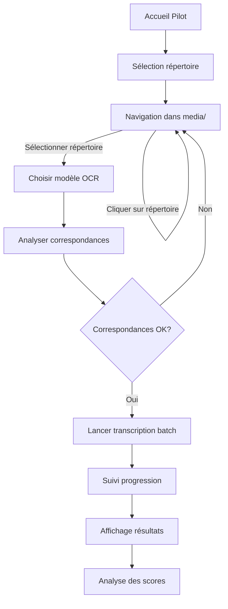

# Application Pilot - Vue d'ensemble

> ⚠️ **ATTENTION** : Application de PILOTE uniquement - **NE PAS déployer en production**

## Responsabilité

L'application **pilot** est un **environnement de test** pour l'expérimentation et l'évaluation des modèles OCR (reconnaissance optique de caractères). Elle permet de :

1. **Sélectionner** des lots d'images à transcrire (navigation dans `media/`)
2. **Lancer** des transcriptions batch avec différents modèles OCR (Gemini)
3. **Comparer** les performances entre modèles et types d'images
4. **Évaluer** la qualité des transcriptions par rapport aux fiches corrigées

## Position dans l'architecture

```
pilot/ (Interface Pilote - Test uniquement)
  ↓ sélection de répertoires d'images
  ↓ lancement de tâches Celery
ingest/ (Pipeline OCR - Production)
  ↓ transcription → TranscriptionBrute
  ↓ matching espèces → EspeceCandidate
observations/ (Création de fiches)
```

**Différence clé** :
- **pilot** : Expérimentation, évaluation, comparaison de modèles (génère du JSON uniquement)
- **ingest** : Pipeline production pour créer réellement des FicheObservation

## Modèles principaux

| Modèle | Description | Fichier |
|--------|-------------|---------|
| **[TranscriptionOCR](models.md#transcriptionocr)** | Métadonnées et évaluation d'une transcription OCR | `pilot/models.py:14-210` |

## Points d'entrée clés

### URLs (`pilot/urls.py`)
- `/pilot/optimisation-ocr/` - Page d'accueil
- `/pilot/optimisation-ocr/selection-repertoire/` - Navigation dans `media/`
- `/pilot/optimisation-ocr/analyser-correspondances/` - Analyse des images vs fiches
- `/pilot/optimisation-ocr/lancer-batch/` - Démarrage du traitement batch
- `/pilot/optimisation-ocr/verifier-progression/` - Suivi temps réel (AJAX)
- `/pilot/optimisation-ocr/resultats/` - Résultats du batch

### Vues principales (`pilot/views.py`)
- `selection_repertoire_ocr` - Navigation dans les répertoires d'images
- `analyser_correspondances` - Matching image ↔ fiche
- `lancer_transcription_batch` - Lance la tâche Celery
- `check_batch_progress` - Polling AJAX pour la progression
- `batch_results` - Affichage des résultats

### Tâches Celery (`pilot/tasks.py`)
- `process_batch_transcription_task` - Traitement batch multi-modèles

### Templates
- `pilot/optimisation_ocr_home.html` - Page d'accueil
- `pilot/selection_repertoire_ocr.html` - Sélection de répertoires
- `pilot/batch_results.html` - Résultats du traitement

## Workflow utilisateur



## Dépendances

### Applications Django
- **observations** - Modèle `FicheObservation` (fiches de référence)
- **core** - Utilitaires de base

### Services externes
- **Celery** + **Redis** - Gestion des tâches asynchrones
- **Google Gemini API** - Modèles OCR (Flash, Pro, etc.)
- **Pillow (PIL)** - Traitement d'images

### Décorateurs
- `@transcription_required` (depuis `observations.decorators`) - Restreint l'accès

## Architecture des données

### Arborescence attendue dans `media/`

```
media/
├── Ancienne_fiche/
│   ├── Sans_traitement/
│   │   ├── image_001.jpg
│   │   ├── image_002.jpg
│   │   └── ...
│   ├── Traitement_1/
│   │   └── ...
│   └── Traitement_2/
│       └── ...
└── Nouvelle_fiche/
    ├── Sans_traitement/
    └── Traitement_1/
```

**Métadonnées déduites du chemin** :
- `type_fiche` : `Ancienne_fiche` ou `Nouvelle_fiche` (niveau 1)
- `type_traitement` : `Sans_traitement`, `Traitement_1`, etc. (niveau 2)

## Fichiers critiques

| Fichier | Sensibilité | Raison |
|---------|-------------|--------|
| `views.py:selection_repertoire_ocr` | 🔥 **Critique** | Gestion des chemins de fichiers - risque de régression ([voir gotchas](gotchas.md#chemin-sous-repertoires)) |
| `tasks.py:process_batch_transcription_task` | ⚠️ Sensible | Tâche Celery longue durée - gestion de timeouts |
| `models.py:TranscriptionOCR` | ✅ Stable | Modèle simple, peu de risques |

## Modèles OCR supportés

Définis dans `models.py:62-72` :

| Code | Modèle Gemini | Usage |
|------|---------------|-------|
| `gemini_3_flash` | Gemini 3 Flash | Rapide, économique |
| `gemini_3_pro` | Gemini 3 Pro | Haute qualité |
| `gemini_2.5_pro` | Gemini 2.5 Pro | Dernière génération |
| `gemini_2.5_flash_lite` | Gemini 2.5 Flash-Lite | Ultra-rapide |

## Types d'images

Définis dans `models.py:52-60` :

| Type | Description |
|------|-------------|
| `brute` | Image scannée brute (aucun traitement) |
| `optimisee` | Image pré-traitée pour améliorer l'OCR |

## Statuts d'évaluation

Définis dans `models.py:81-91` :

| Statut | Signification |
|--------|---------------|
| `non_evaluee` | Transcription créée, pas encore évaluée |
| `en_cours` | Évaluation en cours |
| `evaluee` | Évaluation terminée, scores calculés |
| `erreur` | Erreur lors de l'évaluation |

## Points d'attention

### 🔥 Navigation dans les répertoires
**Problème récurrent** : Perte d'accès aux sous-répertoires lors de modifications.
→ **[Voir documentation détaillée](gotchas.md#probleme-perte-acces-sous-repertoires)**

### ⚠️ Tâches Celery longue durée
Les transcriptions batch peuvent durer **plusieurs minutes** :
- Configurer timeout suffisant (30 min dans `settings.py`)
- Utiliser `AsyncResult` pour le suivi de progression
- Gérer correctement les états PENDING / STARTED / SUCCESS / FAILURE

### ⚠️ Sécurité des chemins
Le code vérifie que les chemins restent dans `MEDIA_ROOT` :
```python
# pilot/views.py:47-54
safe_path = os.path.normpath(current_path).replace('..', '')
full_current_path = os.path.join(base_dir, safe_path)

if not full_current_path.startswith(base_dir):
    safe_path = ''
    full_current_path = base_dir
```

**Ne jamais retirer cette vérification** - risque de directory traversal.

## Voir aussi

- **[Modèles détaillés](models.md)** - Structure de `TranscriptionOCR`
- **[Vues et logique](views.md)** - Détails des vues
- **[Gestion des fichiers](file_handling.md)** - 🔥 Navigation dans `media/`
- **[Workflow OCR](ocr_workflow.md)** - Pipeline complet de transcription
- **[Pièges à éviter](gotchas.md)** - ⚠️ Erreurs courantes et solutions
- **[Pipeline d'import (ingest)](../ingest/index.md)** - Version production

---

*Dernière mise à jour : 2025-12-27*
