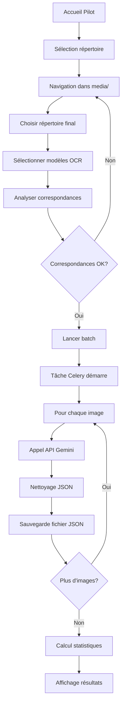
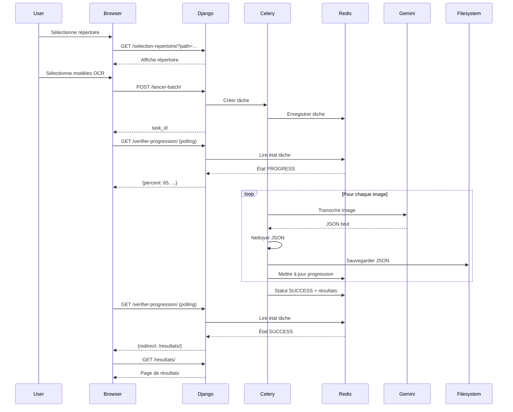

# Pilot - Workflow OCR complet

Ce document décrit le workflow complet de transcription OCR en mode batch dans l'application pilot.

---

## Vue d'ensemble



---

## Étape 1 : Sélection du répertoire

### Interface utilisateur

1. L'utilisateur accède à `/pilot/optimisation-ocr/selection-repertoire/`
2. Il navigue dans l'arborescence de `media/` :
   ```
   media/ → Ancienne_fiche/ → Sans_traitement/
   ```
3. Il visualise les statistiques :
   - Nombre d'images dans le répertoire
   - Type de fiche déduit
   - Type de traitement déduit

### Vue : `selection_repertoire_ocr`

**Voir** : [views.md](views.md#vue-selection_repertoire_ocr)

---

## Étape 2 : Sélection des modèles OCR

### Interface utilisateur

L'utilisateur coche un ou plusieurs modèles OCR :
- [ ] Gemini 3 Flash
- [ ] Gemini 3 Pro
- [ ] Gemini 2.5 Pro
- [ ] Gemini 2.5 Flash-Lite

**Possibilité de sélection multiple** : Permet de comparer les performances entre modèles.

---

## Étape 3 : Analyse des correspondances (optionnel)

### Vue : `analyser_correspondances`

**Fichier** : `pilot/views.py:155-251`

### Objectif
Vérifier que chaque image a une fiche FicheObservation correspondante (nécessaire pour l'évaluation de qualité).

### Résultat
```json
{
  "nb_trouvees": 38,
  "nb_multiples": 2,
  "nb_non_trouvees": 2
}
```

**Décision** :
- Si `nb_non_trouvees > 0` : Avertir l'utilisateur (pas de vérité terrain)
- Si `nb_multiples > 0` : Avertir l'utilisateur (ambiguïté)

---

## Étape 4 : Lancement du batch

### Vue : `lancer_transcription_batch`

**Fichier** : `pilot/views.py:255-328`

### Paramètres envoyés
```javascript
{
  "directories": [
    {"path": "Ancienne_fiche/Sans_traitement", "name": "Sans_traitement"}
  ],
  "modeles_ocr": ["gemini_2.5_pro", "gemini_3_flash"]
}
```

### Action
Création de la tâche Celery :
```python
task = process_batch_transcription_task.delay(directories, modeles_ocr)
```

**Retour** :
```json
{
  "task_id": "a1b2c3d4-...",
  "progress_url": "/pilot/optimisation-ocr/verifier-progression/"
}
```

---

## Étape 5 : Traitement batch (tâche Celery)

### Tâche : `process_batch_transcription_task`

**Fichier** : `pilot/tasks.py`

### Architecture

```python
@shared_task(bind=True)
def process_batch_transcription_task(self, directories, modeles_ocr):
    # Pour chaque répertoire
    for directory in directories:
        images = lister_images(directory['path'])

        # Pour chaque modèle OCR
        for modele in modeles_ocr:
            # Pour chaque image
            for image in images:
                # 1. Appeler l'API Gemini
                response = call_gemini_api_with_timeout(...)

                # 2. Nettoyer le JSON
                json_clean = corriger_json(response)

                # 3. Sauvegarder le fichier JSON
                save_json(json_clean, chemin_json)

                # 4. Mettre à jour la progression
                self.update_state(
                    state='PROGRESS',
                    meta={'processed': i, 'total': total}
                )

    # Retourner les statistiques
    return {
        'total_images': total,
        'total_success': success,
        'total_errors': errors,
        'duration': duration
    }
```

### Gestion des erreurs

#### Retry avec backoff exponentiel

```python
@retry_with_backoff(max_retries=3, initial_delay=2)
def call_gemini_api_with_timeout(client, model_name, prompt, image_path, timeout=120):
    # ...
```

**Délais** :
- Tentative 1 : immédiat
- Tentative 2 : +2s
- Tentative 3 : +4s
- Tentative 4 : +8s

#### Timeout API

**Timeout par défaut** : 120 secondes (2 minutes)

Si timeout dépassé → Exception → Retry

### Mise à jour de la progression

La tâche met à jour régulièrement son état :
```python
self.update_state(
    state='PROGRESS',
    meta={
        'processed': 26,
        'total': 40,
        'current_file': 'fiche_026.jpg',
        'current_directory': 'Ancienne_fiche/Sans_traitement'
    }
)
```

---

## Étape 6 : Suivi de progression (polling AJAX)

### Vue : `check_batch_progress`

**Fichier** : `pilot/views.py:332-394`

### Polling côté client (JavaScript)

```javascript
function pollProgress() {
    fetch('/pilot/optimisation-ocr/verifier-progression/')
        .then(response => response.json())
        .then(data => {
            // Mettre à jour la barre de progression
            document.getElementById('progress-bar').style.width = data.percent + '%';
            document.getElementById('progress-text').textContent = data.message;

            if (data.status === 'SUCCESS') {
                // Rediriger vers les résultats
                window.location.href = data.redirect;
            } else if (data.status === 'FAILURE') {
                // Afficher l'erreur
                alert('Erreur: ' + data.error);
            } else {
                // Re-poll après 2 secondes
                setTimeout(pollProgress, 2000);
            }
        });
}

// Démarrer le polling
pollProgress();
```

### Fréquence de polling
**Recommandé** : 2 secondes (équilibre entre réactivité et charge serveur)

---

## Étape 7 : Sauvegarde des résultats

### Format de fichier JSON

**Chemin** : `media/[repertoire]/[nom_image_sans_ext]_[modele_ocr].json`

**Exemple** :
```
media/Ancienne_fiche/Sans_traitement/fiche_042_gemini_2.5_pro.json
```

**Contenu** :
```json
{
  "espece": "Mésange bleue",
  "commune": "Grenoble",
  "departement": "38",
  "annee": 2023,
  "observateur": "Jean Dupont",
  "date_ponte": {
    "jour": 15,
    "mois": 4
  },
  "nombre_oeufs_pondus": 4,
  "nombre_poussins": 3,
  ...
}
```

**Nettoyage appliqué** (via `corriger_json()`) :
- Extraction du bloc JSON entre `{` et `}`
- Suppression des markdown code fences
- Validation de la structure

---

## Étape 8 : Affichage des résultats

### Vue : `batch_results`

**Fichier** : `pilot/views.py:398-445`

### Statistiques affichées

| Métrique | Description |
|----------|-------------|
| **Total images** | Nombre total d'images traitées |
| **Succès** | Nombre de transcriptions réussies |
| **Erreurs** | Nombre d'erreurs |
| **Taux de succès** | Pourcentage de succès |
| **Durée totale** | Temps total du traitement (secondes) |
| **Durée par image** | Temps moyen par image (secondes) |

### Résultats par répertoire

Pour chaque répertoire traité :
```
Ancienne_fiche/Sans_traitement
  - 40 images
  - 38 succès
  - 2 erreurs
  - Taux de succès : 95%
```

### Actions possibles

1. **Télécharger les JSON** : Lien vers le répertoire `media/`
2. **Lancer une évaluation** : Comparer avec les fiches de référence
3. **Relancer un batch** : Retour à la sélection

---

## Workflow d'évaluation (optionnel)

> **Note** : Cette fonctionnalité peut être développée ultérieurement.

### Objectif
Comparer automatiquement les transcriptions OCR avec les fiches de référence (FicheObservation).

### Étapes

1. **Pour chaque JSON généré** :
   - Récupérer la fiche de référence correspondante
   - Comparer champ par champ
   - Calculer un score de similarité

2. **Créer une TranscriptionOCR** :
   ```python
   TranscriptionOCR.objects.create(
       fiche=fiche_reference,
       chemin_json=chemin_json,
       modele_ocr='gemini_2.5_pro',
       type_image='brute',
       statut_evaluation='evaluee',
       score_global=92.5,
       nombre_champs_corrects=22,
       nombre_champs_total=25,
       # ...
   )
   ```

3. **Générer un rapport de comparaison** :
   - Tableau récapitulatif par modèle
   - Graphiques (score moyen, temps moyen, types d'erreurs)

---

## Diagramme de séquence complet



---

## Configuration requise

### Variables d'environnement

```bash
# API Gemini
GOOGLE_API_KEY=your_api_key_here

# Celery
CELERY_BROKER_URL=redis://127.0.0.1:6379/0
CELERY_RESULT_BACKEND=redis://127.0.0.1:6379/0
```

### Services requis

1. **Redis** : Broker et backend Celery
   ```bash
   redis-server
   ```

2. **Celery Worker** :
   ```bash
   celery -A observations_nids worker --loglevel=info
   ```

### Permissions

- **Lecture** : Répertoire `media/`
- **Écriture** : Répertoire `media/` (pour les JSON)

---

## Points d'attention

### ⚠️ Quotas API Gemini

**Limite** : Dépend du plan Google Cloud

**Prévention** :
- Limiter le nombre d'images par batch
- Utiliser un délai entre les appels (si nécessaire)

### ⚠️ Taille des images

**Problème** : Images très volumineuses → timeout API

**Solution** : Redimensionner les images avant envoi (max 2048px de large)

### ⚠️ Gestion de la concurrence

**Problème** : Plusieurs utilisateurs lancent des batchs simultanément

**Solution actuelle** : Les tâches sont exécutées séquentiellement par le worker Celery

**Amélioration future** : Lancer plusieurs workers ou utiliser un pool de workers

---

## Tests recommandés

### Test 1 : Batch simple (1 répertoire, 1 modèle)

```python
def test_batch_simple():
    """Test d'un batch avec 1 répertoire et 1 modèle"""
    directories = [{'path': 'test_scans/', 'name': 'test_scans'}]
    modeles = ['gemini_3_flash']

    task = process_batch_transcription_task.delay(directories, modeles)
    result = task.get(timeout=300)  # 5 minutes max

    assert result['total_images'] > 0
    assert result['total_success'] > 0
```

### Test 2 : Batch multi-modèles

```python
def test_batch_multi_modeles():
    """Test d'un batch avec plusieurs modèles"""
    directories = [{'path': 'test_scans/', 'name': 'test_scans'}]
    modeles = ['gemini_3_flash', 'gemini_2.5_pro']

    task = process_batch_transcription_task.delay(directories, modeles)
    result = task.get(timeout=600)

    # On doit avoir 2x plus de fichiers JSON (1 par modèle)
    assert result['total_images'] == expected_images * len(modeles)
```

### Test 3 : Gestion d'erreur API

```python
def test_api_timeout():
    """Test de gestion d'un timeout API"""
    # Simuler une image qui cause un timeout
    # Vérifier que le retry fonctionne
```

---

## Voir aussi

- **[Vues et logique](views.md)** - Détails des vues
- **[Modèles](models.md)** - Modèle `TranscriptionOCR`
- **[Pièges à éviter](gotchas.md)** - Problèmes courants

---

*Dernière mise à jour : 2025-12-27*
