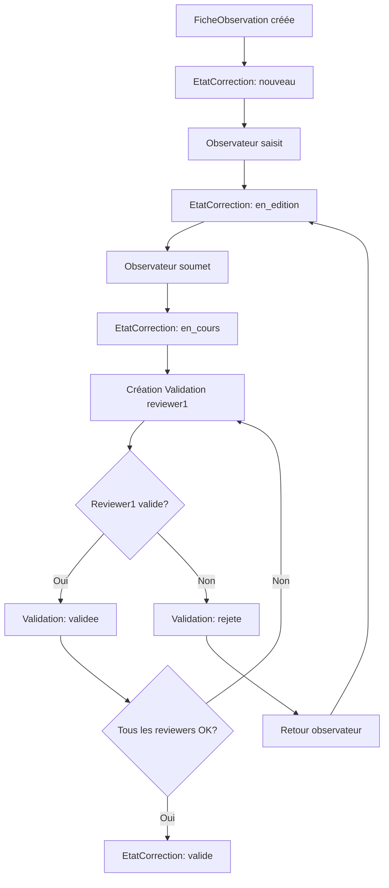

# Review - Vue d'ensemble

> Workflow de validation collaborative des fiches d'observation par les reviewers

## Responsabilité

L'application **review** gère le **processus de validation collaborative** des fiches d'observation :

1. **Validation par reviewers** : Plusieurs reviewers peuvent valider/rejeter une fiche
2. **Historique complet** : Traçabilité de tous les changements de statut
3. **Workflow coordonné** : Intégration avec `EtatCorrection` (observations)
4. **Statuts de validation** : en_cours → validee / rejete

## Position dans l'architecture

```
FicheObservation (observations/)
    ├── EtatCorrection (1:1) - Statut global : nouveau → en_edition → en_cours → valide
    └── Validation (N) - Validations individuelles par reviewers
            ├── statut : en_cours / validee / rejete
            └── HistoriqueValidation (N) - Historique des changements
```

**Différence clé** :
- **EtatCorrection** (observations) : Statut **global** de la fiche dans le workflow général
- **Validation** (review) : Validations **individuelles** par différents reviewers (validation collaborative)

---

## Modèles principaux

| Modèle | Description | Fichier |
|--------|-------------|---------|
| **[Validation](models.md#modele-validation)** | Validation d'une fiche par un reviewer | `review/models.py:7-34` |
| **[HistoriqueValidation](models.md#modele-historiquevalidation)** | Historique des changements de statut | `review/models.py:37-48` |

---

## Statuts et workflow

### Statuts de Validation

**Source** : `core/constants.py:1-5`

| Statut | Signification | Action |
|--------|---------------|--------|
| `en_cours` | Validation en cours par le reviewer | En cours de révision |
| `validee` | Fiche validée par le reviewer | Approbation |
| `rejete` | Fiche rejetée par le reviewer | Demande de corrections |

### Workflow complet



---

## Fonctionnalités principales

### 1. Validation collaborative

Une fiche peut avoir **plusieurs validations** par différents reviewers :

```python
# Une fiche avec 2 reviewers
fiche = FicheObservation.objects.get(num_fiche=123)

val1 = Validation.objects.create(fiche=fiche, reviewer=reviewer1, statut='en_cours')
val2 = Validation.objects.create(fiche=fiche, reviewer=reviewer2, statut='en_cours')

# Reviewer 1 valide
val1.statut = 'validee'
val1.save()  # ✅ HistoriqueValidation créé automatiquement

# Reviewer 2 rejette
val2.statut = 'rejete'
val2.save()  # ✅ Nouvel HistoriqueValidation créé
```

### 2. Traçabilité automatique

Chaque changement de statut crée automatiquement un `HistoriqueValidation` :

```python
# Automatique via save() override
validation.statut = 'validee'
validation.save()  # ✅ Historique créé dans save()

# Récupérer l'historique
for h in validation.historique.all():
    print(f"{h.date_modification}: {h.ancien_statut} → {h.nouveau_statut} par {h.modifie_par.username}")
```

**Voir** : [models.md - Méthode save()](models.md#methode-save) pour les détails

### 3. Intégration avec EtatCorrection

```python
# Vérifier si tous les reviewers ont validé
validations = fiche.validations.all()
toutes_validees = all(v.statut == 'validee' for v in validations)

if toutes_validees:
    # Marquer la fiche comme validée
    fiche.etat_correction.statut = 'valide'
    fiche.etat_correction.date_validation = timezone.now()
    fiche.etat_correction.save()
```

---

## Vues principales

⚠️ **Les vues ne sont pas encore implémentées** (`review/views.py` est vide).

**Vues attendues** :
- Liste des fiches à valider par reviewer
- Interface de validation d'une fiche
- Historique des validations
- Statistiques par reviewer

---

## Dépendances

### Applications Django

- **observations** - `FicheObservation`, `EtatCorrection` (statut global)
- **accounts** - `Utilisateur` (reviewers avec `role='reviewer'`)
- **core** - `STATUT_VALIDATION_CHOICES`

### Relations clés

```python
# FicheObservation → Validations
fiche = FicheObservation.objects.get(num_fiche=123)
validations = fiche.validations.all()  # Reverse relation

# Utilisateur → Validations
reviewer = Utilisateur.objects.get(username='marie.dupont')
validations = reviewer.validation_set.all()  # Reverse relation
```

---

## Configuration

### Permissions

Les validations sont **réservées aux reviewers** :

```python
# Contrainte modèle
reviewer = models.ForeignKey(
    Utilisateur,
    on_delete=models.CASCADE,
    limit_choices_to={'role': 'reviewer'}  # Uniquement reviewers
)
```

---

## Points d'entrée clés

### Requêtes courantes

```python
# Fiches à valider par un reviewer
reviewer = Utilisateur.objects.get(username='marie.dupont')
fiches_a_valider = FicheObservation.objects.filter(
    validations__reviewer=reviewer,
    validations__statut='en_cours'
).distinct()

# Fiches validées par tous les reviewers
from django.db.models import Q, Count

fiches_validees = FicheObservation.objects.annotate(
    nb_validations=Count('validations'),
    nb_validees=Count('validations', filter=Q(validations__statut='validee'))
).filter(nb_validations=models.F('nb_validees'))

# Statistiques par reviewer
stats = Utilisateur.objects.filter(role='reviewer').annotate(
    nb_validations=Count('validation'),
    nb_validees=Count('validation', filter=Q(validation__statut='validee')),
    nb_rejetees=Count('validation', filter=Q(validation__statut='rejete'))
)
```

**Voir** : [models.md - Requêtes ORM courantes](models.md#requetes-orm-courantes)

---

## Fichiers critiques

| Fichier | Sensibilité | Raison |
|---------|-------------|--------|
| `models.py` | 🔥 **Critique** | Logique automatique save() - création d'historique |
| `views.py` | ⚠️ À implémenter | Workflow de validation |

---

## Documentation existante

- **[Architecture workflow détaillé](../../architecture/domaines/09_workflow-correction.md)** - Documentation complète du workflow de correction

---

## Voir aussi

- **[Modèles détaillés](models.md)** - Documentation complète des modèles
- **[Pièges à éviter](gotchas.md)** - Erreurs courantes
- **[EtatCorrection](../observations/models.md#modele-etatcorrection)** - Statut global de la fiche
- **[Workflow observations](../observations/index.md)** - Application centrale

---

*Dernière mise à jour : 2025-12-27*
