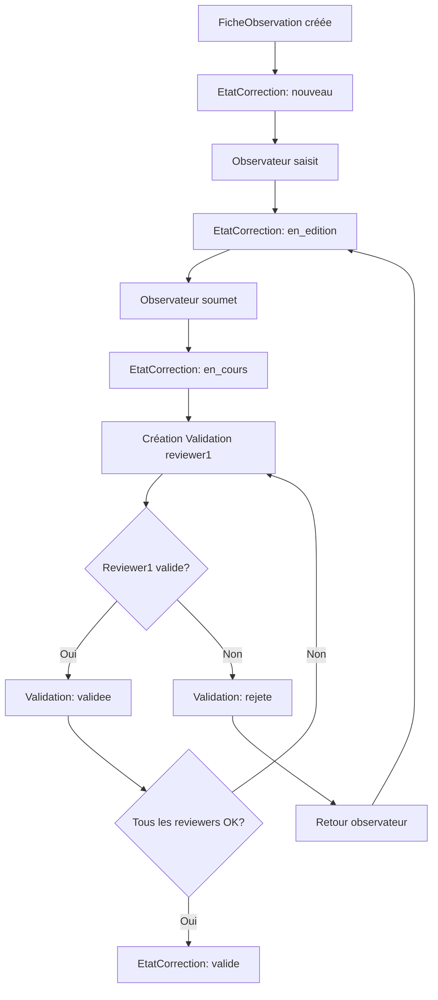

# Review - Modèles de données

Ce fichier documente les modèles de l'application **review**, qui gère le workflow de validation des fiches par les reviewers.

**Fichier source** : `review/models.py`

---

## Architecture du workflow de validation

### Statuts d'une fiche (EtatCorrection)

Le workflow de correction est géré par le modèle `EtatCorrection` dans l'application **observations** :

```
nouveau → en_edition → en_cours → valide
```

**Voir** : [observations/models.md - EtatCorrection](../observations/models.md#modele-etatcorrection)

### Validations par les reviewers (Validation)

L'application **review** ajoute une couche de **validation multiple** par des reviewers :

```
FicheObservation (1)
    └── EtatCorrection (1:1) - Statut global
    └── Validation (N) - Validations par différents reviewers
            └── HistoriqueValidation (N) - Historique des changements
```

---

## Modèle : Validation

**Fichier** : `review/models.py:7-34`

### Responsabilité

Représente une **validation d'une fiche par un reviewer**. Une fiche peut avoir plusieurs validations par différents reviewers (workflow de validation collaborative).

### Champs

| Champ | Type | Description | Contraintes |
|-------|------|-------------|-------------|
| `fiche` | ForeignKey | Fiche validée | → `FicheObservation`, CASCADE |
| `reviewer` | ForeignKey | Reviewer effectuant la validation | → `Utilisateur`, CASCADE, **limit_choices_to={'role': 'reviewer'}** |
| `statut` | CharField(10) | Statut de la validation | Choix: STATUT_VALIDATION_CHOICES, défaut: 'en_cours' |
| `date_modification` | DateTimeField | Date de dernière modification | Auto (auto_now_add) |

### Statuts de validation

**Source** : `core/constants.py:1-5`

```python
STATUT_VALIDATION_CHOICES = [
    ('en_cours', 'En cours'),
    ('validee', 'Validée'),
    ('rejete', 'Rejetée'),
]
```

| Statut | Signification | Action |
|--------|---------------|--------|
| `en_cours` | Validation en cours par le reviewer | En cours de révision |
| `validee` | Fiche validée par le reviewer | Approbation |
| `rejete` | Fiche rejetée par le reviewer | Demande de corrections |

### Relations

#### ForeignKey

```python
fiche = models.ForeignKey(
    'observations.FicheObservation',
    on_delete=models.CASCADE,  # Si fiche supprimée → validations supprimées
    related_name="validations"
)

reviewer = models.ForeignKey(
    Utilisateur,
    on_delete=models.CASCADE,  # Si reviewer supprimé → validations supprimées
    limit_choices_to={'role': 'reviewer'}  # ⚠️ Uniquement les utilisateurs avec rôle 'reviewer'
)
```

#### Reverse relations

```python
# Accès depuis la fiche
fiche = FicheObservation.objects.get(num_fiche=123)
validations = fiche.validations.all()

# Accès depuis l'utilisateur
reviewer = Utilisateur.objects.get(username='marie.dupont')
validations = reviewer.validation_set.all()
```

### Tri

```python
class Meta:
    ordering = ['-date_modification']  # Plus récentes en premier
```

### Méthode : `save()`

**Fichier** : `review/models.py:23-34`

```python
def save(self, *args, **kwargs):
    if self.pk:  # Si modification (pas création)
        ancienne_instance = Validation.objects.filter(pk=self.pk).first()

        # Si le statut a changé → créer un historique
        if ancienne_instance and ancienne_instance.statut != self.statut:
            HistoriqueValidation.objects.create(
                validation=self,
                ancien_statut=ancienne_instance.statut,
                nouveau_statut=self.statut,
                modifie_par=self.reviewer,
            )

    super().save(*args, **kwargs)
```

**Comportement** :
- ✅ Création automatique d'un `HistoriqueValidation` lors d'un changement de statut
- ✅ Traçabilité complète des modifications

### Exemple d'utilisation

```python
# Créer une validation
validation = Validation.objects.create(
    fiche=fiche,
    reviewer=reviewer,
    statut='en_cours'
)

# Valider la fiche
validation.statut = 'validee'
validation.save()  # ✅ HistoriqueValidation créé automatiquement

# Rejeter la fiche
validation.statut = 'rejete'
validation.save()  # ✅ Nouvel HistoriqueValidation créé

# Récupérer toutes les validations d'une fiche
fiche = FicheObservation.objects.get(num_fiche=123)
validations = fiche.validations.select_related('reviewer')

for val in validations:
    print(f"{val.reviewer.username}: {val.get_statut_display()}")
```

---

## Modèle : HistoriqueValidation

**Fichier** : `review/models.py:37-48`

### Responsabilité

Stocke l'**historique des changements de statut** d'une validation. Permet de tracer qui a modifié le statut et quand.

### Champs

| Champ | Type | Description | Contraintes |
|-------|------|-------------|-------------|
| `validation` | ForeignKey | Validation parente | → `Validation`, CASCADE |
| `ancien_statut` | CharField(10) | Statut avant modification | Choix: STATUT_VALIDATION_CHOICES |
| `nouveau_statut` | CharField(10) | Statut après modification | Choix: STATUT_VALIDATION_CHOICES |
| `date_modification` | DateTimeField | Date de la modification | Auto (auto_now_add) |
| `modifie_par` | ForeignKey | Utilisateur ayant effectué la modification | → `Utilisateur`, SET_NULL, nullable |

### Relations

```python
validation = models.ForeignKey(
    Validation,
    on_delete=models.CASCADE,  # Si validation supprimée → historique supprimé
    related_name="historique"
)

modifie_par = models.ForeignKey(
    Utilisateur,
    on_delete=models.SET_NULL,  # Si utilisateur supprimé → conserver l'historique
    null=True,
    blank=True
)
```

### Tri

```python
class Meta:
    ordering = ['-date_modification']  # Plus récentes en premier
```

### Exemple d'utilisation

```python
# Récupérer l'historique d'une validation
validation = Validation.objects.get(id=42)
historique = validation.historique.all()

for h in historique:
    print(f"{h.date_modification}: {h.ancien_statut} → {h.nouveau_statut} par {h.modifie_par.username}")

# Exemple de sortie :
# 2025-12-27 14:30: en_cours → validee par marie.dupont
# 2025-12-27 10:15: validee → rejete par marie.dupont
# 2025-12-26 16:45: en_cours → validee par marie.dupont
```

---

## Relations avec observations

### Lien avec EtatCorrection

```
FicheObservation
    ├── EtatCorrection (1:1) - Statut global de la fiche
    │       └── statut: nouveau / en_edition / en_cours / valide
    └── Validation (N) - Validations individuelles par reviewers
            └── statut: en_cours / validee / rejete
```

**Différence** :
- **EtatCorrection** : Statut **global** de la fiche (workflow général)
- **Validation** : Validations **individuelles** par différents reviewers (validation collaborative)

### Workflow complet



---

## Requêtes ORM courantes

### Validations d'une fiche

```python
fiche = FicheObservation.objects.get(num_fiche=123)
validations = fiche.validations.select_related('reviewer').all()

for val in validations:
    print(f"{val.reviewer.username}: {val.get_statut_display()}")
```

### Fiches à valider par un reviewer

```python
reviewer = Utilisateur.objects.get(username='marie.dupont')
fiches_a_valider = FicheObservation.objects.filter(
    validations__reviewer=reviewer,
    validations__statut='en_cours'
).distinct()
```

### Fiches validées par tous les reviewers

```python
# Fiches avec au moins une validation
fiches_avec_validations = FicheObservation.objects.filter(
    validations__isnull=False
).distinct()

# Fiches avec toutes les validations à 'validee'
from django.db.models import Q, Count

fiches_validees = FicheObservation.objects.annotate(
    nb_validations=Count('validations'),
    nb_validees=Count('validations', filter=Q(validations__statut='validee'))
).filter(nb_validations=models.F('nb_validees'))
```

### Historique complet d'une fiche

```python
fiche = FicheObservation.objects.get(num_fiche=123)

# Historique de toutes les validations
for validation in fiche.validations.all():
    print(f"Validation par {validation.reviewer.username}:")
    for h in validation.historique.all():
        print(f"  {h.date_modification}: {h.ancien_statut} → {h.nouveau_statut}")
```

### Statistiques par reviewer

```python
from django.db.models import Count

stats = Utilisateur.objects.filter(role='reviewer').annotate(
    nb_validations=Count('validation'),
    nb_validees=Count('validation', filter=Q(validation__statut='validee')),
    nb_rejetees=Count('validation', filter=Q(validation__statut='rejete'))
)

for reviewer in stats:
    print(f"{reviewer.username}: {reviewer.nb_validations} validations ({reviewer.nb_validees} validées, {reviewer.nb_rejetees} rejetées)")
```

---

## Cascade behaviors

| Relation | on_delete | Justification |
|----------|-----------|---------------|
| `Validation.fiche` → `FicheObservation` | **CASCADE** | Si fiche supprimée → supprimer les validations |
| `Validation.reviewer` → `Utilisateur` | **CASCADE** | Si reviewer supprimé → supprimer ses validations |
| `HistoriqueValidation.validation` → `Validation` | **CASCADE** | Si validation supprimée → supprimer l'historique |
| `HistoriqueValidation.modifie_par` → `Utilisateur` | **SET_NULL** | Si utilisateur supprimé → conserver l'historique |

---

## Workflow collaboratif

### Cas d'usage : Validation par 2 reviewers

```python
fiche = FicheObservation.objects.get(num_fiche=123)

# Assigner 2 reviewers
reviewer1 = Utilisateur.objects.get(username='marie.dupont')
reviewer2 = Utilisateur.objects.get(username='pierre.martin')

# Créer les validations
val1 = Validation.objects.create(fiche=fiche, reviewer=reviewer1, statut='en_cours')
val2 = Validation.objects.create(fiche=fiche, reviewer=reviewer2, statut='en_cours')

# Reviewer 1 valide
val1.statut = 'validee'
val1.save()

# Reviewer 2 rejette
val2.statut = 'rejete'
val2.save()

# Vérifier si tous les reviewers ont validé
validations = fiche.validations.all()
toutes_validees = all(v.statut == 'validee' for v in validations)

if toutes_validees:
    # Marquer la fiche comme validée
    fiche.etat_correction.statut = 'valide'
    fiche.etat_correction.validee_par = reviewer1  # Ou le dernier reviewer
    fiche.etat_correction.date_validation = timezone.now()
    fiche.etat_correction.save()
else:
    # Retour à l'observateur
    fiche.etat_correction.statut = 'en_edition'
    fiche.etat_correction.save()
```

---

## Voir aussi

- **[Vue d'ensemble](index.md)** - Architecture globale
- **[Pièges à éviter](gotchas.md)** - Erreurs courantes
- **[EtatCorrection](../observations/models.md#modele-etatcorrection)** - Statut global de la fiche
- **[Workflow détaillé](../../architecture/domaines/09_workflow-correction.md)** - Documentation complète

---

*Dernière mise à jour : 2025-12-27*
