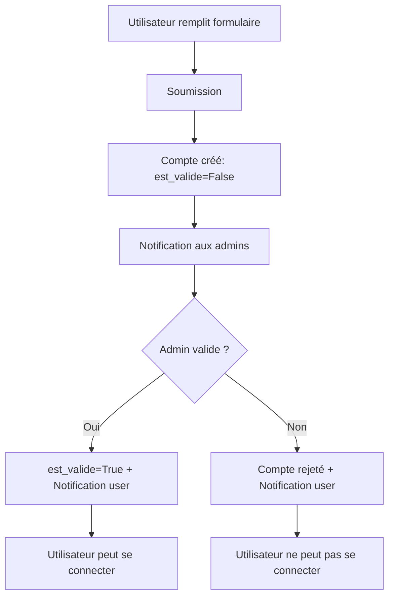

# Domaine : Gestion des utilisateurs

## Vue d'ensemble

Le domaine utilisateur gère l'authentification, l'autorisation et les notifications. Il s'appuie sur un modèle personnalisé `Utilisateur` qui étend `AbstractUser` de Django.

**Fichier** : `accounts/models.py`

---

## Table des matières

1. [Modèles](#modeles)
2. [Workflow d'inscription](#workflow-dinscription)
3. [Gestion administrative](#gestion-administrative)
4. [Réinitialisation de mot de passe](#reinitialisation-de-mot-de-passe)
5. [Email de rappel avec message personnalisé](#email-de-rappel-avec-message-personnalise)
6. [Suppression d'utilisateurs (Soft Delete)](#suppression-dutilisateurs-soft-delete)
7. [Sécurité](#securite)
8. [Requêtes ORM courantes](#requetes-orm-courantes)

---

## Modèles

### Modèle Utilisateur

#### Rôle métier

Représente un utilisateur de l'application avec un système de rôles et de validation de compte par les administrateurs.

#### Héritage

```python
class Utilisateur(AbstractUser):
    # Hérite de tous les champs de AbstractUser:
    # - username, password, email
    # - first_name, last_name
    # - is_staff, is_active, is_superuser
    # - date_joined, last_login
```

#### Champs spécifiques

| Champ | Type | Description | Défaut | Contraintes |
|-------|------|-------------|--------|-------------|
| `role` | CharField(15) | Rôle de l'utilisateur | 'observateur' | Choix: ROLE_CHOICES |
| `est_valide` | BooleanField | Compte validé par un admin | False | Requis pour login |
| `est_transcription` | BooleanField | Utilisateur dédié aux transcriptions OCR | False | Compte technique |
| `email` | EmailField | Adresse email | - | **UNIQUE** et **OBLIGATOIRE** |

#### Système de rôles

**Définition** : `core/constants.py::ROLE_CHOICES`

```python
ROLE_CHOICES = [
    ('observateur', 'Observateur'),
    ('correcteur', 'Correcteur'),
    ('administrateur', 'Administrateur'),
]
```

##### Permissions par rôle

| Rôle | Permissions |
|------|-------------|
| **Observateur** | • Créer/modifier ses propres fiches<br>• Consulter toutes les observations<br>• Soumettre pour correction |
| **Correcteur** | • Toutes permissions observateur<br>• Corriger toutes les fiches<br>• Accès outil de transcription |
| **Administrateur** | • Toutes permissions<br>• Gérer les utilisateurs<br>• Valider les comptes<br>• Accès admin Django |

#### Contrainte d'unicité email

```python
email = models.EmailField(
    "adresse email",
    unique=True,  # ← Contrainte BDD
    error_messages={
        'unique': "Un utilisateur avec cette adresse email existe déjà.",
    },
)
```

**Implémentation** :
- **Migration** : `accounts/migrations/0003_email_unique_et_lien_default.py`
- **Validation** : Niveau base de données + niveau formulaire
- **Script de vérification** : `scripts/check_duplicate_emails.py`

#### Relations

| Collection | Description |
|------------|-------------|
| `fiches` | Fiches d'observation créées (FicheObservation.observateur) |
| `notifications` | Notifications reçues (Notification.destinataire) |
| `notifications_le_concernant` | Notifications où l'utilisateur est référencé |
| `modificateur_de` | Historique des modifications effectuées |

---

### Modèle Notification

#### Rôle métier

Système de notifications internes pour informer les utilisateurs d'événements importants (demandes de compte, validations, etc.).

#### Champs

| Champ | Type | Description | Index |
|-------|------|-------------|-------|
| `destinataire` | ForeignKey | Utilisateur qui reçoit la notification | → Utilisateur |
| `type_notification` | CharField(20) | Type de notification | Choix: TYPE_CHOICES, **Indexé** |
| `titre` | CharField(255) | Titre court | - |
| `message` | TextField | Contenu détaillé | - |
| `lien` | CharField(255) | URL relative vers la ressource | Optionnel |
| `est_lue` | BooleanField | Notification lue ou non | Défaut: False, **Indexé** |
| `date_creation` | DateTimeField | Date de création | Auto (timezone.now) |
| `date_lecture` | DateTimeField | Date de lecture | NULL si non lue |
| `utilisateur_concerne` | ForeignKey | Référence optionnelle utilisateur | → Utilisateur, Optionnel |

#### Types de notifications

```python
TYPE_CHOICES = [
    ('demande_compte', 'Demande de compte'),
    ('compte_valide', 'Compte validé'),
    ('compte_refuse', 'Compte refusé'),
    ('info', 'Information'),
    ('warning', 'Avertissement'),
]
```

#### Index composites

```python
indexes = [
    models.Index(fields=['destinataire', 'est_lue']),  # Requêtes fréquentes
    models.Index(fields=['type_notification']),
]
```

**Optimise** :
```python
# Liste des notifications non lues d'un utilisateur
Notification.objects.filter(
    destinataire=user,
    est_lue=False
).order_by('-date_creation')
```

#### Méthodes

##### `marquer_comme_lue()`

```python
def marquer_comme_lue(self):
    """Marque la notification comme lue"""
    if not self.est_lue:
        self.est_lue = True
        self.date_lecture = timezone.now()
        self.save()
```

**Usage** :
```python
notification = user.notifications.first()
notification.marquer_comme_lue()
```

---

## Workflow d'inscription



### Étapes détaillées

#### 1. Inscription publique

- URL : `/accounts/inscription-publique/`
- Formulaire : `UtilisateurCreationForm`
- Champs : username, email, first_name, last_name, password

#### 2. Création du compte

```python
user = Utilisateur.objects.create(
    username='...',
    email='...',
    first_name='...',
    last_name='...',
    role='observateur',
    est_valide=False,  # ← Compte en attente
    is_active=False,   # ← Ne peut pas se connecter
)
```

#### 3. Notifications automatiques

```python
# Notification à tous les admins
admins = Utilisateur.objects.filter(role='administrateur')
for admin in admins:
    Notification.objects.create(
        destinataire=admin,
        type_notification='demande_compte',
        titre='Nouvelle demande de compte',
        message=f'{user.get_full_name()} demande un accès',
        lien=f'/accounts/utilisateur/{user.id}/',
        utilisateur_concerne=user
    )
```

#### 4. Validation par admin

- Admin consulte la liste des demandes
- URL : `/accounts/liste-utilisateurs/?valide=non`
- Actions possibles :
  - **Valider** → `est_valide=True`, `is_active=True`
  - **Refuser** → Suppression ou rejet

#### 5. Notification de validation

```python
Notification.objects.create(
    destinataire=user,
    type_notification='compte_valide',
    titre='Votre compte a été validé',
    message='Vous pouvez maintenant vous connecter.',
    lien='/login/'
)
```

---

## Gestion administrative

### Liste des utilisateurs

**URL** : `/accounts/utilisateurs/`
**Permission requise** : Administrateur

#### Filtres disponibles

1. **Recherche textuelle**
   - Recherche dans : username, first_name, last_name, email
   - Insensible à la casse

2. **Filtre par rôle**
   - Tous les rôles
   - Observateurs
   - Correcteurs
   - Administrateurs

3. **Filtre par validation**
   - Tous
   - Validés
   - En attente (nouveaux comptes)

4. **Filtre par statut**
   - Tous les statuts
   - Actifs uniquement
   - Inactifs uniquement (utilisateurs supprimés)

#### Affichage des utilisateurs

**Colonnes affichées** :
- Nom d'utilisateur (avec badge "Nouveau" si non validé)
- Nom
- Prénom
- Email
- Rôle
- Validation (Validé / En attente)
- Statut (Actif / Inactif)
- Actions

**Indicateurs visuels** :
- 🟡 Fond jaune : Compte en attente de validation
- 🔘 Grisé + barré : Compte inactif (supprimé)
- Badge compteur : Nombre de demandes en attente

#### Actions disponibles

Pour chaque utilisateur :

1. **Valider** (si non validé)
   - Active le compte (is_active = True)
   - Marque comme validé (est_valide = True)
   - Envoie un email de confirmation à l'utilisateur
   - Crée une notification pour l'utilisateur
   - Marque les notifications admin comme lues

2. **Modifier**
   - Formulaire d'édition des informations
   - Changement de rôle possible
   - Modification email, nom, prénom

3. **Supprimer** (si actif) - Soft Delete
   - Désactive le compte (is_active = False)
   - Conserve toutes les données
   - Affichage en grisé dans la liste
   - Action réversible
   - Voir section [Suppression d'utilisateurs](#suppression-dutilisateurs-soft-delete)

4. **Réactiver** (si inactif)
   - Réactive le compte (is_active = True)
   - L'utilisateur peut à nouveau se connecter
   - Retour à l'affichage normal

### Création manuelle d'utilisateurs

**URL** : `/accounts/utilisateurs/creer/`
**Permission requise** : Administrateur

Les administrateurs peuvent créer directement des comptes validés :
- Compte créé avec est_valide = True
- Compte actif immédiatement (is_active = True)
- Rôle choisi par l'administrateur

### Modification d'utilisateurs

**URL** : `/accounts/utilisateurs/<user_id>/modifier/`
**Permission requise** : Administrateur

**Champs modifiables** :
- Nom d'utilisateur
- Email
- Prénom
- Nom
- Rôle
- Statut de validation
- Statut actif/inactif

### Détails d'un utilisateur

**URL** : `/accounts/utilisateurs/<user_id>/detail/`
**Permission requise** : Administrateur

**Informations affichées** :
- Informations personnelles
- Nombre d'observations créées
- Liste des fiches d'observation
- Historique des actions

**Chargement AJAX** :
- Les détails se chargent sans rechargement de page
- Clic sur une ligne de la liste des utilisateurs

---

## Réinitialisation de mot de passe

### Vue d'ensemble

Cette fonctionnalité permet aux utilisateurs qui ont oublié leur mot de passe de le réinitialiser de manière sécurisée via email.

### Workflow utilisateur

```
1. Page de login
   └─> Clic sur "Mot de passe oublié ?"
       └─> 2. Formulaire de demande de réinitialisation
           ├─> Saisie de l'email
           └─> Envoi du formulaire
               └─> 3. Email de réinitialisation envoyé
                   ├─> Lien avec token (valide 24h)
                   └─> Clic sur le lien
                       └─> 4. Formulaire nouveau mot de passe
                           ├─> Saisie du nouveau mot de passe
                           ├─> Confirmation du mot de passe
                           └─> Enregistrement
                               └─> 5. Redirection vers login
```

### Composants implémentés

#### Formulaires (`accounts/forms.py`)

**`MotDePasseOublieForm`**
- **Champ** : `email` (EmailField)
- **Validation** : Format email valide
- **Usage** : Page de demande de réinitialisation

**`NouveauMotDePasseForm`**
- **Champs** :
  - `password1` : Nouveau mot de passe
  - `password2` : Confirmation du mot de passe
- **Validations** :
  - Minimum 8 caractères
  - Les deux mots de passe doivent correspondre

#### Vues (`accounts/views/auth.py`)

**`mot_de_passe_oublie(request)`**
- **URL** : `/accounts/mot-de-passe-oublie/`
- **Méthode** : GET et POST
- **Authentification** : Non requise
- **Fonctionnement** :
  1. Affiche le formulaire de saisie d'email
  2. Vérifie si l'email existe dans la base de données
  3. Génère un token sécurisé (Django `default_token_generator`)
  4. Encode l'ID utilisateur (base64)
  5. Envoie l'email avec le lien de réinitialisation
  6. **Sécurité** : Message identique que l'email existe ou non (évite l'énumération d'emails)

**`reinitialiser_mot_de_passe(request, uidb64, token)`**
- **URL** : `/accounts/reinitialiser-mot-de-passe/<uidb64>/<token>/`
- **Méthode** : GET et POST
- **Authentification** : Non requise
- **Fonctionnement** :
  1. Décode l'UID et récupère l'utilisateur
  2. Vérifie la validité du token
  3. Si valide : affiche le formulaire de nouveau mot de passe
  4. Enregistre le nouveau mot de passe avec hachage
  5. Redirige vers la page de login

#### Service Email (`accounts/utils/email_service.py`)

**`EmailService.envoyer_email_reinitialisation_mdp(utilisateur, uid, token)`**
- **Template** : `accounts/emails/reinitialisation_mot_de_passe.html`
- **Sujet** : "[Observations Nids] Réinitialisation de votre mot de passe"
- **Contenu** :
  - Bouton avec lien de réinitialisation
  - Lien copié/collable en fallback
  - Avertissement de validité (24h)
  - Instructions de sécurité
- **Protocole** : HTTPS en production, HTTP en développement

#### Templates

**`accounts/templates/accounts/mot_de_passe_oublie.html`**
- Formulaire de saisie d'email
- Bouton d'envoi
- Lien de retour vers la page de login

**`accounts/templates/accounts/reinitialiser_mot_de_passe.html`**
- Deux états :
  - **Lien valide** : Formulaire de nouveau mot de passe
  - **Lien invalide/expiré** : Message d'erreur avec option de redemander un lien

**`accounts/templates/accounts/emails/reinitialisation_mot_de_passe.html`**
- Email HTML responsive
- Style inline pour compatibilité email
- Bouton CTA principal
- Lien de fallback
- Section d'avertissements

#### URLs (`accounts/urls.py`)

```python
# Demande de réinitialisation
path('mot-de-passe-oublie/', auth.mot_de_passe_oublie, name='mot_de_passe_oublie')

# Réinitialisation avec token
path('reinitialiser-mot-de-passe/<uidb64>/<token>/',
     auth.reinitialiser_mot_de_passe,
     name='reinitialiser_mot_de_passe')
```

### Mesures de sécurité

1. **Token sécurisé**
   - Utilise `django.contrib.auth.tokens.default_token_generator`
   - Token unique basé sur le timestamp et le hash du mot de passe
   - Invalide automatiquement après changement de mot de passe

2. **Durée de validité**
   - Les tokens expirent après 24 heures
   - Configurable via `PASSWORD_RESET_TIMEOUT` dans settings

3. **Encodage sécurisé**
   - UID utilisateur encodé en base64 URL-safe
   - Empêche la manipulation directe des IDs

4. **Protection contre l'énumération**
   - Message identique que l'email existe ou non
   - Logs séparés pour le monitoring (email inexistant)

5. **Validation du mot de passe**
   - Minimum 8 caractères
   - Vérification de correspondance password1/password2
   - Hachage Django (`make_password`)

6. **Compte actif uniquement**
   - La réinitialisation ne fonctionne que pour les comptes `is_active=True`

### Configuration requise

#### Variables d'environnement

```bash
# .env
ADMIN_EMAIL=admin@example.com          # Pour notifications admin
DEFAULT_FROM_EMAIL=noreply@example.com # Email expéditeur
ALLOWED_HOSTS=["localhost", "example.com"]  # Pour construire les URLs
```

#### Configuration SMTP

**En développement** (backend console) :
```python
EMAIL_BACKEND = 'django.core.mail.backends.console.EmailBackend'
```

**En production** (SMTP) :
```python
EMAIL_BACKEND = 'django.core.mail.backends.smtp.EmailBackend'
EMAIL_HOST = 'smtp.gmail.com'
EMAIL_PORT = 587
EMAIL_USE_TLS = True
EMAIL_HOST_USER = 'your-email@example.com'
EMAIL_HOST_PASSWORD = 'your-app-password'
```

### Monitoring et logs

**Événements logués** :

```python
# Email de réinitialisation envoyé
logger.info(f"Email de réinitialisation envoyé à {email}")

# Tentative pour email inexistant
logger.warning(f"Tentative de réinitialisation pour email inexistant : {email}")

# Réinitialisation réussie
logger.info(f"Mot de passe réinitialisé pour {utilisateur.username}")

# Lien invalide ou expiré
logger.warning(f"Tentative de réinitialisation avec lien invalide ou expiré")
```

---

## Email de rappel avec message personnalisé

### Vue d'ensemble

Cette fonctionnalité permet aux administrateurs d'envoyer un email de rappel aux utilisateurs depuis la page de modification du compte. L'email contient les informations du compte et un lien optionnel de réinitialisation de mot de passe. L'administrateur peut ajouter un message personnalisé qui sera affiché dans l'email.

### Interface utilisateur

**URL** : `/accounts/utilisateurs/<user_id>/modifier/`
**Permission requise** : Administrateur

#### Présentation

La fonctionnalité est accessible depuis la section "Actions supplémentaires" de la page de modification d'un utilisateur. Elle se présente sous forme d'un tableau à 3 colonnes :

**Colonne 1 (30%)** - Description :
- Titre : "Email de rappel"
- Information sur le destinataire (email de l'utilisateur)
- Explication du contenu de l'email

**Colonne 2 (50%)** - Message personnalisé :
- Zone de texte (textarea) pour saisir un message optionnel
- Le message sera affiché dans un encadré en haut de l'email
- Support des sauts de ligne

**Colonne 3 (20%)** - Action :
- Bouton "Envoyer l'email"
- Soumission directe du formulaire
- Pas de boîte de dialogue modale

### Workflow utilisateur (admin)

```
1. Admin accède à la page de modification d'un utilisateur
   └─> Section "Actions supplémentaires"
       └─> 2. (Optionnel) Saisie d'un message personnalisé
           └─> 3. Clic sur "Envoyer l'email"
               └─> 4. Génération du token de réinitialisation
                   └─> 5. Envoi de l'email avec message personnalisé
                       └─> 6. Confirmation affichée à l'admin
```

### Composants implémentés

#### Vue (`accounts/views/auth.py`)

**`envoyer_email_rappel_utilisateur(request, user_id)`**

```python
@login_required
@user_passes_test(est_admin)
def envoyer_email_rappel_utilisateur(request, user_id):
    """Vue pour envoyer un email de rappel avec message personnalisé"""
    if request.method == 'POST':
        utilisateur = get_object_or_404(Utilisateur, id=user_id)

        # Vérifier que l'utilisateur a un email
        if not utilisateur.email:
            messages.error(request, f"L'utilisateur n'a pas d'adresse email.")
            return redirect('accounts:modifier_utilisateur', user_id=user_id)

        # Récupérer le message personnalisé (optionnel)
        message_personnalise = request.POST.get('message_personnalise', '').strip()

        # Générer le token et l'UID pour la réinitialisation
        token = default_token_generator.make_token(utilisateur)
        uid = urlsafe_base64_encode(force_bytes(utilisateur.pk))

        # Envoyer l'email
        succes = EmailService.envoyer_email_rappel_compte(
            utilisateur, uid, token, message_personnalise=message_personnalise
        )

        if succes:
            messages.success(request, f"Un email de rappel a été envoyé à {utilisateur.email}.")
            logger.info(f"Email de rappel envoyé à {utilisateur.email} par {request.user.username}")
        else:
            messages.error(request, f"Erreur lors de l'envoi de l'email.")

        return redirect('accounts:modifier_utilisateur', user_id=user_id)
```

**Sécurité** :
- Accès réservé aux administrateurs via `@user_passes_test(est_admin)`
- Validation de l'existence de l'utilisateur avec `get_object_or_404`
- Vérification de la présence d'un email
- Token sécurisé généré par Django

#### Service Email (`accounts/utils/email_service.py`)

**`EmailService.envoyer_email_rappel_compte(utilisateur, uid, token, message_personnalise="")`**

```python
@staticmethod
def envoyer_email_rappel_compte(utilisateur, uid, token, message_personnalise=""):
    """
    Envoie un email de rappel avec les données du compte et un lien de
    réinitialisation de mot de passe optionnel.

    Args:
        utilisateur: L'utilisateur à qui envoyer le rappel
        uid: L'UID encodé de l'utilisateur pour le lien de réinitialisation
        token: Le token de réinitialisation de mot de passe
        message_personnalise: Message optionnel de l'administrateur (défaut: "")

    Returns:
        bool: True si l'email a été envoyé avec succès, False sinon
    """
```

**Contenu de l'email** :
- Sujet : `[Observations Nids] Rappel des informations de votre compte`
- Template : `accounts/emails/rappel_compte_utilisateur.html`
- Informations du compte (username, nom, prénom, email, rôle, statut)
- Message personnalisé (si fourni) dans un encadré bleu
- Lien de connexion
- Lien de réinitialisation de mot de passe (optionnel, valide 7 jours)

#### Template Email (`accounts/templates/accounts/emails/rappel_compte_utilisateur.html`)

**Structure** :
```html
<!-- En-tête -->
<div class="header">Rappel des informations de votre compte</div>

<!-- Contenu -->
<div class="content">
    <p>Bonjour {{ utilisateur.first_name }},</p>

    <!-- Message personnalisé (conditionnel) -->
    
    <div style="background-color: #e7f3ff; border-left: 4px solid #2196F3; ...">
        <h4>Message de l'administrateur</h4>
        <p style="white-space: pre-wrap;">{{ message_personnalise }}</p>
    </div>
    

    <!-- Informations du compte -->
    <div class="info-box">
        <h3>Informations de votre compte</h3>
        <p><strong>Nom d'utilisateur :</strong> {{ utilisateur.username }}</p>
        <p><strong>Email :</strong> {{ utilisateur.email }}</p>
        <p><strong>Rôle :</strong> {{ utilisateur.get_role_display }}</p>
        ...
    </div>

    <!-- Bouton de connexion -->
    <a href="http://{{ site_url }}/login/" class="button">Se connecter</a>

    <!-- Section réinitialisation (optionnelle) -->
    <div class="reset-box">
        <h3>Réinitialisation du mot de passe (optionnel)</h3>
        <p>Important : Si vous n'utilisez pas ce lien, votre mot de passe
           reste inchangé.</p>
    </div>

    <a href="{{ reset_url }}" class="button button-warning">
        Réinitialiser mon mot de passe
    </a>
</div>
```

**Design** :
- Email HTML responsive
- Style inline pour compatibilité email
- Encadré bleu pour le message personnalisé
- Support des sauts de ligne (`white-space: pre-wrap`)
- Boutons CTA distincts pour connexion et réinitialisation

#### Template Page (`accounts/templates/accounts/modifier_utilisateur.html`)

**Section "Actions supplémentaires"** :

```html
<div class="mt-4 pt-4 border-top">
    <h5 class="mb-3">Actions supplémentaires</h5>
    <form method="post" action="">
        
        <table style="width: 100%; border-collapse: collapse;">
            <tr>
                <!-- Colonne 1 : Description -->
                <td style="width: 30%; padding-right: 20px; vertical-align: top;">
                    <p class="mb-1"><strong>Email de rappel</strong></p>
                    <small class="text-muted">
                        Envoie un email à <strong>{{ utilisateur.email }}</strong>
                        avec les informations de son compte et un lien optionnel
                        de réinitialisation de mot de passe.
                    </small>
                </td>

                <!-- Colonne 2 : Message personnalisé -->
                <td style="width: 50%; padding-right: 20px; vertical-align: top;">
                    <div class="form-group">
                        <label for="messagePersonnalise">
                            <strong>Message personnalisé (optionnel) :</strong>
                        </label>
                        <textarea
                            class="form-control"
                            id="messagePersonnalise"
                            name="message_personnalise"
                            rows="4"
                            placeholder="Ajoutez un message personnalisé...">
                        </textarea>
                        <small class="form-text text-muted">
                            Ce message sera affiché en haut de l'email,
                            avant les informations du compte.
                        </small>
                    </div>
                </td>

                <!-- Colonne 3 : Bouton d'action -->
                <td style="width: 20%; vertical-align: middle; text-align: center;">
                    <button type="submit" class="btn btn-info">
                        <i class="fas fa-paper-plane"></i> Envoyer l'email
                    </button>
                </td>
            </tr>
        </table>
    </form>
</div>
```

**Avantages de cette présentation** :
- ✅ Tout visible en un coup d'œil
- ✅ Pas de modal à ouvrir
- ✅ Saisie rapide du message
- ✅ Action directe en un clic

#### URLs (`accounts/urls.py`)

```python
path(
    'utilisateurs/<int:user_id>/envoyer-rappel/',
    auth.envoyer_email_rappel_utilisateur,
    name='envoyer_rappel_utilisateur',
),
```

### Cas d'usage

#### 1. Rappel simple sans message

**Situation** : Un utilisateur a demandé ses identifiants.

**Actions** :
1. Admin accède à `/accounts/utilisateurs/<id>/modifier/`
2. Clique sur "Envoyer l'email" (sans message personnalisé)
3. L'utilisateur reçoit un email avec ses informations

**Email reçu** :
- Informations du compte
- Lien de connexion
- Lien de réinitialisation de mot de passe (optionnel)

#### 2. Rappel avec message personnalisé

**Situation** : Suite à un contact téléphonique, l'admin veut envoyer un message personnalisé.

**Exemple de message** :
```
Bonjour,

Suite à notre discussion téléphonique de ce jour, voici un rappel
de vos informations de connexion.

Si vous rencontrez des difficultés, n'hésitez pas à me recontacter.

Cordialement,
L'équipe Observations Nids
```

**Email reçu** :
- **Encadré bleu** avec le message de l'admin
- Informations du compte
- Lien de connexion
- Lien de réinitialisation de mot de passe (optionnel)

#### 3. Réinitialisation guidée

**Situation** : L'utilisateur a perdu son mot de passe mais contacter l'admin.

**Message admin** :
```
Vous avez signalé avoir perdu votre mot de passe.

Utilisez le lien de réinitialisation ci-dessous pour créer un nouveau
mot de passe. Ce lien est valide pendant 7 jours.

Si vous n'utilisez pas le lien, votre mot de passe actuel reste valide.
```

**Email reçu** :
- Encadré avec instructions personnalisées
- Informations du compte
- **Mise en avant** du lien de réinitialisation

### Sécurité

#### Token de réinitialisation

- Utilise `django.contrib.auth.tokens.default_token_generator`
- Token unique basé sur le timestamp et le hash du mot de passe
- Valide pendant 7 jours par défaut
- Invalide automatiquement après changement de mot de passe
- UID encodé en base64 URL-safe

#### Protection des données

- Seuls les administrateurs peuvent envoyer ces emails
- Vérification de l'existence de l'utilisateur
- Message personnalisé non stocké (transmission directe)
- Email envoyé uniquement à l'adresse enregistrée

#### Logs

```python
# Email envoyé avec succès
logger.info(f"Email de rappel envoyé à {utilisateur.email} par {request.user.username}")

# Erreur d'envoi
logger.error(f"Échec de l'envoi de l'email de rappel pour {utilisateur.username}")
```

### Configuration requise

#### Variables d'environnement

Voir [Réinitialisation de mot de passe](#reinitialisation-de-mot-de-passe) pour la configuration SMTP.

#### Settings Django

```python
# Expéditeur des emails
DEFAULT_FROM_EMAIL = 'noreply@observations-nids.fr'

# Hôte pour construire les URLs
ALLOWED_HOSTS = ['127.0.0.1', 'observations-nids.fr']

# Mode développement/production
DEBUG = True  # False en production
```

### Différences avec la réinitialisation de mot de passe

| Fonctionnalité | Email de rappel | Réinitialisation MDP |
|----------------|-----------------|----------------------|
| **Initié par** | Administrateur | Utilisateur |
| **Accès** | Page admin | Page publique |
| **Message personnalisé** | ✅ Oui | ❌ Non |
| **Informations compte** | ✅ Oui | ❌ Non |
| **Lien réinitialisation** | ✅ Optionnel | ✅ Principal |
| **Lien connexion** | ✅ Oui | ❌ Non |
| **Cas d'usage** | Support utilisateur | Mot de passe oublié |

### Points d'attention

**⚠️ Message personnalisé**
- Non stocké en base de données
- Transmis directement dans l'email
- Support des sauts de ligne (`\n`)
- Pas de limite de caractères (raisonnable pour un email)

**⚠️ Lien de réinitialisation**
- Toujours inclus dans l'email
- L'utilisateur peut choisir de l'utiliser ou non
- Si non utilisé, le mot de passe actuel reste valide
- Même système de sécurité que la réinitialisation standard

**⚠️ Différence avec email automatique**
- Email de validation : Automatique lors de la validation du compte
- Email de rappel : Manuel, à la demande de l'admin, avec message personnalisé

### Monitoring et logs

**Événements logués** :

```python
# Succès
logger.info(f"Email de rappel envoyé à {utilisateur.email} par {request.user.username}")

# Échec
logger.error(f"Échec de l'envoi de l'email de rappel pour {utilisateur.username}")

# Utilisateur sans email
logger.warning(f"L'utilisateur {utilisateur.username} n'a pas d'email")
```

---

## Suppression d'utilisateurs (Soft Delete)

### Concept

**Soft Delete** = Suppression "douce" sans perte de données

- L'utilisateur est **désactivé** (is_active = False)
- Toutes ses données **restent dans le système**
- Ses observations **restent accessibles**
- Action **100% réversible**
- Aucune suppression définitive depuis l'interface web

### Interface utilisateur

#### Bouton "Supprimer"

**Apparence** :
- Icône : `trash-alt` (poubelle)
- Couleur : Rouge (`btn-danger`)
- Visible uniquement pour les utilisateurs actifs

**Message de confirmation** :
```
⚠️ ATTENTION

Voulez-vous vraiment supprimer cet utilisateur ?

L'utilisateur [username] ne pourra plus se connecter.
Ses observations resteront dans le système.

Cette action est réversible via le bouton 'Réactiver'.
```

#### Affichage des utilisateurs supprimés

**Style CSS** :
```css
.user-inactive {
    opacity: 0.5;                    /* Semi-transparent */
    background-color: #f8f9fa;       /* Fond gris clair */
}

.user-inactive td {
    color: #6c757d;                  /* Texte gris */
    text-decoration: line-through;   /* Texte barré */
}
```

**Comportement** :
- Ligne complète en grisé
- Texte barré
- Badge "Inactif" en rouge
- Survol possible (opacity: 0.7)
- Boutons et badges restent visibles (opacity: 1)

#### Bouton "Réactiver"

**Apparence** :
- Icône : `user-check`
- Couleur : Vert (`btn-success`)
- Visible uniquement pour les utilisateurs inactifs

**Message de confirmation** :
```
Voulez-vous réactiver l'utilisateur [username] ?

Il pourra à nouveau se connecter à l'application.
```

### Workflow technique

**Suppression** :
```python
@login_required
@user_passes_test(est_admin)
def desactiver_utilisateur(request, user_id):
    utilisateur = get_object_or_404(Utilisateur, id=user_id)
    utilisateur.is_active = False
    utilisateur.save()

    # Log de l'action
    logger.info(f"Utilisateur {utilisateur.username} supprimé (soft delete) par {request.user.username}")

    # Message de succès explicite
    messages.success(request,
        f"L'utilisateur {utilisateur.username} a été supprimé. "
        f"Il ne peut plus se connecter mais ses données sont conservées. "
        f"Vous pouvez le réactiver à tout moment."
    )
```

**Réactivation** :
```python
@login_required
@user_passes_test(est_admin)
def activer_utilisateur(request, user_id):
    utilisateur = get_object_or_404(Utilisateur, id=user_id)
    utilisateur.is_active = True
    utilisateur.save()

    # Log de l'action
    logger.info(f"Utilisateur {utilisateur.username} réactivé par {request.user.username}")

    messages.success(request,
        f"L'utilisateur {utilisateur.username} a été réactivé. "
        f"Il peut à nouveau se connecter à l'application."
    )
```

### Impact sur les données

**Ce qui est conservé** :
- ✅ Informations utilisateur (username, email, nom, prénom)
- ✅ Toutes les observations créées
- ✅ Historique des modifications
- ✅ Notifications
- ✅ Relations ForeignKey

**Ce qui est affecté** :
- ❌ Connexion impossible (is_active = False)
- ❌ Apparaît comme "Inactif" dans les listes
- ℹ️ Les observations restent attribuées à cet utilisateur

### Suppression définitive (admin Django)

**Interface admin Django** : `/admin/accounts/utilisateur/`

**Cas d'usage** :
- Nettoyage de comptes de test
- Suppression suite à demande RGPD
- Cas exceptionnels uniquement

**Conséquences** :
- ⚠️ Suppression définitive de toutes les données
- ⚠️ CASCADE ou PROTECT selon les ForeignKey
- ⚠️ Peut échouer si des données liées existent

**Recommandation** : Utiliser uniquement en dernier recours. Préférer le soft delete.

---

## Sécurité

### Email unique obligatoire

**Pourquoi ?**
- Permet réinitialisation de mot de passe sécurisée
- Évite les doublons (un email = un compte)
- Facilite identification des utilisateurs

**Migration** :
```python
# accounts/migrations/0003_email_unique_et_lien_default.py
operations = [
    migrations.AlterField(
        model_name='utilisateur',
        name='email',
        field=models.EmailField(unique=True, ...),
    ),
]
```

### Vérification avant migration

Script de diagnostic :
```bash
python scripts/check_duplicate_emails.py
```

**Output** :
```
ERREUR: Emails en double detectes:

  Email: user@example.com - 2 comptes
     -> user1 (ID: 42) - actif - observateur
     -> user2 (ID: 43) - inactif - observateur

RECOMMANDATION:
1. Supprimer ou desactiver les comptes en double
2. Ajouter une contrainte unique sur le champ email
```

### Authentification et autorisation

**Décorateurs utilisés** :
```python
@login_required                    # Authentification requise
@user_passes_test(est_admin)       # Administrateur requis
@user_passes_test(est_superuser)   # Superuser requis (Django)
```

**Mixins pour les vues class-based** :
```python
LoginRequiredMixin      # Authentification requise
UserPassesTestMixin     # Test personnalisé (est_admin)
```

### Protection contre les attaques

**1. Énumération d'utilisateurs**
- Messages identiques que l'email existe ou non (réinitialisation mdp)
- Pas de différenciation dans les erreurs de login

**2. CSRF (Cross-Site Request Forgery)**
- Token CSRF sur tous les formulaires POST
- Middleware CSRF actif

**3. XSS (Cross-Site Scripting)**
- Templates Django avec échappement automatique
- Validation des inputs utilisateur

**4. SQL Injection**
- ORM Django (requêtes paramétrées)
- Pas de requêtes SQL brutes

### Logs et traçabilité

**Actions loguées** :
```python
# Inscription
logger.info(f"Nouvelle demande d'inscription reçue : {username} ({email})")

# Validation
logger.info(f"Compte validé pour {username} par {admin.username}")

# Réinitialisation mdp
logger.info(f"Email de réinitialisation envoyé à {email}")

# Suppression/Réactivation
logger.info(f"Utilisateur {username} supprimé (soft delete) par {admin.username}")
logger.info(f"Utilisateur {username} réactivé par {admin.username}")
```

---

## Requêtes ORM courantes

### Utilisateurs en attente de validation

```python
demandes = Utilisateur.objects.filter(
    est_valide=False,
    is_active=False
).order_by('-date_joined')
```

### Notifications non lues d'un utilisateur

```python
non_lues = user.notifications.filter(
    est_lue=False
).select_related('utilisateur_concerne')
```

### Administrateurs actifs

```python
admins = Utilisateur.objects.filter(
    role='administrateur',
    is_active=True,
    est_valide=True
)
```

### Statistiques par rôle

```python
from django.db.models import Count, Q

stats = Utilisateur.objects.values('role').annotate(
    total=Count('id'),
    valides=Count('id', filter=Q(est_valide=True)),
    actifs=Count('id', filter=Q(is_active=True))
)
```

---

## Points d'attention

### ⚠️ Différence `est_valide` vs `is_active`

| Champ | Signification | Usage |
|-------|---------------|-------|
| `est_valide` | Validation par admin | Workflow d'inscription |
| `is_active` | Compte actif | Login autorisé (Django standard) |

**Règle** : Un utilisateur doit être `est_valide=True` ET `is_active=True` pour se connecter.

### ⚠️ Suppression CASCADE

Si un utilisateur est supprimé :
- ✅ Ses notifications sont supprimées (CASCADE)
- ⚠️ Ses fiches d'observation sont supprimées (CASCADE sur `FicheObservation.observateur`)

**Recommandation** : Toujours utiliser **soft delete** (`is_active=False`)

---

## Voir aussi

- **[Diagramme ERD](../diagrammes/erd.md)** - Relations avec autres modèles
- **[Workflow de correction](09_workflow-correction.md)** - Interactions avec les utilisateurs
- **[Configuration](../../configuration/01_configuration.md)** - Variables d'environnement

---

*Dernière mise à jour : 2025-11-10*
