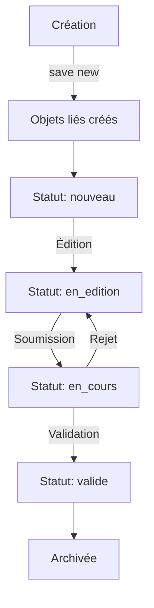

# Domaine : Fiches d'observation

## Vue d'ensemble

Le modèle **`FicheObservation`** est le **pivot central** de toute l'application. Il représente une fiche d'observation complète d'un nid pour une espèce et une année données.

**Fichier** : `observations/models.py`

---

## Modèle FicheObservation

### Rôle métier

Une fiche d'observation documente la nidification d'une espèce d'oiseau pendant une saison de reproduction. Elle regroupe :
- Les informations sur l'observateur et l'espèce
- La localisation précise du nid
- Les caractéristiques physiques du nid
- Les observations datées (dates de ponte, éclosion, envol)
- Les causes d'échec éventuelles
- L'état de correction et validation

### Champs principaux

| Champ | Type | Description | Contraintes |
|-------|------|-------------|-------------|
| `num_fiche` | AutoField (PK) | Numéro unique de la fiche | Auto-incrémenté |
| `date_creation` | DateTimeField | Date/heure de création | Auto (auto_now_add) |
| `observateur` | ForeignKey | Utilisateur créateur | → `Utilisateur`, CASCADE |
| `espece` | ForeignKey | Espèce observée | → `Espece`, **PROTECT** |
| `annee` | IntegerField | Année d'observation | Année (YYYY) |
| `chemin_image` | CharField(255) | Chemin vers l'image scannée | Optionnel |
| `chemin_json` | CharField(255) | Chemin vers les données OCR JSON | Optionnel |
| `transcription` | BooleanField | Issue d'une transcription OCR | Défaut: False |

### Relations (1:1 - Objets liés automatiques)

Lors de la création d'une fiche, **5 objets sont créés automatiquement** :

1. **`Localisation`** → [Voir documentation](05_localisation.md)
   - Commune, lieu-dit, coordonnées GPS
   - Altitude, paysage environnant

2. **`Nid`** → [Voir détails](#modele-nid)
   - Hauteur du nid et du couvert végétal
   - Détails descriptifs

3. **`ResumeObservation`** → [Voir documentation](06_nidification.md)
   - Dates partielles (jour/mois) : premier œuf, premier poussin éclos/volant
   - Compteurs : œufs pondus/éclos/non éclos, poussins

4. **`CausesEchec`** → [Voir détails](#modele-causesechec)
   - Description des causes d'échec de la nidification

5. **`EtatCorrection`** → [Voir documentation](09_workflow-correction.md)
   - Statut : nouveau, en_edition, en_cours, valide
   - Pourcentage de complétion
   - Valideur et date de validation

### Relations (1:N - Collections)

| Collection | Modèle cible | Description |
|------------|--------------|-------------|
| `observations` | `Observation` | Observations ponctuelles datées |
| `remarques` | `Remarque` | Remarques textuelles libres |
| `modifications` | `HistoriqueModification` | Historique des modifications |
| `validations` | `Validation` | Validations par des reviewers |

---

## Comportement : Création automatique

### Méthode `save()`

```python
@transaction.atomic
def save(self, *args, **kwargs):
    is_new = self.pk is None
    super().save(*args, **kwargs)

    # Si nouvelle fiche → créer les objets liés
    if is_new:
        Localisation.objects.get_or_create(fiche=self, defaults={...})
        Nid.objects.get_or_create(fiche=self, defaults={...})
        ResumeObservation.objects.get_or_create(fiche=self, defaults={...})
        CausesEchec.objects.get_or_create(fiche=self, defaults={...})
        EtatCorrection.objects.get_or_create(fiche=self, defaults={...})
```

**Avantages** :
- ✅ Garantit la cohérence des données
- ✅ Simplifie la logique métier (pas besoin de créer manuellement)
- ✅ Transaction atomique (tout ou rien)

**Valeurs par défaut** :
```python
Localisation:
    commune: 'Non spécifiée'
    departement: '00'
    coordonnees: '0,0'
    altitude: 0

Nid:
    nid_prec_t_meme_couple: False
    hauteur_nid: 0
    hauteur_couvert: 0
    details_nid: 'Aucun détail'

ResumeObservation:
    nombre_oeufs_pondus: NULL      # NULL = non observé
    nombre_oeufs_eclos: NULL
    nombre_oeufs_non_eclos: NULL
    nombre_poussins: NULL

CausesEchec:
    description: 'Aucune cause identifiée'

EtatCorrection:
    statut: 'nouveau'
    pourcentage_completion: 0
```

---

## Modèle Nid

### Rôle métier
Décrit les caractéristiques physiques du nid observé.

### Champs

| Champ | Type | Description | Défaut |
|-------|------|-------------|--------|
| `fiche` | OneToOne | Fiche parente | → `FicheObservation` |
| `nid_prec_t_meme_couple` | BooleanField | Nid précédent du même couple | False |
| `hauteur_nid` | IntegerField | Hauteur du nid (cm) | 0 |
| `hauteur_couvert` | IntegerField | Hauteur du couvert végétal (cm) | 0 |
| `details_nid` | TextField | Description libre | 'Aucun détail' |

### Localisation dans le code
**Fichier** : `observations/models.py:107-115`

---

## Modèle Observation

### Rôle métier
Représente une **observation ponctuelle datée** au sein d'une fiche. Une fiche peut contenir plusieurs observations (visites successives du nid).

### Champs

| Champ | Type | Description | Contraintes |
|-------|------|-------------|-------------|
| `fiche` | ForeignKey | Fiche parente | → `FicheObservation` |
| `date_observation` | DateTimeField | Date/heure de l'observation | **Obligatoire**, indexé |
| `nombre_oeufs` | IntegerField | Nombre d'œufs observés | ≥ 0 |
| `nombre_poussins` | IntegerField | Nombre de poussins observés | ≥ 0 |
| `observations` | TextField | Notes libres | Défaut: 'Aucune observation' |

### Index
- `date_observation` : Indexé pour tri chronologique rapide

### Cas d'usage
```python
# Exemple : 3 visites d'un même nid
fiche = FicheObservation.objects.get(num_fiche=123)

# Visite 1 : Début de ponte
Observation.objects.create(
    fiche=fiche,
    date_observation=datetime(2025, 4, 15, 10, 30),
    nombre_oeufs=2,
    nombre_poussins=0,
    observations="Nid en construction, 2 œufs"
)

# Visite 2 : Incubation
Observation.objects.create(
    fiche=fiche,
    date_observation=datetime(2025, 4, 25, 14, 0),
    nombre_oeufs=4,  # Ponte complète
    nombre_poussins=0,
    observations="4 œufs, adulte couve"
)

# Visite 3 : Éclosion
Observation.objects.create(
    fiche=fiche,
    date_observation=datetime(2025, 5, 10, 9, 15),
    nombre_oeufs=1,  # 1 œuf non éclos
    nombre_poussins=3,  # 3 poussins éclos
    observations="3 poussins éclos, 1 œuf non éclos"
)
```

### Localisation dans le code
**Fichier** : `observations/models.py:118-134`

---

## Modèle CausesEchec

### Rôle métier
Documente les causes d'échec de la nidification (prédation, conditions météo, abandon, etc.).

### Champs

| Champ | Type | Description | Défaut |
|-------|------|-------------|--------|
| `fiche` | OneToOne | Fiche parente | → `FicheObservation` |
| `description` | TextField | Description des causes | 'Aucune cause identifiée' |

### Cas d'usage
```python
fiche = FicheObservation.objects.get(num_fiche=456)
causes = fiche.causes_echec

# Échec par prédation
causes.description = "Prédation par une pie. Nid détruit le 12/05/2025."
causes.save()
```

### Localisation dans le code
**Fichier** : `observations/models.py:242-249`

---

## Modèle Remarque

### Rôle métier
Remarques textuelles libres associées à une fiche (notes de terrain, observations particulières).

### Champs

| Champ | Type | Description | Contraintes |
|-------|------|-------------|-------------|
| `fiche` | ForeignKey | Fiche parente | → `FicheObservation` |
| `remarque` | CharField | Texte de la remarque | Max 200 caractères |
| `date_remarque` | DateTimeField | Date/heure de la remarque | Auto (auto_now_add) |

### Cas d'usage
```python
fiche = FicheObservation.objects.get(num_fiche=789)

# Ajout de remarques
Remarque.objects.create(
    fiche=fiche,
    remarque="Mâle portant une bague bleue"
)

Remarque.objects.create(
    fiche=fiche,
    remarque="Nid situé à proximité d'un chemin forestier"
)

# Récupération de toutes les remarques
remarques = fiche.remarques.all().order_by('-date_remarque')
```

---

## Index et optimisations

### Index composites

```python
class Meta:
    indexes = [
        models.Index(fields=['observateur', 'date_creation']),
    ]
```

**Bénéfice** : Optimise les requêtes du type :
```python
# Liste des fiches d'un observateur par date
FicheObservation.objects.filter(
    observateur=user
).order_by('-date_creation')
```

### Protection CASCADE vs PROTECT

| Relation | Action on delete | Justification |
|----------|------------------|---------------|
| `observateur` → Utilisateur | **CASCADE** | Si utilisateur supprimé → supprimer ses fiches |
| `espece` → Espece | **PROTECT** | Empêcher suppression accidentelle d'espèce avec observations |

---

## Requêtes ORM courantes

### Récupérer une fiche avec tous ses objets liés

```python
# Optimisé avec select_related (1 seule requête SQL)
fiche = FicheObservation.objects.select_related(
    'observateur',
    'espece',
    'espece__famille',
    'localisation',
    'nid',
    'resume',
    'causes_echec',
    'etat_correction'
).get(num_fiche=123)

# Accès sans requête supplémentaire
print(fiche.observateur.username)
print(fiche.espece.nom_scientifique)
print(fiche.localisation.commune)
print(fiche.resume.nombre_oeufs_pondus)
```

### Récupérer les fiches avec leurs observations

```python
# Optimisé avec prefetch_related (2 requêtes SQL au lieu de N+1)
fiches = FicheObservation.objects.prefetch_related(
    'observations',
    'remarques'
).filter(annee=2025)

for fiche in fiches:
    print(f"Fiche {fiche.num_fiche} : {fiche.observations.count()} observations")
    for obs in fiche.observations.all():
        print(f"  - {obs.date_observation}: {obs.nombre_oeufs} œufs")
```

### Fiches validées d'une espèce

```python
fiches_validees = FicheObservation.objects.filter(
    espece__nom='Mésange bleue',
    etat_correction__statut='valide'
).select_related('etat_correction')
```

### Statistiques par observateur

```python
from django.db.models import Count, Avg

stats = FicheObservation.objects.values('observateur__username').annotate(
    nb_fiches=Count('num_fiche'),
    completion_moyenne=Avg('etat_correction__pourcentage_completion')
).order_by('-nb_fiches')
```

---

## Cycle de vie d'une fiche



1. **Création** : `FicheObservation` créée → 5 objets liés auto-créés
2. **Édition** : Observateur remplit les champs (localisation, nid, observations)
3. **Soumission** : Fiche soumise pour correction (`statut='en_cours'`)
4. **Validation** : Correcteur valide ou rejette
5. **Archivage** : Fiche validée archivée

**Voir** : [Workflow de correction détaillé](09_workflow-correction.md)

---

## Tests associés

**Fichier** : `observations/tests/test_models.py`

Tests critiques à vérifier :
- ✅ Création automatique des objets liés
- ✅ Protection CASCADE/PROTECT
- ✅ Contraintes d'unicité
- ✅ Validation des dates

---

## Points d'attention

### ⚠️ Création automatique

**Avantage** : Simplifie la création de fiches
**Inconvénient** : 5 requêtes INSERT à chaque création de fiche

**Optimisation possible** :
```python
# Créer en bulk si import massif
with transaction.atomic():
    fiches = FicheObservation.objects.bulk_create([...])
    # Puis créer objets liés en bulk
```

### ⚠️ Soft delete non implémenté

Actuellement, la suppression d'une fiche est **définitive** (CASCADE).

**Amélioration future** : Implémenter soft delete via `core.models.SoftDeleteModel`

---

## Voir aussi

- **[Données de nidification](06_nidification.md)** - Modèle `ResumeObservation` avec contraintes complexes
- **09_workflow-correction.md** - Modèle `EtatCorrection` et statuts
- **[Localisation](05_localisation.md)** - Géocodage et précision GPS
- **[Traçabilité](04_audit.md)** - `HistoriqueModification` sur les fiches
- **[Diagramme ERD](../diagrammes/erd.md)** - Vue d'ensemble des relations

---

*Dernière mise à jour : 2025-10-20*
