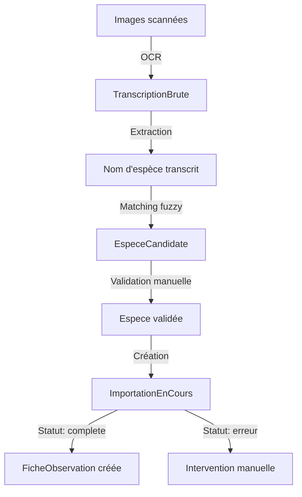

# Domaine : Import et transcription OCR

## Vue d'ensemble

Le pipeline d'import transforme des **fiches papier numérisées** en données structurées via OCR (reconnaissance optique de caractères). Il gère :
1. **Transcription brute** : Extraction du texte depuis images
2. **Validation des espèces** : Matching fuzzy avec le référentiel
3. **Import progressif** : Création contrôlée des fiches d'observation

**Fichier** : `ingest/models.py`

---

## Architecture du pipeline



---

## Modèle TranscriptionBrute

### Rôle métier

Stocke le **JSON brut** produit par l'OCR (ex: Tesseract, Azure Computer Vision) pour chaque fiche scannée.

### Champs

| Champ | Type | Description | Contraintes |
|-------|------|-------------|-------------|
| `fichier_source` | CharField(255) | Chemin du fichier image source | **UNIQUE** |
| `json_brut` | JSONField | Données OCR brutes (JSON) | - |
| `date_importation` | DateTimeField | Date d'importation | Auto (auto_now_add) |
| `traite` | BooleanField | Transcription traitée ou non | Défaut: False |

### Structure JSON typique

```json
{
  "image_path": "/data/scans/fiche_001.jpg",
  "text_blocks": [
    {
      "text": "Mésange bleue",
      "confidence": 0.95,
      "bounding_box": [120, 50, 300, 80]
    },
    {
      "text": "Grenoble",
      "confidence": 0.88,
      "bounding_box": [120, 100, 250, 130]
    },
    {
      "text": "4 œufs pondus",
      "confidence": 0.76,
      "bounding_box": [120, 200, 280, 230]
    }
  ],
  "metadata": {
    "ocr_engine": "Azure Computer Vision",
    "version": "3.2",
    "processing_time_ms": 1250
  }
}
```

### Localisation dans le code

**Fichier** : `ingest/models.py:8-15`

---

## Modèle EspeceCandidate

### Rôle métier

Stocke les **noms d'espèces transcrits** avec :
- Le nom brut extrait de l'OCR
- Le matching avec une espèce validée (si trouvée)
- Un score de similarité (fuzzy matching)
- Le statut de validation manuelle

### Champs

| Champ | Type | Description | Contraintes |
|-------|------|-------------|-------------|
| `nom_transcrit` | CharField(100) | Nom d'espèce extrait par OCR | **UNIQUE** |
| `espece_validee` | ForeignKey | Espèce correspondante | → `Espece`, SET_NULL |
| `validation_manuelle` | BooleanField | Validé manuellement par un admin | Défaut: False |
| `score_similarite` | FloatField | Score de matching (0-100%) | Défaut: 0.0 |

### Matching fuzzy

**Algorithme** : Levenshtein distance ou similarité cosine

```python
from fuzzywuzzy import fuzz

def trouver_espece_candidate(nom_transcrit):
    """Trouve l'espèce la plus proche du nom transcrit"""

    meilleures_correspondances = []

    especes = Espece.objects.filter(valide_par_admin=True)

    for espece in especes:
        # Calculer le score de similarité
        score = fuzz.ratio(nom_transcrit.lower(), espece.nom.lower())

        meilleures_correspondances.append({
            'espece': espece,
            'score': score
        })

    # Trier par score décroissant
    meilleures_correspondances.sort(key=lambda x: x['score'], reverse=True)

    # Retourner la meilleure correspondance si score > 80%
    if meilleures_correspondances and meilleures_correspondances[0]['score'] >= 80:
        meilleure = meilleures_correspondances[0]

        # Créer ou récupérer l'EspeceCandidate
        candidate, created = EspeceCandidate.objects.get_or_create(
            nom_transcrit=nom_transcrit,
            defaults={
                'espece_validee': meilleure['espece'],
                'score_similarite': meilleure['score'],
                'validation_manuelle': False
            }
        )

        return candidate
    else:
        # Aucune correspondance automatique → validation manuelle requise
        candidate, created = EspeceCandidate.objects.get_or_create(
            nom_transcrit=nom_transcrit,
            defaults={
                'espece_validee': None,
                'score_similarite': 0.0,
                'validation_manuelle': False
            }
        )

        return candidate
```

### Exemples de matching

| Nom transcrit (OCR) | Espèce validée | Score | Validation manuelle |
|---------------------|----------------|-------|---------------------|
| "Mésange bleue" | Mésange bleue | 100% | Non |
| "Mesange bieue" | Mésange bleue | 90% | Non |
| "M. bleue" | Mésange bleue | 65% | **Oui** (score < 80%) |
| "Pinson des arbres" | Pinson des arbres | 100% | Non |
| "Px arbres" | NULL | 0% | **Oui** (aucune correspondance) |

### Localisation dans le code

**Fichier** : `ingest/models.py:18-27`

---

## Modèle ImportationEnCours

### Rôle métier

Représente une **tentative d'importation** d'une transcription en fiche d'observation. Gère le workflow d'import avec 3 statuts.

### Champs

| Champ | Type | Description | Contraintes |
|-------|------|-------------|-------------|
| `transcription` | OneToOne | Transcription source | → `TranscriptionBrute`, CASCADE |
| `fiche_observation` | OneToOne | Fiche créée (si succès) | → `FicheObservation`, SET_NULL |
| `espece_candidate` | ForeignKey | Espèce candidate matchée | → `EspeceCandidate`, SET_NULL |
| `observateur` | ForeignKey | Observateur assigné | → `Utilisateur`, SET_NULL |
| `statut` | CharField(20) | Statut de l'importation | Choix: STATUT_IMPORTATION_CHOICES |
| `date_creation` | DateTimeField | Date de création | Auto (auto_now_add) |

### Statuts d'importation

```python
# core/constants.py
STATUT_IMPORTATION_CHOICES = [
    ('en_attente', 'En attente de validation'),
    ('erreur', 'Erreur détectée'),
    ('complete', 'Importation complétée'),
]
```

| Statut | Signification | Action requise |
|--------|---------------|----------------|
| `en_attente` | Import en cours, en attente de validation | Valider l'espèce candidate ou l'observateur |
| `erreur` | Erreur détectée (données manquantes, incohérentes) | Intervention manuelle |
| `complete` | Fiche créée avec succès | Aucune |

### Localisation dans le code

**Fichier** : `ingest/models.py:30-47`

---

## Workflow complet d'import

### Étape 1 : Scan et OCR

```python
import json
from ingest.models import TranscriptionBrute

# Exécuter l'OCR (exemple avec Azure)
def scanner_fiche(image_path):
    # Appel API OCR (exemple simplifié)
    ocr_result = azure_computer_vision.analyze_image(image_path)

    # Créer la transcription brute
    transcription = TranscriptionBrute.objects.create(
        fichier_source=image_path,
        json_brut=ocr_result,
        traite=False
    )

    return transcription

# Usage
transcription = scanner_fiche('/data/scans/fiche_042.jpg')
```

### Étape 2 : Extraction et matching d'espèce

```python
def extraire_espece(transcription):
    """Extrait le nom d'espèce depuis le JSON OCR"""

    json_data = transcription.json_brut

    # Rechercher le bloc de texte "espèce" (logique spécifique au template)
    for block in json_data['text_blocks']:
        text = block['text']

        # Heuristique : chercher un nom d'oiseau connu
        if text in ['Mésange bleue', 'Pinson des arbres', ...]:  # Liste connue
            return text

    # Si pas trouvé, retourner le premier bloc de texte (à affiner)
    return json_data['text_blocks'][0]['text'] if json_data['text_blocks'] else None

# Extraction
nom_espece = extraire_espece(transcription)

# Matching fuzzy
from ingest.utils import trouver_espece_candidate
candidate = trouver_espece_candidate(nom_espece)

print(f"Nom transcrit : {candidate.nom_transcrit}")
print(f"Espèce validée : {candidate.espece_validee.nom if candidate.espece_validee else 'À valider'}")
print(f"Score : {candidate.score_similarite}%")
```

### Étape 3 : Création de l'ImportationEnCours

```python
from ingest.models import ImportationEnCours

# Créer l'importation
importation = ImportationEnCours.objects.create(
    transcription=transcription,
    espece_candidate=candidate,
    observateur=None,  # À assigner manuellement
    statut='en_attente'
)

# Si espèce non validée → statut erreur
if not candidate.espece_validee:
    importation.statut = 'erreur'
    importation.save()

    # Notifier l'admin
    print(f"ERREUR : Espèce '{candidate.nom_transcrit}' non reconnue")
```

### Étape 4 : Validation manuelle (si nécessaire)

```python
# Interface admin : validation de l'espèce candidate
def valider_espece_candidate(candidate_id, espece_id):
    candidate = EspeceCandidate.objects.get(id=candidate_id)
    espece = Espece.objects.get(id=espece_id)

    candidate.espece_validee = espece
    candidate.validation_manuelle = True
    candidate.score_similarite = 100.0  # Validation manuelle = 100%
    candidate.save()

    # Mettre à jour l'importation
    importation = ImportationEnCours.objects.get(espece_candidate=candidate)
    importation.statut = 'en_attente'  # Repasser en attente
    importation.save()

# Usage
valider_espece_candidate(candidate_id=42, espece_id=15)
```

### Étape 5 : Création de la FicheObservation

```python
def creer_fiche_depuis_importation(importation_id):
    """Crée une FicheObservation depuis une ImportationEnCours"""

    importation = ImportationEnCours.objects.get(id=importation_id)

    # Vérifier que l'espèce et l'observateur sont renseignés
    if not importation.espece_candidate.espece_validee:
        raise ValueError("Espèce non validée")

    if not importation.observateur:
        raise ValueError("Observateur non assigné")

    # Extraire les données du JSON
    json_data = importation.transcription.json_brut

    # Créer la fiche
    fiche = FicheObservation.objects.create(
        observateur=importation.observateur,
        espece=importation.espece_candidate.espece_validee,
        annee=extraire_annee(json_data),  # Fonction à implémenter
        chemin_image=importation.transcription.fichier_source,
        chemin_json=f'/data/json/{importation.transcription.id}.json',
        transcription=True  # Marquer comme issue de transcription
    )

    # Remplir les données complémentaires (localisation, nid, etc.)
    remplir_localisation(fiche, json_data)
    remplir_nid(fiche, json_data)
    remplir_resume(fiche, json_data)

    # Marquer l'importation comme complète
    importation.fiche_observation = fiche
    importation.statut = 'complete'
    importation.save()

    # Marquer la transcription comme traitée
    importation.transcription.traite = True
    importation.transcription.save()

    return fiche

# Usage
fiche = creer_fiche_depuis_importation(importation_id=123)
print(f"Fiche {fiche.num_fiche} créée depuis transcription")
```

---

## Cas d'usage

### Afficher les transcriptions en attente

```python
en_attente = ImportationEnCours.objects.filter(
    statut='en_attente'
).select_related('transcription', 'espece_candidate', 'espece_candidate__espece_validee')

for imp in en_attente:
    print(f"Transcription : {imp.transcription.fichier_source}")
    print(f"  Espèce : {imp.espece_candidate.nom_transcrit}")
    if imp.espece_candidate.espece_validee:
        print(f"  → {imp.espece_candidate.espece_validee.nom} ({imp.espece_candidate.score_similarite}%)")
    else:
        print(f"  → NON VALIDÉE (validation manuelle requise)")
```

### Espèces candidates non matchées

```python
non_matchees = EspeceCandidate.objects.filter(
    espece_validee__isnull=True,
    validation_manuelle=False
)

print(f"{non_matchees.count()} espèces à valider manuellement :")
for candidate in non_matchees:
    print(f"  - {candidate.nom_transcrit}")
```

### Statistiques d'import

```python
from django.db.models import Count

stats = ImportationEnCours.objects.values('statut').annotate(
    nb_imports=Count('id')
)

for stat in stats:
    print(f"{stat['statut']} : {stat['nb_imports']} importations")

# Résultat :
# en_attente : 12 importations
# erreur : 3 importations
# complete : 45 importations
```

### Taux de succès OCR

```python
total = ImportationEnCours.objects.count()
completes = ImportationEnCours.objects.filter(statut='complete').count()

taux_succes = (completes / total * 100) if total > 0 else 0
print(f"Taux de succès : {taux_succes:.1f}%")
```

---

## Requêtes ORM courantes

### Transcriptions non traitées

```python
non_traitees = TranscriptionBrute.objects.filter(traite=False)

for trans in non_traitees:
    print(f"À traiter : {trans.fichier_source}")
```

### Fiches issues de transcription

```python
fiches_ocr = FicheObservation.objects.filter(
    transcription=True
).select_related('espece', 'observateur')

for fiche in fiches_ocr:
    print(f"Fiche {fiche.num_fiche} : {fiche.espece.nom}")
    print(f"  Image source : {fiche.chemin_image}")
```

### Matching par score

```python
# Espèces avec score > 90% (haute confiance)
haute_confiance = EspeceCandidate.objects.filter(
    score_similarite__gte=90
).select_related('espece_validee')

# Espèces avec score < 80% (faible confiance)
faible_confiance = EspeceCandidate.objects.filter(
    score_similarite__lt=80,
    score_similarite__gt=0
).select_related('espece_validee')
```

---

## Points d'attention

### Performance : JSONField

Les `JSONField` sont **lents à requêter** en SQL.

**Éviter** :
```python
# ❌ LENT : Recherche dans JSON
TranscriptionBrute.objects.filter(
    json_brut__metadata__ocr_engine='Azure'
)
```

**Préférer** :
- Extraire les champs importants en colonnes dédiées
- Utiliser PostgreSQL avec index GIN sur JSON (si vraiment nécessaire)

### Nettoyage des transcriptions

Supprimer les transcriptions traitées anciennes pour libérer l'espace :

```python
from datetime import timedelta
from django.utils import timezone

# Supprimer les transcriptions traitées > 6 mois
six_mois = timezone.now() - timedelta(days=180)

TranscriptionBrute.objects.filter(
    traite=True,
    date_importation__lt=six_mois
).delete()
```

### Unicité `fichier_source`

```python
# ❌ ERREUR : fichier déjà importé
TranscriptionBrute.objects.create(
    fichier_source='/data/scans/fiche_001.jpg',  # Déjà existant
    json_brut={}
)
# IntegrityError: UNIQUE constraint failed: ingest_transcriptionbrute.fichier_source
```

**Solution** : Utiliser `get_or_create()` :
```python
transcription, created = TranscriptionBrute.objects.get_or_create(
    fichier_source='/data/scans/fiche_001.jpg',
    defaults={'json_brut': ocr_result}
)

if not created:
    print("Transcription déjà existante")
```

### Matching multi-langue

Si fiches en plusieurs langues (français, anglais) :

```python
def trouver_espece_multilingue(nom_transcrit):
    """Matching sur nom français ET anglais"""

    meilleures = []

    for espece in Espece.objects.all():
        score_fr = fuzz.ratio(nom_transcrit.lower(), espece.nom.lower())
        score_en = fuzz.ratio(nom_transcrit.lower(), espece.nom_anglais.lower())

        score = max(score_fr, score_en)  # Meilleur score

        meilleures.append({'espece': espece, 'score': score})

    # Trier et retourner
    meilleures.sort(key=lambda x: x['score'], reverse=True)
    return meilleures[0] if meilleures else None
```

---

## Améliorations futures

### 1. Détection automatique de zones

Utiliser un modèle de détection d'objets (YOLO, Faster R-CNN) pour identifier les **zones de la fiche** :
- Nom d'espèce
- Commune
- Date
- Nombre d'œufs

**Avantage** : Extraction plus précise qu'une heuristique de position.

### 2. Validation par modèle ML

Entraîner un modèle de classification pour valider automatiquement les espèces candidates :

```python
# Exemple avec scikit-learn
from sklearn.ensemble import RandomForestClassifier

# Features : score_similarite, longueur du nom, etc.
X = [[candidate.score_similarite, len(candidate.nom_transcrit), ...]]
y = [candidate.validation_manuelle]  # 0 ou 1

model = RandomForestClassifier()
model.fit(X, y)

# Prédiction
prediction = model.predict([[85, 12, ...]])
# → 1 = validation recommandée
```

### 3. Interface de validation par lot

Dashboard pour valider plusieurs espèces candidates en une fois :
- Afficher image de la fiche scannée
- Afficher nom transcrit + suggestions
- Boutons : Valider / Rejeter / Assigner manuellement

---

## Voir aussi

- **[Fiches d'observation](observations.md)** - Modèle `FicheObservation` créé
- **[Taxonomie](taxonomie.md)** - Modèle `Espece` utilisé pour matching
- **[Azure Computer Vision](https://azure.microsoft.com/services/cognitive-services/computer-vision/)** - OCR cloud
- **[Tesseract](https://github.com/tesseract-ocr/tesseract)** - OCR open source
- **[FuzzyWuzzy](https://github.com/seatgeek/fuzzywuzzy)** - Fuzzy string matching

---

*Dernière mise à jour : 2025-10-20*
