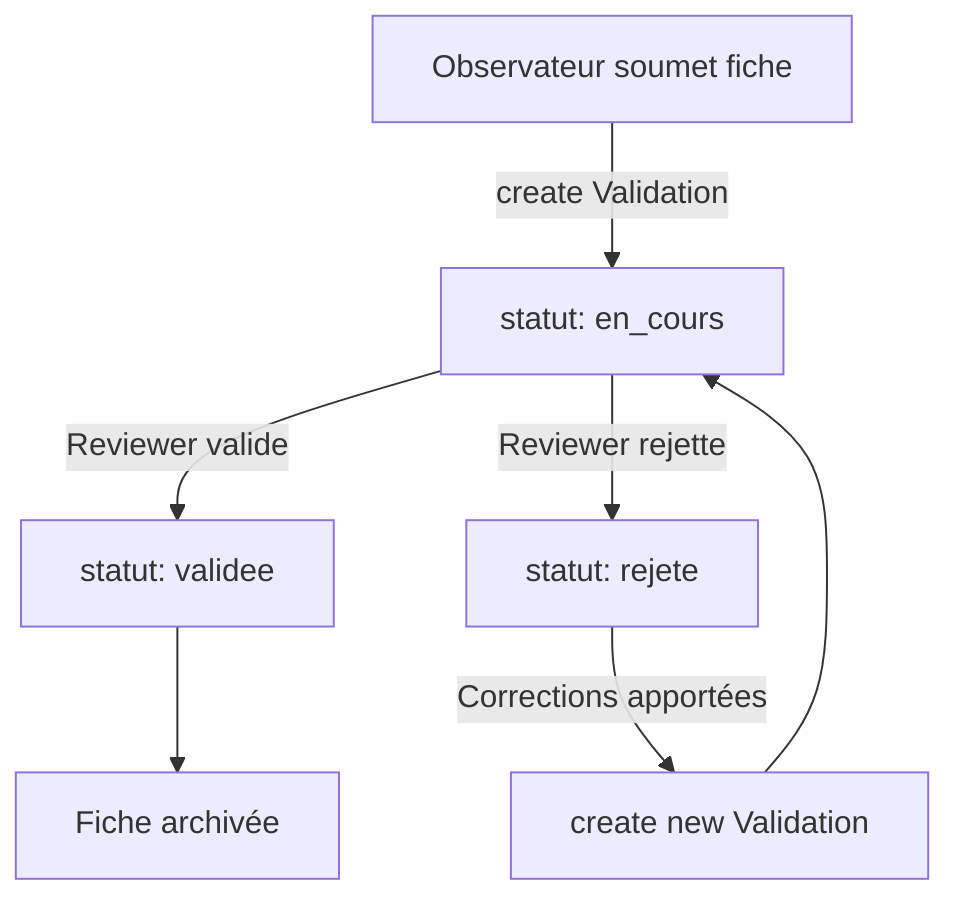

# Domaine : Validation et revue de fiches

## Vue d'ensemble

Le domaine validation gère le processus de **revue par les pairs** des fiches d'observation. Il s'articule autour de deux modèles :
- **`Validation`** : Processus de validation d'une fiche par un reviewer
- **`HistoriqueValidation`** : Historique des changements de statut (audit trail)

**Fichier** : `review/models.py`

---

## Modèle Validation

### Rôle métier

Représente une **demande de validation** d'une fiche par un reviewer (correcteur). Une fiche peut avoir plusieurs validations successives si elle est rejetée puis resoumise.

### Champs

| Champ | Type | Description | Contraintes |
|-------|------|-------------|-------------|
| `fiche` | ForeignKey | Fiche à valider | → `FicheObservation`, CASCADE |
| `reviewer` | ForeignKey | Reviewer assigné | → `Utilisateur`, CASCADE |
| `statut` | CharField(10) | Statut de la validation | Choix: STATUT_VALIDATION_CHOICES |
| `date_modification` | DateTimeField | Date de dernière modification | Auto (auto_now_add) |

### Relations

| Collection | Description |
|------------|-------------|
| `historique` | Historique des changements de statut (HistoriqueValidation.validation) |

### Choix de statuts

```python
# core/constants.py
STATUT_VALIDATION_CHOICES = [
    ('en_cours', 'En cours'),
    ('validee', 'Validée'),
    ('rejete', 'Rejetée'),
]
```

### Index et ordonnancement

```python
class Meta:
    ordering = ['-date_modification']  # Plus récentes en premier
```

**Optimise** : Affichage chronologique des validations.

### Contrainte `limit_choices_to`

```python
reviewer = models.ForeignKey(
    Utilisateur,
    on_delete=models.CASCADE,
    limit_choices_to={'role': 'reviewer'}  # ← Seuls les reviewers
)
```

**Effet** : Dans les formulaires Django admin, seuls les utilisateurs avec `role='reviewer'` sont disponibles.

### Localisation dans le code

**Fichier** : `review/models.py:7-34`

---

## Modèle HistoriqueValidation

### Rôle métier

Enregistre **chaque changement de statut** d'une validation pour traçabilité complète. Créé automatiquement lors du `save()` de `Validation`.

### Champs

| Champ | Type | Description |
|-------|------|-------------|
| `validation` | ForeignKey | Validation parente | → `Validation`, CASCADE |
| `ancien_statut` | CharField(10) | Statut avant modification | STATUT_VALIDATION_CHOICES |
| `nouveau_statut` | CharField(10) | Statut après modification | STATUT_VALIDATION_CHOICES |
| `date_modification` | DateTimeField | Date du changement | Auto (auto_now_add) |
| `modifie_par` | ForeignKey | Utilisateur ayant modifié | → `Utilisateur`, SET_NULL |

### Index et ordonnancement

```python
class Meta:
    ordering = ['-date_modification']  # Plus récents en premier
```

### Localisation dans le code

**Fichier** : `review/models.py:37-48`

---

## Création automatique d'historique

### Méthode `save()` surchargée

```python
def save(self, *args, **kwargs):
    if self.pk:  # ← Si modification (pas création)
        ancienne_instance = Validation.objects.filter(pk=self.pk).first()
        if ancienne_instance and ancienne_instance.statut != self.statut:
            # Créer entrée d'historique
            HistoriqueValidation.objects.create(
                validation=self,
                ancien_statut=ancienne_instance.statut,
                nouveau_statut=self.statut,
                modifie_par=self.reviewer,
            )

    super().save(*args, **kwargs)
```

**Comportement** :
1. Vérifier si c'est une **modification** (pas création) : `if self.pk`
2. Récupérer l'**ancienne version** depuis la BDD
3. Comparer les statuts
4. Si changement → créer `HistoriqueValidation`
5. Sauvegarder la validation

**Résultat** : Historique automatique et transparent pour les développeurs.

---

## Workflow de validation

### Diagramme de transition



### Étapes détaillées

#### 1. Soumission de la fiche

```python
# Observateur soumet sa fiche (statut en_edition → en_cours)
fiche = FicheObservation.objects.get(num_fiche=123)
fiche.etat_correction.statut = 'en_cours'
fiche.etat_correction.save()

# Assigner automatiquement à un reviewer
reviewer = Utilisateur.objects.filter(
    role='reviewer',
    is_active=True
).order_by('?').first()  # Random assignment

# Créer la validation
validation = Validation.objects.create(
    fiche=fiche,
    reviewer=reviewer,
    statut='en_cours'
)

# Notifier le reviewer
Notification.objects.create(
    destinataire=reviewer,
    type_notification='info',
    titre='Nouvelle fiche à valider',
    message=f'Fiche {fiche.num_fiche} de {fiche.observateur.username}',
    lien=f'/review/fiche/{fiche.num_fiche}/'
)
```

#### 2. Reviewer valide la fiche

```python
validation = Validation.objects.get(id=456)

# Changement de statut → crée automatiquement HistoriqueValidation
validation.statut = 'validee'
validation.save()

# Mettre à jour l'état de la fiche
fiche = validation.fiche
fiche.etat_correction.valider(validation.reviewer)

# Notifier l'observateur
Notification.objects.create(
    destinataire=fiche.observateur,
    type_notification='info',
    titre='Fiche validée',
    message=f'Votre fiche {fiche.num_fiche} a été validée par {validation.reviewer.username}',
    lien=f'/observations/fiche/{fiche.num_fiche}/'
)
```

#### 3. Reviewer rejette la fiche

```python
validation = Validation.objects.get(id=456)

# Rejet → crée automatiquement HistoriqueValidation
validation.statut = 'rejete'
validation.save()

# Repasser la fiche en édition
fiche = validation.fiche
fiche.etat_correction.statut = 'en_edition'
fiche.etat_correction.save()

# Créer une remarque expliquant le rejet
Remarque.objects.create(
    fiche=fiche,
    remarque="Localisation imprécise, veuillez affiner les coordonnées GPS"
)

# Notifier l'observateur
Notification.objects.create(
    destinataire=fiche.observateur,
    type_notification='warning',
    titre='Fiche rejetée',
    message=f'Votre fiche {fiche.num_fiche} nécessite des corrections',
    lien=f'/observations/fiche/{fiche.num_fiche}/edit/'
)
```

#### 4. Resoumission après corrections

```python
# Observateur corrige et resubmit
fiche.etat_correction.statut = 'en_cours'
fiche.etat_correction.save()

# Nouvelle validation (peut être assignée au même reviewer)
nouvelle_validation = Validation.objects.create(
    fiche=fiche,
    reviewer=reviewer,
    statut='en_cours'
)

# Historique : la fiche a maintenant 2 validations
nb_validations = fiche.validations.count()
print(f"Tentative de validation #{nb_validations}")
```

---

## Cas d'usage

### Afficher les validations en attente

```python
validations_en_attente = Validation.objects.filter(
    statut='en_cours'
).select_related('fiche', 'fiche__observateur', 'reviewer')

for val in validations_en_attente:
    print(f"Fiche {val.fiche.num_fiche} → Reviewer: {val.reviewer.username}")
    print(f"  Observateur: {val.fiche.observateur.username}")
    print(f"  Complétion: {val.fiche.etat_correction.pourcentage_completion}%")
```

### Fiches validées cette semaine

```python
from datetime import timedelta
from django.utils import timezone

semaine_derniere = timezone.now() - timedelta(days=7)

validations_recentes = Validation.objects.filter(
    statut='validee',
    date_modification__gte=semaine_derniere
).select_related('fiche', 'reviewer')

print(f"{validations_recentes.count()} fiches validées cette semaine")
```

### Taux de rejet par reviewer

```python
from django.db.models import Count, Q

stats = Utilisateur.objects.filter(
    role='reviewer'
).annotate(
    nb_validations=Count('validation'),
    nb_rejets=Count('validation', filter=Q(validation__statut='rejete')),
    nb_validees=Count('validation', filter=Q(validation__statut='validee'))
).values('username', 'nb_validations', 'nb_rejets', 'nb_validees')

for reviewer in stats:
    taux_rejet = (reviewer['nb_rejets'] / reviewer['nb_validations'] * 100
                  if reviewer['nb_validations'] > 0 else 0)
    print(f"{reviewer['username']} : {taux_rejet:.1f}% de rejets")
```

### Historique d'une validation

```python
validation = Validation.objects.get(id=789)

historique = validation.historique.all().select_related('modifie_par')

print(f"Historique de la validation #{validation.id} :")
for entry in historique:
    print(f"  {entry.date_modification} : {entry.ancien_statut} → {entry.nouveau_statut}")
    print(f"    par {entry.modifie_par.username if entry.modifie_par else 'Système'}")

# Exemple de sortie :
# Historique de la validation #789 :
#   2025-10-15 14:30 : en_cours → rejete
#     par reviewer_john
#   2025-10-20 10:15 : rejete → en_cours
#     par reviewer_john
#   2025-10-20 16:45 : en_cours → validee
#     par reviewer_john
```

---

## Requêtes ORM courantes

### Fiches avec plusieurs tentatives de validation

```python
from django.db.models import Count

fiches_multiples = FicheObservation.objects.annotate(
    nb_validations=Count('validations')
).filter(nb_validations__gt=1)

for fiche in fiches_multiples:
    print(f"Fiche {fiche.num_fiche} : {fiche.nb_validations} tentatives")
```

### Validations par fiche (chronologique)

```python
fiche = FicheObservation.objects.get(num_fiche=123)

validations = fiche.validations.all().select_related('reviewer')

for i, val in enumerate(validations, 1):
    print(f"Tentative #{i} : {val.statut} par {val.reviewer.username}")
```

### Charge de travail par reviewer

```python
charge = Validation.objects.filter(
    statut='en_cours'
).values('reviewer__username').annotate(
    nb_fiches=Count('id')
).order_by('-nb_fiches')

for reviewer in charge:
    print(f"{reviewer['reviewer__username']} : {reviewer['nb_fiches']} fiches à valider")
```

### Délai moyen de validation

```python
from django.db.models import F, Avg, ExpressionWrapper
from django.db.models.fields import DurationField

delai = Validation.objects.filter(
    statut='validee'
).annotate(
    duree=ExpressionWrapper(
        F('date_modification') - F('fiche__date_creation'),
        output_field=DurationField()
    )
).aggregate(
    delai_moyen=Avg('duree')
)

print(f"Délai moyen de validation : {delai['delai_moyen']}")
# Exemple : 2 days, 5:30:00
```

---

## Différence avec `EtatCorrection`

### Deux systèmes complémentaires

| Aspect | EtatCorrection | Validation |
|--------|----------------|------------|
| **Scope** | Complétion de la fiche | Revue par les pairs |
| **Statuts** | nouveau, en_edition, en_cours, valide | en_cours, validee, rejete |
| **Cardinalité** | 1:1 avec FicheObservation | 1:N avec FicheObservation |
| **Calcul auto** | Pourcentage de complétude | - |
| **Historique** | - | HistoriqueValidation |

### Synchronisation

```python
# Quand Validation passe à 'validee' → EtatCorrection passe à 'valide'
if validation.statut == 'validee':
    fiche.etat_correction.valider(validation.reviewer)

# Quand Validation passe à 'rejete' → EtatCorrection repasse à 'en_edition'
if validation.statut == 'rejete':
    fiche.etat_correction.statut = 'en_edition'
    fiche.etat_correction.save()
```

**Recommandation** : Implémenter signals Django pour automatiser :
```python
from django.db.models.signals import post_save
from django.dispatch import receiver

@receiver(post_save, sender=Validation)
def sync_etat_correction(sender, instance, **kwargs):
    if instance.statut == 'validee':
        instance.fiche.etat_correction.valider(instance.reviewer)
    elif instance.statut == 'rejete':
        etat = instance.fiche.etat_correction
        etat.statut = 'en_edition'
        etat.save()
```

---

## Points d'attention

### Plusieurs validations par fiche

Une fiche peut avoir **plusieurs validations** (rejet → resoumission).

**Question** : Quelle validation afficher en priorité ?

**Réponse** : La plus récente (`ordering = ['-date_modification']`)

```python
# Dernière validation
derniere_validation = fiche.validations.first()

# Toutes les validations
toutes_validations = fiche.validations.all()
```

### Suppression CASCADE

```python
# Si Validation supprimée → HistoriqueValidation supprimé (CASCADE)
validation.delete()  # Supprime aussi son historique

# Si Utilisateur supprimé → Validation supprimée (CASCADE)
# ⚠️ Perte de traçabilité !
```

**Recommandation** : `on_delete=models.SET_NULL` pour `reviewer` + soft delete

### Historique créé APRÈS le save()

```python
# ATTENTION : l'ordre compte !

# ❌ INCORRECT : historique pas encore créé
validation.statut = 'validee'
validation.save()
historique = validation.historique.first()  # None (pas encore créé)

# ✅ CORRECT : rafraîchir depuis la BDD
validation.statut = 'validee'
validation.save()
validation.refresh_from_db()  # Ou requête séparée
historique = validation.historique.first()  # Présent
```

### Performance : N+1 queries

```python
# ❌ LENT : N+1 queries
for validation in Validation.objects.all():
    print(validation.fiche.num_fiche)        # 1 query
    print(validation.reviewer.username)       # 1 query
    print(validation.historique.count())      # 1 query

# ✅ RAPIDE : select_related + prefetch_related
for validation in Validation.objects.select_related(
    'fiche', 'reviewer'
).prefetch_related('historique'):
    print(validation.fiche.num_fiche)
    print(validation.reviewer.username)
    print(validation.historique.count())
```

---

## Voir aussi

- **[Workflow de correction](workflow-correction.md)** - Modèle `EtatCorrection` complémentaire
- **[Gestion des utilisateurs](utilisateurs.md)** - Rôle `reviewer`
- **[Audit](audit.md)** - Traçabilité complémentaire via `HistoriqueModification`
- **[Notifications](utilisateurs.md#modèle-notification)** - Système de notifications
- **[Diagramme ERD](../diagrammes/erd.md)** - Vue d'ensemble des relations

---

*Dernière mise à jour : 2025-10-20*
