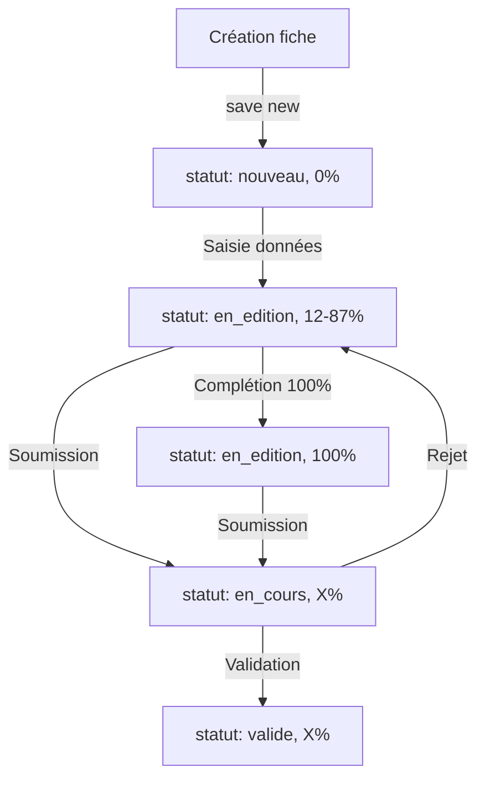

# Domaine : Workflow de correction

## Vue d'ensemble

Le modèle **`EtatCorrection`** gère le cycle de vie d'une fiche d'observation, du statut "nouveau" à "validée". Il implémente un **algorithme de calcul automatique de la complétude** basé sur 8 critères métier.

**Fichier** : `observations/models.py:265-370`

---

## Modèle EtatCorrection

### Rôle métier

Suit l'état d'avancement d'une fiche d'observation à travers 4 statuts :
1. **nouveau** : Fiche vierge créée
2. **en_edition** : Observateur saisit les données
3. **en_cours** : Soumise pour correction/validation
4. **valide** : Validée par un correcteur

**Relation** : OneToOne avec `FicheObservation` (créé automatiquement à la création de la fiche)

### Champs

| Champ | Type | Description | Défaut |
|-------|------|-------------|--------|
| `fiche` | OneToOne | Fiche parente | → `FicheObservation`, CASCADE |
| `statut` | CharField(20) | Statut actuel | 'nouveau' |
| `pourcentage_completion` | IntegerField | Pourcentage de complétion (0-100%) | 0 |
| `date_derniere_modification` | DateTimeField | Date de dernière modification | Auto (auto_now) |
| `validee_par` | ForeignKey | Correcteur ayant validé | → `Utilisateur`, SET_NULL |
| `date_validation` | DateTimeField | Date de validation | NULL |

### Choix de statuts

```python
STATUTS_CHOICES = [
    ('nouveau', 'Nouvelle fiche'),
    ('en_edition', "En cours d'édition"),
    ('en_cours', 'En cours de correction'),
    ('valide', 'Validée'),
]
```

### Contrainte CHECK

```python
models.CheckConstraint(
    name="etat_correction_pourcentage_valide",
    check=Q(pourcentage_completion__gte=0) & Q(pourcentage_completion__lte=100),
)
```

**Garantit** : `0 ≤ pourcentage_completion ≤ 100`

### Localisation dans le code

**Fichier** : `observations/models.py:265-370`

---

## Algorithme de calcul de complétude

### Vue d'ensemble

L'algorithme évalue **8 critères métier** pour calculer le pourcentage de complétion :

| Critère | Points | Description |
|---------|--------|-------------|
| 1. Observateur | 1 | Observateur renseigné |
| 2. Espèce | 1 | Espèce renseignée |
| 3. Localisation | 1 | Commune et département renseignés |
| 4. Observation datée | 1 | Au moins une observation avec date |
| 5. Données d'œufs | 1 | Nombre d'œufs pondus > 0 |
| 6. Détails du nid | 1 | Détails du nid non vides |
| 7. Hauteur du nid | 1 | Hauteur du nid > 0 |
| 8. Image associée | 1 | Chemin image renseigné |

**Score** : `pourcentage = (score / 8) * 100`

**Exemple** :
- 8/8 critères → 100%
- 5/8 critères → 62%
- 0/8 critères → 0%

### Code complet

```python
def calculer_pourcentage_completion(self):
    """Calcule automatiquement le pourcentage de completion basé sur les données de la fiche"""
    score = 0
    total_criteres = 8

    # Critère 1: Observateur renseigné (1 point)
    if self.fiche.observateur:
        score += 1

    # Critère 2: Espèce renseignée (1 point)
    if self.fiche.espece:
        score += 1

    # Critère 3: Localisation complète (1 point)
    if hasattr(self.fiche, 'localisation'):
        loc = self.fiche.localisation
        if (loc.commune and loc.commune != 'Non spécifiée' and
            loc.departement and loc.departement != '00'):
            score += 1

    # Critère 4: Au moins une observation avec date (1 point)
    if self.fiche.observations.exists():
        score += 1

    # Critère 5: Résumé avec données d'œufs (1 point)
    if hasattr(self.fiche, 'resume'):
        resume = self.fiche.resume
        if resume.nombre_oeufs_pondus is not None and resume.nombre_oeufs_pondus > 0:
            score += 1

    # Critère 6: Détails du nid renseignés (1 point)
    if hasattr(self.fiche, 'nid'):
        nid = self.fiche.nid
        if nid.details_nid and nid.details_nid != 'Aucun détail':
            score += 1

    # Critère 7: Hauteur du nid renseignée (1 point)
    if hasattr(self.fiche, 'nid'):
        nid = self.fiche.nid
        if nid.hauteur_nid is not None and nid.hauteur_nid > 0:
            score += 1

    # Critère 8: Image associée (1 point)
    if self.fiche.chemin_image:
        score += 1

    pourcentage = int((score / total_criteres) * 100)

    # Mettre à jour le statut automatiquement
    if pourcentage > 0 and self.statut == 'nouveau':
        self.statut = 'en_edition'

    self.pourcentage_completion = pourcentage
    return pourcentage
```

---

## Workflow complet

### Diagramme de transition



### Étapes détaillées

#### 1. Création (statut `nouveau`)

```python
fiche = FicheObservation.objects.create(
    observateur=user,
    espece=espece,
    annee=2025
)

# EtatCorrection créé automatiquement
etat = fiche.etat_correction
print(etat.statut)                    # 'nouveau'
print(etat.pourcentage_completion)    # 0
```

**Score initial** : 2/8 (observateur + espèce) = 25%

#### 2. Édition (statut `en_edition`)

```python
# Ajout de données
fiche.localisation.commune = 'Grenoble'
fiche.localisation.departement = '38'
fiche.localisation.save()

# Mise à jour automatique du pourcentage
fiche.mettre_a_jour_etat_correction()

etat = fiche.etat_correction
print(etat.statut)                    # 'en_edition' (auto-changé si >0%)
print(etat.pourcentage_completion)    # 37% (3/8 critères)
```

**Transition automatique** : `nouveau` → `en_edition` dès que `pourcentage > 0`

#### 3. Complétion progressive

```python
# Ajout d'une observation
Observation.objects.create(
    fiche=fiche,
    date_observation=timezone.now(),
    nombre_oeufs=4
)

# Ajout de données de nidification
fiche.resume.nombre_oeufs_pondus = 4
fiche.resume.save()

fiche.nid.hauteur_nid = 150
fiche.nid.details_nid = 'Nid dans un nichoir à 1,5m du sol'
fiche.nid.save()

# Mise à jour
fiche.mettre_a_jour_etat_correction()
print(etat.pourcentage_completion)    # 75% (6/8 critères)
```

#### 4. Soumission (statut `en_cours`)

```python
# Observateur soumet la fiche pour correction
etat = fiche.etat_correction
etat.statut = 'en_cours'
etat.save()

# Notification aux correcteurs (exemple)
correcteurs = Utilisateur.objects.filter(role='correcteur')
for correcteur in correcteurs:
    Notification.objects.create(
        destinataire=correcteur,
        type_notification='info',
        titre='Nouvelle fiche à corriger',
        message=f'Fiche {fiche.num_fiche} soumise par {fiche.observateur.username}',
        lien=f'/observations/fiche/{fiche.num_fiche}/'
    )
```

#### 5. Validation (statut `valide`)

```python
def valider_fiche(fiche, correcteur):
    """Valide une fiche"""
    etat = fiche.etat_correction
    etat.valider(correcteur)

# Usage
valider_fiche(fiche, correcteur_user)

etat = fiche.etat_correction
print(etat.statut)           # 'valide'
print(etat.validee_par)      # correcteur_user
print(etat.date_validation)  # 2025-10-20 14:30:00
```

**Méthode `valider()`** :
```python
def valider(self, utilisateur):
    """Marque la fiche comme validée par un utilisateur"""
    self.statut = 'valide'
    self.validee_par = utilisateur
    self.date_validation = timezone.now()
    self.save()
```

---

## Calcul automatique lors du save()

### Méthode `save()` surchargée

```python
def save(self, *args, **kwargs):
    # Calculer automatiquement le pourcentage avant la sauvegarde
    if not kwargs.pop('skip_auto_calculation', False):
        self.calculer_pourcentage_completion()
    super().save(*args, **kwargs)
```

**Comportement** :
- ✅ Par défaut : calcul automatique à chaque `save()`
- ⚠️ Option `skip_auto_calculation=True` pour désactiver

**Exemples** :
```python
# Calcul automatique
etat.save()  # Recalcule le pourcentage

# Désactiver le calcul (rare)
etat.pourcentage_completion = 50  # Forcer une valeur
etat.save(skip_auto_calculation=True)
```

---

## Cas d'usage

### Afficher les fiches en cours d'édition

```python
fiches_edition = FicheObservation.objects.filter(
    etat_correction__statut='en_edition'
).select_related('etat_correction', 'observateur')

for fiche in fiches_edition:
    print(f"Fiche {fiche.num_fiche} : {fiche.etat_correction.pourcentage_completion}%")
```

### Fiches prêtes à soumettre (≥75%)

```python
fiches_pretes = FicheObservation.objects.filter(
    etat_correction__statut='en_edition',
    etat_correction__pourcentage_completion__gte=75
).select_related('etat_correction')

print(f"{fiches_pretes.count()} fiches prêtes à soumettre")
```

### Fiches validées par un correcteur

```python
fiches_validees = FicheObservation.objects.filter(
    etat_correction__statut='valide',
    etat_correction__validee_par=correcteur
).select_related('etat_correction')

for fiche in fiches_validees:
    print(f"Fiche {fiche.num_fiche} validée le {fiche.etat_correction.date_validation}")
```

### Statistiques de complétion

```python
from django.db.models import Avg, Count, Min, Max

stats = EtatCorrection.objects.aggregate(
    completion_moyenne=Avg('pourcentage_completion'),
    completion_min=Min('pourcentage_completion'),
    completion_max=Max('pourcentage_completion'),
    nb_fiches_completes=Count('id', filter=Q(pourcentage_completion=100))
)

print(f"Complétion moyenne : {stats['completion_moyenne']:.1f}%")
print(f"Fiches 100% complètes : {stats['nb_fiches_completes']}")
```

---

## Requêtes ORM courantes

### Fiches par statut

```python
# Nouvelles fiches
nouvelles = FicheObservation.objects.filter(
    etat_correction__statut='nouveau'
).count()

# Fiches en cours de correction
en_cours = FicheObservation.objects.filter(
    etat_correction__statut='en_cours'
).select_related('etat_correction', 'observateur')

# Fiches validées
validees = FicheObservation.objects.filter(
    etat_correction__statut='valide'
).count()
```

### Fiches avec faible complétion (<50%)

```python
fiches_incompletes = FicheObservation.objects.filter(
    etat_correction__pourcentage_completion__lt=50
).select_related('etat_correction', 'observateur')

for fiche in fiches_incompletes:
    print(f"Fiche {fiche.num_fiche} ({fiche.etat_correction.pourcentage_completion}%)")
    print(f"  → Observateur : {fiche.observateur.username}")
```

### Taux de validation par correcteur

```python
from django.db.models import Count

stats_correcteurs = Utilisateur.objects.filter(
    role='correcteur'
).annotate(
    nb_validations=Count('validations', filter=Q(validations__statut='valide'))
).order_by('-nb_validations')

for correcteur in stats_correcteurs:
    print(f"{correcteur.username} : {correcteur.nb_validations} validations")
```

### Progression temporelle

```python
from django.db.models.functions import TruncDate

progression = EtatCorrection.objects.values(
    date=TruncDate('date_derniere_modification')
).annotate(
    nb_fiches=Count('id'),
    completion_moyenne=Avg('pourcentage_completion')
).order_by('date')

for jour in progression:
    print(f"{jour['date']} : {jour['nb_fiches']} fiches, {jour['completion_moyenne']:.1f}% moyen")
```

---

## Points d'attention

### Calcul automatique : Performance

Le calcul de complétude implique **plusieurs requêtes** (localisation, nid, resume, observations).

**Impact** :
- ✅ Fréquent : 1 fiche modifiée → 1 recalcul (acceptable)
- ⚠️ Import massif : 1000 fiches → 1000 recalculs (lent)

**Optimisation pour import massif** :
```python
from django.db import transaction

with transaction.atomic():
    for data in import_data:
        fiche = FicheObservation.objects.create(...)

        # Remplir les données
        fiche.localisation.commune = data['commune']
        fiche.localisation.save()

        # ... autres données ...

        # Recalcul final UNIQUE
        fiche.mettre_a_jour_etat_correction()
```

### Transition `nouveau` → `en_edition`

La transition est **automatique** dès que `pourcentage > 0`.

**Conséquence** : Impossible de rester en statut `nouveau` avec des données.

**Alternative** : Désactiver la transition automatique si besoin :
```python
# Dans calculer_pourcentage_completion()
# Commenter ces lignes :
# if pourcentage > 0 and self.statut == 'nouveau':
#     self.statut = 'en_edition'
```

### Critères pondérés

Actuellement, tous les critères ont le **même poids** (1 point).

**Amélioration future** : Critères pondérés
```python
# Exemple de pondération
score = 0
total = 100  # Total en points

score += 20 if self.fiche.observateur else 0         # 20%
score += 20 if self.fiche.espece else 0              # 20%
score += 15 if localisation_complete else 0          # 15%
score += 15 if observations_exist else 0             # 15%
score += 10 if oeufs_pondus else 0                   # 10%
score += 10 if details_nid else 0                    # 10%
score += 5 if hauteur_nid else 0                     # 5%
score += 5 if chemin_image else 0                    # 5%

pourcentage = score  # Déjà en %
```

### Statut `valide` immuable ?

Actuellement, une fiche validée peut être **rééditée** et son pourcentage peut changer.

**Question** : Faut-il **geler** les fiches validées ?

**Option 1** : Blocage strict
```python
def save(self, *args, **kwargs):
    if self.statut == 'valide' and self.pk:
        raise ValidationError("Impossible de modifier une fiche validée")
    super().save(*args, **kwargs)
```

**Option 2** : Invalidation automatique
```python
def save(self, *args, **kwargs):
    if self.statut == 'valide' and self.pk:
        # Si modifiée → repasser en_edition
        self.statut = 'en_edition'
        self.validee_par = None
        self.date_validation = None
    super().save(*args, **kwargs)
```

---

## Voir aussi

- **[Fiches d'observation](observations.md)** - Modèle `FicheObservation` parent
- **[Données de nidification](nidification.md)** - Critère 5 (nombre d'œufs)
- **[Localisation](localisation.md)** - Critère 3 (commune/département)
- **[Audit](audit.md)** - Traçabilité des changements de statut
- **[Diagramme ERD](../diagrammes/erd.md)** - Vue d'ensemble des relations

---

*Dernière mise à jour : 2025-10-20*
