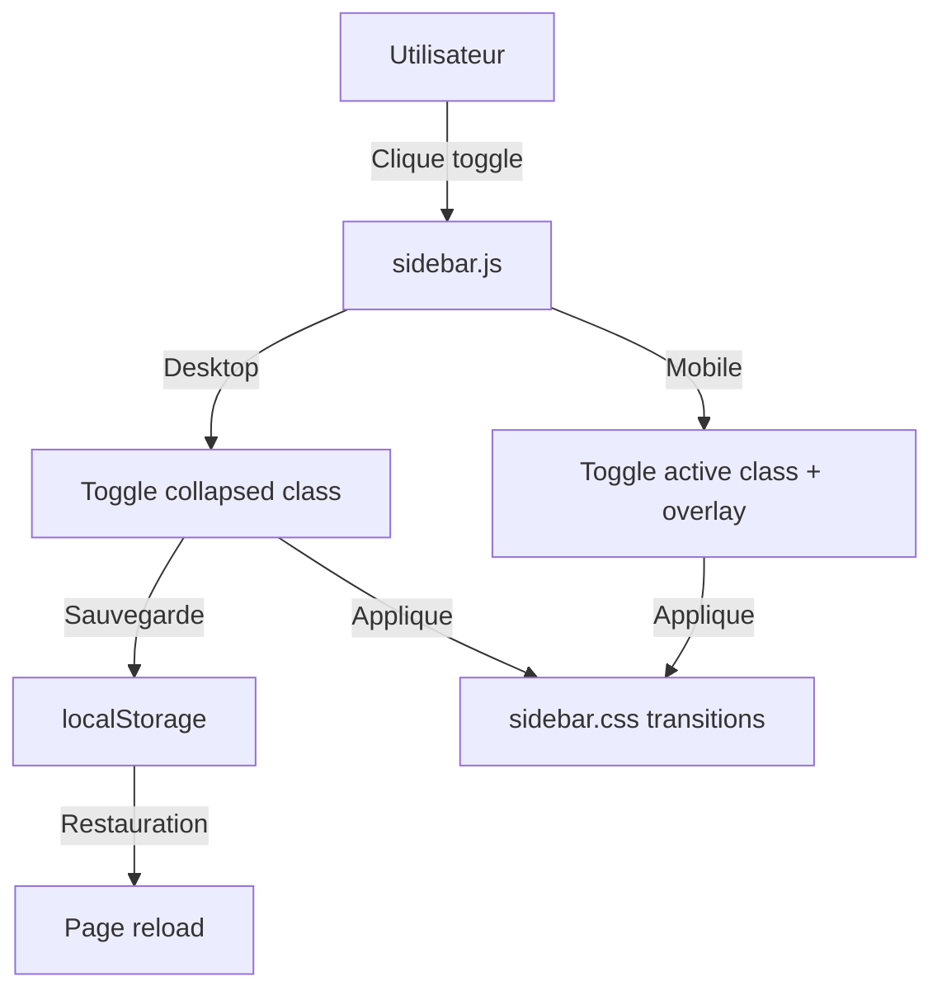

# Guide de la Sidebar - Menu de navigation latéral

**Version** : 1.0
**Date** : Novembre 2025
**Auteur** : Équipe de développement

---

## 📋 Table des matières

[TOC]

---

## Introduction

La sidebar (barre latérale de navigation) est un composant clé de l'interface utilisateur de l'application **Observations Nids**. Elle remplace l'ancien menu horizontal par une navigation verticale moderne, collapsible et responsive.

### Objectifs

- **Améliorer l'ergonomie** : Navigation accessible depuis n'importe quelle page
- **Optimiser l'espace** : Menu collapsible pour maximiser l'espace de contenu
- **Responsive** : Adaptation automatique mobile/tablette/desktop
- **Persistance** : Mémorisation de l'état (collapsed/expanded)

### Captures d'écran

**Mode desktop (étendu)**
```
┌──────────────────────────────────────────┐
│ [🐦 Suivi des nids]     [User] [Logout] │ ← Navbar supérieure
├───────────┬──────────────────────────────┤
│           │                              │
│ 🏠 Accueil│  Contenu principal          │
│           │                              │
│ Observ... │  (Fiches, tableaux, etc.)   │
│ ➕ Nouv.  │                              │
│ 📋 Liste  │                              │
│           │                              │
│ Transcr.. │                              │
│ 📸 Images │                              │
│           │                              │
└───────────┴──────────────────────────────┘
    260px          Largeur variable
```

**Mode desktop (réduit)**
```
┌──────────────────────────────────────────┐
│ [🐦 Suivi des nids]     [User] [Logout] │
├───┬──────────────────────────────────────┤
│   │                                      │
│ 🏠│  Contenu principal élargi           │
│ ➕│                                      │
│ 📋│  (Plus d'espace disponible)         │
│   │                                      │
└───┴──────────────────────────────────────┘
 60px        Largeur maximale
```

**Mode mobile**
```
┌──────────────────────────┐
│ ☰ [🐦 Suivi] [User] [X] │
├──────────────────────────┤
│                          │
│  Contenu plein écran     │
│                          │
│  (Sidebar masquée)       │
│                          │
└──────────────────────────┘

Clic sur ☰ → Sidebar overlay
```

---

## Architecture

### Vue d'ensemble

La sidebar utilise une architecture en 3 composants :

1. **CSS** (`sidebar.css`) : Styles et animations
2. **JavaScript** (`sidebar.js`) : Logique de comportement
3. **Template** (`base.html`) : Structure HTML

### Diagramme de flux



### Variables CSS

Le système utilise des **variables CSS personnalisables** :

```css
:root {
    --sidebar-width: 260px;              /* Largeur étendue */
    --sidebar-collapsed-width: 60px;     /* Largeur réduite */
    --navbar-height: 56px;                /* Hauteur navbar top */
    --transition-speed: 0.3s;             /* Vitesse animations */
}
```

---

## Fonctionnalités

### 1. Mode Collapsible (Desktop)

**État étendu (par défaut)**
- Largeur : 260px
- Affiche les icônes + texte
- Sections organisées avec titres

**État réduit**
- Largeur : 60px
- Affiche uniquement les icônes
- Tooltips au survol pour identifier les liens

**Persistance**
- L'état est sauvegardé dans `localStorage`
- Clé : `sidebarCollapsed` (valeur : `"true"` ou `"false"`)
- Restauré automatiquement au chargement de la page

### 2. Mode Mobile (< 768px)

**Comportement**
- Sidebar cachée par défaut (hors écran à gauche)
- Bouton hamburger pour afficher/masquer
- Overlay semi-transparent lors de l'ouverture
- Fermeture automatique au clic sur un lien

**Gestion des événements**
- Clic sur overlay → ferme la sidebar
- Touche `Escape` → ferme la sidebar
- Clic sur lien → ferme la sidebar

### 3. Mise en surbrillance active

**Détection automatique**
- Compare `window.location.pathname` avec les URLs des liens
- Ajoute la classe `.active` au lien correspondant
- Gestion des sous-chemins (ex: `/observations/123/` active "Observations")

**Styles**
```css
.nav-link.active {
    background-color: #007bff;
    color: white;
    border-left: 3px solid white;
}
```

### 4. Badges de notification

**Exemple : Demandes admin en attente**

```django
<a class="nav-link" href="">
    <i class="fas fa-users"></i>
    <span class="link-text">Utilisateurs</span>
    
    <span class="sidebar-badge">{{ demandes_en_attente }}</span>
    
</a>
```

Le badge disparaît automatiquement en mode réduit.

### 5. Animations

**Transitions fluides**
- Ouverture/fermeture : 0.3s ease
- Rotation du bouton toggle : 180°
- Animation d'apparition des éléments (slideIn)

**Délais progressifs**
```css
.nav-item:nth-child(1) { animation-delay: 0.05s; }
.nav-item:nth-child(2) { animation-delay: 0.1s; }
.nav-item:nth-child(3) { animation-delay: 0.15s; }
```

---

## Structure des fichiers

### Arborescence

```
observations_nids/
├── observations/
│   └── static/
│       └── Observations/
│           ├── css/
│           │   ├── sidebar.css        ← Styles sidebar
│           │   └── styles.css          (adapté pour sidebar)
│           └── js/
│               └── sidebar.js          ← Logique sidebar
└── templates/
    └── base.html                       ← Structure HTML
```

### sidebar.css (310 lignes)

**Sections principales**

1. **Variables CSS** (lignes 6-10)
2. **Layout principal** (lignes 12-30)
3. **Styles sidebar** (lignes 32-120)
4. **Liens de navigation** (lignes 60-92)
5. **Titres de section** (lignes 94-110)
6. **Contenu principal** (lignes 112-135)
7. **Bouton toggle** (lignes 137-175)
8. **Responsive** (lignes 177-240)
9. **Animations** (lignes 260-310)

### sidebar.js (150 lignes)

**Fonctions principales**

```javascript
// Initialisation
document.addEventListener('DOMContentLoaded', function() {...})

// Toggle sidebar
function toggleSidebar() {...}

// Sauvegarde état
function saveSidebarState() {...}

// Restauration état
function restoreSidebarState() {...}

// Mise à jour lien actif
function updateActiveLink() {...}

// Gestion responsive
function handleResize() {...}

// API publique
window.SidebarAPI = {
    toggle: toggleSidebar,
    collapse: function() {...},
    expand: function() {...},
    isCollapsed: function() {...}
}
```

### base.html

**Structure HTML**

```html
<body>
    <!-- Navbar supérieure fixe -->
    <nav class="navbar-top">...</nav>

    <!-- Wrapper principal -->
    <div class="wrapper">
        <!-- Sidebar -->
        <nav id="sidebar">
            <ul class="nav flex-column">
                <!-- Liens de navigation -->
            </ul>
        </nav>

        <!-- Bouton toggle -->
        <button class="sidebar-toggle">...</button>

        <!-- Overlay mobile -->
        <div class="sidebar-overlay"></div>

        <!-- Contenu principal -->
        <div id="content">
            <div class="content-inner">
                
            </div>
        </div>
    </div>
</body>
```

---

## Utilisation

### Ajouter un nouveau lien

**1. Dans `base.html`**

```django
<li class="nav-item">
    <a class="nav-link" href="" data-title="Description">
        <i class="fas fa-icon-name"></i>
        <span class="link-text">Mon lien</span>
    </a>
</li>
```

**Attributs importants**
- `data-title` : Texte du tooltip en mode réduit
- `class="link-text"` : Masqué automatiquement en mode réduit
- Icône FontAwesome dans `<i>`

**2. Avec permissions conditionnelles**

```django

<li class="nav-item">
    <a class="nav-link" href="">
        <i class="fas fa-shield-alt"></i>
        <span class="link-text">Admin uniquement</span>
    </a>
</li>

```

### Ajouter une section

**Avec séparateur visuel**

```django
<li class="nav-item">
    <div class="sidebar-divider"></div>
    <h6 class="sidebar-heading">Ma nouvelle section</h6>
</li>
```

### Ajouter un badge de notification

```django
<a class="nav-link" href="">
    <i class="fas fa-bell"></i>
    <span class="link-text">Notifications</span>
    
    <span class="sidebar-badge">{{ notifications_count }}</span>
    
</a>
```

### Contrôle programmatique (JavaScript)

```javascript
// Réduire la sidebar
window.SidebarAPI.collapse();

// Étendre la sidebar
window.SidebarAPI.expand();

// Toggle
window.SidebarAPI.toggle();

// Vérifier l'état
if (window.SidebarAPI.isCollapsed()) {
    console.log('Sidebar est réduite');
}
```

---

## Personnalisation

### Changer les couleurs

**1. Modifier `sidebar.css`**

```css
/* Couleur de fond sidebar */
#sidebar {
    background: #2c3e50;  /* Bleu foncé au lieu de gris */
}

/* Couleur liens */
#sidebar .nav-link {
    color: #ecf0f1;
}

/* Couleur lien actif */
#sidebar .nav-link.active {
    background-color: #e74c3c;  /* Rouge au lieu de bleu */
}

/* Couleur au survol */
#sidebar .nav-link:hover {
    background-color: #34495e;
}
```

### Changer les dimensions

**1. Modifier les variables CSS**

```css
:root {
    --sidebar-width: 300px;           /* Plus large */
    --sidebar-collapsed-width: 80px;  /* Moins réduite */
    --navbar-height: 64px;            /* Navbar plus haute */
}
```

### Changer la vitesse d'animation

```css
:root {
    --transition-speed: 0.5s;  /* Plus lent (défaut: 0.3s) */
}
```

### Changer les icônes

**Utiliser FontAwesome 6.0**

```django
<!-- Avant -->
<i class="fas fa-home"></i>

<!-- Après (icône différente) -->
<i class="fas fa-house-user"></i>
```

[Liste complète des icônes](https://fontawesome.com/icons)

### Ajouter des sous-menus (dropdown)

**HTML**

```django
<li class="nav-item">
    <a class="nav-link" data-toggle="collapse" href="#submenu1">
        <i class="fas fa-cog"></i>
        <span class="link-text">Paramètres</span>
        <i class="fas fa-chevron-down ms-auto"></i>
    </a>
    <div class="collapse" id="submenu1">
        <ul class="nav flex-column ms-3">
            <li class="nav-item">
                <a class="nav-link" href="#">Sous-menu 1</a>
            </li>
            <li class="nav-item">
                <a class="nav-link" href="#">Sous-menu 2</a>
            </li>
        </ul>
    </div>
</li>
```

**CSS supplémentaire**

```css
.collapse .nav-link {
    font-size: 14px;
    padding: 8px 20px;
}
```

---

## Responsive Design

### Breakpoints

| Résolution | Comportement | Largeur sidebar | Détails |
|------------|-------------|-----------------|---------|
| **> 1200px** | Desktop complet | 260px / 60px | Collapsible, tooltips |
| **769-1200px** | Tablette | 220px / 60px | Collapsible, font réduite |
| **< 768px** | Mobile | Cachée | Hamburger menu + overlay |

### Media queries utilisées

```css
/* Tablettes */
@media (max-width: 1024px) {
    :root {
        --sidebar-width: 220px;
    }
    #sidebar .nav-link {
        font-size: 14px;
    }
}

/* Mobile */
@media (max-width: 768px) {
    #sidebar {
        margin-left: calc(-1 * var(--sidebar-width));
    }
    #sidebar.active {
        margin-left: 0;
    }
    #content {
        margin-left: 0;
    }
}
```

### Test responsive

**Chrome DevTools**
1. `F12` → Toggle device toolbar (`Ctrl+Shift+M`)
2. Tester les résolutions suivantes :
   - iPhone SE (375px)
   - iPad (768px)
   - Desktop (1920px)

**Points à vérifier**
- ✅ Sidebar cachée sur mobile
- ✅ Overlay visible au clic
- ✅ Bouton toggle repositionné
- ✅ Contenu prend toute la largeur
- ✅ Tableaux responsive (fiches observation)

---

## Maintenance

### Vérifications régulières

**1. Compatibilité navigateurs**

Tester sur :
- ✅ Chrome (dernière version)
- ✅ Firefox (dernière version)
- ✅ Safari (macOS/iOS)
- ✅ Edge (Chromium)

**2. Performance**

```javascript
// Mesurer le temps de toggle
console.time('sidebar-toggle');
SidebarAPI.toggle();
console.timeEnd('sidebar-toggle');
// Doit être < 50ms
```

**3. localStorage**

Vérifier que la persistance fonctionne :
```javascript
// DevTools Console
localStorage.getItem('sidebarCollapsed');
// → "true" ou "false"
```

### Debugging

**Activer les logs**

Modifier `sidebar.js` :

```javascript
const DEBUG = true;  // En haut du fichier

function toggleSidebar() {
    if (DEBUG) console.log('Toggle sidebar called');
    // ...
}
```

**Vérifier les classes CSS**

```javascript
// DevTools Console
document.getElementById('sidebar').classList;
// → DOMTokenList ["collapsed"] (ou vide)

document.getElementById('content').classList;
// → DOMTokenList ["expanded"] (ou vide)
```

### Mises à jour FontAwesome

**Version actuelle** : 6.0.0

**Mise à jour** :
1. Modifier `base.html` :
```html
<!-- Ancienne -->
<link rel="stylesheet" href="https://cdnjs.cloudflare.com/ajax/libs/font-awesome/6.0.0/css/all.min.css">

<!-- Nouvelle -->
<link rel="stylesheet" href="https://cdnjs.cloudflare.com/ajax/libs/font-awesome/6.5.0/css/all.min.css">
```

2. Vérifier les icônes (certaines peuvent changer)

---

## Troubleshooting

### Problème : La sidebar ne s'affiche pas

**Causes possibles**
1. Fichiers CSS/JS non chargés
2. Erreur JavaScript

**Solutions**

```javascript
// 1. Vérifier dans DevTools Console
// Doit afficher : Object {toggle: ƒ, collapse: ƒ, expand: ƒ, ...}
console.log(window.SidebarAPI);

// 2. Vérifier les fichiers chargés (Network tab)
// sidebar.css → 200 OK
// sidebar.js → 200 OK
```

### Problème : Le toggle ne fonctionne pas

**Diagnostic**

```javascript
// DevTools Console
document.querySelector('.sidebar-toggle').addEventListener('click', function() {
    console.log('Click détecté !');
});
```

**Solution** : Vérifier que `sidebar.js` est chargé **après** le DOM

```html
<!-- Ordre correct dans base.html -->
<script src=""></script>
<script src=""></script>
<script src=""></script>
```

### Problème : L'état n'est pas mémorisé

**Cause** : localStorage bloqué ou désactivé

**Solution**

```javascript
// Tester localStorage
try {
    localStorage.setItem('test', 'value');
    localStorage.removeItem('test');
    console.log('localStorage OK');
} catch (e) {
    console.error('localStorage bloqué:', e);
}
```

### Problème : Tooltips ne s'affichent pas

**Vérifier** :
1. L'attribut `data-title` est présent
2. La sidebar est en mode `collapsed`
3. Le CSS de tooltip est correct

```css
/* Vérifier dans sidebar.css */
#sidebar.collapsed .nav-link:hover::after {
    content: attr(data-title);
    /* ... */
}
```

### Problème : Lien actif non mis en surbrillance

**Cause** : URL ne correspond pas exactement

**Solution** : Vérifier la logique dans `updateActiveLink()` :

```javascript
console.log('Current path:', window.location.pathname);
document.querySelectorAll('.nav-link').forEach(link => {
    console.log('Link path:', new URL(link.href).pathname);
});
```

### Problème : Overlay ne disparaît pas (mobile)

**Solution** : Vérifier que l'événement est attaché

```javascript
// Dans sidebar.js
if (overlay) {
    overlay.addEventListener('click', closeSidebarMobile);
    console.log('Overlay listener attaché');
}
```

---

## Bonnes pratiques

### 1. Accessibilité (a11y)

**Attributs ARIA recommandés**

```html
<nav id="sidebar" role="navigation" aria-label="Menu principal">
    <ul class="nav flex-column" role="menu">
        <li class="nav-item" role="none">
            <a class="nav-link" href="..." role="menuitem">
                ...
            </a>
        </li>
    </ul>
</nav>

<button class="sidebar-toggle"
        aria-label="Toggle sidebar"
        aria-expanded="true">
    ...
</button>
```

**Navigation au clavier**
- `Tab` : Parcourir les liens
- `Enter` : Activer un lien
- `Escape` : Fermer (mobile)

### 2. Performance

**Éviter les reflows**
- Utiliser `transform` au lieu de `width` pour les animations
- Utiliser `will-change` pour les transitions fréquentes

```css
#sidebar {
    will-change: transform;
    transform: translateX(0);
}

#sidebar.collapsed {
    transform: translateX(-200px);
}
```

### 3. SEO

La sidebar n'impacte pas le SEO car elle contient des liens de navigation déjà présents dans l'application.

**Bonnes pratiques**
- ✅ Utiliser des `<a>` réels (pas de JavaScript seul)
- ✅ Attributs `href` valides
- ✅ Texte descriptif (pas seulement des icônes)

### 4. Tests

**Tests manuels recommandés**
1. ✅ Toggle desktop (collapse/expand)
2. ✅ Persistance après refresh
3. ✅ Mobile overlay + fermeture
4. ✅ Lien actif sur chaque page
5. ✅ Badges de notification
6. ✅ Tooltips en mode réduit

**Tests automatisés (optionnel)**

```python
# tests/test_sidebar.py (Selenium)
from selenium.webdriver.common.by import By

def test_sidebar_toggle(selenium):
    selenium.get('http://localhost:8000')
    toggle_btn = selenium.find_element(By.CLASS_NAME, 'sidebar-toggle')
    sidebar = selenium.find_element(By.ID, 'sidebar')

    # Vérifier état initial
    assert 'collapsed' not in sidebar.get_attribute('class')

    # Cliquer
    toggle_btn.click()

    # Vérifier état après toggle
    assert 'collapsed' in sidebar.get_attribute('class')
```

---

## Références

### Documentation externe

- [Bootstrap 4 Navbar](https://getbootstrap.com/docs/4.6/components/navbar/)
- [FontAwesome Icons](https://fontawesome.com/icons)
- [CSS Variables](https://developer.mozilla.org/en-US/docs/Web/CSS/Using_CSS_custom_properties)
- [localStorage API](https://developer.mozilla.org/en-US/docs/Web/API/Window/localStorage)

### Fichiers du projet

- `templates/base.html` : Structure HTML de la sidebar
- `observations/static/Observations/css/sidebar.css` : Styles
- `observations/static/Observations/js/sidebar.js` : Logique JavaScript
- `observations/static/Observations/css/styles.css` : Styles généraux (adaptés)

### Commits associés

```bash
git log --oneline --grep="sidebar"
# 896ecd7 - Ajout d'une sidebar latérale gauche collapsible
```

---

## Changelog

### Version 1.0 (Novembre 2025)

**Ajouté**
- ✅ Sidebar collapsible avec transitions CSS
- ✅ Mode responsive (desktop/tablette/mobile)
- ✅ Persistance de l'état via localStorage
- ✅ Mise en surbrillance du lien actif
- ✅ Badges de notification
- ✅ Tooltips en mode réduit
- ✅ Overlay mobile avec fermeture automatique
- ✅ Animations d'apparition progressive
- ✅ API JavaScript publique (SidebarAPI)

**Adapté**
- Contenu principal : max-width 1000px → 1400px
- Templates : ancien header → nouvelle navbar top
- Responsive : ajout breakpoints pour tableaux

---

## Support

**Questions ?** Créer un ticket via le système helpdesk :
```

```

**Problème technique ?** Contacter l'équipe de développement.

---

**Dernière mise à jour** : Novembre 2025
**Mainteneur** : Équipe de développement Observations Nids
