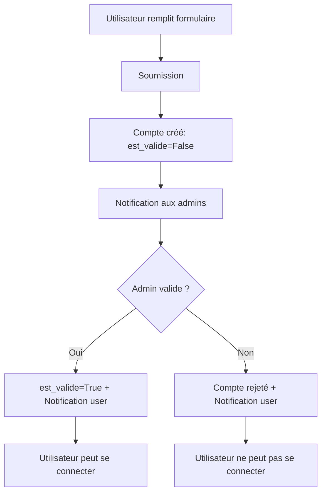

# Gestion des Utilisateurs et Transferts entre Installations

**Dernière mise à jour** : 26 décembre 2025
**Objectif** : Documentation consolidée pour la gestion des utilisateurs avec leurs rôles/permissions, et les procédures de transfert entre les environnements Production et Pilote.

---

## 1. Vue d'ensemble

### 1.1 Système de gestion des utilisateurs

L'application utilise un système de gestion d'utilisateurs basé sur un modèle personnalisé Django avec :

- **3 rôles distincts** : Observateur, Correcteur, Administrateur
- **Processus de validation** : Tout nouveau compte doit être validé par un administrateur
- **Système de notifications** : Notifications internes pour les événements importants
- **Soft delete** : Suppression réversible sans perte de données
- **Workflows email** : Inscription, validation, réinitialisation de mot de passe, rappels

### 1.2 Environnements et transferts

L'application dispose de deux environnements distincts :

- **Production** : Environnement opérationnel avec les données réelles
  - Base de données : `NidsObservation_Production`
  - Répertoire : `/var/www/html/Observations_Nids/`
  - Redis DB : 0

- **Pilote** : Environnement de test/staging pour valider les nouvelles fonctionnalités
  - Base de données : `NidsObservation`
  - Répertoire : `/var/www/observations_nids_pilote/`
  - Redis DB : 1

**Scripts de transfert disponibles** :
- `scripts/sync_prod_to_pilote.sh` : Synchronisation des données Production → Pilote
- `scripts/deploy_pilote.sh` : Installation complète de l'environnement Pilote

### 1.3 Rôles et permissions

| Rôle | Permissions | Cas d'usage |
|------|-------------|-------------|
| **Observateur** | • Créer/modifier ses propres observations<br>• Consulter toutes les observations<br>• Soumettre pour correction | Utilisateur standard |
| **Correcteur** | • Toutes permissions observateur<br>• Corriger toutes les fiches<br>• Accès outil de transcription | Validateur de données |
| **Administrateur** | • Toutes permissions<br>• Gérer les utilisateurs<br>• Valider les comptes<br>• Accès admin Django | Gestion complète |

---

## 2. Interface d'administration web

Toutes les opérations de gestion des utilisateurs sont accessibles via l'interface web d'administration Django.

### 2.1 Accès à l'interface

**URL** : `/accounts/utilisateurs/`
**Permission requise** : Administrateur

### 2.2 Liste des utilisateurs

L'interface affiche une liste complète avec les informations suivantes :

**Colonnes** :
- Nom d'utilisateur (avec badge "Nouveau" si non validé)
- Nom complet (prénom + nom)
- Email
- Rôle
- Validation (Validé / En attente)
- Statut (Actif / Inactif)
- Actions

**Indicateurs visuels** :
- 🟡 **Fond jaune** : Compte en attente de validation
- 🔘 **Grisé + barré** : Compte inactif (supprimé avec soft delete)
- **Badge compteur** : Nombre de demandes en attente

### 2.3 Filtres disponibles

L'interface propose 4 types de filtres :

1. **Recherche textuelle**
   - Recherche dans : username, first_name, last_name, email
   - Insensible à la casse

2. **Filtre par rôle**
   - Tous les rôles
   - Observateurs
   - Correcteurs
   - Administrateurs

3. **Filtre par validation**
   - Tous
   - Validés
   - En attente (nouveaux comptes)

4. **Filtre par statut**
   - Tous les statuts
   - Actifs uniquement
   - Inactifs uniquement (utilisateurs supprimés)

### 2.4 Actions sur les utilisateurs

Pour chaque utilisateur, les actions suivantes sont disponibles :

#### Valider un compte (si non validé)

**Effet** :
- Active le compte (`is_active = True`)
- Marque comme validé (`est_valide = True`)
- Envoie un email de confirmation à l'utilisateur
- Crée une notification pour l'utilisateur
- Marque les notifications admin comme lues

#### Modifier un utilisateur

**URL** : `/accounts/utilisateurs/<user_id>/modifier/`

**Champs modifiables** :
- Nom d'utilisateur
- Email
- Prénom
- Nom
- Rôle
- Statut de validation
- Statut actif/inactif

#### Supprimer un utilisateur (Soft Delete)

**Effet** :
- Désactive le compte (`is_active = False`)
- **Conserve toutes les données** (observations, notifications, etc.)
- Affichage en grisé dans la liste
- **Action réversible** via le bouton "Réactiver"

**Message de confirmation** :
```
⚠️ ATTENTION

Voulez-vous vraiment supprimer cet utilisateur ?

L'utilisateur [username] ne pourra plus se connecter.
Ses observations resteront dans le système.

Cette action est réversible via le bouton 'Réactiver'.
```

#### Réactiver un utilisateur (si inactif)

**Effet** :
- Réactive le compte (`is_active = True`)
- L'utilisateur peut à nouveau se connecter
- Retour à l'affichage normal

### 2.5 Création manuelle d'utilisateurs

**URL** : `/accounts/utilisateurs/creer/`
**Permission requise** : Administrateur

Les administrateurs peuvent créer directement des comptes validés :
- Compte créé avec `est_valide = True`
- Compte actif immédiatement (`is_active = True`)
- Rôle choisi par l'administrateur
- Pas de processus de validation nécessaire

### 2.6 Détails d'un utilisateur

**URL** : `/accounts/utilisateurs/<user_id>/detail/`

**Informations affichées** :
- Informations personnelles
- Nombre d'observations créées
- Liste des fiches d'observation
- Historique des actions

**Chargement AJAX** :
- Les détails se chargent sans rechargement de page
- Clic sur une ligne de la liste des utilisateurs

---

## 3. Workflows utilisateurs

### 3.1 Processus d'inscription d'un nouvel utilisateur

Le processus est conçu pour que chaque nouveau compte soit validé par un administrateur avant d'être activé.



#### Étape 1 : Formulaire d'inscription

**URL** : `/accounts/inscription-publique/`

L'utilisateur remplit le formulaire d'inscription avec :
- Nom d'utilisateur (username)
- Email (unique et obligatoire)
- Prénom
- Nom
- Mot de passe

#### Étape 2 : Création du compte

```python
user = Utilisateur.objects.create(
    username='...',
    email='...',
    first_name='...',
    last_name='...',
    role='observateur',
    est_valide=False,  # ← Compte en attente
    is_active=False,   # ← Ne peut pas se connecter
)
```

#### Étape 3 : Notifications

Trois types de notifications sont envoyés :

1. **Email à l'administrateur** : Envoyé à l'adresse définie dans `ADMIN_EMAIL`
2. **Email à l'utilisateur** : Confirmation que la demande a été enregistrée
3. **Notification en base de données** : Créée pour chaque administrateur actif

```python
# Notification à tous les admins
admins = Utilisateur.objects.filter(role='administrateur')
for admin in admins:
    Notification.objects.create(
        destinataire=admin,
        type_notification='demande_compte',
        titre='Nouvelle demande de compte',
        message=f'{user.get_full_name()} demande un accès',
        lien=f'/accounts/utilisateur/{user.id}/',
        utilisateur_concerne=user
    )
```

#### Étape 4 : Page de confirmation

**URL** : `/accounts/inscription-completee/`

L'utilisateur est redirigé vers une page de confirmation qui résume les prochaines étapes.

### 3.2 Processus de connexion pour utilisateur en attente

Si un utilisateur dont le compte n'a pas encore été validé essaie de se connecter :

1. **Tentative de connexion** : L'utilisateur remplit le formulaire de connexion
2. **Détection du statut** : La vue `CustomLoginView` détecte que le compte est inactif
3. **Redirection** : Vers `/accounts/compte-en-attente/<user_id>/`
4. **Page de statut** :
   - Informe que le compte est en attente de validation
   - Propose un bouton "Renvoyer la notification à l'administrateur"
   - Limitation : Une fois toutes les 24 heures pour éviter le spam

### 3.3 Processus de validation par l'administrateur

1. **Tableau de bord** : L'administrateur voit les demandes en attente
2. **Validation** : Clic sur le bouton "Valider"
   - `est_valide` et `is_active` passent à `True`
3. **Notification de validation** : Email final envoyé à l'utilisateur

### 3.4 Réinitialisation de mot de passe

Workflow utilisateur pour mot de passe oublié :

```
1. Page de login
   └─> Clic sur "Mot de passe oublié ?"
       └─> 2. Formulaire de demande de réinitialisation
           ├─> Saisie de l'email
           └─> Envoi du formulaire
               └─> 3. Email de réinitialisation envoyé
                   ├─> Lien avec token (valide 24h)
                   └─> Clic sur le lien
                       └─> 4. Formulaire nouveau mot de passe
                           ├─> Saisie du nouveau mot de passe
                           ├─> Confirmation du mot de passe
                           └─> Enregistrement
                               └─> 5. Redirection vers login
```

**URLs** :
- Demande : `/accounts/mot-de-passe-oublie/`
- Réinitialisation : `/accounts/reinitialiser-mot-de-passe/<uidb64>/<token>/`

**Sécurité** :
- Token sécurisé généré par Django (`default_token_generator`)
- Durée de validité : 24 heures
- Message identique que l'email existe ou non (évite l'énumération d'emails)
- UID encodé en base64 URL-safe

### 3.5 Email de rappel avec message personnalisé (Administrateur)

Les administrateurs peuvent envoyer un email de rappel aux utilisateurs depuis la page de modification du compte.

**URL** : `/accounts/utilisateurs/<user_id>/modifier/`
**Section** : "Actions supplémentaires"

#### Interface

La fonctionnalité se présente sous forme d'un tableau à 3 colonnes :

- **Colonne 1 (30%)** : Description de l'action
- **Colonne 2 (50%)** : Zone de texte pour message personnalisé (optionnel)
- **Colonne 3 (20%)** : Bouton "Envoyer l'email"

#### Contenu de l'email

L'email envoyé contient :
- **Message personnalisé** (si fourni) dans un encadré bleu
- Informations du compte (username, email, rôle, statut)
- Lien de connexion
- Lien de réinitialisation de mot de passe (optionnel, valide 7 jours)

#### Cas d'usage

1. **Rappel simple** : Utilisateur a demandé ses identifiants
2. **Rappel avec message** : Suite à un contact téléphonique
3. **Réinitialisation guidée** : Utilisateur a perdu son mot de passe et contacte l'admin

**Exemple de message personnalisé** :
```
Bonjour,

Suite à notre discussion téléphonique de ce jour, voici un rappel
de vos informations de connexion.

Si vous rencontrez des difficultés, n'hésitez pas à me recontacter.

Cordialement,
L'équipe Observations Nids
```

---

## 4. Transferts entre installations

### 4.1 Vue d'ensemble

Les transferts permettent de :
- Synchroniser les données de Production vers Pilote
- Tester de nouvelles fonctionnalités sur des données réelles
- Valider les migrations avant déploiement en production

### 4.2 Script de synchronisation : sync_prod_to_pilote.sh

**Emplacement** : `scripts/sync_prod_to_pilote.sh`
**Exécution** : Sur le Raspberry Pi (héberge les deux environnements)

#### Prérequis

1. Être exécuté sur le Raspberry Pi
2. Avoir un fichier `~/.my.cnf` configuré avec les identifiants de la base de données
3. Avoir la même version de code (branche git) déployée sur les deux environnements

#### Processus de synchronisation

Le script effectue les opérations suivantes :

##### 1. Vérification de la concordance des schémas

```bash
# Génère la liste des migrations appliquées pour chaque environnement
(cd $PROD_PROJECT_DIR && python3 manage.py showmigrations | grep '\[X\]') > /tmp/prod_migrations.txt
(cd $PILOTE_PROJECT_DIR && python3 manage.py showmigrations | grep '\[X\]') > /tmp/pilote_migrations.txt

# Compare les deux listes
if ! diff -q /tmp/prod_migrations.txt /tmp/pilote_migrations.txt; then
    echo "ERREUR : Les schémas des bases de données ne sont pas identiques."
    exit 1
fi
```

**Important** : Les migrations doivent être identiques sur les deux environnements pour éviter les conflits.

##### 2. Sauvegarde de sécurité du Pilote

```bash
mysqldump --single-transaction "$PILOTE_DB_NAME" > "/tmp/${PILOTE_DB_NAME}.$(date +%F-%H%M%S).bak.sql"
```

Crée une sauvegarde horodatée dans `/tmp/` pour permettre une restauration en cas de problème.

##### 3. Export de la base de production

```bash
mysqldump --single-transaction --routines --triggers "$PROD_DB_NAME" > "$BACKUP_FILE"
```

Options importantes :
- `--single-transaction` : Export cohérent sans verrouiller les tables
- `--routines` : Inclut les procédures stockées
- `--triggers` : Inclut les triggers

##### 4. Import dans la base pilote

```bash
mysql "$PILOTE_DB_NAME" < "$BACKUP_FILE"
```

**Attention** : Cette opération **écrase complètement** les données du pilote.

##### 5. Nettoyage

```bash
rm "$BACKUP_FILE"
```

Supprime le fichier d'export temporaire.

#### Utilisation

```bash
# Se connecter au Raspberry Pi
ssh utilisateur@raspberry-pi

# Exécuter le script
cd /var/www/html/Observations_Nids/scripts
bash sync_prod_to_pilote.sh
```

Le script demande une confirmation avant d'écraser les données :
```
ATTENTION : Les données de 'NidsObservation' vont être écrasées. Continuer ? (o/N)
```

#### Logs et vérifications

Le script affiche :
- ✅ OK : Les schémas sont identiques
- ❌ ERREUR : Si les migrations diffèrent
- 📁 Emplacement de la sauvegarde de sécurité
- ✅ Synchronisation terminée avec succès

### 4.3 Script de déploiement : deploy_pilote.sh

**Emplacement** : `scripts/deploy_pilote.sh`
**Objectif** : Installation complète de l'environnement Pilote

#### Prérequis

- Raspberry Pi avec production déjà installée
- Sous-domaine DNS configuré (ex: `pilote.observation-nids.votre-domaine.fr`)
- Accès sudo

#### Étapes d'installation

Le script effectue automatiquement les opérations suivantes :

##### 1. Vérification des prérequis

- Droits sudo
- Présence de l'installation production
- Python 3 installé
- MariaDB actif
- Redis actif

##### 2. Installation de Nginx et Gunicorn

```bash
apt update
apt install -y nginx gunicorn3
```

##### 3. Clonage du repository

```bash
git clone "https://github.com/jmFschneider/Observations_Nids.git" "$PILOTE_DIR"
cd "$PILOTE_DIR"
git checkout main
```

##### 4. Création de l'environnement virtuel Python

```bash
python3 -m venv .venv
.venv/bin/pip install --upgrade pip
.venv/bin/pip install -r requirements-prod.txt
```

##### 5. Configuration du fichier .env

Le script génère un fichier `.env` avec :
- Nouvelle `SECRET_KEY` générée automatiquement
- Configuration de la base de données (demandée interactivement)
- Configuration email (optionnel)
- Configuration Gemini API
- Redis DB 1 (distinct de la production)

**Exemple de .env généré** :
```bash
SECRET_KEY=<généré_automatiquement>
DEBUG=False
ALLOWED_HOSTS=pilote.observation-nids.votre-domaine.fr

# Base de données
DB_NAME=observations_nids_pilote
DB_USER=utilisateur_prod
DB_PASSWORD=<demandé>
DB_HOST=localhost
DB_PORT=3306

# Redis (DB 1 pour le pilote)
REDIS_HOST=localhost
REDIS_PORT=6379
CELERY_BROKER_URL=redis://localhost:6379/1
CELERY_RESULT_BACKEND=redis://localhost:6379/1

# Environnement
ENVIRONMENT=pilote
VERSION=pilote-main
```

##### 6. Création de la base de données

```sql
CREATE DATABASE IF NOT EXISTS observations_nids_pilote
CHARACTER SET utf8mb4 COLLATE utf8mb4_unicode_ci;

GRANT ALL PRIVILEGES ON observations_nids_pilote.* TO 'utilisateur_prod'@'localhost';
FLUSH PRIVILEGES;
```

##### 7. Configuration Django

```bash
# Application des migrations
python manage.py migrate

# Chargement de la taxonomie
python manage.py charger_lof

# Collection des fichiers statiques
python manage.py collectstatic --noinput

# Création des répertoires médias
mkdir -p media/transcription media/images
chown -R www-data:www-data media/
```

##### 8. Création du superutilisateur

```bash
python manage.py createsuperuser
```

Le script demande interactivement de créer un compte administrateur pour le pilote.

##### 9. Configuration Nginx

Création de la configuration Nginx dans `/etc/nginx/sites-available/observations_nids_pilote` :

```nginx
upstream django_pilote {
    server unix:/run/gunicorn-pilote/gunicorn.sock fail_timeout=0;
}

server {
    listen 80;
    server_name pilote.observation-nids.votre-domaine.fr;

    location /static/ {
        alias /var/www/observations_nids_pilote/staticfiles/;
    }

    location /media/ {
        alias /var/www/observations_nids_pilote/media/;
    }

    location / {
        proxy_pass http://django_pilote;
        proxy_set_header Host $host;
        proxy_set_header X-Real-IP $remote_addr;
        proxy_set_header X-Forwarded-For $proxy_add_x_forwarded_for;
        proxy_set_header X-Forwarded-Proto $scheme;
    }
}
```

##### 10. Configuration Gunicorn

Création du service systemd `/etc/systemd/system/gunicorn-pilote.service` :

```ini
[Unit]
Description=Gunicorn daemon for Observations Nids Pilote
After=network.target

[Service]
Type=exec
User=www-data
Group=www-data
RuntimeDirectory=gunicorn-pilote
WorkingDirectory=/var/www/observations_nids_pilote
Environment="PATH=/var/www/observations_nids_pilote/.venv/bin"
EnvironmentFile=/var/www/observations_nids_pilote/.env

ExecStart=/var/www/observations_nids_pilote/.venv/bin/gunicorn \
    --workers 3 \
    --worker-class sync \
    --timeout 120 \
    --bind unix:/run/gunicorn-pilote/gunicorn.sock \
    --error-logfile /var/log/gunicorn-pilote-error.log \
    --access-logfile /var/log/gunicorn-pilote-access.log \
    --log-level info \
    observations_nids.wsgi:application

[Install]
WantedBy=multi-user.target
```

##### 11. Configuration Celery

Création du service systemd `/etc/systemd/system/celery-worker-pilote.service` :

```ini
[Unit]
Description=Celery Worker Pilote - Observations Nids
After=network.target redis-server.service

[Service]
Type=forking
User=www-data
Group=www-data
WorkingDirectory=/var/www/observations_nids_pilote
Environment="PATH=/var/www/observations_nids_pilote/.venv/bin"
EnvironmentFile=/var/www/observations_nids_pilote/.env

ExecStart=/var/www/observations_nids_pilote/.venv/bin/celery \
    -A observations_nids worker \
    --loglevel=info \
    --logfile=/var/log/celery-pilote-worker.log \
    --pidfile=/var/run/celery-pilote-worker.pid \
    --detach \
    --concurrency=2

[Install]
WantedBy=multi-user.target
```

##### 12. Démarrage des services

```bash
systemctl daemon-reload
systemctl enable gunicorn-pilote celery-worker-pilote
systemctl start nginx gunicorn-pilote celery-worker-pilote
```

##### 13. Configuration SSL (optionnel)

```bash
apt install -y certbot python3-certbot-nginx
certbot --nginx -d pilote.observation-nids.votre-domaine.fr
```

Active automatiquement HTTPS et met à jour le `.env` :
```bash
SECURE_SSL_REDIRECT=True
SESSION_COOKIE_SECURE=True
CSRF_COOKIE_SECURE=True
```

##### 14. Création du script de mise à jour

Génère automatiquement `/var/www/observations_nids_pilote/update_pilote.sh` :

```bash
#!/bin/bash
set -e

PILOTE_DIR="/var/www/observations_nids_pilote"
VENV_DIR="$PILOTE_DIR/.venv"

echo "=== Mise à jour de l'environnement PILOTE ==="
cd $PILOTE_DIR

echo "→ Git pull..."
git fetch origin
git pull origin main

echo "→ Activation environnement virtuel..."
source $VENV_DIR/bin/activate

echo "→ Mise à jour des dépendances..."
pip install -r requirements-prod.txt --upgrade

echo "→ Application des migrations..."
python manage.py migrate

echo "→ Collecte des fichiers statiques..."
python manage.py collectstatic --noinput

echo "→ Vérification Django..."
python manage.py check

echo "→ Redémarrage des services..."
sudo systemctl restart gunicorn-pilote
sudo systemctl restart celery-worker-pilote
sudo systemctl reload nginx

echo "=== Mise à jour terminée avec succès ! ==="
```

#### Utilisation

```bash
# Se connecter au Raspberry Pi
ssh utilisateur@raspberry-pi

# Exécuter le script d'installation
cd /var/www/html/Observations_Nids/scripts
sudo bash deploy_pilote.sh
```

Le script demande :
1. Confirmation pour continuer
2. Identifiants MySQL
3. Configuration email (optionnel)
4. Clé API Gemini
5. Création du superutilisateur
6. Configuration SSL (optionnel)

#### Résumé post-installation

À la fin de l'installation, le script affiche :

```
✓ Environnement PILOTE installé avec succès

Informations importantes:
  URL Pilote : http://pilote.observation-nids.votre-domaine.fr
  Admin URL  : http://pilote.observation-nids.votre-domaine.fr/admin/
  Code       : /var/www/observations_nids_pilote
  Database   : observations_nids_pilote
  Redis DB   : 1

Services:
  Nginx      : sudo systemctl status nginx
  Gunicorn   : sudo systemctl status gunicorn-pilote
  Celery     : sudo systemctl status celery-worker-pilote

Logs:
  Nginx      : sudo tail -f /var/log/nginx/error.log
  Gunicorn   : sudo tail -f /var/log/gunicorn-pilote-error.log
  Celery     : sudo tail -f /var/log/celery-pilote-worker.log

Maintenance:
  Mise à jour : /var/www/observations_nids_pilote/update_pilote.sh
  Redémarrer  : sudo systemctl restart gunicorn-pilote celery-worker-pilote

Prochaines étapes:
  1. Vérifier l'accès
  2. Configurer SSL
  3. Tester les fonctionnalités principales
  4. Inviter les utilisateurs pilotes
```

### 4.4 Workflow de mise à jour du Pilote

Pour mettre à jour le code sur le Pilote après des modifications en production :

```bash
# Se connecter au Raspberry Pi
ssh utilisateur@raspberry-pi

# Exécuter le script de mise à jour
cd /var/www/observations_nids_pilote
./update_pilote.sh
```

Le script effectue automatiquement :
1. `git pull origin main`
2. Mise à jour des dépendances Python
3. Application des migrations
4. Collecte des fichiers statiques
5. Vérification Django
6. Redémarrage des services

### 4.5 Export et import d'utilisateurs

#### Script export_users.py

Pour transférer uniquement les utilisateurs d'un environnement à l'autre, utilisez le script d'export/import.

**Emplacement** : `accounts/management/commands/export_users.py`

##### Export des utilisateurs

Sur l'environnement source (Production) :

```bash
cd /var/www/html/Observations_Nids
source .venv/bin/activate
python manage.py export_users --output users_export.json
```

**Contenu exporté** :
- Informations utilisateur (username, email, nom, prénom)
- Mot de passe hashé (sécurisé)
- Rôles et permissions
- Statuts (is_active, is_staff, is_superuser, est_valide, est_refuse)
- Champ calculé `acces_referentiels` (administrateurs uniquement)
- Groupes et permissions spécifiques
- Dates (date_joined, last_login)

**⚠️ Important** :
- Le fichier contient des **mots de passe hashés** → Gardez-le sécurisé
- Supprimez le fichier après l'import
- Ne versionnez **jamais** ce fichier dans Git

##### Import des utilisateurs

Sur l'environnement cible (Pilote) :

```bash
cd /var/www/observations_nids_pilote
source .venv/bin/activate
python manage.py import_users users_export.json
```

**Comportement de l'import** :
- Si l'utilisateur existe déjà (même username) → **Mise à jour** des informations
- Si l'utilisateur n'existe pas → **Création**
- Si l'email existe déjà (avec un username différent) → **Conflit détecté**, utilisateur ignoré avec message d'erreur
- Les mots de passe hashés sont importés tels quels (les utilisateurs conservent leurs mots de passe)

**Options disponibles** :
- `--skip-existing` : Ignore les utilisateurs existants (basé sur username et email)
- `--update-existing` : Met à jour les utilisateurs existants au lieu de les ignorer
- `--input fichier.json` : Spécifie le fichier d'entrée (défaut: users_export.json)

##### Cas d'usage

**1. Transfert initial vers Pilote**
```bash
# Sur Production
python manage.py export_users --output users_prod.json

# Copier vers Pilote (scp, USB, etc.)
scp users_prod.json pilote:/tmp/

# Sur Pilote
python manage.py import_users /tmp/users_prod.json
rm /tmp/users_prod.json  # Supprimer après import
```

**2. Synchronisation partielle**

Si vous ne voulez synchroniser que les utilisateurs sans toucher aux données d'observations :

```bash
# Export depuis Production
python manage.py export_users --output users_$(date +%Y%m%d).json

# Import vers Pilote
python manage.py import_users users_20251226.json
```

**3. Sauvegarde des utilisateurs**

Créer une sauvegarde avant modifications importantes :

```bash
python manage.py export_users --output backup_users_avant_migration.json
```

**4. Import avec gestion des conflits**

Pour éviter les erreurs lors de l'import d'utilisateurs en cas de conflit (username ou email déjà existant) :

```bash
# Ignorer les utilisateurs déjà existants
python manage.py import_users users_backup.json --skip-existing

# Mettre à jour les utilisateurs existants
python manage.py import_users users_backup.json --update-existing
```

Exemple de sortie avec conflits détectés :
```
Utilisateur PAULE-M ignoré (déjà existant)
Conflit d'email pour Odiles: l'email odile.mp.schneider@free.fr est déjà utilisé par test_jms. Utilisateur Odiles ignoré.
============================================================
Importation terminée:
  - 10 utilisateur(s) créé(s)
  - 7 utilisateur(s) ignoré(s)
============================================================
```

### 4.6 Synchronisation complète Production → Pilote

Workflow recommandé pour synchroniser le Pilote avec la Production :

```bash
# 1. Mettre à jour le code du Pilote
cd /var/www/observations_nids_pilote
./update_pilote.sh

# 2. Synchroniser les données (option A : tout ou option B : utilisateurs uniquement)

# Option A : Synchronisation complète (base de données complète)
cd /var/www/html/Observations_Nids/scripts
bash sync_prod_to_pilote.sh

# Option B : Synchronisation utilisateurs uniquement
cd /var/www/html/Observations_Nids
python manage.py export_users --output users_sync.json
scp users_sync.json pilote:/tmp/
ssh pilote "cd /var/www/observations_nids_pilote && python manage.py import_users /tmp/users_sync.json && rm /tmp/users_sync.json"
```

**Ordre important** :
1. **D'abord** : Mettre à jour le code (migrations)
2. **Ensuite** : Synchroniser les données

Cela garantit que les schémas de base de données sont identiques avant le transfert.

### 4.7 Synchronisation Pilote → Dev (Docker)

**Emplacement** : `scripts/sync_pilote_to_dev.sh`

Ce script permet de synchroniser la base Pilote vers l'environnement de développement Docker pour travailler sur des données réelles.

#### Prérequis

1. Accès à la base Pilote (MySQL local ou via SSH)
2. Docker compose lancé sur l'environnement de développement
3. Variables d'environnement Docker configurées (`.env`)
4. Même version de code déployée sur Pilote et Dev

#### Utilisation

```bash
cd /opt/observations_nids_pilote
./scripts/sync_pilote_to_dev.sh
```

#### Modes disponibles

**Mode 1: Migration COMPLÈTE (avec utilisateurs)**
- Transfère toutes les données y compris les utilisateurs
- Écrase les utilisateurs de Dev

**Mode 2: Migration SÉLECTIVE (sans utilisateurs) - RECOMMANDÉ**
- Transfère toutes les données **sauf** les utilisateurs
- Préserve les comptes de développement existants
- Tables exclues :
  - `accounts_utilisateur`
  - `accounts_utilisateur_groups`
  - `accounts_utilisateur_user_permissions`
  - `auth_group`
  - `auth_group_permissions`

#### Workflow du script

1. **Vérification des migrations** - Compare Pilote et Dev
2. **Choix du mode** - Complet ou sélectif
3. **Confirmation** - Demande validation avant écrasement
4. **Backup automatique** - Sauvegarde la base Dev
5. **Export Pilote** - Dump de la base source
6. **Import Docker** - Restauration dans le conteneur
7. **Nettoyage** - Suppression optionnelle des dumps

#### Exemple d'exécution

```bash
$ ./scripts/sync_pilote_to_dev.sh

==========================================
  Synchronisation Pilote → Dev (Docker)
==========================================

--- 1. Vérification de la concordance des schémas via les migrations ---
✓ OK : Les schémas sont identiques.

--- 2. Mode de synchronisation ---
1) Migration COMPLÈTE (avec utilisateurs)
2) Migration SÉLECTIVE (sans utilisateurs) - RECOMMANDÉ pour Dev

Votre choix (1/2) : 2
Mode choisi: Migration SÉLECTIVE (sans utilisateurs)

--- 3. Confirmation ---
Source      : Base Pilote (pilote_observations_nids)
Destination : Base Dev Docker (observations_nids_dev)
Mode        : SÉLECTIF (sans users)

ATTENTION : Les données de Dev vont être écrasées. Continuer ? (o/N) o

--- 4. Sauvegarde de sécurité de la base Dev... ---
✓ Sauvegarde créée: /tmp/dev_backup_2025-12-26-143052.sql

--- 5. Export de la base Pilote (pilote_observations_nids)... ---
✓ Export terminé: /tmp/pilote_to_dev_dump_2025-12-26-143052.sql

--- 6. Import dans la base Dev (Docker - observations_nids_dev)... ---
✓ Import terminé.

--- 7. Nettoyage des fichiers temporaires... ---
Supprimer le dump Pilote ? (o/N) o
✓ Dump supprimé

==========================================
  ✓ Synchronisation terminée avec succès !
==========================================

📋 Résumé:
  - Source : Pilote (pilote_observations_nids)
  - Destination : Dev Docker (observations_nids_dev)
  - Mode : SÉLECTIF (sans users)
  - Backup Dev : /tmp/dev_backup_2025-12-26-143052.sql

⚠️  Pour restaurer en cas de problème:
  docker exec -i observations_db mysql -uuser -ppass observations_nids_dev < /tmp/dev_backup_2025-12-26-143052.sql
```

#### Configuration

Modifiez les variables dans le script si nécessaire :

```bash
# Base source (Pilote)
PILOTE_DB_NAME="pilote_observations_nids"
PILOTE_PROJECT_DIR="/var/www/observations_nids_pilote"

# Base destination (Dev Docker)
DEV_DOCKER_DIR="/opt/observations_nids_pilote/docker"
DEV_CONTAINER_DB="observations_db"
DEV_CONTAINER_WEB="observations_web"
```

#### Restauration en cas de problème

Le script crée automatiquement un backup. Pour restaurer :

```bash
docker exec -i observations_db mysql \
  -u$DB_USER -p$DB_PASSWORD \
  $DB_NAME < /tmp/dev_backup_YYYY-MM-DD-HHMMSS.sql
```

---

## 5. Architecture technique

### 5.1 Modèle Utilisateur

**Fichier** : `accounts/models.py`

```python
class Utilisateur(AbstractUser):
    # Hérite de AbstractUser:
    # - username, password, email
    # - first_name, last_name
    # - is_staff, is_active, is_superuser
    # - date_joined, last_login

    role = models.CharField(
        max_length=15,
        choices=ROLE_CHOICES,
        default='observateur'
    )

    est_valide = models.BooleanField(
        default=False,
        help_text="Compte validé par un administrateur"
    )

    est_transcription = models.BooleanField(
        default=False,
        help_text="Utilisateur dédié aux transcriptions OCR"
    )

    email = models.EmailField(
        "adresse email",
        unique=True,  # ← Contrainte unique
        error_messages={
            'unique': "Un utilisateur avec cette adresse email existe déjà.",
        },
    )
```

**Rôles disponibles** (`core/constants.py`) :
```python
ROLE_CHOICES = [
    ('observateur', 'Observateur'),
    ('correcteur', 'Correcteur'),
    ('administrateur', 'Administrateur'),
]
```

**Relations** :
- `fiches` : Fiches d'observation créées (FicheObservation.observateur)
- `notifications` : Notifications reçues (Notification.destinataire)
- `notifications_le_concernant` : Notifications où l'utilisateur est référencé
- `modificateur_de` : Historique des modifications effectuées

### 5.2 Modèle Notification

```python
class Notification(models.Model):
    destinataire = models.ForeignKey(
        Utilisateur,
        on_delete=models.CASCADE,
        related_name='notifications'
    )

    type_notification = models.CharField(
        max_length=20,
        choices=TYPE_CHOICES,
        db_index=True
    )

    titre = models.CharField(max_length=255)
    message = models.TextField()
    lien = models.CharField(max_length=255, blank=True)

    est_lue = models.BooleanField(default=False, db_index=True)
    date_creation = models.DateTimeField(auto_now_add=True)
    date_lecture = models.DateTimeField(null=True, blank=True)

    utilisateur_concerne = models.ForeignKey(
        Utilisateur,
        on_delete=models.CASCADE,
        related_name='notifications_le_concernant',
        null=True,
        blank=True
    )

    class Meta:
        indexes = [
            models.Index(fields=['destinataire', 'est_lue']),
            models.Index(fields=['type_notification']),
        ]

    def marquer_comme_lue(self):
        """Marque la notification comme lue"""
        if not self.est_lue:
            self.est_lue = True
            self.date_lecture = timezone.now()
            self.save()
```

**Types de notifications** :
```python
TYPE_CHOICES = [
    ('demande_compte', 'Demande de compte'),
    ('compte_valide', 'Compte validé'),
    ('compte_refuse', 'Compte refusé'),
    ('info', 'Information'),
    ('warning', 'Avertissement'),
]
```

### 5.3 Service Email

**Fichier** : `accounts/utils/email_service.py`

Centralise tous les envois d'emails :

```python
class EmailService:
    @staticmethod
    def envoyer_email_reinitialisation_mdp(utilisateur, uid, token):
        """Email de réinitialisation de mot de passe"""

    @staticmethod
    def envoyer_email_rappel_compte(utilisateur, uid, token, message_personnalise=""):
        """Email de rappel avec message personnalisé (admin)"""

    @staticmethod
    def envoyer_email_validation_compte(utilisateur):
        """Email de validation de compte"""

    @staticmethod
    def envoyer_email_nouvelle_demande(utilisateur):
        """Email à l'admin pour nouvelle demande"""
```

**Templates email** : `accounts/templates/accounts/emails/`
- `reinitialisation_mot_de_passe.html`
- `rappel_compte_utilisateur.html`
- `validation_compte.html`
- `nouvelle_demande.html`

### 5.4 Système de soft delete

**Principe** : Suppression "douce" sans perte de données

**Implémentation** :
```python
# Suppression
utilisateur.is_active = False
utilisateur.save()

# Réactivation
utilisateur.is_active = True
utilisateur.save()
```

**Ce qui est conservé** :
- ✅ Informations utilisateur (username, email, nom, prénom)
- ✅ Toutes les observations créées
- ✅ Historique des modifications
- ✅ Notifications
- ✅ Relations ForeignKey

**Ce qui est affecté** :
- ❌ Connexion impossible (`is_active = False`)
- ❌ Apparaît comme "Inactif" dans les listes
- ℹ️ Les observations restent attribuées à cet utilisateur

### 5.5 Sécurité

#### Email unique obligatoire

**Migration** : `accounts/migrations/0003_email_unique_et_lien_default.py`

```python
operations = [
    migrations.AlterField(
        model_name='utilisateur',
        name='email',
        field=models.EmailField(unique=True, ...),
    ),
]
```

**Script de vérification** : `scripts/check_duplicate_emails.py`

#### Tokens de réinitialisation

- Utilise `django.contrib.auth.tokens.default_token_generator`
- Token unique basé sur le timestamp et le hash du mot de passe
- **Réinitialisation mdp** : Valide 24 heures
- **Email de rappel** : Valide 7 jours
- Invalide automatiquement après changement de mot de passe
- UID encodé en base64 URL-safe

#### Protection contre les attaques

1. **Énumération d'utilisateurs**
   - Messages identiques que l'email existe ou non
   - Pas de différenciation dans les erreurs de login

2. **CSRF (Cross-Site Request Forgery)**
   - Token CSRF sur tous les formulaires POST
   - Middleware CSRF actif

3. **XSS (Cross-Site Scripting)**
   - Templates Django avec échappement automatique
   - Validation des inputs utilisateur

4. **SQL Injection**
   - ORM Django (requêtes paramétrées)
   - Pas de requêtes SQL brutes

#### Logs et traçabilité

```python
# Inscription
logger.info(f"Nouvelle demande d'inscription reçue : {username} ({email})")

# Validation
logger.info(f"Compte validé pour {username} par {admin.username}")

# Réinitialisation mdp
logger.info(f"Email de réinitialisation envoyé à {email}")

# Suppression/Réactivation
logger.info(f"Utilisateur {username} supprimé (soft delete) par {admin.username}")
logger.info(f"Utilisateur {username} réactivé par {admin.username}")
```

### 5.6 Authentification et autorisation

**Décorateurs utilisés** :
```python
@login_required                    # Authentification requise
@user_passes_test(est_admin)       # Administrateur requis
@user_passes_test(est_superuser)   # Superuser requis (Django)
```

**Mixins pour les vues class-based** :
```python
LoginRequiredMixin      # Authentification requise
UserPassesTestMixin     # Test personnalisé (est_admin)
```

---

## 6. Référence rapide

### 6.1 URLs principales

| URL | Description | Permission |
|-----|-------------|------------|
| `/accounts/inscription-publique/` | Formulaire d'inscription | Public |
| `/accounts/utilisateurs/` | Liste des utilisateurs | Admin |
| `/accounts/utilisateurs/creer/` | Créer un utilisateur | Admin |
| `/accounts/utilisateurs/<id>/modifier/` | Modifier un utilisateur | Admin |
| `/accounts/utilisateurs/<id>/detail/` | Détails d'un utilisateur | Admin |
| `/accounts/mot-de-passe-oublie/` | Demande réinitialisation mdp | Public |
| `/accounts/reinitialiser-mot-de-passe/<uidb64>/<token>/` | Réinitialisation mdp | Public |
| `/login/` | Connexion | Public |
| `/admin/` | Interface admin Django | Superuser |

### 6.2 Commandes Django

```bash
# Créer un superutilisateur
python manage.py createsuperuser

# Lister les utilisateurs
python manage.py shell
>>> from accounts.models import Utilisateur
>>> Utilisateur.objects.all()

# Valider un utilisateur
>>> user = Utilisateur.objects.get(username='exemple')
>>> user.est_valide = True
>>> user.is_active = True
>>> user.save()

# Afficher les migrations
python manage.py showmigrations

# Appliquer les migrations
python manage.py migrate

# Vérifier les emails en double
python scripts/check_duplicate_emails.py
```

### 6.3 Requêtes ORM courantes

```python
# Utilisateurs en attente de validation
demandes = Utilisateur.objects.filter(
    est_valide=False,
    is_active=False
).order_by('-date_joined')

# Notifications non lues d'un utilisateur
non_lues = user.notifications.filter(
    est_lue=False
).select_related('utilisateur_concerne')

# Administrateurs actifs
admins = Utilisateur.objects.filter(
    role='administrateur',
    is_active=True,
    est_valide=True
)

# Statistiques par rôle
from django.db.models import Count, Q

stats = Utilisateur.objects.values('role').annotate(
    total=Count('id'),
    valides=Count('id', filter=Q(est_valide=True)),
    actifs=Count('id', filter=Q(is_active=True))
)
```

### 6.4 Scripts de transfert

```bash
# Synchronisation complète Production → Pilote (base de données)
cd /var/www/html/Observations_Nids/scripts
bash sync_prod_to_pilote.sh

# Export des utilisateurs uniquement
python manage.py export_users --output users_export.json

# Import des utilisateurs
python manage.py import_users users_export.json

# Installation Pilote
cd /var/www/html/Observations_Nids/scripts
sudo bash deploy_pilote.sh

# Mise à jour Pilote
cd /var/www/observations_nids_pilote
./update_pilote.sh
```

### 6.5 Services systemd

```bash
# Production
sudo systemctl status gunicorn
sudo systemctl status celery-worker
sudo systemctl restart gunicorn

# Pilote
sudo systemctl status gunicorn-pilote
sudo systemctl status celery-worker-pilote
sudo systemctl restart gunicorn-pilote celery-worker-pilote

# Commun
sudo systemctl status nginx
sudo systemctl status redis-server
sudo systemctl status mariadb
```

### 6.6 Logs

```bash
# Production
sudo tail -f /var/log/gunicorn-error.log
sudo tail -f /var/log/celery-worker.log

# Pilote
sudo tail -f /var/log/gunicorn-pilote-error.log
sudo tail -f /var/log/celery-pilote-worker.log

# Commun
sudo tail -f /var/log/nginx/error.log
sudo tail -f /var/log/nginx/access.log
```

### 6.7 Configuration email

**Développement** (backend console) :
```python
# settings.py ou .env
EMAIL_BACKEND = 'django.core.mail.backends.console.EmailBackend'
```

**Production** (SMTP) :
```bash
# .env
EMAIL_HOST=smtp.gmail.com
EMAIL_PORT=587
EMAIL_USE_TLS=True
EMAIL_HOST_USER=your-email@example.com
EMAIL_HOST_PASSWORD=your-app-password
DEFAULT_FROM_EMAIL=noreply@observations-nids.fr
ADMIN_EMAIL=admin@observations-nids.fr
```

---

## 7. Dépannage

### 7.1 Problèmes d'authentification

#### Utilisateur ne peut pas se connecter

**Vérifications** :
```python
python manage.py shell

>>> from accounts.models import Utilisateur
>>> user = Utilisateur.objects.get(username='exemple')
>>> user.is_active  # Doit être True
>>> user.est_valide  # Doit être True
```

**Solution** :
```python
>>> user.is_active = True
>>> user.est_valide = True
>>> user.save()
```

#### Email "unique constraint violation"

**Diagnostic** :
```bash
python scripts/check_duplicate_emails.py
```

**Solution** :
1. Identifier les comptes en double
2. Supprimer ou modifier les doublons
3. Appliquer la migration d'unicité

### 7.2 Problèmes de transfert

#### Erreur "Les schémas ne sont pas identiques"

**Cause** : Les migrations diffèrent entre Production et Pilote

**Solution** :
```bash
# Sur le Pilote
cd /var/www/observations_nids_pilote
source .venv/bin/activate
python manage.py migrate

# Vérifier
python manage.py showmigrations
```

#### Erreur "Access denied for user"

**Cause** : Fichier `~/.my.cnf` mal configuré

**Solution** :
```bash
# Créer/éditer ~/.my.cnf
nano ~/.my.cnf

# Contenu
[client]
user=votre_utilisateur_mysql
password=votre_mot_de_passe_mysql

# Permissions
chmod 600 ~/.my.cnf
```

### 7.3 Problèmes de services

#### Gunicorn ne démarre pas

**Diagnostic** :
```bash
sudo systemctl status gunicorn-pilote
sudo tail -f /var/log/gunicorn-pilote-error.log
```

**Causes courantes** :
1. **Fichier .env manquant ou invalide**
   ```bash
   # Vérifier
   ls -la /var/www/observations_nids_pilote/.env
   ```

2. **Permissions incorrectes**
   ```bash
   sudo chown -R www-data:www-data /var/www/observations_nids_pilote
   ```

3. **Socket Gunicorn**
   ```bash
   # Vérifier le socket
   ls -la /run/gunicorn-pilote/

   # Si manquant, redémarrer
   sudo systemctl restart gunicorn-pilote
   ```

#### Celery ne démarre pas

**Diagnostic** :
```bash
sudo systemctl status celery-worker-pilote
sudo tail -f /var/log/celery-pilote-worker.log
```

**Causes courantes** :
1. **Redis non accessible**
   ```bash
   redis-cli -h localhost -p 6379 -n 1 ping
   # Doit répondre PONG
   ```

2. **Variable CELERY_BROKER_URL incorrecte**
   ```bash
   # Vérifier .env
   grep CELERY_BROKER_URL /var/www/observations_nids_pilote/.env
   # Doit être : redis://localhost:6379/1
   ```

#### Nginx erreur 502 Bad Gateway

**Cause** : Gunicorn non actif ou socket inaccessible

**Solution** :
```bash
# Vérifier Gunicorn
sudo systemctl status gunicorn-pilote

# Vérifier le socket
ls -la /run/gunicorn-pilote/gunicorn.sock

# Tester la configuration Nginx
sudo nginx -t

# Recharger Nginx
sudo systemctl reload nginx
```

### 7.4 Problèmes d'emails

#### Emails non envoyés

**Diagnostic** :
```python
python manage.py shell

>>> from django.core.mail import send_mail
>>> send_mail(
...     'Test',
...     'Message de test',
...     'noreply@observations-nids.fr',
...     ['destinataire@example.com'],
... )
```

**Causes courantes** :
1. **Backend console en production**
   ```bash
   # Vérifier .env
   grep EMAIL_BACKEND /var/www/observations_nids_pilote/.env
   # Ne doit PAS être 'console.EmailBackend'
   ```

2. **Credentials SMTP invalides**
   ```bash
   # Tester manuellement
   telnet smtp.gmail.com 587
   ```

3. **Firewall bloque le port 587**
   ```bash
   sudo ufw status
   sudo ufw allow 587/tcp
   ```

### 7.5 Problèmes de base de données

#### Migration échouée

**Diagnostic** :
```bash
python manage.py showmigrations
python manage.py migrate --plan
```

**Solution** :
```bash
# Fake la migration si déjà appliquée manuellement
python manage.py migrate --fake accounts 0003

# Ou annuler et réappliquer
python manage.py migrate accounts 0002
python manage.py migrate accounts 0003
```

#### Base de données verrouillée

**Cause** : Transaction non terminée

**Solution** :
```sql
-- Afficher les processus MySQL
SHOW PROCESSLIST;

-- Tuer un processus bloquant
KILL <process_id>;
```

### 7.6 Différence `est_valide` vs `is_active`

**Règle** : Un utilisateur doit être `est_valide=True` ET `is_active=True` pour se connecter.

| Champ | Signification | Usage |
|-------|---------------|-------|
| `est_valide` | Validation par admin | Workflow d'inscription |
| `is_active` | Compte actif | Login autorisé (Django standard) |

**Scénarios** :
- `est_valide=False, is_active=False` → Nouveau compte en attente
- `est_valide=True, is_active=True` → Compte validé et actif (OK)
- `est_valide=True, is_active=False` → Compte supprimé (soft delete)
- `est_valide=False, is_active=True` → État incohérent (à éviter)

### 7.7 Restaurer une sauvegarde du Pilote

Si la synchronisation a écrasé des données importantes :

```bash
# Lister les sauvegardes disponibles
ls -lh /tmp/NidsObservation.*.bak.sql

# Restaurer une sauvegarde
mysql NidsObservation < /tmp/NidsObservation.2025-12-26-143025.bak.sql

# Redémarrer les services
sudo systemctl restart gunicorn-pilote celery-worker-pilote
```

---

## Voir aussi

- **[Diagramme ERD](../architecture/diagrammes/erd.md)** - Relations avec autres modèles
- **[Workflow de correction](../architecture/domaines/09_workflow-correction.md)** - Interactions avec les utilisateurs
- **[Configuration](../configuration/01_configuration.md)** - Variables d'environnement
- **[Installation Production](../installation/02_production_deployment.md)** - Déploiement production
- **[Installation Pilote](../installation/03_environnement_pilote.md)** - Déploiement pilote

---

*Dernière mise à jour : 26 décembre 2025*
