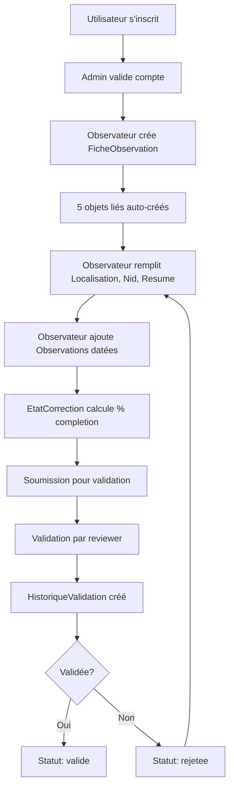

# Diagramme Entité-Relation (ERD)

## Vue d'ensemble

Ce document présente le diagramme entité-relation complet du projet Observations Nids, montrant les relations entre les 21 modèles concrets.

---

## Diagramme ERD Textuel Complet

```
┌─────────────────────────────────────────────────────────────────────┐
│                      DOMAINE UTILISATEUR                             │
└─────────────────────────────────────────────────────────────────────┘

Utilisateur (AbstractUser)
    │
    ├──[1:N]─→ fiches (FicheObservation.observateur) ★
    ├──[1:N]─→ notifications (Notification.destinataire)
    ├──[1:N]─→ notifications_le_concernant (Notification.utilisateur_concerne)
    ├──[1:N]─→ modifications (HistoriqueModification.modifie_par)
    ├──[1:N]─→ validations_effectuees (Validation.reviewer)
    └──[1:N]─→ validations_etat (EtatCorrection.validee_par)

Notification
    ├──[N:1]─→ destinataire → Utilisateur
    └──[N:1]─→ utilisateur_concerne → Utilisateur (optionnel)

┌─────────────────────────────────────────────────────────────────────┐
│                      DOMAINE TAXONOMIE                               │
└─────────────────────────────────────────────────────────────────────┘

Ordre
    │
    └──[1:N]─→ familles (Famille.ordre)

Famille
    ├──[N:1]─→ ordre → Ordre
    │
    └──[1:N]─→ especes (Espece.famille)

Espece
    ├──[N:1]─→ famille → Famille (SET_NULL)
    │
    └──[1:N]─→ observations (FicheObservation.espece) ★

┌─────────────────────────────────────────────────────────────────────┐
│              DOMAINE OBSERVATION (MODÈLE PIVOT CENTRAL)              │
└─────────────────────────────────────────────────────────────────────┘

FicheObservation [★★★ PIVOT CENTRAL ★★★]
    │
    ├── Relations N:1
    │   ├──[N:1]─→ observateur → Utilisateur (CASCADE)
    │   └──[N:1]─→ espece → Espece (PROTECT)
    │
    ├── Relations 1:1 (objets liés automatiques)
    │   ├──[1:1]─→ localisation (Localisation.fiche) ★
    │   ├──[1:1]─→ nid (Nid.fiche) ★
    │   ├──[1:1]─→ resume (ResumeObservation.fiche) ★
    │   ├──[1:1]─→ causes_echec (CausesEchec.fiche)
    │   └──[1:1]─→ etat_correction (EtatCorrection.fiche) ★
    │
    └── Collections 1:N
        ├──[1:N]─→ observations (Observation.fiche) ★
        ├──[1:N]─→ remarques (Remarque.fiche)
        ├──[1:N]─→ modifications (HistoriqueModification.fiche)
        └──[1:N]─→ validations (Validation.fiche)

┌─────────────────────────────────────────────────────────────────────┐
│                  DOMAINE NIDIFICATION                                │
└─────────────────────────────────────────────────────────────────────┘

Nid
    └──[1:1]─→ fiche → FicheObservation (CASCADE)

ResumeObservation [★ 6 contraintes CHECK ★]
    └──[1:1]─→ fiche → FicheObservation (CASCADE)

    Contraintes CHECK:
    ├─ premier_oeuf_pondu_jour/mois : both or none
    ├─ premier_poussin_eclos_jour/mois : both or none
    ├─ premier_poussin_volant_jour/mois : both or none
    ├─ nombre_oeufs_eclos ≤ nombre_oeufs_pondus
    ├─ nombre_oeufs_non_eclos ≤ nombre_oeufs_pondus
    └─ nombre_poussins ≤ nombre_oeufs_eclos

CausesEchec
    └──[1:1]─→ fiche → FicheObservation (CASCADE)

Observation
    └──[N:1]─→ fiche → FicheObservation (CASCADE)

Remarque
    └──[N:1]─→ fiche → FicheObservation (CASCADE)

┌─────────────────────────────────────────────────────────────────────┐
│                  DOMAINE GÉOLOCALISATION                             │
└─────────────────────────────────────────────────────────────────────┘

CommuneFrance (Référentiel autonome - 35 000+ communes)
    Champs: code_insee (UNIQUE), nom, code_postal, latitude, longitude
    Pas de relations FK (référentiel de données)

Localisation
    ├──[1:1]─→ fiche → FicheObservation (CASCADE)
    └── code_insee → CommuneFrance (référence textuelle, pas FK)

    Sources de coordonnées:
    ├─ gps_terrain (précision ± 5m)
    ├─ geocodage_auto (API)
    ├─ geocodage_manuel
    ├─ carte (saisie manuelle)
    ├─ base_locale (CommuneFrance)
    └─ nominatim (OpenStreetMap)

┌─────────────────────────────────────────────────────────────────────┐
│                  DOMAINE WORKFLOW & CORRECTION                       │
└─────────────────────────────────────────────────────────────────────┘

EtatCorrection [★ Algorithme de complétude 8 critères ★]
    ├──[1:1]─→ fiche → FicheObservation (CASCADE)
    └──[N:1]─→ validee_par → Utilisateur (SET_NULL, optionnel)

    Statuts:
    ├─ nouveau (0% par défaut)
    ├─ en_edition (observateur édite)
    ├─ en_cours (soumise pour correction)
    └─ valide (validée par correcteur)

    Critères de complétude (8):
    ├─ 1. Espèce renseignée
    ├─ 2. Localisation complète (commune, coords, altitude)
    ├─ 3. Détails du nid
    ├─ 4. Au moins 1 observation datée
    ├─ 5. Résumé rempli (dates partielles)
    ├─ 6. Compteurs cohérents (œufs, poussins)
    ├─ 7. Remarques présentes
    └─ 8. Causes d'échec documentées (si applicable)

┌─────────────────────────────────────────────────────────────────────┐
│                      DOMAINE VALIDATION & REVIEW                     │
└─────────────────────────────────────────────────────────────────────┘

Validation
    ├──[N:1]─→ fiche → FicheObservation (CASCADE)
    ├──[N:1]─→ reviewer → Utilisateur (role='reviewer') (CASCADE)
    │
    └──[1:N]─→ historique (HistoriqueValidation.validation)

    Statuts:
    ├─ en_cours (révision en cours)
    ├─ validee (approuvée)
    └─ rejetee (refusée)

HistoriqueValidation [Création automatique via save()]
    ├──[N:1]─→ validation → Validation (CASCADE)
    └──[N:1]─→ modifie_par → Utilisateur (SET_NULL, optionnel)

┌─────────────────────────────────────────────────────────────────────┐
│                      DOMAINE AUDIT & TRAÇABILITÉ                     │
└─────────────────────────────────────────────────────────────────────┘

HistoriqueModification [Audit trail complet]
    ├──[N:1]─→ fiche → FicheObservation (CASCADE)
    └──[N:1]─→ modifie_par → Utilisateur (SET_NULL, optionnel)

    Catégories:
    ├─ observation
    ├─ localisation
    ├─ nidification
    ├─ taxonomie
    └─ autre

    Champs tracés:
    - champ_modifie (nom du champ)
    - ancienne_valeur (avant)
    - nouvelle_valeur (après)
    - date_modification (horodatage)

┌─────────────────────────────────────────────────────────────────────┐
│                  DOMAINE IMPORT & TRANSCRIPTION OCR                  │
└─────────────────────────────────────────────────────────────────────┘

TranscriptionBrute
    │
    ├── fichier_source (UNIQUE)
    ├── json_brut (JSONField - données Google Vision API)
    │
    └──[1:1]─→ ImportationEnCours

EspeceCandidate [Matching fuzzy d'espèces]
    │
    ├── nom_transcrit (UNIQUE - texte OCR)
    ├── score_similarite (0-100%)
    │
    └──[N:1]─→ espece_validee → Espece (SET_NULL, optionnel)

ImportationEnCours [Workflow d'import]
    ├──[1:1]─→ transcription → TranscriptionBrute (CASCADE)
    ├──[1:1]─→ fiche_observation → FicheObservation (SET_NULL, optionnel)
    ├──[N:1]─→ espece_candidate → EspeceCandidate (SET_NULL, optionnel)
    └──[N:1]─→ observateur → Utilisateur (SET_NULL, optionnel)

    Statuts d'import:
    ├─ en_attente
    ├─ en_cours
    ├─ completee
    └─ erreur

┌─────────────────────────────────────────────────────────────────────┐
│                      MODÈLES ABSTRAITS (Core)                        │
└─────────────────────────────────────────────────────────────────────┘

TimeStampedModel (abstract)
    ├─ created_at (DateTimeField, auto)
    └─ updated_at (DateTimeField, auto)

UUIDModel (abstract)
    └─ id (UUIDField, PK, auto uuid4)

SoftDeleteModel (abstract)
    ├─ is_deleted (BooleanField)
    ├─ deleted_at (DateTimeField, nullable)
    └─ soft_delete() méthode

Note: Non utilisés actuellement dans les modèles métier
```

---

## Statistiques

| Métrique | Valeur |
|----------|--------|
| **Total modèles concrets** | 21 |
| **Modèles abstraits** | 3 (core) |
| **Relations ForeignKey (N:1)** | 24 |
| **Relations OneToOne (1:1)** | 11 |
| **Relations ManyToMany (N:N)** | 0 |
| **Contraintes CHECK** | 6 (ResumeObservation) |
| **Index composites** | 4 |
| **Champs UNIQUE** | 8 |

---

## Relations par action on_delete

| Action | Nombre | Modèles concernés |
|--------|--------|-------------------|
| **CASCADE** | 20 | Majorité (suppression liée) |
| **SET_NULL** | 7 | Utilisateur valideur, Espece famille, etc. |
| **PROTECT** | 1 | FicheObservation.espece (empêche suppression d'espèce avec observations) |

---

## Modèles par priorité métier

### Priorité 1 - Cœur métier (5 modèles)
1. **FicheObservation** - Modèle pivot central
2. **ResumeObservation** - Données de nidification critiques
3. **EtatCorrection** - Workflow de validation
4. **Utilisateur** - Gestion des accès
5. **Localisation** - Géolocalisation des observations

### Priorité 2 - Workflows (6 modèles)
6. Validation
7. HistoriqueValidation
8. HistoriqueModification
9. TranscriptionBrute
10. EspeceCandidate
11. ImportationEnCours

### Priorité 3 - Référentiels (5 modèles)
12. Ordre
13. Famille
14. Espece
15. CommuneFrance
16. Notification

### Priorité 4 - Modèles secondaires (5 modèles)
17. Nid
18. Observation
19. CausesEchec
20. Remarque
21. (3 modèles abstraits core)

---

## Dépendances circulaires (aucune)

Le graphe de dépendances est **acyclique** :
```
Ordre → Famille → Espece → FicheObservation → [5 objets liés 1:1]
                              ↑
                         Utilisateur
```

**Points d'attention** :
- Certaines FK utilisent des chaînes (`'observations.FicheObservation'`) pour éviter imports circulaires
- Relations résolues au runtime par Django

---

## Flux de données principal



---

## Index critiques pour performance

### Index composites

1. **Notification** : `(destinataire, est_lue)` - Liste des notifications non lues
2. **Notification** : `(type_notification)` - Filtrage par type
3. **FicheObservation** : `(observateur, date_creation)` - Fiches d'un observateur
4. **CommuneFrance** : `(nom, code_departement)` - Recherche de commune

### Index simples

- `Observation.date_observation` - Tri chronologique
- `HistoriqueModification.categorie` - Filtrage modifications
- Toutes les ForeignKey (indexées par défaut)

---

## Voir aussi

- **[Architecture générale](../index.md)** - Vue d'ensemble du projet
- **[Fiches d'observation](../domaines/observations.md)** - Documentation du modèle pivot
- **[Données de nidification](../domaines/nidification.md)** - Contraintes CHECK détaillées
- **[Workflow de correction](../domaines/workflow-correction.md)** - Algorithme de complétude
- **[Traçabilité](../domaines/audit.md)** - Historique des modifications

---

*Dernière mise à jour : 2025-10-20*
