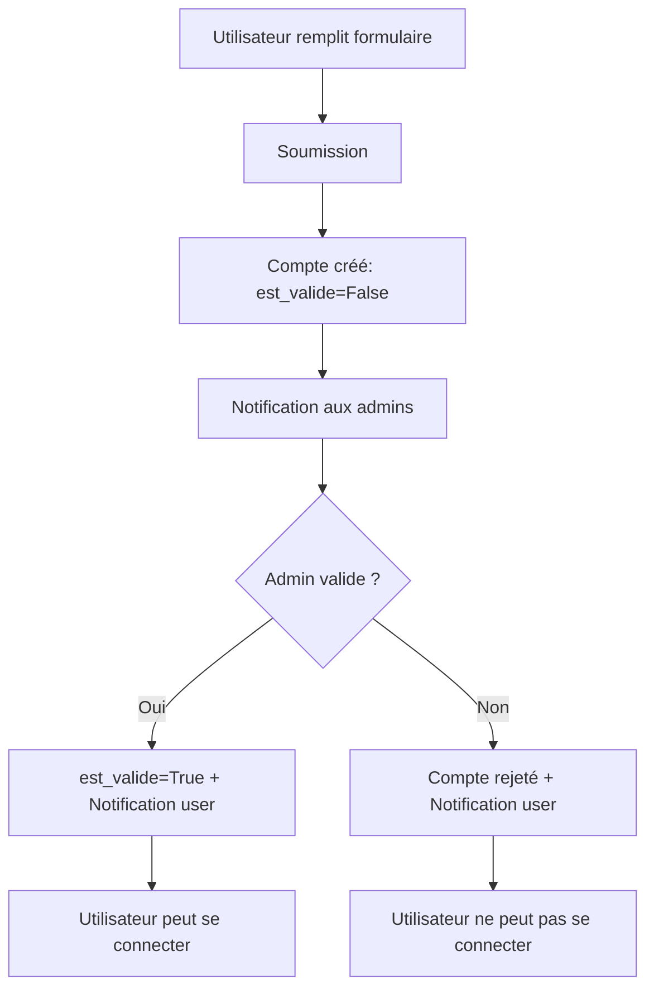

# Domaine : Gestion des utilisateurs

## Vue d'ensemble

Le domaine utilisateur gère l'authentification, l'autorisation et les notifications. Il s'appuie sur un modèle personnalisé `Utilisateur` qui étend `AbstractUser` de Django.

**Fichier** : `accounts/models.py`

---

## Modèle Utilisateur

### Rôle métier

Représente un utilisateur de l'application avec un système de rôles et de validation de compte par les administrateurs.

### Héritage

```python
class Utilisateur(AbstractUser):
    # Hérite de tous les champs de AbstractUser:
    # - username, password, email
    # - first_name, last_name
    # - is_staff, is_active, is_superuser
    # - date_joined, last_login
```

### Champs spécifiques

| Champ | Type | Description | Défaut | Contraintes |
|-------|------|-------------|--------|-------------|
| `role` | CharField(15) | Rôle de l'utilisateur | 'observateur' | Choix: ROLE_CHOICES |
| `est_valide` | BooleanField | Compte validé par un admin | False | Requis pour login |
| `est_transcription` | BooleanField | Utilisateur dédié aux transcriptions OCR | False | Compte technique |
| `email` | EmailField | Adresse email | - | **UNIQUE** et **OBLIGATOIRE** |

### Système de rôles

**Définition** : `core/constants.py::ROLE_CHOICES`

```python
ROLE_CHOICES = [
    ('observateur', 'Observateur'),
    ('correcteur', 'Correcteur'),
    ('administrateur', 'Administrateur'),
]
```

#### Permissions par rôle

| Rôle | Permissions |
|------|-------------|
| **Observateur** | • Créer/modifier ses propres fiches<br>• Consulter toutes les observations<br>• Soumettre pour correction |
| **Correcteur** | • Toutes permissions observateur<br>• Corriger toutes les fiches<br>• Accès outil de transcription |
| **Administrateur** | • Toutes permissions<br>• Gérer les utilisateurs<br>• Valider les comptes<br>• Accès admin Django |

**Voir** : [Documentation complète gestion utilisateurs](../../account/GESTION_UTILISATEURS.md)

### Contrainte d'unicité email

```python
email = models.EmailField(
    "adresse email",
    unique=True,  # ← Contrainte BDD
    error_messages={
        'unique': "Un utilisateur avec cette adresse email existe déjà.",
    },
)
```

**Implémentation** :
- **Migration** : `accounts/migrations/0003_email_unique_et_lien_default.py`
- **Validation** : Niveau base de données + niveau formulaire
- **Script de vérification** : `scripts/check_duplicate_emails.py`

### Relations

| Collection | Description |
|------------|-------------|
| `fiches` | Fiches d'observation créées (FicheObservation.observateur) |
| `notifications` | Notifications reçues (Notification.destinataire) |
| `notifications_le_concernant` | Notifications où l'utilisateur est référencé |
| `modificateur_de` | Historique des modifications effectuées |

---

## Modèle Notification

### Rôle métier

Système de notifications internes pour informer les utilisateurs d'événements importants (demandes de compte, validations, etc.).

### Champs

| Champ | Type | Description | Index |
|-------|------|-------------|-------|
| `destinataire` | ForeignKey | Utilisateur qui reçoit la notification | → Utilisateur |
| `type_notification` | CharField(20) | Type de notification | Choix: TYPE_CHOICES, **Indexé** |
| `titre` | CharField(255) | Titre court | - |
| `message` | TextField | Contenu détaillé | - |
| `lien` | CharField(255) | URL relative vers la ressource | Optionnel |
| `est_lue` | BooleanField | Notification lue ou non | Défaut: False, **Indexé** |
| `date_creation` | DateTimeField | Date de création | Auto (timezone.now) |
| `date_lecture` | DateTimeField | Date de lecture | NULL si non lue |
| `utilisateur_concerne` | ForeignKey | Référence optionnelle utilisateur | → Utilisateur, Optionnel |

### Types de notifications

```python
TYPE_CHOICES = [
    ('demande_compte', 'Demande de compte'),
    ('compte_valide', 'Compte validé'),
    ('compte_refuse', 'Compte refusé'),
    ('info', 'Information'),
    ('warning', 'Avertissement'),
]
```

### Index composites

```python
indexes = [
    models.Index(fields=['destinataire', 'est_lue']),  # Requêtes fréquentes
    models.Index(fields=['type_notification']),
]
```

**Optimise** :
```python
# Liste des notifications non lues d'un utilisateur
Notification.objects.filter(
    destinataire=user,
    est_lue=False
).order_by('-date_creation')
```

### Méthodes

#### `marquer_comme_lue()`

```python
def marquer_comme_lue(self):
    """Marque la notification comme lue"""
    if not self.est_lue:
        self.est_lue = True
        self.date_lecture = timezone.now()
        self.save()
```

**Usage** :
```python
notification = user.notifications.first()
notification.marquer_comme_lue()
```

---

## Workflow d'inscription



### Étapes détaillées

1. **Inscription publique**
   - URL : `/accounts/inscription-publique/`
   - Formulaire : `UtilisateurCreationForm`
   - Champs : username, email, first_name, last_name, password

2. **Création du compte**
   ```python
   user = Utilisateur.objects.create(
       username='...',
       email='...',
       first_name='...',
       last_name='...',
       role='observateur',
       est_valide=False,  # ← Compte en attente
       is_active=False,   # ← Ne peut pas se connecter
   )
   ```

3. **Notifications automatiques**
   ```python
   # Notification à tous les admins
   admins = Utilisateur.objects.filter(role='administrateur')
   for admin in admins:
       Notification.objects.create(
           destinataire=admin,
           type_notification='demande_compte',
           titre='Nouvelle demande de compte',
           message=f'{user.get_full_name()} demande un accès',
           lien=f'/accounts/utilisateur/{user.id}/',
           utilisateur_concerne=user
       )
   ```

4. **Validation par admin**
   - Admin consulte la liste des demandes
   - URL : `/accounts/liste-utilisateurs/?valide=non`
   - Actions possibles :
     - **Valider** → `est_valide=True`, `is_active=True`
     - **Refuser** → Suppression ou rejet

5. **Notification de validation**
   ```python
   Notification.objects.create(
       destinataire=user,
       type_notification='compte_valide',
       titre='Votre compte a été validé',
       message='Vous pouvez maintenant vous connecter.',
       lien='/login/'
   )
   ```

**Voir** : [Workflow complet](../../account/GESTION_UTILISATEURS.md#workflow-dinscription)

---

## Soft delete (suppression)

### Implémentation actuelle

Les utilisateurs peuvent être **désactivés** via `is_active=False` :

```python
# accounts/views/auth.py
def desactiver_utilisateur(request, user_id):
    utilisateur = get_object_or_404(Utilisateur, id=user_id)
    utilisateur.is_active = False
    utilisateur.save()
```

**Conséquences** :
- ✅ Utilisateur ne peut plus se connecter
- ✅ Données (fiches, observations) conservées
- ✅ Réversible (`activer_utilisateur()`)

### Amélioration future

Implémenter soft delete via `core.models.SoftDeleteModel` :

```python
class Utilisateur(AbstractUser, SoftDeleteModel):
    # Hérite automatiquement de:
    # - is_deleted (BooleanField)
    # - deleted_at (DateTimeField)
    # - soft_delete() méthode
    pass
```

---

## Sécurité

### Email unique obligatoire

**Pourquoi ?**
- Permet réinitialisation de mot de passe sécurisée
- Évite les doublons (un email = un compte)
- Facilite identification des utilisateurs

**Migration** :
```python
# accounts/migrations/0003_email_unique_et_lien_default.py
operations = [
    migrations.AlterField(
        model_name='utilisateur',
        name='email',
        field=models.EmailField(unique=True, ...),
    ),
]
```

### Vérification avant migration

Script de diagnostic :
```bash
python scripts/check_duplicate_emails.py
```

**Output** :
```
ERREUR: Emails en double detectes:

  Email: user@example.com - 2 comptes
     -> user1 (ID: 42) - actif - observateur
     -> user2 (ID: 43) - inactif - observateur

RECOMMANDATION:
1. Supprimer ou desactiver les comptes en double
2. Ajouter une contrainte unique sur le champ email
```

---

## Réinitialisation de mot de passe

### Workflow

1. **Page "Mot de passe oublié"**
   - URL : `/accounts/mot-de-passe-oublie/`
   - Saisie de l'email

2. **Génération du lien**
   ```python
   from django.contrib.auth.tokens import default_token_generator
   from django.utils.http import urlsafe_base64_encode
   from django.utils.encoding import force_bytes

   uid = urlsafe_base64_encode(force_bytes(user.pk))
   token = default_token_generator.make_token(user)

   reset_url = f'/accounts/reinitialiser/{uid}/{token}/'
   ```

3. **Envoi de l'email**
   - Template : `accounts/templates/accounts/emails/reinitialisation_mot_de_passe.html`
   - Lien valide 24h

4. **Réinitialisation**
   - Utilisateur clique le lien
   - Saisie du nouveau mot de passe
   - Validation et redirection

**Voir** : [Documentation réinitialisation](../../account/REINITIALISATION_MDP.md)

### Tests associés

**Fichier** : `accounts/tests/test_password_reset.py`

**21 tests critiques** :
- ✅ Envoi email si compte existe
- ✅ Pas de révélation si email inexistant
- ✅ Token valide/invalide
- ✅ Contrainte email unique
- ✅ Gestion des utilisateurs inactifs

---

## Requêtes ORM courantes

### Utilisateurs en attente de validation

```python
demandes = Utilisateur.objects.filter(
    est_valide=False,
    is_active=False
).order_by('-date_joined')
```

### Notifications non lues d'un utilisateur

```python
non_lues = user.notifications.filter(
    est_lue=False
).select_related('utilisateur_concerne')
```

### Administrateurs actifs

```python
admins = Utilisateur.objects.filter(
    role='administrateur',
    is_active=True,
    est_valide=True
)
```

### Statistiques par rôle

```python
from django.db.models import Count

stats = Utilisateur.objects.values('role').annotate(
    total=Count('id'),
    valides=Count('id', filter=Q(est_valide=True)),
    actifs=Count('id', filter=Q(is_active=True))
)
```

---

## Points d'attention

### ⚠️ Différence `est_valide` vs `is_active`

| Champ | Signification | Usage |
|-------|---------------|-------|
| `est_valide` | Validation par admin | Workflow d'inscription |
| `is_active` | Compte actif | Login autorisé (Django standard) |

**Règle** : Un utilisateur doit être `est_valide=True` ET `is_active=True` pour se connecter.

### ⚠️ Suppression CASCADE

Si un utilisateur est supprimé :
- ✅ Ses notifications sont supprimées (CASCADE)
- ⚠️ Ses fiches d'observation sont supprimées (CASCADE sur `FicheObservation.observateur`)

**Recommandation** : Toujours utiliser **soft delete** (`is_active=False`)

---

## Voir aussi

- **[Gestion utilisateurs complète](../../account/GESTION_UTILISATEURS.md)** - Workflow détaillé, formulaires, vues
- **[Réinitialisation mot de passe](../../account/REINITIALISATION_MDP.md)** - Documentation technique complète
- **[Tests](../../testing/TESTS_REINITIALISATION_MDP.md)** - 21 tests de réinitialisation
- **[Diagramme ERD](../diagrammes/erd.md)** - Relations avec autres modèles

---

*Dernière mise à jour : 2025-10-20*
