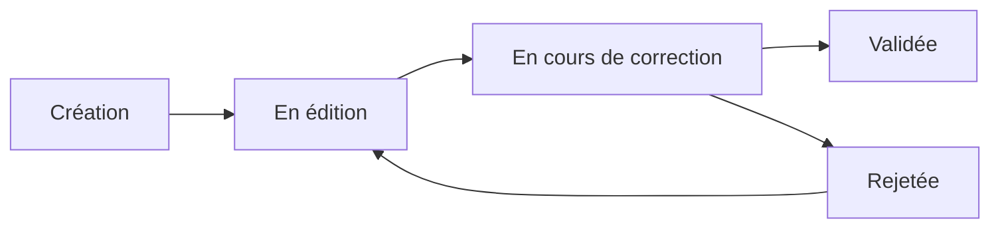

# Architecture du Projet - Observations Nids

## Vue d'ensemble

**Observations Nids** est une application Django pour la gestion d'observations ornithologiques de nidification. L'application permet la transcription OCR automatique de fiches papier, la saisie manuelle, la correction collaborative et la validation des données avec traçabilité complète.

### Objectifs principaux

1. **Numérisation automatisée** : OCR des fiches papier via Google Vision API
2. **Saisie et correction** : Interface web intuitive pour gérer les observations
3. **Workflow collaboratif** : Système de rôles (observateur, correcteur, validateur, admin)
4. **Traçabilité** : Historique complet de toutes les modifications
5. **Qualité des données** : Validation stricte et workflow de révision

---

## Structure des applications Django

Le projet est organisé en **8 applications Django** pour une meilleure séparation des responsabilités :

```
observations_nids/
├── accounts/              # Authentification et gestion utilisateurs
├── audit/                 # Historique et traçabilité des modifications
├── core/                  # Fonctionnalités communes et utilitaires
├── geo/                   # Gestion des localisations géographiques
├── ingest/                # Ingestion et traitement de données externes
├── observations/          # Application principale - gestion des observations
├── review/                # Système de révision et validation
├── taxonomy/              # Classification taxonomique des espèces
└── observations_nids/     # Configuration Django principale
```

---

## Organisation de la documentation

Cette section architecture est organisée par **domaines métier**. Chaque document détaille les modèles, leurs relations et leurs règles métier.

### 📚 Documents par domaine

#### Domaine Utilisateur
- **[Gestion des utilisateurs](domaines/utilisateurs.md)** - Modèles `Utilisateur`, `Notification`, rôles et permissions

#### Domaine Observation (Cœur métier)
- **[Fiches d'observation](domaines/observations.md)** - Modèle `FicheObservation` (modèle pivot central)
- **[Données de nidification](domaines/nidification.md)** - Modèles `Nid`, `ResumeObservation`, `CausesEchec`
- **[Workflow de correction](domaines/workflow-correction.md)** - Modèles `EtatCorrection`, `Observation`, `Remarque`

#### Domaine Géographique
- **[Localisation](domaines/localisation.md)** - Modèles `Localisation`, `CommuneFrance`, géocodage

#### Domaine Taxonomique
- **[Taxonomie ornithologique](domaines/taxonomie.md)** - Modèles `Ordre`, `Famille`, `Espece`

#### Domaine Validation
- **[Processus de validation](domaines/validation.md)** - Modèles `Validation`, `HistoriqueValidation`

#### Domaine Import/Transcription
- **[Import et transcription](domaines/import-transcription.md)** - Pipeline d'import OCR

#### Domaine Audit
- **[Traçabilité](domaines/audit.md)** - Modèle `HistoriqueModification`

### 📊 Diagrammes

- **[Diagramme entité-relation (ERD)](diagrammes/erd.md)** - Vue complète des relations entre modèles

---

## Modèle pivot : FicheObservation

Le cœur de l'application est le modèle **`FicheObservation`** qui représente une fiche d'observation complète d'un nid pour une espèce et une année donnée.

### Relations principales

```
FicheObservation (modèle central)
    ├── observateur → Utilisateur
    ├── espece → Espece
    │
    ├── localisation (1:1) → Localisation
    ├── nid (1:1) → Nid
    ├── resume (1:1) → ResumeObservation
    ├── causes_echec (1:1) → CausesEchec
    ├── etat_correction (1:1) → EtatCorrection
    │
    ├── observations (1:N) → Observation
    ├── remarques (1:N) → Remarque
    ├── modifications (1:N) → HistoriqueModification
    └── validations (1:N) → Validation
```

**Voir** : [Documentation complète des fiches d'observation](domaines/observations.md)

---

## Cycle de vie d'une fiche



1. **Création** : Saisie manuelle ou transcription OCR
2. **En édition** : L'observateur complète sa fiche
3. **En cours** : Soumise pour correction/validation
4. **Validée** : Approuvée par un validateur
5. **Rejetée** : Renvoyée à l'observateur pour corrections

**Voir** : [Workflow de correction détaillé](domaines/workflow-correction.md)

---

## Technologies et choix techniques

### Stack technique
- **Backend** : Django 5.2.7 + Python 3.12
- **Base de données** : MySQL/MariaDB
- **Tâches asynchrones** : Celery + Redis
- **OCR** : Google Vision API
- **Frontend** : Templates Django + Bootstrap

### Points techniques notables

#### 1. Gestion automatique des objets liés
Lors de la création d'une `FicheObservation`, **5 objets liés sont créés automatiquement** :
- `Localisation`
- `Nid`
- `ResumeObservation`
- `CausesEchec`
- `EtatCorrection`

Cela simplifie la logique métier et garantit la cohérence.

#### 2. Contraintes CHECK métier
Le modèle `ResumeObservation` contient **6 contraintes CHECK** pour garantir :
- Cohérence des dates partielles (jour/mois)
- Cohérence des compteurs (œufs pondus/éclos/non éclos)
- Logique métier (poussins ≤ œufs éclos)

**Voir** : [Données de nidification](domaines/nidification.md)

#### 3. Audit trail complet
Toutes les modifications sont tracées via :
- `HistoriqueModification` : Changements au niveau des champs
- `HistoriqueValidation` : Changements de statut de validation

**Voir** : [Traçabilité](domaines/audit.md)

#### 4. Géocodage multi-sources
La localisation des nids supporte plusieurs sources :
- GPS terrain (précision ± 5m)
- Géocodage automatique via API
- Saisie manuelle
- Base locale (cache `CommuneFrance`)

**Voir** : [Localisation et géocodage](domaines/localisation.md)

---

## Sécurité

### Authentification et permissions
- **Modèle utilisateur personnalisé** : `Utilisateur` hérite de `AbstractUser`
- **3 rôles** : Observateur, Correcteur, Administrateur
- **Email unique obligatoire** : Avec contrainte de base de données
- **Validation des comptes** : Workflow d'approbation par les admins

**Voir** : [Gestion des utilisateurs](domaines/utilisateurs.md)

### Protection des données
- **CSRF Protection** : Activée sur tous les formulaires POST
- **Expiration de session** : Déconnexion automatique
- **Permissions vérifiées** : Décorateurs `@login_required`, `@user_passes_test`
- **Prévention SQL injection** : Utilisation exclusive de l'ORM Django
- **Auto-échappement XSS** : Templates Django

---

## Optimisations de performance

### Base de données
- **Index stratégiques** : Sur FK fréquemment utilisées
- **Index composites** : Ex: `(destinataire, est_lue)` sur `Notification`
- **Relations optimisées** : `select_related()` et `prefetch_related()`

### Caching
- **Cache de référence** : `CommuneFrance` (45,000+ communes)
- **Cache applicatif** : Données taxonomiques (espèces, familles)

### Pagination
- Toutes les listes longues sont paginées (20 items par page)

---

## Configuration

### Variables d'environnement
La configuration utilise **Pydantic Settings** pour valider et typer les variables :

```python
# observations_nids/config.py
class Settings(BaseSettings):
    SECRET_KEY: str
    DEBUG: bool = False
    ALLOWED_HOSTS: List[str] = ['localhost']
    DATABASE: DatabaseSettings
    # ...
```

### Fichier .env
Template fourni dans `.env.example` :
```bash
SECRET_KEY=votre-cle-secrete
DEBUG=True
DATABASE_NAME=observations_nids
DATABASE_USER=root
# ...
```

**Voir** : [Configuration](../configuration/configuration.md)

---

## Prochaines étapes

Pour comprendre en détail l'architecture :

1. Commencez par **[Fiches d'observation](domaines/observations.md)** (modèle central)
2. Consultez le **[Diagramme ERD](diagrammes/erd.md)** pour une vue d'ensemble
3. Explorez les domaines selon vos besoins métier

---

## Statistiques du projet

| Métrique | Valeur |
|----------|--------|
| **Nombre d'applications** | 8 |
| **Nombre de modèles** | 24 (21 concrets + 3 abstraits) |
| **Modèle pivot** | `FicheObservation` |
| **Relations** | 35+ ForeignKey/OneToOne |
| **Contraintes CHECK** | 6 (dans `ResumeObservation`) |
| **Lignes de code** | ~41,600 |

---

*Dernière mise à jour : 2025-10-20*
