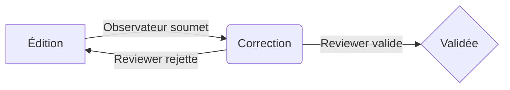

# Guide d'Utilisation : Gestion des Fiches d'Observation

Ce guide couvre l'ensemble du cycle de vie d'une fiche d'observation, de sa création à sa validation finale.

## 1. Le Cycle de Vie d'une Fiche

Le système suit un workflow en plusieurs étapes pour garantir la qualité des données :

| Statut | Badge | Description | Qui peut agir ? |
|---|---|---|---|
| **En édition** | Jaune | L'observateur saisit ou modifie les données. | Observateur (auteur) |
| **En cours de correction** | Orange | La fiche est soumise et attend la relecture. | Reviewers, Admins |
| **Validée** | Vert | La fiche est vérifiée, complète et verrouillée. | Personne (lecture seule) |
| **Rejetée** | Rouge | La fiche contient des erreurs et est renvoyée à l'observateur. | Observateur (auteur) |

---

## 2. Mode Édition : Saisir et Modifier une Fiche

C'est la première étape, réalisée par l'observateur.

### Accès
- **Nouvelle fiche :** Bouton "Nouvelle observation" sur la page d'accueil (`/observations/`).
- **Modifier une fiche existante :** Via la liste "Mes fiches en cours d'édition" sur l'accueil ou le bouton "Modifier" dans la liste générale (`/observations/modifier/<id>/`).

### Règle d'Or : La Différence entre "Non observé" (NULL) et "Zéro"

C'est le concept le plus important pour garantir la qualité des données.

- **Laisser un champ vide (NULL)** signifie : "Je n'ai pas pu voir ou compter cette donnée".
- **Saisir `0`** signifie : "J'ai observé et j'ai compté zéro".

**Exemple Concret :**
- Un nid est trop haut pour voir à l'intérieur : laissez les champs `Nombre d'œufs` et `Nombre de poussins` **vides**.
- Vous observez un nid vide après une prédation : saisissez `0` dans `Nombre d'œufs` et `Nombre de poussins`.

Le système est conçu pour ne pas bloquer la saisie si des champs sont vides. Les contrôles de cohérence (ex: `poussins ≤ œufs`) ne s'appliquent que sur les valeurs que vous avez effectivement saisies.

### Structure du Formulaire de Saisie

Le formulaire est organisé en 6 sections pour une saisie guidée.

#### Section 1 : Informations Générales
- **Espèce** et **Année** de l'observation.

#### Section 2 : Localisation
- **Commune :** Saisissez les premières lettres pour activer l'**auto-complétion**. Sélectionnez une commune dans la liste pour remplir automatiquement le département, les coordonnées GPS (du centre de la commune) et l'altitude.
- **Bouton "Ma position" (📍) :** Idéal sur mobile. Récupère vos coordonnées GPS exactes et vous propose les communes les plus proches. L'altitude précise de votre GPS, si disponible, sera privilégiée.
- **Altitude :** Le système gère l'altitude intelligemment. Si vous saisissez une altitude manuellement, il vous demandera confirmation avant de l'écraser lors de la sélection d'une commune.

#### Section 3 : Description du Nid
- Caractéristiques du nid (hauteur, support, etc.).

#### Section 4 : Observations
- C'est un tableau dynamique où vous ajoutez une ligne pour chaque visite au nid.
- **Important :** Le bouton `+ Ajouter une observation` n'apparaît que pour les fiches **déjà enregistrées** une première fois.
- Chaque ligne contient la date/heure, le nombre d'œufs/poussins et des notes.

#### Section 5 : Résumé
- Synthèse des données de reproduction (total d'œufs pondus, de poussins envolés, etc.).

#### Section 6 : Causes d'échec et Remarques
- **Remarques :** Pour ajouter des commentaires généraux sur la fiche, cliquez sur le bouton `➕ Ajouter/Modifier`. Une fenêtre s'ouvre pour gérer toutes les remarques.

### Sauvegarder votre travail

- Le bouton **"Enregistrer"** sauvegarde vos modifications. La fiche reste "En édition" et vous pouvez y revenir plus tard.

---

## 3. Soumission pour Correction

Lorsque vous avez terminé la saisie pour la saison et que toutes vos données sont vérifiées, vous pouvez soumettre la fiche.

### Procédure

1.  Cliquez sur le bouton **"Soumettre pour correction"**.
2.  Confirmez votre choix.

**Conséquences :**
- Le statut de la fiche passe à **"En cours de correction"**.
- **Vous ne pouvez plus la modifier.**
- Elle disparaît de votre liste "Mes fiches en cours d'édition" et apparaît dans la liste de travail des reviewers.

---

## 4. Mode Correction (pour les Reviewers)

Cette étape est réalisée par les utilisateurs ayant le rôle de "Reviewer" ou "Administrateur".

### Accès
- Via la liste générale des fiches, en cliquant sur "Corriger" pour une fiche avec le statut "En cours de correction".

### Interface
- L'interface est la même que le formulaire d'édition, mais permet de modifier les données d'un autre observateur.
- Le bouton **"Historique"** est disponible pour tracer toutes les modifications précédentes.

### Processus

1.  **Vérifier la cohérence** des données (dates, comptages, etc.).
2.  **Corriger les erreurs** si nécessaire.
3.  **Ajouter des remarques** pour documenter les corrections.
4.  Une fois la révision terminée, le reviewer peut **Valider** ou **Rejeter** la fiche (fonctionnalité de validation à venir).

---

## 5. Dépannage et Astuces

- **L'auto-complétion des communes ne marche pas ?**
  - Tapez au moins 2 caractères. Rafraîchissez la page (Ctrl+F5).

- **La géolocalisation ne marche pas ?**
  - Assurez-vous d'avoir activé le GPS sur votre mobile et d'avoir autorisé le site à y accéder. En production, le site doit être en **HTTPS**.

- **Le bouton "+ Ajouter une observation" n'apparaît pas ?**
  - C'est normal pour une nouvelle fiche. Enregistrez-la une première fois et le bouton apparaîtra.
