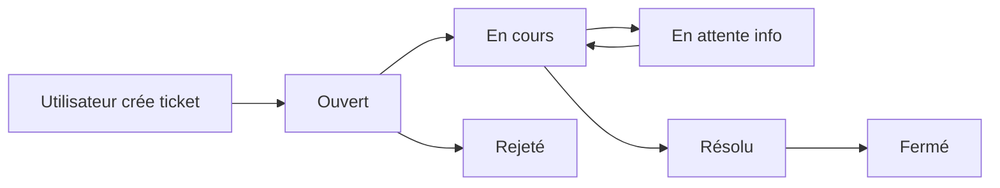

# Documentation Helpdesk

## 📋 Vue d'ensemble

Le système Helpdesk permet aux utilisateurs de **signaler des problèmes**, **demander de l'aide** et **proposer des améliorations** pour l'application Observations Nids.

Il est basé sur **Django-Helpdesk**, un système de tickets open-source intégré et personnalisé pour nos besoins.

---

## 📚 Documentation disponible

### Pour les utilisateurs

**➡️ [Guide utilisateur : Comment utiliser le système de support](guide-utilisateur.md)**

Ce guide explique :
- Comment créer un ticket
- Comment suivre vos tickets
- Comment répondre et communiquer avec le support
- Les bonnes pratiques
- Les statuts des tickets
- Les notifications par email

**Public cible** : Tous les utilisateurs de l'application

---

### Pour les développeurs

**➡️ [Guide développeur : Intégration technique de Django-Helpdesk](guide-developpeur.md)**

Ce guide détaille :
- L'installation et la configuration
- Les personnalisations (formulaires, templates, views)
- L'architecture et le modèle de données
- La configuration email
- La sécurité et les permissions
- L'API REST (optionnel)
- Les tests et la maintenance
- Le déploiement en production

**Public cible** : Développeurs et administrateurs système

---

### Documentation complémentaire

**➡️ [Django-Helpdesk : Guide d'intégration complet](../guides/fonctionnalites/django-helpdesk.md)**

Documentation technique très détaillée couvrant :
- Installation pas à pas
- Configuration avancée
- Personnalisation complète des templates
- Intégration avec l'authentification
- Configuration des queues (catégories)
- Troubleshooting

---

## 🚀 Accès rapide

### URLs du système

| URL | Description |
|-----|-------------|
| `/helpdesk/` | Tableau de bord Helpdesk |
| `/helpdesk/tickets/submit/` | Créer un nouveau ticket |
| `/helpdesk/tickets/<slug>/` | Voir un ticket spécifique |
| `/admin/helpdesk/` | Administration des tickets (staff only) |

### Catégories de tickets disponibles

| Catégorie | Utilisation |
|-----------|-------------|
| 🐛 **Bug** | Signaler un dysfonctionnement technique |
| ✨ **Nouvelle fonctionnalité** | Proposer une amélioration ou une nouvelle fonction |
| ❓ **Support/Question** | Poser une question ou demander de l'aide |
| 📚 **Documentation** | Signaler un problème dans la documentation |

---

## 🔐 Sécurité

### Accès restreint

Le système Helpdesk requiert une **authentification obligatoire** :
- Pas d'accès public pour créer des tickets
- Les utilisateurs ne voient que leurs propres tickets
- Seuls les membres du staff peuvent voir tous les tickets

### Configuration

```python
# settings.py
HELPDESK_SUBMIT_A_TICKET_PUBLIC = False  # Pas de soumission publique
HELPDESK_VIEW_A_TICKET_PUBLIC = False    # Pas de visualisation publique
```

---

## 📊 Statistiques et KPI

Le tableau de bord Helpdesk affiche :

- **Nombre de tickets ouverts** : Tickets en attente de traitement
- **Tickets en cours** : Tickets actuellement traités
- **Tickets résolus** : Tickets traités avec succès
- **Temps de réponse moyen** : Délai moyen de première réponse
- **Taux de résolution** : Pourcentage de tickets résolus

---

## 🛠️ Administration

### Gestion des tickets (Staff)

Les membres du staff peuvent :
- ✅ Voir tous les tickets
- ✅ Assigner des tickets à des utilisateurs
- ✅ Modifier le statut des tickets
- ✅ Ajouter des suivis internes (non visibles par les utilisateurs)
- ✅ Fermer des tickets
- ✅ Gérer les catégories (Queues)

### Via l'admin Django

Accès : `/admin/helpdesk/`

**Modèles disponibles :**
- **Files** (Queues) : Gérer les catégories de tickets
- **Tickets** : Voir et gérer tous les tickets
- **Suivis** : Historique des échanges
- **Pièces jointes** : Fichiers joints aux tickets

---

## 📧 Notifications email

### Événements déclenchant un email

Les utilisateurs reçoivent automatiquement un email lorsque :
- ✅ Un nouveau ticket est créé (confirmation)
- ✅ Quelqu'un répond à leur ticket
- ✅ Le statut de leur ticket change
- ✅ Leur ticket est assigné à quelqu'un
- ✅ Leur ticket est résolu ou fermé

### Configuration email

Les emails sont envoyés depuis : `observationnids@gmail.com`

**Catégories avec sous-adresses** (Gmail) :
- `observationnids+bug@gmail.com`
- `observationnids+feature@gmail.com`
- `observationnids+support@gmail.com`
- `observationnids+doc@gmail.com`

Toutes les sous-adresses arrivent dans la même boîte `observationnids@gmail.com` pour faciliter la gestion.

---

## 🔄 Workflow d'un ticket



**Détail des statuts :**

1. **Ouvert** : Ticket créé, en attente de prise en charge
2. **En cours** : Un membre du staff traite le ticket
3. **En attente** : En attente d'informations de l'utilisateur
4. **Résolu** : Le problème est résolu, en attente de confirmation
5. **Fermé** : Ticket terminé et archivé
6. **Rejeté** : La demande a été refusée (avec explication)

---

## 🧪 Tests

### Tests utilisateur

Avant le déploiement, vérifier :

- [ ] Création d'un ticket (formulaire complet)
- [ ] Réception de l'email de confirmation
- [ ] Visualisation du ticket créé
- [ ] Ajout d'un suivi (réponse)
- [ ] Changement de statut
- [ ] Notification email lors du changement

### Tests staff

- [ ] Voir tous les tickets
- [ ] Assigner un ticket
- [ ] Modifier le statut
- [ ] Ajouter un suivi interne
- [ ] Fermer un ticket
- [ ] Créer une nouvelle catégorie (Queue)

---

## 📞 Support

### Pour les utilisateurs

Si vous rencontrez un problème avec le système Helpdesk lui-même :
- Contactez directement un administrateur par email
- Ou créez un ticket dans la catégorie **"Bug"**

### Pour les développeurs

Consultez :
- [Guide développeur](guide-developpeur.md)
- [Documentation Django-Helpdesk officielle](https://django-helpdesk.readthedocs.io/)
- [Issues GitHub du projet](https://github.com/django-helpdesk/django-helpdesk/issues)

---

## 🔄 Historique des versions

| Version | Date | Changements |
|---------|------|-------------|
| **1.0** | 2024-10-28 | Installation initiale de Django-Helpdesk 2.0.2 |
| **1.1** | 2024-10-28 | Personnalisation des templates et formulaires |
| **1.2** | 2024-10-28 | Ajout des catégories Bug, Feature, Support, Doc |
| **1.3** | 2024-10-28 | Configuration email et sécurisation |
| **1.4** | 2024-10-30 | Documentation complète utilisateur et développeur |

---

## 📝 Licence

Le module **Django-Helpdesk** est sous licence BSD-3-Clause.

Les personnalisations développées pour Observations Nids sont propriétaires.

---

## 🤝 Contribution

Pour contribuer à l'amélioration du système Helpdesk :

1. Consultez le [guide développeur](guide-developpeur.md)
2. Proposez vos modifications via une Pull Request
3. Assurez-vous que les tests passent
4. Documentez vos changements

---

**Dernière mise à jour** : 30 octobre 2024
