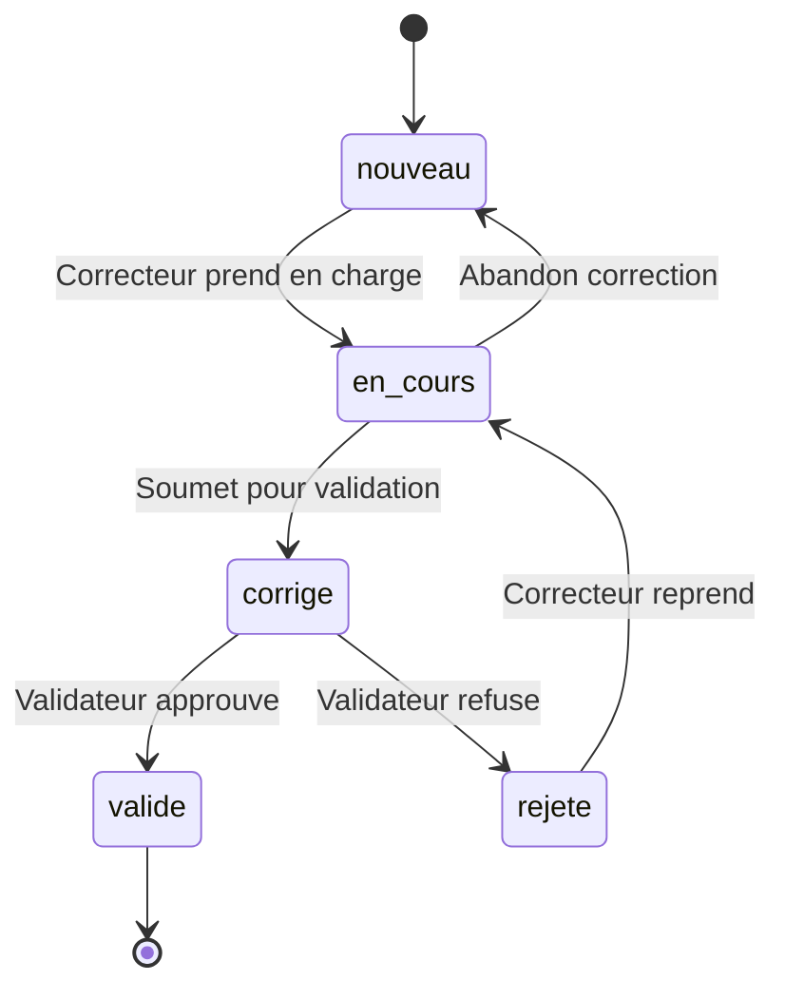

# Workflows de l'Application

> **Documentation détaillée des processus métier**
> Ce document décrit les 5 workflows majeurs de l'application : transcription OCR, correction, validation, audit et consultation.

**Navigation :**
- **[← Retour à la page projet](./README.md)** : Vue d'ensemble du projet
- **[Liste des fonctionnalités →](./FEATURES.md)** : Inventaire complet des fonctionnalités par module

---

## Vue d'ensemble

Le projet **Observations Nids** organise la numérisation et la validation des données ornithologiques selon un processus structuré en 5 étapes principales. Ce workflow garantit la qualité des données tout en optimisant l'efficacité du traitement.

### Principe général

```
📄 Fiche papier manuscrite
    ↓
📷 Numérisation (scan/photo)
    ↓
🤖 Transcription automatique (OCR via Google Vision API)
    ↓
✏️  Correction collaborative (vérification humaine)
    ↓
✅ Validation finale (contrôle qualité)
    ↓
💾 Exploitation scientifique des données validées
```

### Acteurs et responsabilités

Le système distingue 4 rôles avec des permissions croissantes :

| Rôle | Création | Modification | Validation | Administration |
|------|----------|--------------|------------|----------------|
| **Observateur** | Ses fiches uniquement | Ses fiches uniquement | ❌ | ❌ |
| **Correcteur** | Toutes les fiches | Toutes les fiches | ❌ | ❌ |
| **Validateur** | Toutes les fiches | Toutes les fiches | ✅ | ❌ |
| **Administrateur** | ✅ | ✅ | ✅ | ✅ |

**Séparation des responsabilités :**
- Un correcteur ne peut **jamais** valider ses propres corrections (principe du "4 yeux")
- Un validateur peut corriger ET valider directement (gain de temps pour corrections mineures)
- Toutes les actions sont tracées dans l'historique (audit complet)

---

## 1. Workflow de transcription OCR

### Objectif

Transformer rapidement des centaines de fiches papier en données numériques exploitables, avec un taux de réussite visé de **85-95%**.

### Étapes du processus

#### 1.1 Préparation des images (en amont)

**Checklist qualité :**
- ✅ Résolution minimum : **300 DPI**
- ✅ Format : JPG, PNG ou PDF
- ✅ Contraste suffisant (texte noir sur fond blanc/clair)
- ✅ Image droite (pas d'inclinaison > 5°)
- ✅ Absence d'ombres marquées
- ❌ Éviter : flou, reflets, pliures importantes

**Organisation recommandée :**
```
scans/
├── lot_2024_01/          # Par période
│   ├── fiche_001.jpg
│   ├── fiche_002.jpg
│   └── ...
├── lot_2024_02/
└── archives/
```

#### 1.2 Lancement de la transcription

**Point d'entrée :** `/transcription/demarrer/`

**Paramètres configurables :**
- Sélection du répertoire source
- Observateur par défaut (si absent sur la fiche)
- Année par défaut (si absente sur la fiche)
- Mode de traitement (séquentiel ou parallèle)

**Processus technique :**
1. Le système scanne le répertoire et liste les images
2. Pour chaque image, une **tâche Celery asynchrone** est créée
3. Les tâches sont distribuées aux workers disponibles
4. Chaque worker appelle **Google Vision API** pour l'OCR
5. Le texte extrait est parsé selon des patterns prédéfinis
6. Une `FicheObservation` est créée automatiquement en base

**Durée typique :** 10-20 secondes par fiche

#### 1.3 Suivi en temps réel

**Interface :** `/transcription/verifier-progression/`

L'interface affiche :
- Barre de progression globale (%)
- Compteurs en temps réel : Total / Réussies / Échecs / En cours
- Statut détaillé par fiche (PENDING, STARTED, SUCCESS, FAILURE)
- Mise à jour automatique toutes les 2 secondes (AJAX)

#### 1.4 Parsing intelligent du texte

Le système recherche des **patterns structurés** dans le texte OCR :

**Exemples de patterns reconnus :**
- `Observateur: Dupont Jean` → extraction automatique
- `Espèce: Faucon crécerelle` → matching avec la base taxonomique
- `Commune: Chamonix-Mont-Blanc` → géocodage automatique
- `Date: 15/05/2024` → conversion en objet Date
- Tableau d'observations avec dates/nombres

**Gestion des erreurs OCR courantes :**
- "Faucon crecerelle" → suggère "Faucon crécerelle"
- "3 œfs" → corrigé en "3 œufs"
- Dates ambiguës (15/05 vs 05/15) → inférence selon format français

#### 1.5 Résultats et actions

**Interface :** `/transcription/resultats/`

**Affichage du rapport :**
- ✅ Fiches créées avec succès (avec liens directs)
- ❌ Échecs détaillés avec raisons :
  - Image illisible (qualité insuffisante)
  - Aucun texte détecté (page blanche, image inversée)
  - Erreur de parsing (format non reconnu)
  - Erreur technique (API indisponible)

**Actions disponibles :**
- Accéder directement aux fiches pour correction
- Relancer les échecs après correction des images
- Exporter le rapport (CSV, PDF)
- Passer au lot suivant

### Traçabilité de la transcription

Chaque fiche transcrite conserve :
- `chemin_image` : référence vers l'image source
- `chemin_json` : données brutes de l'OCR
- `transcription = True` : indique l'origine automatique

Cela permet de revenir à la source en cas de doute.

---

## 2. Workflow de correction et saisie

### Objectif

Garantir la **qualité et la cohérence** des données avant validation finale. Chaque fiche est vérifiée champ par champ par un correcteur humain.

### Organisation de l'interface

**Point d'entrée :** `/observations/modifier/<fiche_id>/`

L'interface utilise une **approche progressive par sections** (cards Bootstrap) :

```
📋 Section 1 : Informations générales
   → Observateur, Espèce, Année

📍 Section 2 : Localisation  
   → Commune, Département, GPS (+ bouton Géocoder), Altitude, Paysage

🏠 Section 3 : Description du nid
   → Hauteur, Support, Orientation, Couverture végétale

📊 Section 4 : Observations chronologiques
   → Tableau dynamique (dates, œufs, poussins, notes)

📈 Section 5 : Résumé de reproduction
   → Synthèse des succès/échecs

⚠️ Section 6 : Causes d'échec
   → Si échec constaté
```

**Avantages de cette organisation :**
- ✅ Navigation claire et logique
- ✅ Focus sur une section à la fois
- ✅ Validation progressive
- ✅ Adaptation mobile/tablette

### Fonctionnalités clés

#### 2.1 Gestion des observations multiples

**Principe :** Une fiche peut contenir **plusieurs observations** réalisées à des dates différentes (suivi longitudinal du nid).

**Fonctionnalités :**
- ➕ Ajouter des observations dynamiquement
- 🗑️ Supprimer des observations (marquage pour suppression)
- 📝 Modifier les observations existantes
- 💬 Ajouter des remarques contextuelles

**Technologie utilisée :** Django Formsets
- Fichier : `observations/forms.py` → `ObservationFormSet`
- Vue : `observations/views/saisie_observation_view.py` → `modifier_fiche()`

**Particularité importante :**
- Le `management_form` doit **toujours** être présent dans le template
- Les observations sont sauvegardées en transaction atomique
- La suppression utilise un checkbox `DELETE` (soft delete)

#### 2.2 Validation en temps réel

**Règles de cohérence vérifiées automatiquement :**

1. **Nombres d'œufs :**
   - `œufs_éclos` ≤ `œufs_pondus`
   - `poussins_envolés` ≤ `œufs_éclos`

2. **Dates :**
   - `date_ponte` < `date_envol`
   - Dates d'observation dans l'année de la fiche

3. **Logique métier :**
   - Si `succès_reproduction = True` → au moins 1 poussin envolé
   - Si `échec = True` → cause obligatoire

**Affichage des erreurs :**
- Messages d'erreur clairs en haut du formulaire
- Champs en erreur surlignés en rouge
- Blocage de la soumission si erreurs critiques

Fonction JavaScript : `validerCoherence()`

#### 2.3 Géocodage automatique

**Bouton "Géocoder la commune"** → Appel AJAX

**Processus :**
1. Lecture des champs : commune, département, lieu-dit
2. Appel à `/geo/geocoder/` (API interne)
3. Recherche en base locale (35 000 communes)
4. Si non trouvé → fallback Nominatim (OpenStreetMap)
5. Mise à jour automatique des coordonnées GPS
6. Affichage du résultat (source, précision)

**Fichier JavaScript :** `observations/static/js/geocoding.js` → `geocoderCommune()`

#### 2.4 Système de remarques contextuelles

**Modal AJAX** pour ajouter des remarques :
- Sans recharger la page
- Liées à une observation spécifique
- Traçables (auteur, date)

**Vue API :** `observations/api_views.py` → `ajouter_remarque()`

### Sauvegarde et statuts

#### États d'une fiche



#### Actions disponibles

**Bouton "Enregistrer" :**
- Sauvegarde l'état actuel
- **Ne change PAS le statut**
- Reste sur la même page
- Permet une correction progressive

**Bouton "Soumettre pour validation" :**
- Sauvegarde + change le statut : `en_cours` → `corrige`
- Calcul automatique du % de complétude
- Notification automatique aux validateurs (email)
- Redirection vers la liste des fiches

**Fonction :** `observations/views/views_observation.py` → `soumettre_validation()`

### Bonnes pratiques pour les correcteurs

**Workflow recommandé :**

1. **Prendre par lots** : 10-20 fiches max à la fois
2. **Ordre de correction** :
   - Informations générales (vérifier espèce)
   - Localisation (géocoder immédiatement)
   - Nid puis observations
   - Résumé et causes d'échec

3. **Vérifications systématiques :**
   - ✅ Orthographe des espèces (nomenclature scientifique)
   - ✅ Cohérence des dates
   - ✅ Logique des nombres (œufs → poussins)
   - ✅ Coordonnées GPS valides

4. **Sauvegardes fréquentes** : toutes les 2-3 sections
5. **Utiliser les remarques** pour signaler les doutes

**Durée moyenne :** 5-15 minutes par fiche selon la complexité

---

## 3. Workflow de validation

### Objectif

Contrôle qualité final par un **validateur expérimenté** avant exploitation scientifique des données.

### Principe du double contrôle

**Règle fondamentale :** Un correcteur ne peut **jamais** valider ses propres corrections.

**Exception :** Un utilisateur avec le rôle "Validateur" peut :
- Corriger directement une fiche
- ET la valider immédiatement
- Gain de temps pour corrections mineures

### Interface de validation

**Point d'entrée :** `/observations/valider/<fiche_id>/`

**Vue :** `review/views.py` → `valider_fiche()`

#### Affichage en 2 colonnes

**Colonne gauche (large) :** Données de la fiche
- Toutes les données en **lecture seule**
- Mise en forme claire et structurée
- Observations en tableau chronologique

**Colonne droite (étroite) :** Outils de validation
- **Informations de correction :**
  - Qui a corrigé (correcteur)
  - Quand (date/heure de fin de correction)
  - Complétude (% de remplissage)
  - Commentaires éventuels du correcteur

- **Historique récent :**
  - 10-20 dernières modifications
  - Qui a modifié quoi et quand
  - Anciennes vs nouvelles valeurs

- **Formulaire de décision :**
  - Zone de commentaires (optionnel pour validation, **obligatoire** pour rejet)
  - Bouton "✅ Valider" (vert)
  - Bouton "❌ Rejeter" (rouge)

### Checklist de validation

**Validateur doit vérifier :**

#### Données générales
- [ ] Espèce : orthographe conforme à la nomenclature
- [ ] Observateur : existe dans la base
- [ ] Année : cohérente avec les dates d'observation

#### Localisation
- [ ] Commune : orthographe, département correct
- [ ] Coordonnées GPS : format valide, cohérence géographique
- [ ] Altitude : plausible pour l'espèce et la localisation

#### Nid
- [ ] Hauteur : valeur réaliste (0-50m généralement)
- [ ] Support : cohérent avec l'espèce (arbre, falaise, bâtiment...)
- [ ] Orientation : format correct (N, NE, E, SE, S, SW, W, NW)

#### Observations
- [ ] Dates : ordre chronologique respecté
- [ ] Dates : dans l'année de la fiche
- [ ] Nombres : pas de valeurs négatives
- [ ] Évolution : logique œufs → poussins

#### Résumé
- [ ] `œufs_éclos` ≤ `œufs_pondus`
- [ ] `poussins_envolés` ≤ `œufs_éclos`
- [ ] `date_ponte` ≤ `date_envol`
- [ ] Succès cohérent avec poussins envolés

#### Causes d'échec
- [ ] Si `échec = True` → cause renseignée
- [ ] Cohérence avec `succès_reproduction`

### Décisions possibles

#### ✅ Validation

**Actions système :**
1. Statut : `corrige` → `valide`
2. Enregistrement : validateur, date, commentaire (optionnel)
3. Email au correcteur : "Fiche #123 validée"
4. Redirection vers liste des fiches à valider

**Résultat :** Données exploitables pour analyses scientifiques

#### ❌ Rejet

**Actions système :**
1. Statut : `corrige` → `rejete`
2. Enregistrement : validateur, date, **commentaire obligatoire**
3. Email au correcteur : "Fiche #123 rejetée" + raisons détaillées
4. Correcteur peut reprendre la correction

**Commentaire de rejet :** Doit être **constructif et précis**

Exemple de bon commentaire :
```
Erreurs détectées :
1. Incohérence œufs/poussins : 5 éclos mais 6 envolés (impossible)
2. Dates inversées : envol (12/05) avant ponte (20/05)
3. Espèce : corriger "Busard des roseau" en "Busard des roseaux"

Merci de vérifier la fiche papier originale (scan: lot_2024_01/fiche_042.jpg)
```

### Critères de rejet

**Rejeter une fiche si :**
- ❌ Incohérences mathématiques (nombres impossibles)
- ❌ Dates impossibles ou incohérentes
- ❌ Espèce mal identifiée ou orthographe incorrecte
- ❌ Localisation aberrante (GPS en mer, hors de France...)
- ❌ Données essentielles manquantes (espèce, localisation, dates)

**Ne PAS rejeter pour :**
- ✅ Remarques ou notes manquantes (champs optionnels)
- ✅ Précision GPS approximative (centre de commune suffit)
- ✅ Données secondaires non renseignées
- ✅ Qualité photo médiocre (si données lisibles)

### Listes de travail

#### Pour les validateurs

**URL :** `/observations/a-valider/`

**Affichage :**
- Liste paginée des fiches en statut `corrige`
- Tri par défaut : date de soumission (plus anciennes en premier)
- Filtres : observateur, espèce, correcteur, période

**Statistiques du jour :**
- Fiches à valider (total)
- Validées aujourd'hui
- Rejetées aujourd'hui
- Taux de validation

**Fonction :** `review/views.py` → `liste_fiches_a_valider()`

### Notifications

#### Email au validateur (fiche soumise)

**Déclencheur :** Correcteur clique "Soumettre pour validation"

**Contenu :**
```
Objet : Nouvelle fiche à valider : #1234

Bonjour [Validateur],

Une nouvelle fiche d'observation est prête pour validation :

• Fiche : #1234
• Espèce : Faucon crécerelle  
• Commune : Chamonix-Mont-Blanc (74)
• Année : 2024
• Corrigée par : Jean Dupont
• Le : 15/03/2024 à 14:50

➡️ Accéder à la validation : [lien direct]

Cordialement,
Le système Observations Nids
```

**Fonction :** `review/notifications.py` → `notifier_validateurs()`

#### Email au correcteur (résultat)

**Contenu selon résultat :**

**Si validée :**
```
Objet : ✅ Fiche #1234 validée

Bonjour [Correcteur],

Votre correction de la fiche #1234 a été validée par [Validateur].

Commentaire : "Fiche correcte, bon travail !"

Merci pour votre contribution.
```

**Si rejetée :**
```
Objet : ❌ Fiche #1234 rejetée

Bonjour [Correcteur],

La fiche #1234 a été rejetée par [Validateur] et nécessite une nouvelle correction.

Raisons du rejet :
[Commentaires détaillés du validateur]

➡️ Corriger à nouveau : [lien direct]

Merci de votre compréhension.
```

**Fonction :** `review/notifications.py` → `notifier_correcteur()`

---

## 4. Workflow d'audit et traçabilité

### Objectif

Garantir la **traçabilité complète** de toutes les modifications pour :
- Conformité réglementaire (données scientifiques)
- Résolution de litiges
- Analyse des processus de correction
- Détection d'anomalies

### Principe de fonctionnement

**Enregistrement automatique** via des **signaux Django** :
- Aucune intervention manuelle nécessaire
- Capture au niveau du modèle (transparence totale)
- Granularité au niveau du champ (chaque modification tracée)

### Modèle d'historique

**Table :** `audit.HistoriqueModification`

**Informations enregistrées :**
- `fiche` : référence vers la fiche modifiée
- `utilisateur` : qui a fait la modification
- `date_modification` : timestamp précis
- `champ_modifie` : nom du champ
- `ancienne_valeur` : valeur avant modification
- `nouvelle_valeur` : valeur après modification
- `type_modification` : création / modification / suppression

### Capture automatique

**Mécanisme technique :**

1. **Middleware** : capture l'utilisateur courant dans le contexte de la requête
   - Fichier : `audit/signals.py` → `CurrentUserMiddleware`

2. **Signal pre_save** : capture les anciennes valeurs avant sauvegarde
   - Stocke l'instance originale dans `_old_instance`

3. **Signal post_save** : compare anciennes et nouvelles valeurs
   - Enregistre chaque différence dans `HistoriqueModification`

**Fichiers concernés :**
- `audit/signals.py` : définition des signaux
- `audit/apps.py` : enregistrement des signaux au démarrage

### Consultation de l'historique

**Point d'entrée :** `/observations/historique/<fiche_id>/`

**Vue :** `audit/views.py` → `historique_fiche()`

#### Affichage par date

**Organisation :** Timeline chronologique inversée (plus récent en haut)

**Groupement par journée :**
```
📅 16 Mars 2024
├── 09:15 - Martin P. (Validateur)
│   └── statut: "corrigé" → "validé"
│
└── 09:14 - Martin P. (Validateur)
    └── commentaires_validateur: "" → "Fiche correcte"

📅 15 Mars 2024
├── 14:50 - Dupont J. (Correcteur)
│   └── statut: "en_cours" → "corrigé"
│
├── 14:45 - Dupont J. (Correcteur)
│   └── [Création] Observation du 20/04/2024
│
├── 14:40 - Dupont J. (Correcteur)
│   └── coordonnees_gps: "" → "45.923,6.869"
│
└── 14:35 - Dupont J. (Correcteur)
    └── espece: "Faucon crecerelle" → "Faucon crécerelle"
```

#### Fonctionnalités de consultation

**Filtres disponibles :**
- Par utilisateur (voir toutes les modifs d'un correcteur)
- Par type de modification (créations, modifications, suppressions)
- Par champ (voir l'historique d'un champ spécifique)
- Par période (dernières 24h, semaine, mois...)

**Export possible :**
- CSV : pour analyse dans Excel
- PDF : pour archivage
- JSON : pour traitement automatique

### Modèles surveillés

**Surveillance automatique :**
- ✅ `FicheObservation` : tous les champs
- ✅ `Observation` : création, modification, suppression
- ✅ `Localisation` : coordonnées, commune, etc.
- ✅ `Nid` : caractéristiques
- ✅ `ResumeObservation` : résultats de reproduction
- ✅ `CausesEchec` : causes d'échec
- ✅ `EtatCorrection` : changements de statut

**Non surveillé :**
- Connexions/déconnexions (logs serveur)
- Consultations simples (lectures)
- Modifications de configuration système

### Utilisation de l'historique

#### Pour les correcteurs
- Voir ses propres modifications
- Comprendre les rejets (quels champs posent problème)

#### Pour les validateurs
- Vérifier qui a modifié quoi
- Détecter des patterns d'erreurs récurrentes
- Justifier une décision de rejet

#### Pour les administrateurs
- Auditer l'activité globale
- Identifier les utilisateurs les plus actifs
- Détecter des comportements anormaux
- Analyser les temps de correction

---

## 5. Consultation et recherche

### Liste des fiches

**Point d'entrée :** `/observations/liste/`

**Vue :** `observations/views/views_observation.py` → `liste_fiches()`

#### Filtres disponibles

**Filtres métier :**
- Observateur (liste déroulante)
- Espèce (autocomplétion)
- Année (liste des années présentes)
- Commune (saisie libre avec autocomplétion)
- Département (liste déroulante)

**Filtres de workflow :**
- Statut (nouveau, en_cours, corrigé, validé, rejeté)
- Transcription (fiches OCR vs saisies manuelles)
- Période de création/modification

#### Tri et ordre

**Options de tri :**
- Date de création (↓ défaut, ↑ inverse)
- Date de modification
- Numéro de fiche
- Espèce (alphabétique)
- Statut

#### Affichage

**Format tableau responsive :**
- Pagination : 25 fiches par page
- Colonnes : #, Espèce, Commune, Année, Observateur, Statut, Actions
- Badge de couleur selon le statut :
  - 🟡 Nouveau
  - 🔵 En cours
  - 🟠 Corrigé
  - 🟢 Validé
  - 🔴 Rejeté

**Actions rapides :**
- 👁️ Consulter
- ✏️ Modifier (si permissions)
- ✅ Valider (si validateur et statut = corrigé)
- 📋 Historique

#### Statistiques d'en-tête

**Affichage en badges :**
- Total de fiches (selon filtres actifs)
- Fiches validées
- Fiches en cours de correction
- Fiches en attente de validation

### Vue détaillée

**Point d'entrée :** `/observations/fiche/<fiche_id>/`

**Vue :** `observations/views/views_observation.py` → `fiche_detail()`

#### Organisation de la page

**En-tête :**
- Numéro de fiche
- Badge de statut
- Dates de création/modification
- Boutons d'action (selon permissions)

**Sections principales :**
1. **Informations générales**
2. **Localisation** (avec mini-carte si coordonnées GPS)
3. **Description du nid**
4. **Observations** (tableau chronologique)
5. **Résumé de reproduction**
6. **Causes d'échec** (si applicable)

**Panneau latéral :**
- Historique récent (10 dernières modifs)
- Pièces jointes (image source, JSON OCR)
- Métadonnées (transcription, géocodage)

#### Permissions d'accès

**Lecture :**
- Tout utilisateur authentifié peut consulter
- Affichage en lecture seule

**Modification :**
- Observateur : ses propres fiches uniquement
- Correcteur/Validateur/Admin : toutes les fiches

**Validation :**
- Validateur/Admin : fiches en statut "corrigé"

### Recherche avancée

**Fonctionnalités futures :**
- Recherche full-text (espèce, commune, notes)
- Recherche géographique (rayon autour d'un point)
- Recherche par critères biologiques (succès/échec, nombres d'œufs)
- Export des résultats de recherche

---

## 6. Métriques et indicateurs

### Indicateurs de performance (KPI)

#### Pour le système

**Transcription OCR :**
- Taux de succès : `fiches_ocr_réussies / total_fiches_ocr × 100`
- Temps moyen par fiche
- Nombre de fiches traitées par jour
- Taux d'erreurs par type (illisible, format, technique)

**Cible :** Taux de succès > 85%, temps < 20 sec/fiche

**Correction :**
- Temps moyen de correction par fiche
- Nombre de fiches en cours depuis > 7 jours (blocage)
- Fiches corrigées par correcteur par semaine
- Nombre moyen d'observations par fiche

**Cible :** < 15 min/fiche, < 5% de fiches bloquées

**Validation :**
- Taux de validation du premier coup (non rejeté)
- Temps moyen entre soumission et validation
- Nombre de validations par validateur par semaine
- Taux de rejet par correcteur (qualité)

**Cible :** Taux validation > 90%, temps < 48h

#### Pour les utilisateurs

**Dashboard correcteur :**
```
Mes statistiques
├── Fiches en cours : 12
├── Fiches corrigées ce mois : 87
├── Temps moyen de correction : 11 min
└── Taux de validation : 93%
```

**Dashboard validateur :**
```
Mes statistiques
├── Fiches à valider : 23
├── Fiches validées ce mois : 145
├── Fiches rejetées ce mois : 12 (8%)
└── Temps moyen de validation : 4 min
```

**Vue :** `observations/views/dashboards.py`

### Tableaux de bord

**Pour administrateurs :**

**URL :** `/observations/statistiques/`

**Affichage :**
- **Évolution mensuelle** : graphique des fiches créées/validées
- **Par statut** : diagramme circulaire
- **Top espèces** : 10 espèces les plus observées
- **Top observateurs** : 10 observateurs