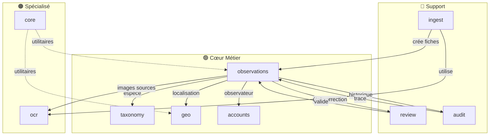

# 📋 Plan Directeur - Documentation Observations Nids

> **Tableau de bord** pour suivre l'avancement de la documentation du projet.

---

## 🎯 Vue d'Ensemble

| Catégorie | Progression | Statut |
|-----------|-------------|--------|
| Applications Django | 9/9 | ✅ Terminé |
| Guides transverses | 2/5 | 🔵 En cours |
| Documentation générale | 2/2 | ✅ Terminé |

---

## 📦 Applications Django

### 🟢 Priorité Haute (Cœur métier)

- [x] **observations** - Fiches d'observation, saisie, workflow de correction ✅
  - 🔗 Pointe vers : `taxonomy` (espèces), `geo` (localisation), `accounts` (observateurs), `audit` (historique)
  - 📌 **Priorité 1** : Application centrale du projet
  - 📄 Fichiers : `observations.md`, `observations_saisie_formulaires.md`

- [x] **taxonomy** - Gestion des espèces et codes GONM ✅
  - 🔗 Pointé par : `observations` (espèce de la fiche)
  - 📝 Contient : Ordre, Famille, Espece, codes GONM
  - 📄 Fichier : `taxonomy.md`

- [x] **geo** - Communes et géolocalisation ✅
  - 🔗 Pointé par : `observations` (localisation des fiches)
  - 📝 Contient : CommuneFrance, AncienneCommune, Localisation
  - 📄 Fichier : `geo.md`

- [x] **accounts** - Authentification et utilisateurs ✅
  - 🔗 Pointé par : `observations` (observateur), `audit` (modifié par)
  - 📝 Contient : Utilisateur, Notification, rôles
  - 📄 Fichier : `accounts.md`

### 🔵 Priorité Moyenne (Support)

- [x] **review** - Validation et correction des fiches ✅
  - 🔗 Travaille avec : `observations` (état de correction)
  - 📝 Contient : Validation, HistoriqueValidation
  - 📄 Fichier : `review.md`

- [x] **audit** - Historique et traçabilité ✅
  - 🔗 Pointé par : `observations` (historique des modifications)
  - 📝 Contient : HistoriqueModification
  - 📄 Fichier : `audit.md`

- [x] **ingest** - Import JSON et workflow batch ✅
  - 🔗 Travaille avec : `observations` (création de fiches), `ocr` (transcription)
  - 📝 Contient : PreparationImage, TranscriptionBrute, EspeceCandidate, ImportationEnCours
  - 📄 Fichier : `ingest.md`

### 🟠 Priorité Basse (Spécialisé)

- [x] **ocr** - Transcription OCR avec Gemini ✅
  - 🔗 Travaille avec : `observations` (ImageSource), `ingest` (traitement)
  - 📝 Contient : TranscriptionOCR, évaluation des modèles
  - 📄 Fichier : `ocr.md`

- [x] **core** - Utilitaires partagés ✅
  - 🔗 Utilisé par : toutes les applications
  - 📝 Contient : Constantes, modèles abstraits, exceptions
  - 📄 Fichier : `core.md`

---

## 📖 Guides Transverses

### 🔵 Fonctionnement Métier

- [x] **workflow_fiche.md** - Workflow complet d'une fiche ✅
  - 📝 Du téléversement de l'image à la validation finale
  - 🔗 Implique : `observations`, `ocr`, `ingest`, `review`, `audit`
  - 📌 Diagramme de flux complet, états, transitions
  - 📄 Fichier : `guides/workflow_fiche.md`

- [x] **permissions.md** - Système de permissions ✅
  - 📝 Rôles et droits par fonctionnalité
  - 🔗 Implique : `accounts`, `observations`, `review`
  - 📌 Matrice de permissions, cas d'usage
  - 📄 Fichier : `guides/permissions.md`

- [ ] **ocr_gemini.md** - Intégration OCR Gemini
  - 📝 Pipeline de transcription des fiches papier
  - 🔗 Implique : `ocr`, `ingest`, `observations`
  - 📌 Configuration API, prompts, évaluation qualité

### 🚀 Déploiement

- [ ] **deploiement_linux_windows.md** - Déploiement natif
  - 📝 Installation sur Linux (Ubuntu/Debian) et Windows
  - 📌 Prérequis, Python, PostgreSQL, Redis, Celery
  - 📌 Configuration Nginx/Apache, systemd/services Windows

- [ ] **deploiement_docker.md** - Déploiement avec Docker
  - 📝 Installation via Docker Compose
  - 📌 Images, volumes, réseaux, variables d'environnement
  - 📌 Production vs développement, mise à jour

---

## 📚 Documentation Générale

- [x] **README.md** - Vue d'ensemble du projet ✅
  - 📝 Présentation, fonctionnalités, quick start
  - 📄 Fichier : `README.md`

- [x] **architecture.md** - Architecture technique ✅
  - 📝 Stack technique, flux de données, schémas Mermaid
  - 📄 Fichier : `architecture.md`

---

## 🔄 Liens Logiques Entre Applications



---

## 📝 Notes de Rédaction

### Placeholders à utiliser

Pour les liens vers des sections non encore documentées :

```markdown
[🔗 Voir documentation Geo (à venir)](./geo.md)
[🔗 Voir documentation Taxonomy (à venir)](./taxonomy.md)
```

### Convention de nommage des fichiers

| Type | Répertoire | Exemple |
|------|------------|---------|
| Application Django | `applications/` | `observations.md`, `taxonomy.md` |
| Guide métier | `guides/` | `workflow_fiche.md`, `permissions.md` |
| Guide déploiement | `deploiement/` | `deploiement_docker.md` |
| Documentation générale | `docs/` | `README.md`, `architecture.md` |

---

## ✅ Journal d'Avancement

| Date | Action | Par |
|------|--------|-----|
| 2026-01-18 | Création du plan directeur | Claude |
| 2026-01-18 | Documentation `observations.md` | Claude |
| 2026-01-18 | Annexe `observations_saisie_formulaires.md` (observateur, espèces, communes) | Claude |
| 2026-01-18 | Documentation `taxonomy.md` | Claude |
| 2026-01-18 | Documentation `geo.md` | Claude |
| 2026-01-18 | Documentation `accounts.md` | Claude |
| 2026-01-18 | Documentation `review.md` | Claude |
| 2026-01-18 | Documentation `ingest.md` | Claude |
| 2026-01-18 | Documentation `ocr.md` | Claude |
| 2026-01-18 | Documentation `audit.md` | Claude |
| 2026-01-18 | Documentation `core.md` | Claude |
| 2026-01-18 | Documentation `README.md` | Claude |
| 2026-01-18 | Documentation `architecture.md` | Claude |
| 2026-01-18 | Guide `workflow_fiche.md` | Claude |
| 2026-01-18 | Guide `permissions.md` | Claude |
