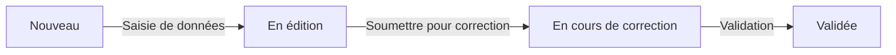

# Guide d'utilisation des fiches d'observation

## Table des matières
- [Vue d'ensemble](#vue-densemble)
- [Mode Édition](#mode-édition)
- [Soumission pour correction](#soumission-pour-correction)
- [Mode Correction](#mode-correction)
- [Statuts des fiches](#statuts-des-fiches)
- [Bonnes pratiques](#bonnes-pratiques)

---

## Vue d'ensemble

Le système de gestion des fiches d'observation suit un workflow en trois étapes :
1. **Édition** : Saisie et modification par l'observateur
2. **Correction** : Révision par les reviewers/administrateurs
3. **Validation** : Fiche finalisée et validée

---

## Mode Édition

### Accès au mode édition

**Pour une nouvelle fiche :**
- Depuis la page d'accueil : cliquer sur "Nouvelle observation"
- URL : `http://127.0.0.1:8000/observations/`

**Pour une fiche existante :**
- Depuis la page d'accueil : section "Mes fiches en cours d'édition" → bouton "Continuer"
- Depuis la liste : bouton "Corriger"
- URL : `http://127.0.0.1:8000/observations/modifier/{fiche_id}/`

### Saisie des données

#### Champs obligatoires
- **Observateur** : Automatiquement renseigné avec l'utilisateur connecté
- **Espèce** : Sélection dans la liste
- **Année** : Année de l'observation
- **Date d'observation** : Au moins une observation avec date

#### Sections de la fiche

1. **Informations générales**
   - Observateur, Espèce, Année

2. **Localisation**
   - Commune, Département, Lieu-dit
   - Coordonnées GPS (Latitude, Longitude, Altitude)
   - Description du paysage et des alentours

3. **Description du nid**
   - Utilisé par le même couple (case à cocher)
   - Hauteur du nid (cm)
   - Hauteur du couvert (cm)
   - Détails du nid (description texte)

4. **Observations**
   - Date et heure d'observation
   - Nombre d'œufs
   - Nombre de poussins
   - Notes d'observation
   - Possibilité d'ajouter plusieurs observations

5. **Résumé de l'observation**
   - Premier œuf pondu (jour/mois)
   - Premier poussin éclos (jour/mois)
   - Premier poussin volant (jour/mois)
   - Compteurs : œufs pondus, éclos, non éclos, poussins

6. **Causes d'échec et remarques**
   - Description des causes d'échec
   - Remarques (avec bouton "Ajouter/Modifier")

### Gestion des valeurs non observées

#### Règle fondamentale : NULL vs 0

Il est essentiel de bien distinguer entre :
- **NULL (champ vide)** = Donnée non observée / non accessible
- **0 (zéro)** = Donnée observée, résultat = zéro
- **Valeur > 0** = Nombre observé

#### Exemples concrets

**Cas 1 : Nid inaccessible en hauteur**
```
Nombre d'œufs pondus : [vide]        → NULL = Je n'ai pas pu observer
Nombre d'œufs éclos  : [vide]        → NULL = Je n'ai pas pu observer
Nombre de poussins   : [vide]        → NULL = Je n'ai pas pu observer
```
✅ **Aucune contrainte de cohérence ne s'applique**

**Cas 2 : Nid avec ponte qui a échoué**
```
Nombre d'œufs pondus : 3             → Observé : 3 œufs pondus
Nombre d'œufs éclos  : 0             → Observé : aucun œuf n'a éclos
Nombre de poussins   : 0             → Observé : aucun poussin
```
✅ **Contraintes appliquées : 0 ≤ 3 (OK)**

**Cas 3 : Observation partielle**
```
Nombre d'œufs pondus : [vide]        → NULL = Ponte pas observée
Nombre d'œufs éclos  : [vide]        → NULL = Éclosion pas observée
Nombre de poussins   : 2             → Observé : 2 poussins au nid
```
✅ **Seules les valeurs renseignées sont vérifiées**

**Cas 4 : Suivi complet**
```
Nombre d'œufs pondus : 5             → 5 œufs pondus
Nombre d'œufs éclos  : 4             → 4 œufs ont éclos
Nombre de poussins   : 3             → 3 poussins ont survécu
```
✅ **Contraintes appliquées : 3 ≤ 4 ≤ 5 (OK)**

#### Comment saisir NULL ?

1. **Pour un nouveau champ** : Laissez-le vide
2. **Pour revenir à NULL** :
   - Cliquez dans le champ
   - Supprimez tout le contenu (Suppr ou Backspace)
   - Sortez du champ (Tab ou clic ailleurs)
   - Le champ affiche alors "Non observé"

#### Indication visuelle

- **Placeholder** : "Non observé" affiché dans les champs vides
- **Texte d'aide** : "Vide = non observé" sous chaque champ de comptage
- **Pas de valeur par défaut** : Les nouveaux champs sont vides (NULL)

#### Avantages de cette approche

✅ **Précision scientifique** : Différenciation claire entre "pas observé" et "zéro"
✅ **Flexibilité** : Permet de saisir des observations partielles
✅ **Pas de blocage** : Les contraintes ne bloquent que les incohérences réelles
✅ **Évolutivité** : Possibilité de compléter les données ultérieurement

### Effacement automatique des valeurs par défaut

Les champs avec des valeurs par défaut ("Non spécifié", "0", etc.) s'effacent automatiquement au focus pour faciliter la saisie.

### Ajout d'observations multiples

Les observations permettent de suivre l'évolution du nid au fil du temps. Vous pouvez en ajouter autant que nécessaire.

#### Procédure d'ajout

⚠️ **Important** : Le bouton "+ Ajouter une observation" n'est visible que pour les fiches déjà sauvegardées (avec un numéro de fiche).

**Étapes** :
1. **Sauvegarder la fiche** si ce n'est pas déjà fait (bouton "Enregistrer")
2. Cliquer sur le bouton "**+ Ajouter une observation**" (dans la section Observations)
3. Une fenêtre modale s'ouvre avec le formulaire

**Formulaire d'observation** :
```
┌─────────────────────────────────────┐
│  Ajouter une observation            │
├─────────────────────────────────────┤
│ Date et heure : [DD/MM/YYYY HH:MM] │
│ Nombre d'œufs : [vide ou nombre]   │
│ Nombre de poussins : [vide/nombre] │
│ Observations : [texte libre]        │
├─────────────────────────────────────┤
│     [Annuler]    [Ajouter]         │
└─────────────────────────────────────┘
```

4. **Remplir les champs** :
   - **Date et heure** : Obligatoire (moment de l'observation)
   - **Nombre d'œufs** : Facultatif (laisser vide si non observé)
   - **Nombre de poussins** : Facultatif (laisser vide si non observé)
   - **Observations** : Notes textuelles (comportements, événements, etc.)

5. Cliquer sur "**Ajouter**"
6. La fenêtre se ferme
7. La nouvelle observation apparaît dans le tableau

#### Modification d'une observation existante

❌ **Non disponible via l'interface** : Pour modifier une observation, utilisez le mode correction ou contactez un administrateur.

#### Suppression d'une observation

⚠️ **À faire avec précaution**
1. Identifier l'observation à supprimer dans le tableau
2. Utiliser le bouton de suppression associé (si disponible)
3. Confirmer la suppression

#### Bonnes pratiques pour les observations

✅ **Fréquence** : Observer régulièrement (1 à 2 fois par semaine minimum)
✅ **Précision** : Noter l'heure exacte de l'observation
✅ **Contexte** : Décrire les comportements observés dans le champ "Observations"
✅ **Photos** : Mentionner si des photos ont été prises
✅ **Météo** : Noter les conditions météorologiques si pertinent

**Exemple d'observation bien documentée** :
```
Date : 15/04/2025 08:30
Œufs : 4
Poussins : 0
Observations : "Femelle couve, mâle apporte des matériaux.
Temps ensoleillé, 15°C. Photos prises à distance."
```

### Gestion des remarques

Les remarques permettent d'ajouter des commentaires généraux sur la fiche (différentes des observations ponctuelles).

#### Accès à l'interface des remarques

**Deux méthodes pour ouvrir la fenêtre modale** :

**Méthode 1 - Bouton visible** (Recommandée) :
1. Localiser la section "Remarques" dans la fiche
2. Cliquer sur le bouton "**Ajouter/Modifier**" (bleu, à côté du titre)
3. La fenêtre modale s'ouvre

**Méthode 2 - Double-clic** :
1. Double-cliquer n'importe où sur le **tableau des remarques**
2. La fenêtre modale s'ouvre

#### Interface de la fenêtre modale

```
┌────────────────────────────────────────┐
│  Édition des remarques            [×]  │
├────────────────────────────────────────┤
│                                        │
│  [15/04/2025 10:30]                   │
│  ┌──────────────────────────────────┐ │
│  │ Remarque initiale sur la fiche   │ │
│  └──────────────────────────────────┘ │
│                           [Supprimer] │
│                                        │
│  [16/04/2025 14:20]                   │
│  ┌──────────────────────────────────┐ │
│  │ Nid difficile d'accès           │ │
│  └──────────────────────────────────┘ │
│                           [Supprimer] │
│                                        │
│  [+ Ajouter une remarque]             │
│                                        │
├────────────────────────────────────────┤
│        [Annuler]    [Sauvegarder]     │
└────────────────────────────────────────┘
```

#### Ajouter une remarque

1. Dans la fenêtre modale, cliquer sur "**+ Ajouter une remarque**"
2. Un nouveau champ de texte apparaît
3. Saisir le texte de la remarque
4. Cliquer sur "**Sauvegarder**" pour enregistrer

💡 **Astuce** : Vous pouvez ajouter plusieurs remarques avant de sauvegarder

#### Modifier une remarque

1. Ouvrir la fenêtre modale
2. Cliquer dans le champ de texte de la remarque à modifier
3. Modifier le texte
4. Cliquer sur "**Sauvegarder**"

⚠️ **Note** : La date de la remarque ne change pas lors de la modification

#### Supprimer une remarque

1. Ouvrir la fenêtre modale
2. Cliquer sur le bouton "**Supprimer**" à droite de la remarque
3. La remarque est marquée pour suppression (barrée ou grisée)
4. Cliquer sur "**Sauvegarder**" pour confirmer

#### Annuler les modifications

- Cliquer sur "**Annuler**" ou sur le "**×**" en haut à droite
- Toutes les modifications non sauvegardées sont perdues
- Les remarques restent dans leur état précédent

#### Types de remarques recommandés

**Remarques générales** :
- Contexte de l'observation (accès difficile, propriétaire contacté, etc.)
- Événements exceptionnels (tempête, prédation, etc.)
- Problèmes rencontrés (jumelles perdues, nid abandonné, etc.)

**Remarques de correction** (pour reviewers) :
- Données vérifiées et corrigées
- Incohérences détectées
- Demandes de clarification à l'observateur

**Exemple de remarques** :
```
[10/03/2025] Nid découvert, couple en construction
[25/03/2025] Propriétaire informé et coopératif
[15/04/2025] Tempête : vérifier l'état du nid
[01/05/2025] Nid abandonné après prédation supposée
```

### Sauvegarde

- Bouton "**Enregistrer**" : Sauvegarde les modifications sans changer le statut
- La fiche reste en mode édition
- Vous pouvez revenir la modifier à tout moment

---

## Soumission pour correction

### Quand soumettre ?

Soumettez votre fiche lorsque :
- ✅ Toutes les observations sont saisies pour la saison
- ✅ Les données sont complètes et vérifiées
- ✅ Vous ne prévoyez plus de modifications

⚠️ **Important** : Après soumission, vous ne pourrez plus modifier la fiche !

### Procédure de soumission

1. **Vérifier les données** : Relisez votre fiche attentivement
2. **Sauvegarder** : Cliquez sur "Enregistrer" pour sauvegarder une dernière fois
3. **Soumettre** : Cliquez sur le bouton "**Soumettre pour correction**" (vert)
4. **Confirmer** : Une popup demande confirmation
   ```
   Êtes-vous sûr de vouloir soumettre cette fiche pour correction ?
   Vous ne pourrez plus la modifier ensuite.
   ```
5. **Validation** : Cliquez sur "OK"

### Après la soumission

- **Message de confirmation** : "Fiche #{id} soumise pour correction. Complétion : {pourcentage}%"
- **Redirection** : Vers la vue détail (lecture seule)
- **Statut** : Passe de "En cours d'édition" à "**En cours de correction**"
- **Page d'accueil** : La fiche disparaît de "Mes fiches en cours d'édition"

### Pourcentage de complétion

Le système calcule automatiquement un score basé sur :
- Observateur renseigné (1 point)
- Espèce renseignée (1 point)
- Localisation complète (1 point)
- Au moins une observation (1 point)
- Données d'œufs renseignées (1 point)
- Détails du nid (1 point)
- Hauteur du nid (1 point)
- Image associée (1 point)

**Total : 8 critères = 100%**

---

## Mode Correction

### Qui peut corriger ?

- **Reviewers** : Rôle dédié à la correction des fiches
- **Administrateurs** : Accès complet

### Accès au mode correction

**Depuis la liste des fiches** :
- URL : `http://127.0.0.1:8000/observations/liste/`
- Bouton "Corriger" sur chaque fiche en statut "En cours de correction"

### Interface de correction

L'interface de correction est identique à celle d'édition, mais pour une fiche soumise :
- Tous les champs sont modifiables
- Possibilité d'ajouter/modifier/supprimer des observations
- Possibilité d'ajouter des remarques de correction

### Processus de correction

1. **Révision des données**
   - Vérifier la cohérence des observations
   - Contrôler les dates
   - Valider les comptages (œufs, poussins)

2. **Corrections si nécessaire**
   - Modifier les données incorrectes
   - Ajouter des remarques pour l'observateur
   - Compléter les informations manquantes

3. **Sauvegarde**
   - Cliquer sur "Enregistrer" pour sauvegarder les corrections
   - L'historique des modifications est automatiquement enregistré

4. **Validation finale** (à venir)
   - Une fois la correction terminée, passer le statut à "Validée"
   - La fiche devient alors définitive

### Historique des modifications

- Accessible via le bouton "**Historique**" (s'ouvre dans un nouvel onglet)
- Affiche toutes les modifications avec :
  - Date et heure
  - Utilisateur ayant effectué la modification
  - Champ modifié
  - Ancienne et nouvelle valeur
  - Catégorie (fiche, localisation, observation, remarque, etc.)

---

## Statuts des fiches

### Cycle de vie d'une fiche



### Détail des statuts

| Statut | Badge | Description | Actions possibles |
|--------|-------|-------------|-------------------|
| **Nouveau** | Gris | Fiche créée, aucune donnée | Éditer, Soumettre |
| **En édition** | Jaune | Données en cours de saisie | Éditer, Soumettre |
| **En cours de correction** | Orange | Soumise, en attente de correction | Corriger (reviewers) |
| **Validée** | Vert | Fiche validée et finalisée | Visualiser uniquement |

### Visualisation des statuts

**Sur la page d'accueil** :
- Section "Mes fiches en cours d'édition" : fiches avec statut "Nouveau" ou "En édition"
- Les fiches soumises n'apparaissent plus dans cette section

**Sur la liste des fiches** :
- Colonne "État de correction" avec badge coloré
- Barre de progression pour les fiches en correction
- Icône de validation pour les fiches validées

---

## Bonnes pratiques

### Pour les observateurs

1. **Saisie régulière** : Enregistrez vos observations au fur et à mesure de la saison
2. **Valeurs NULL** : Utilisez les champs vides pour les données non observables
3. **Remarques** : Ajoutez des remarques pour noter des événements particuliers
4. **Vérification** : Relisez votre fiche avant soumission
5. **Timing** : Soumettez uniquement quand la saison d'observation est terminée

### Pour les correcteurs

1. **Cohérence** : Vérifiez la logique des données (poussins ≤ œufs éclos, etc.)
2. **Dates** : Contrôlez la chronologie des événements
3. **Remarques** : Utilisez les remarques pour communiquer avec l'observateur
4. **Historique** : Consultez l'historique avant de modifier
5. **Documentation** : Documentez vos corrections dans les remarques

### Contraintes de cohérence

Le système vérifie automatiquement :
- ✅ Nombre d'œufs éclos ≤ œufs pondus
- ✅ Nombre d'œufs non éclos ≤ œufs pondus
- ✅ Nombre de poussins ≤ œufs éclos

💡 **Ces contraintes ne s'appliquent que si les valeurs sont renseignées** (non NULL)

### Gestion des erreurs courantes

**Erreur : "La contrainte n'est pas respectée"**
- Cause : Incohérence dans les comptages
- Solution : Vérifiez que poussins ≤ œufs éclos ≤ œufs pondus
- Alternative : Laissez vide si non observé

**Erreur : Impossible de soumettre**
- Cause : Fiche déjà soumise ou statut incorrect
- Solution : Vérifiez le statut actuel de la fiche

**Bouton "Soumettre" non visible**
- Cause : Fiche déjà soumise (statut ≠ "Nouveau" ou "En édition")
- Solution : Rafraîchissez la page (Ctrl+F5)

---

## Raccourcis et astuces

### Navigation rapide

- **Page d'accueil** : `/`
- **Nouvelle observation** : `/observations/`
- **Liste des fiches** : `/observations/liste/`
- **Éditer une fiche** : `/observations/modifier/{fiche_id}/`
- **Visualiser une fiche** : `/observations/{fiche_id}/`

### Astuces de saisie

- **Tab** : Naviguer entre les champs
- **Entrée** : Valider un champ de saisie
- **Clic sur champ vide** : Les valeurs par défaut s'effacent automatiquement
- **Effacer un champ** : Pour revenir à "non observé", supprimez le contenu

### Boutons d'action

| Bouton | Couleur | Action |
|--------|---------|--------|
| Enregistrer | Bleu | Sauvegarde sans changer le statut |
| Soumettre pour correction | Vert | Passe en mode correction |
| Historique | Info | Ouvre l'historique des modifications |
| Voir détails | Gris | Visualisation en lecture seule |

---

## Support et questions

Pour toute question ou problème :
- Vérifiez d'abord ce guide
- Consultez l'historique des modifications de la fiche
- Contactez un administrateur si nécessaire

---

*Dernière mise à jour : 02/10/2025*
