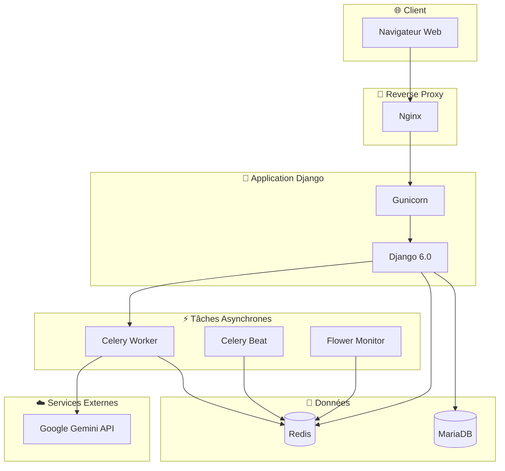
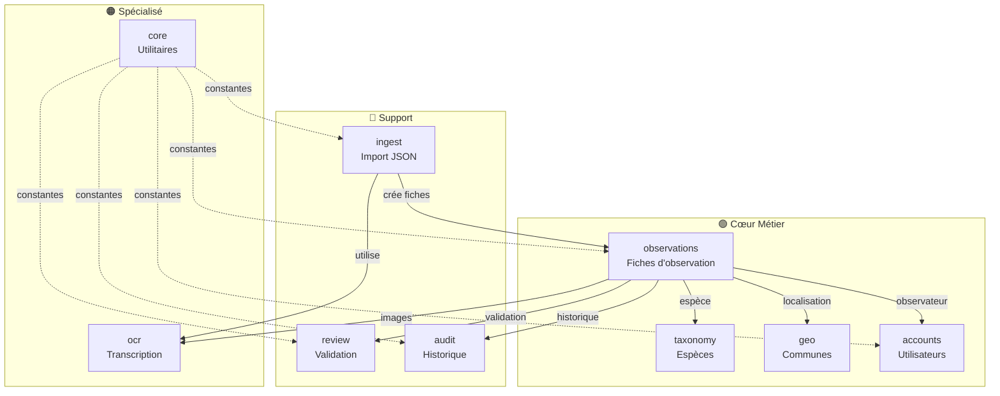
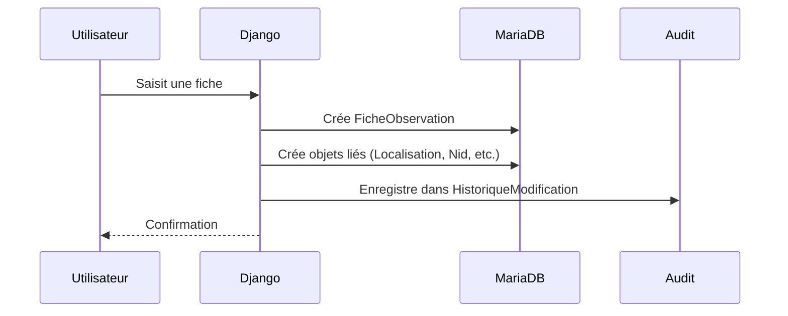
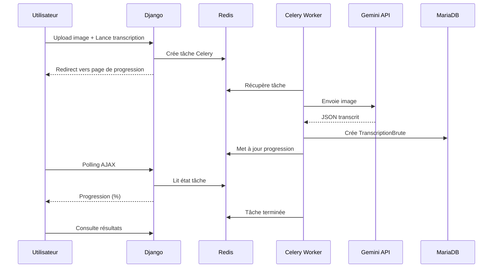
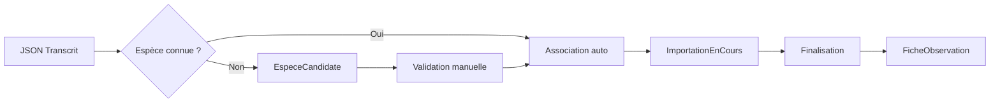
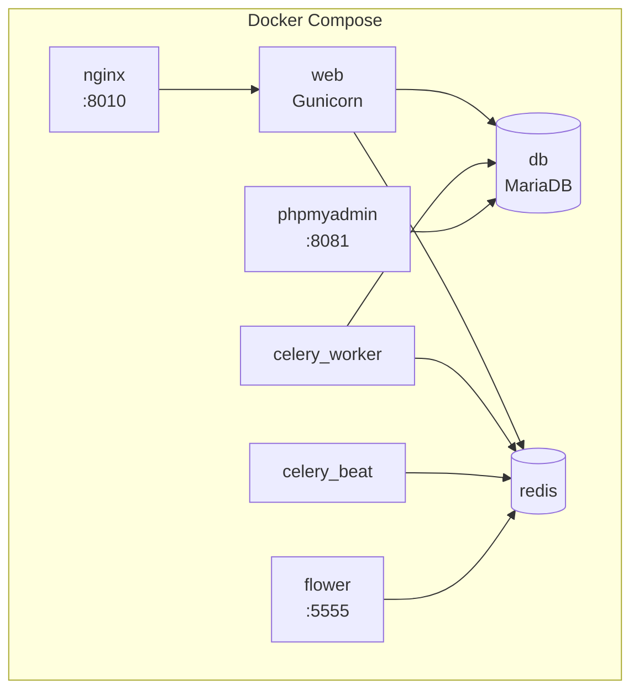
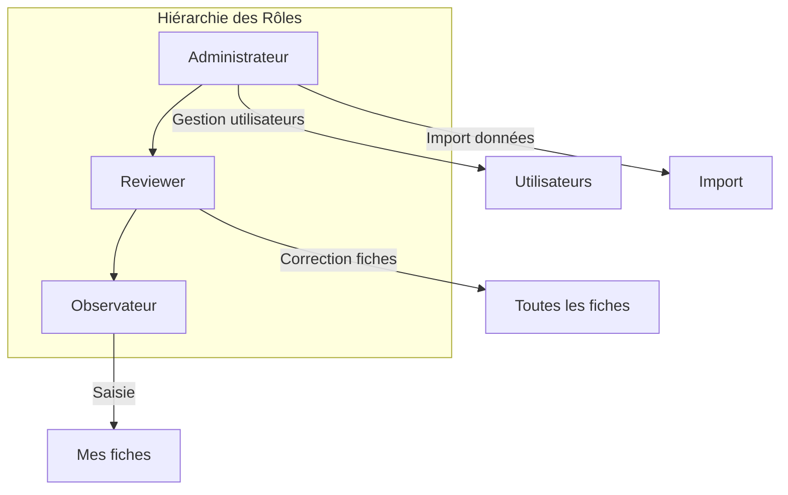
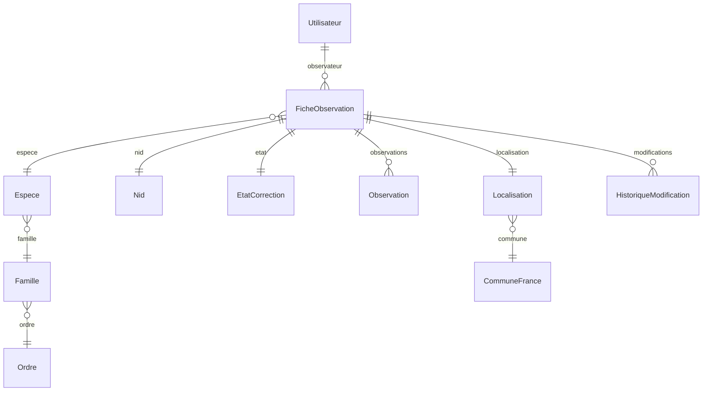

# 🏗️ Architecture Technique

> **Vue d'ensemble de l'architecture du projet Observations Nids**

---

## 🎯 Vue d'Ensemble



---

## 📦 Stack Technique

### Backend

| Composant | Version | Rôle |
|-----------|---------|------|
| **Python** | 3.11+ | Langage principal |
| **Django** | 6.0.1 | Framework web |
| **Gunicorn** | - | Serveur WSGI |
| **Celery** | 5.6.2 | Tâches asynchrones |

### Base de Données

| Composant | Version | Rôle |
|-----------|---------|------|
| **MariaDB** | 10.11 | Base de données principale |
| **Redis** | 7 | Cache + Broker Celery |

### Infrastructure

| Composant | Version | Rôle |
|-----------|---------|------|
| **Nginx** | Alpine | Reverse proxy + Fichiers statiques |
| **Docker** | - | Conteneurisation |
| **Docker Compose** | - | Orchestration |

### Services Externes

| Service | Rôle |
|---------|------|
| **Google Gemini** | Transcription OCR des fiches papier |

---

## 🗂️ Architecture Applicative

### Applications Django



### Responsabilités des Applications

| Application | Responsabilité | Modèles Principaux |
|-------------|----------------|-------------------|
| **observations** | Gestion des fiches | FicheObservation, Observation, Nid, EtatCorrection |
| **taxonomy** | Référentiel espèces | Ordre, Famille, Espece |
| **geo** | Géolocalisation | CommuneFrance, AncienneCommune, Localisation |
| **accounts** | Authentification | Utilisateur, Notification |
| **review** | Workflow validation | Validation, HistoriqueValidation |
| **audit** | Traçabilité | HistoriqueModification |
| **ingest** | Import données | TranscriptionBrute, EspeceCandidate, ImportationEnCours |
| **ocr** | OCR Gemini | TranscriptionOCR |
| **core** | Utilitaires | Constantes, Modèles abstraits, Exceptions |

---

## 🔄 Flux de Données

### Flux Principal : Saisie Manuelle



### Flux OCR : Transcription Automatique



### Flux Import : JSON vers Fiche



---

## 🐳 Architecture Docker

### Services



### Volumes

| Volume | Contenu |
|--------|---------|
| `db_data` | Données MariaDB |
| `redis_data` | Données Redis (AOF) |
| `static_volume` | Fichiers statiques Django |
| `/opt/.../media` | Fichiers uploadés (images) |

### Réseaux

| Réseau | Rôle |
|--------|------|
| `observations_network` | Communication inter-services |

---

## 🔐 Sécurité

### Authentification

- Sessions Django avec cookies sécurisés
- Tokens de réinitialisation de mot de passe
- Validation des comptes par administrateur

### Autorisations



### Protection des Données

- CSRF protection
- XSS protection (templates Django)
- SQL injection protection (ORM Django)
- Cookies sécurisés en production (`SECURE_SSL_REDIRECT`, `SESSION_COOKIE_SECURE`)

---

## 📊 Base de Données

### Schéma Simplifié



### Indexation

| Table | Index | Colonnes |
|-------|-------|----------|
| `FicheObservation` | PK | `num_fiche` |
| `Localisation` | Index | `code_insee` |
| `CommuneFrance` | Index | `nom`, `code_departement` |
| `Espece` | Unique | `nom` |
| `HistoriqueModification` | Index | `categorie` |

---

## ⚡ Performance

### Optimisations

| Technique | Implémentation |
|-----------|----------------|
| **Cache** | Redis pour sessions et résultats Celery |
| **Indexation** | Index sur champs fréquemment filtrés |
| **Pagination** | Listes paginées (20-50 éléments) |
| **Lazy loading** | `select_related()` et `prefetch_related()` |
| **Async** | Tâches longues via Celery |

### Limitations Redis

- Résultats Celery limités à 150-200 entrées
- TTL sur les résultats de tâches

---

## 🔧 Configuration

### Environnements

| Environnement | Fichier | Caractéristiques |
|---------------|---------|------------------|
| **Développement** | `settings_local.py` | DEBUG=True, SQLite/MySQL local |
| **Production** | `settings.py` + `.env` | DEBUG=False, MariaDB, HTTPS |
| **Docker** | `docker-compose.yml` | Services conteneurisés |

### Variables Clés

```bash
# Django
SECRET_KEY=...
DEBUG=False
ALLOWED_HOSTS=example.com

# Base de données
DB_NAME=observations_db
DB_USER=obs_user
DB_PASSWORD=***
DB_HOST=db
DB_PORT=3306

# Redis / Celery
REDIS_HOST=redis
CELERY_BROKER_URL=redis://redis:6379/0
CELERY_RESULT_BACKEND=redis://redis:6379/0

# OCR
GEMINI_API_KEY=AIza...
```

---

## 📈 Monitoring

### Outils Disponibles

| Outil | URL | Rôle |
|-------|-----|------|
| **Flower** | `:5555` | Monitoring Celery |
| **phpMyAdmin** | `:8081` | Administration BDD |
| **Django Admin** | `/admin/` | Administration Django |

### Logs

| Service | Emplacement |
|---------|-------------|
| Django | `logs/django.log` |
| Celery | `logs/celery.log` |
| Nginx | Container stdout |

---

## 🔗 Voir Aussi

- [README](../README.md) - Présentation du projet
- [Applications](../applications/) - Documentation détaillée
- [Plan Directeur](../projet/docs_todo.md) - État de la documentation
