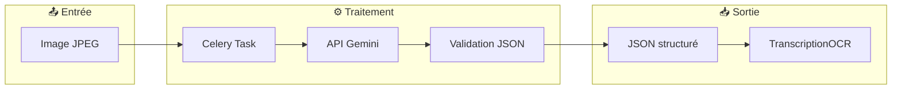
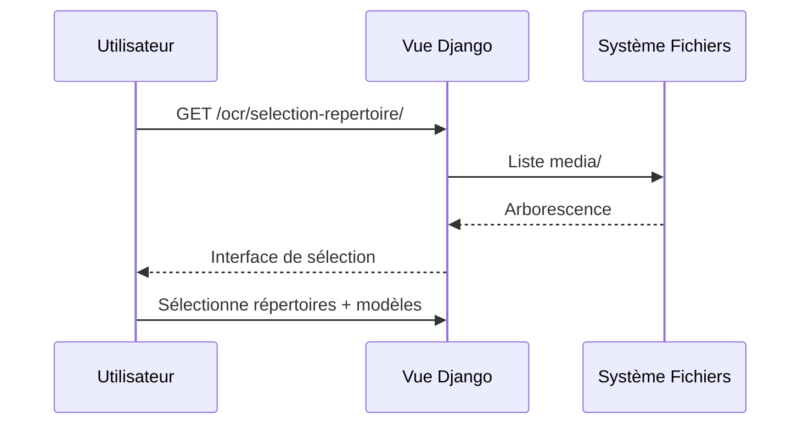
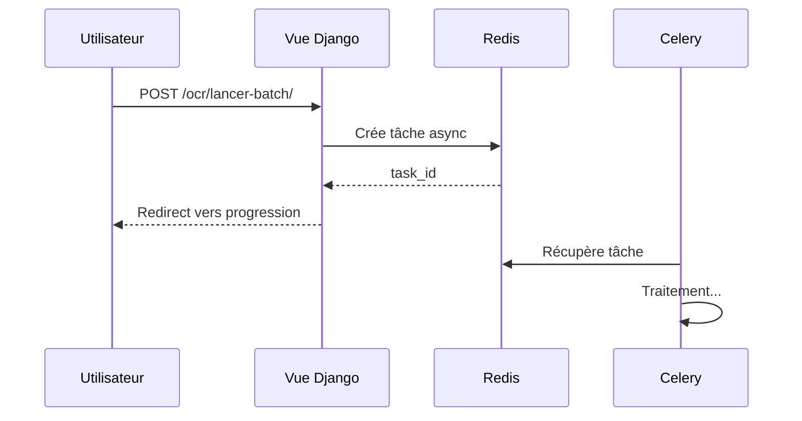
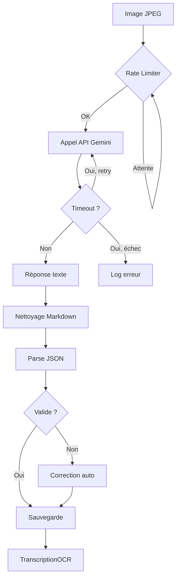
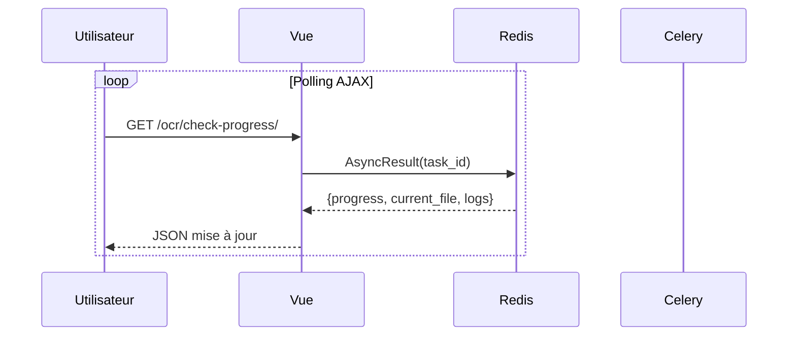

# 🤖 Intégration OCR Gemini

> **Résumé** : Pipeline de transcription des fiches papier via l'API Google Gemini.

---

## 🎯 Vue d'Ensemble



| Composant | Technologie | Rôle |
|-----------|-------------|------|
| API OCR | Google Gemini | Transcription image → texte |
| Broker | Redis | File d'attente des tâches |
| Worker | Celery | Exécution asynchrone |
| Stockage | MariaDB | Résultats et métadonnées |

---

## ⚙️ Configuration

### Clé API Gemini

**Fichier** : `.env`

```bash
GEMINI_API_KEY=AIzaSy...votre_cle_api
```

**Chargement** : `observations_nids/config.py`

```python
class Settings(BaseSettings):
    GEMINI_API_KEY: str | None = Field(default=None, alias="gemini_api_key")
```

### Modèles Disponibles

| Modèle | Identifiant API | Usage |
|--------|-----------------|-------|
| Gemini 3 Flash | `gemini-3-flash-preview` | Rapide, usage général |
| Gemini 3 Pro | `gemini-3-pro-preview` | Haute qualité |
| Gemini 2.5 Pro | `gemini-2.5-pro` | Équilibré |
| Gemini 2.5 Flash Lite | `gemini-2.5-flash-lite` | Économique |

---

## 📝 Prompts de Transcription

### Prompt Standard (Fiches Modernes)

**Fichier** : `observations/json_rep/prompt_gemini_transcription.txt`

**Sections extraites** :

| Section | Champs |
|---------|--------|
| `informations_generales` | n_fiche, observateur, n_espece, espece, annee |
| `nid` | nid_prec_t_meme_c_ple, haut_nid, h_c_vert, nid |
| `localisation` | IGN_50000, commune, dep_t, coordonnees, altitude, paysage |
| `tableau_donnees` | Jour, Mois, Heure, Nombre_oeuf, Nombre_pou, age, observations |
| `tableau_donnees_2` | 1er_o_pondu, 1er_p_eclos, 1er_p_volant, nombre_oeufs, nombre_poussins |
| `causes_echec` | causes_d_echec |
| `remarque` | Texte libre |

### Prompt Anciennes Fiches (1970-1980)

**Fichier** : `observations/json_rep/prompt_gemini_transcription_Ancienne_Fiche.txt`

**Particularités** :
- Année écrite verticalement en marge
- Cases à cocher pour succès/échec
- Normalisation des années (ex: "77" → "1977")
- Métadonnées de confiance OCR

```json
"evaluation_ocr": {
  "indice_confiance": "Elevé | Moyen | Faible",
  "zones_douteuses": "Description des zones illisibles",
  "commentaire_qualite_scan": "État du document"
}
```

### Sélection Automatique du Prompt

```python
def _charger_prompt_selon_type_fiche(chemin_relatif: str) -> str:
    if "ancien" in chemin_relatif.lower():
        return PROMPT_ANCIENNE_FICHE
    return PROMPT_STANDARD
```

---

## 🔄 Pipeline de Transcription

### Étape 1 : Sélection des Répertoires



### Étape 2 : Lancement du Batch



### Étape 3 : Traitement par Image



---

## ⚡ Gestion des Erreurs

### Retry avec Backoff Exponentiel

**Fichier** : `ocr/tasks.py`

```python
@retry_with_backoff(max_retries=3, initial_delay=2, max_delay=16)
def call_gemini_api_with_timeout(client, model_name, prompt, image_path, timeout=120):
    ...
```

| Tentative | Délai avant retry |
|-----------|-------------------|
| 1 | 2 secondes |
| 2 | 4 secondes |
| 3 | 8 secondes |
| 4 | 16 secondes (max) |

### Types d'Erreurs

| Erreur | Traitement | Résultat |
|--------|------------|----------|
| Timeout (120s) | 3 retries | `timeout` si échec |
| JSON invalide | Correction auto | `_raw.json` + `_result.json` |
| Erreur API | Log + continue | `error` avec détails |

### Rate Limiting

```python
class RateLimiter:
    def __init__(self, requests_per_minute=60):
        self.min_interval = 60.0 / requests_per_minute  # 1 seconde
```

- **Limite API** : 60 requêtes/minute
- **Intervalle minimum** : 1 seconde entre requêtes

---

## 📊 Validation et Correction JSON

### Structure Attendue

```json
{
  "informations_generales": { ... },
  "nid": { ... },
  "localisation": { ... },
  "tableau_donnees": [ ... ],
  "tableau_donnees_2": { ... },
  "causes_echec": { ... },
  "remarque": "..."
}
```

### Validation Automatique

**Fichier** : `observations/json_rep/json_sanitizer.py`

```python
def validate_json_structure(data) -> list[str]:
    """Retourne liste d'erreurs (vide si valide)"""
    errors = []

    # Vérifie 7 sections obligatoires
    required_keys = [
        'informations_generales', 'nid', 'localisation',
        'tableau_donnees', 'tableau_donnees_2',
        'causes_echec', 'remarque'
    ]

    for key in required_keys:
        if key not in data:
            errors.append(f"Section manquante: {key}")

    return errors
```

### Correction Automatique

Si le JSON est invalide, `corriger_json()` :
- Normalise les noms de champs
- Complète les sections manquantes
- Corrige les types de données
- Sauvegarde version brute (`_raw.json`) et corrigée (`_result.json`)

---

## 💾 Stockage des Résultats

### Modèle TranscriptionOCR

**Fichier** : `ocr/models.py`

| Champ | Type | Description |
|-------|------|-------------|
| `fiche` | FK | Fiche liée (si trouvée) |
| `chemin_json` | CharField | Chemin vers résultat JSON |
| `chemin_image` | CharField | Chemin vers image source |
| `modele_ocr` | CharField | Modèle utilisé |
| `type_image` | CharField | `brute` ou `optimisee` |
| `temps_traitement_secondes` | Float | Durée du traitement |
| `statut_evaluation` | CharField | État de l'évaluation qualité |

### Métriques de Qualité

| Métrique | Description |
|----------|-------------|
| `score_global` | Score 0-100% |
| `nombre_champs_corrects` | Champs sans erreur |
| `nombre_erreurs_dates` | Erreurs sur les dates |
| `nombre_erreurs_nombres` | Erreurs numériques |
| `nombre_erreurs_especes` | Erreurs taxonomiques |
| `details_comparaison` | JSON du diff champ par champ |

### Organisation des Fichiers

```
media/
└── transcription_results/
    └── Ancienne_fiche/
        └── Sans_traitement/
            ├── gemini_3_flash/
            │   ├── fiche_001_result.json
            │   └── fiche_001_raw.json
            └── gemini_2.5_pro/
                └── fiche_001_result.json
```

---

## 🖥️ Interface Utilisateur

### URLs Disponibles

| URL | Fonction |
|-----|----------|
| `/ocr/selection-repertoire/` | Navigation et sélection |
| `/ocr/analyser-correspondances/` | Vérifier fiches existantes |
| `/ocr/lancer-batch/` | Démarrer transcription |
| `/ocr/progression/<task_id>/` | Suivi en temps réel |
| `/ocr/resultats/<task_id>/` | Résultats finaux |

### Suivi de Progression



**Informations affichées** :
- Pourcentage global
- Fichier en cours
- 150 derniers logs (limité pour Redis)
- Erreurs éventuelles

---

## 🔧 Administration

### Django Admin

**URL** : `/admin/ocr/transcriptionocr/`

**Fonctionnalités** :
- Code couleur des scores (vert ≥90%, jaune ≥75%, orange ≥50%, rouge <50%)
- Filtres par modèle, type d'image, statut
- Actions groupées pour évaluation
- Recherche par numéro de fiche

### Actions Disponibles

| Action | Description |
|--------|-------------|
| Marquer comme évaluée | Change statut à `evaluee` |
| Réinitialiser évaluation | Remet à `non_evaluee` |
| Exporter JSON | Télécharge les résultats |

---

## ⚠️ Points d'Attention

!!! warning "Clé API"
    Ne jamais commiter la clé API Gemini. Utiliser `.env` et `.gitignore`.

!!! info "Rate Limiting"
    L'API Gemini limite à 60 requêtes/minute. Le rate limiter gère automatiquement les délais.

!!! tip "Fichiers volumineux"
    Les images JPEG doivent être < 20 Mo pour l'API Gemini. Utiliser la préparation d'images si nécessaire.

!!! danger "Coûts API"
    Surveiller la consommation API. Les modèles "Pro" coûtent plus cher que "Flash".

---

## 📈 Performance

| Paramètre | Valeur | Configurable |
|-----------|--------|--------------|
| Timeout par image | 120 secondes | Oui |
| Retries max | 3 | Oui |
| Rate limit | 60 req/min | Non (limite API) |
| Logs en mémoire | 150 entrées | Oui |
| Workers Celery | 2 | Oui |

---

## 🔗 Voir Aussi

- [📦 Application OCR](../applications/ocr.md) - Modèles et vues
- [📦 Application Ingest](../applications/ingest.md) - Import des JSON
- [🔄 Workflow Fiche](./workflow_fiche.md) - Intégration au workflow
