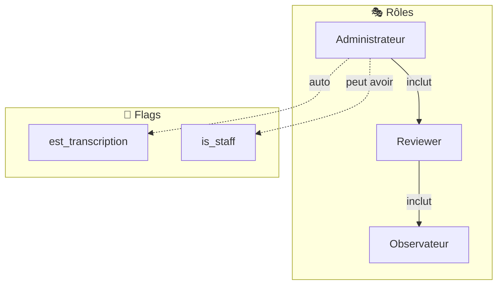
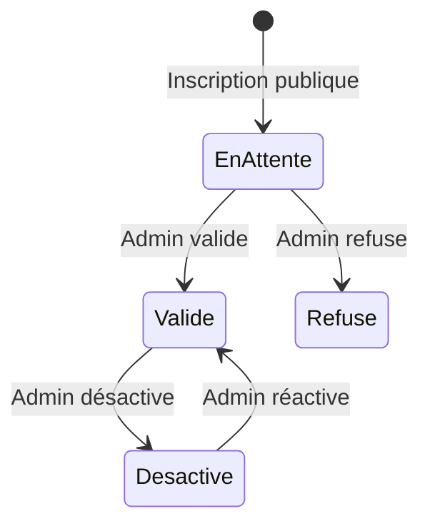
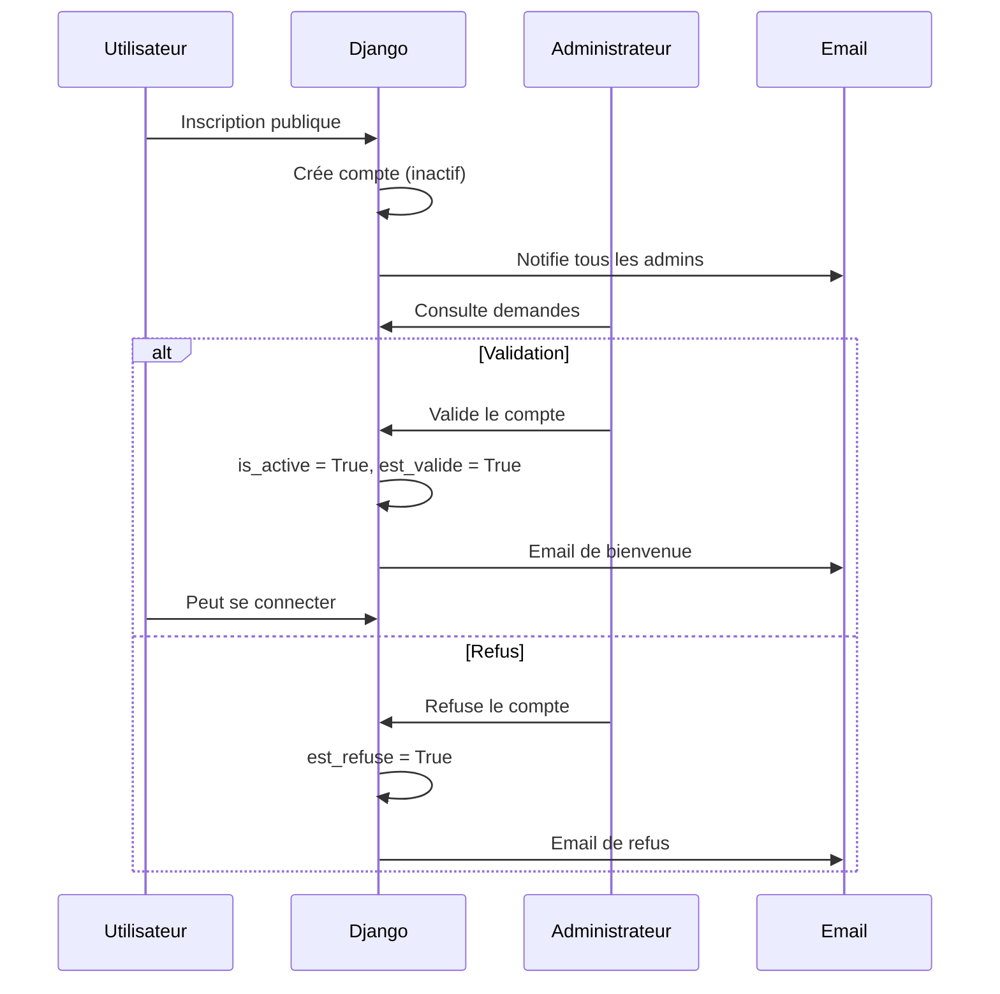

# 🔐 Système de Permissions

> **Résumé** : Rôles utilisateurs, droits par fonctionnalité et matrice de permissions.

---

## 🎯 Vue d'Ensemble

Le système de permissions repose sur **3 rôles** et **2 flags** additionnels :



---

## 👥 Rôles Utilisateur

### Définition

**Fichier** : `core/constants.py`

```python
ROLE_CHOICES = [
    ('observateur', 'Observateur'),
    ('reviewer', 'Reviewer'),
    ('administrateur', 'Administrateur'),
]
```

### Hiérarchie

| Rôle | Niveau | Description |
|------|--------|-------------|
| **Observateur** | Base | Saisie de ses propres fiches |
| **Reviewer** | Intermédiaire | Correction des fiches soumises |
| **Administrateur** | Complet | Gestion globale + tous droits |

---

## 📋 Matrice de Permissions

### Gestion des Fiches

| Action | Observateur | Reviewer | Admin |
|--------|:-----------:|:--------:|:-----:|
| Créer une fiche | ✅ | ❌ | ✅ |
| Modifier sa fiche (en_edition) | ✅ | ❌ | ✅ |
| Voir ses fiches | ✅ | ✅ | ✅ |
| Voir toutes les fiches | 👁️ lecture | ✅ | ✅ |
| Soumettre pour correction | ✅ | ❌ | ✅ |
| Corriger une fiche (en_cours) | ❌ | ✅ | ✅ |
| Valider une fiche | ❌ | ✅ | ✅ |
| Libérer son verrou | ❌ | ✅ | ✅ |
| Libérer tout verrou | ❌ | ❌ | ✅ |

### Gestion des Images

| Action | Observateur | Reviewer | Admin |
|--------|:-----------:|:--------:|:-----:|
| Uploader une image | ✅ | ✅ | ✅ |
| Voir ses images | ✅ | ✅ | ✅ |
| Voir toutes les images | ❌ | ❌ | ✅ |

### Transcription & Import (avec flag)

| Action | Observateur | Reviewer | Admin |
|--------|:-----------:|:--------:|:-----:|
| Accès menu Transcription | ❌* | ❌* | ✅ |
| Préparer des images | ❌* | ❌* | ✅ |
| Lancer transcription OCR | ❌* | ❌* | ✅ |
| Importer JSON | ❌* | ❌* | ✅ |
| Finaliser importations | ❌* | ❌* | ✅ |

*\* Sauf si `est_transcription = True`*

### Gestion des Utilisateurs

| Action | Observateur | Reviewer | Admin |
|--------|:-----------:|:--------:|:-----:|
| Voir liste utilisateurs | ❌ | ❌ | ✅ |
| Créer un utilisateur | ❌ | ❌ | ✅ |
| Modifier un utilisateur | ❌ | ❌ | ✅ |
| Valider un compte | ❌ | ❌ | ✅ |
| Refuser un compte | ❌ | ❌ | ✅ |
| Désactiver un utilisateur | ❌ | ❌ | ✅ |
| Promouvoir administrateur | ❌ | ❌ | 🔒 superuser |

### Référentiels (avec flag is_staff)

| Action | Observateur | Reviewer | Admin |
|--------|:-----------:|:--------:|:-----:|
| Gérer les espèces | ❌ | ❌ | ✅* |
| Gérer les communes | ❌ | ❌ | ✅* |

*\* Requiert également `is_staff = True`*

---

## 🚩 Flags Spéciaux

### `est_transcription`

**Objectif** : Accorder l'accès transcription/import indépendamment du rôle.

**Vérification** :
```python
def peut_transcrire(user):
    return user.is_authenticated and (
        user.est_transcription or
        user.role == 'administrateur'
    )
```

**Usage** :
- Peut être accordé à n'importe quel rôle
- Configuré lors de la validation du compte
- Donne accès à tout le workflow d'import

**Menus débloqués** :
- Préparer des images
- Transcription OCR
- Import JSON
- Gestion des importations

### `is_staff`

**Objectif** : Accès à la gestion des données référentielles.

**Menus débloqués** :
- Gestion des espèces (taxonomy)
- Gestion des communes (geo)

---

## 🔒 Protection des Vues

### Décorateurs Utilisés

| Décorateur | Effet |
|------------|-------|
| `@login_required` | Authentification obligatoire |
| `@user_passes_test(est_admin)` | Rôle administrateur requis |
| `@user_passes_test(peut_transcrire)` | Flag transcription ou admin |
| `@transcription_required` | Décorateur custom équivalent |

### Exemples de Protection

**Vue Admin uniquement** :
```python
@login_required
@user_passes_test(est_admin)
def liste_utilisateurs(request):
    ...
```

**Vue Transcription** :
```python
@login_required
@user_passes_test(peut_transcrire)
def importer_json(request):
    ...
```

**Vue authentifiée** :
```python
@login_required
def upload_image_source(request):
    ...
```

---

## 🎨 Permissions dans les Templates

### Menu Navigation (base.html)

**Section Transcription** :
```html

    <!-- Menu Transcription visible -->

```

**Section Administration** :
```html

    <!-- Menu Admin visible -->

```

**Section Référentiels** :
```html

    <!-- Menu Référentiels visible -->

```

---

## 👤 Cycle de Vie d'un Compte

### États du Compte



| État | `is_active` | `est_valide` | `est_refuse` |
|------|:-----------:|:------------:|:------------:|
| En attente | ❌ | ❌ | ❌ |
| Validé | ✅ | ✅ | ❌ |
| Refusé | ❌ | ❌ | ✅ |
| Désactivé | ❌ | ✅ | ❌ |

### Workflow d'Inscription



---

## 🔓 Verrouillage des Fiches

### Règles de Verrouillage

| Situation | Observateur | Reviewer | Admin |
|-----------|:-----------:|:--------:|:-----:|
| Fiche verrouillée par autre | 👁️ lecture | 👁️ lecture | ⚠️ peut forcer |
| Fiche verrouillée par soi | - | ✏️ édition | ✏️ édition |
| Fiche non verrouillée | - | ✏️ verrouille | ✏️ verrouille |

### Libération de Verrou

| Qui | Peut libérer |
|-----|--------------|
| Reviewer | Son propre verrou |
| Administrateur | N'importe quel verrou |
| Système | Verrous expirés (auto) |

---

## ⚠️ Points d'Attention

!!! warning "Rôle vs Flags"
    Les flags `est_transcription` et `is_staff` sont **indépendants** du rôle. Un observateur avec `est_transcription=True` a accès à l'import.

!!! info "Superuser"
    La promotion administrateur nécessite d'être `superuser`. C'est la seule action avec cette restriction.

!!! tip "Validation obligatoire"
    Tous les comptes créés via inscription publique nécessitent une validation admin avant de pouvoir se connecter.

---

## 📊 Résumé par Rôle

### Observateur

- ✅ Créer et modifier ses fiches
- ✅ Uploader des images
- ✅ Consulter ses données
- ❌ Corriger les fiches d'autres
- ❌ Valider des fiches
- ❌ Gérer les utilisateurs

### Reviewer

- ✅ Tout ce que peut l'observateur
- ✅ Corriger les fiches soumises
- ✅ Valider les fiches
- ✅ Gérer ses verrous
- ❌ Créer des fiches
- ❌ Gérer les utilisateurs

### Administrateur

- ✅ Tous les droits
- ✅ Gestion des utilisateurs
- ✅ Import/Transcription (auto)
- ✅ Libérer tout verrou
- ✅ Django Admin
- 🔒 Promouvoir admin (si superuser)

---

## 🔗 Voir Aussi

- [📦 Application Accounts](../applications/accounts.md) - Modèle Utilisateur
- [🔄 Workflow Fiche](./workflow_fiche.md) - Cycle de vie des fiches
- [📦 Application Review](../applications/review.md) - Système de validation
