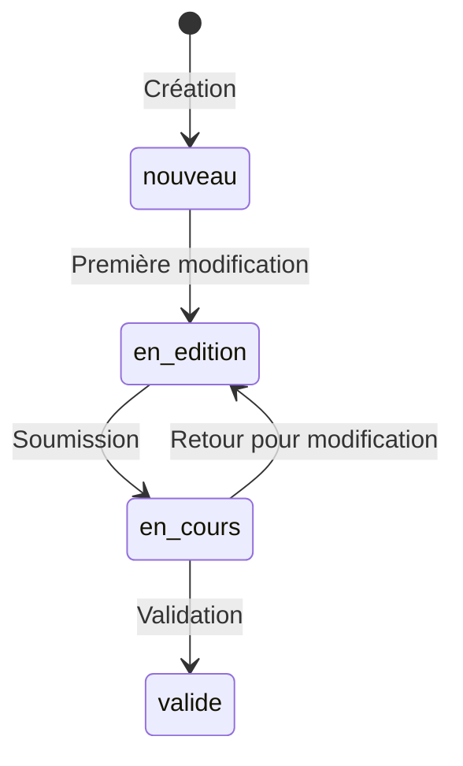
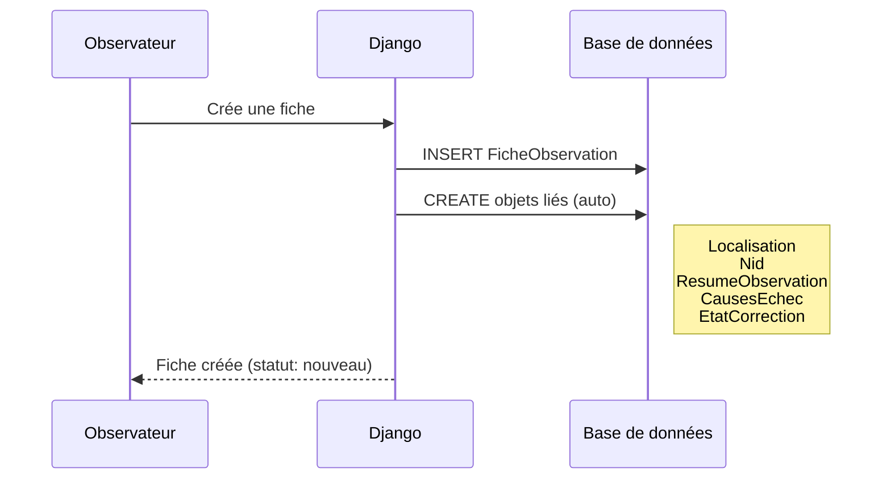
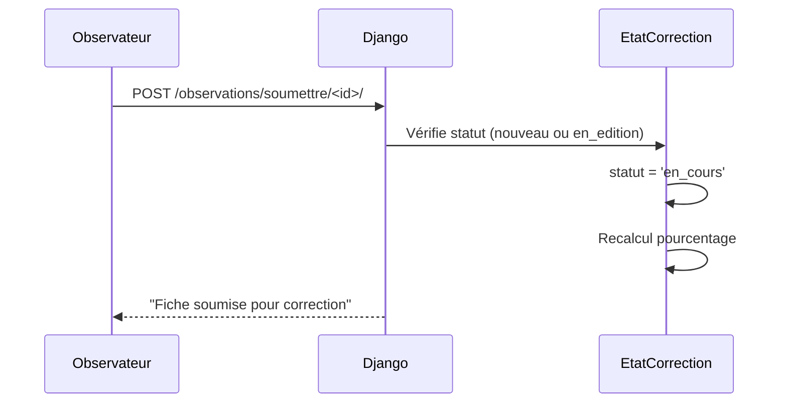
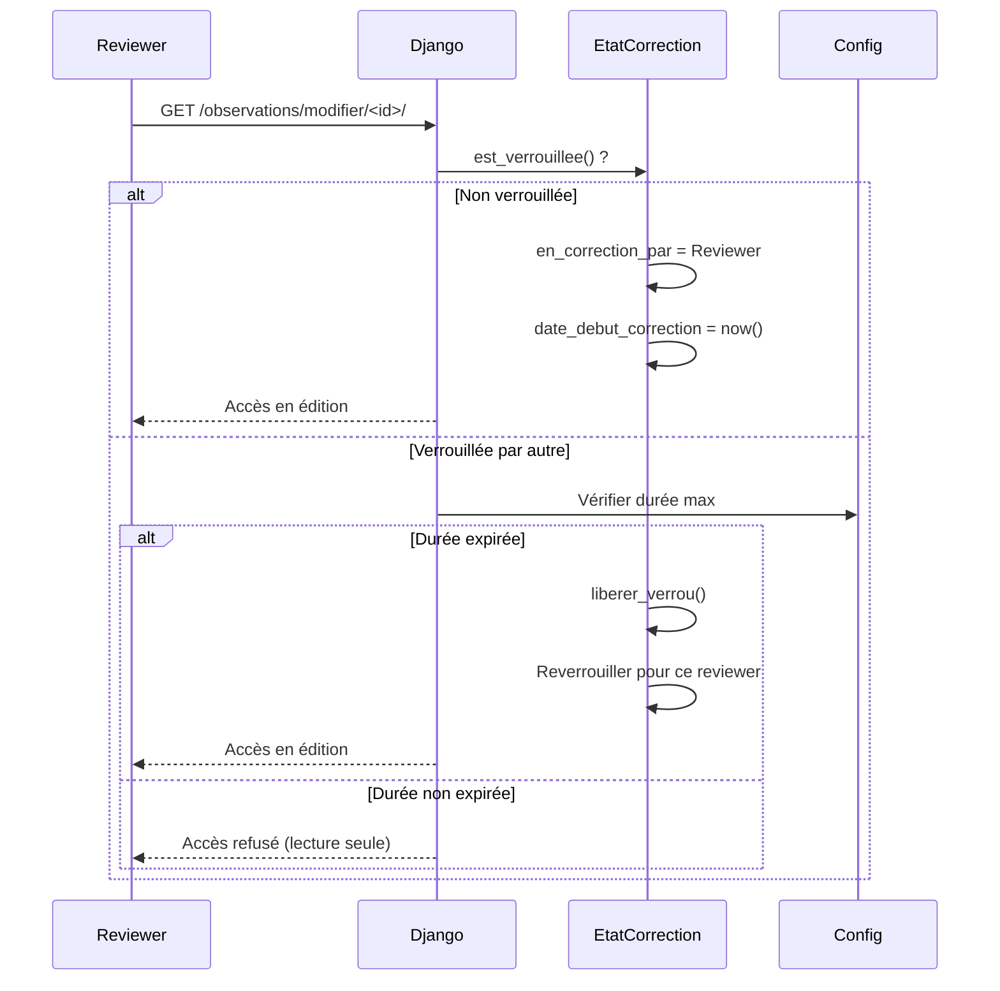
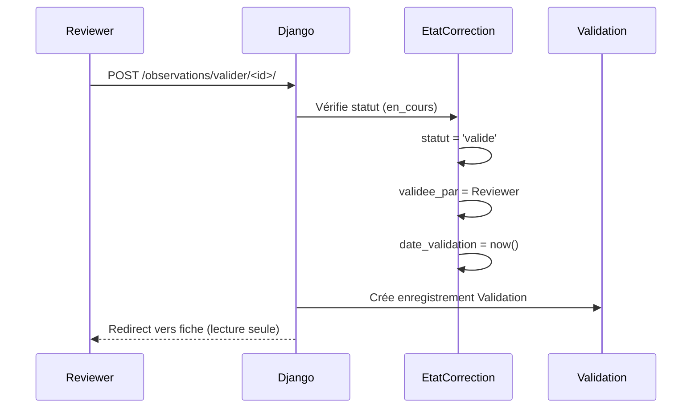
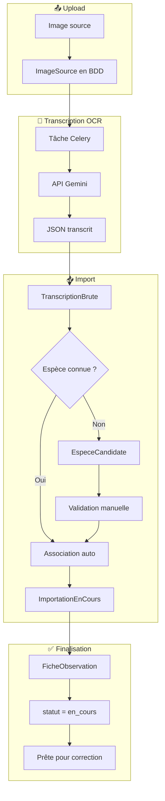

# 🔄 Workflow d'une Fiche d'Observation

> **Résumé** : Cycle de vie complet d'une fiche, de la création à la validation finale.

---

## 🎯 Vue d'Ensemble

Une fiche d'observation traverse **4 états** au cours de son cycle de vie :



| État | Badge | Description | Qui peut modifier |
|------|-------|-------------|-------------------|
| `nouveau` | 🔵 Nouvelle | Fiche venant d'être créée | Observateur |
| `en_edition` | 🔵 En saisie | L'observateur complète sa fiche | Observateur |
| `en_cours` | 🟠 En correction | Soumise pour review | Reviewer |
| `valide` | 🟢 Validée | Correction terminée | Personne (lecture seule) |

---

## 📋 Cycle de Vie Détaillé

### Phase 1 : Création (nouveau)



**Objets créés automatiquement** :

| Objet | Relation | Rôle |
|-------|----------|------|
| `Localisation` | OneToOne | Commune, coordonnées GPS |
| `Nid` | OneToOne | Détails du nid |
| `ResumeObservation` | OneToOne | Bilan (œufs, poussins) |
| `CausesEchec` | OneToOne | Causes d'échec de nidification |
| `EtatCorrection` | OneToOne | Gestion du workflow |

---

### Phase 2 : Édition (en_edition)

**Transition automatique** : `nouveau` → `en_edition`

- **Déclencheur** : Première donnée enregistrée (pourcentage > 0)
- **Code** : `observations/models.py:429`

```python
if pourcentage > 0 and self.statut == 'nouveau':
    self.statut = 'en_edition'
```

**Calcul du pourcentage de complétion** :

8 critères (12.5% chacun) :

| # | Critère | Points |
|---|---------|--------|
| 1 | Observateur renseigné | 12.5% |
| 2 | Espèce renseignée | 12.5% |
| 3 | Localisation complète | 12.5% |
| 4 | Au moins une observation | 12.5% |
| 5 | Résumé avec œufs pondus | 12.5% |
| 6 | Détails du nid | 12.5% |
| 7 | Hauteur du nid | 12.5% |
| 8 | Image associée | 12.5% |

---

### Phase 3 : Soumission pour Correction

**Transition manuelle** : `en_edition` → `en_cours`



**Conditions** :
- Statut actuel : `nouveau` ou `en_edition`
- Utilisateur : Observateur (auteur) ou Administrateur

**Effet** : La fiche devient visible aux reviewers pour correction.

---

### Phase 4 : Correction par un Reviewer

**Mécanisme de verrouillage** :



**Configuration du verrouillage** :

| Durée | Description |
|-------|-------------|
| 1 jour | Verrouillage court |
| 2 jours | |
| **5 jours** | Valeur par défaut |
| 10 jours | Verrouillage long |
| 0 (permanent) | Pas de déverrouillage auto |

!!! tip "Singleton Configuration"
    La durée est configurable via Django Admin : "Configuration du verrouillage"

**Actions du reviewer** :
- Corriger les données de la fiche
- Corriger la localisation
- Modifier les observations
- Compléter le résumé
- Ajouter des remarques

---

### Phase 5 : Validation

**Transition manuelle** : `en_cours` → `valide`



**Conditions** :
- Statut actuel : `en_cours`
- Utilisateur : Reviewer ou Administrateur

**Effet** : La fiche devient **lecture seule** pour tous.

!!! danger "Irréversibilité"
    Une fiche validée ne peut plus être modifiée. Seul un administrateur peut la remettre en édition via Django Admin.

---

## 🤖 Workflow OCR (Transcription)

Les fiches issues de l'OCR suivent un workflow particulier :



### Étapes Détaillées

| Étape | Action | Résultat |
|-------|--------|----------|
| 1. Upload | Observateur téléverse une image | `ImageSource` créé |
| 2. OCR | Celery envoie à Gemini | JSON retourné |
| 3. Parsing | Import du JSON | `TranscriptionBrute` créé |
| 4. Matching | Recherche espèce (fuzzy + GONM) | `EspeceCandidate` créé |
| 5. Observateur | Création/recherche utilisateur | Utilisateur lié |
| 6. Finalisation | Création fiche complète | `FicheObservation` créé |

!!! info "Statut initial OCR"
    Les fiches OCR démarrent directement en `en_cours` (pas de phase `nouveau` ou `en_edition`) car elles nécessitent une correction par un reviewer.

### Création Automatique d'Observateur

Si l'observateur n'existe pas en base :

| Champ | Valeur |
|-------|--------|
| `first_name` | Extrait du JSON |
| `last_name` | Extrait du JSON |
| `email` | `prenom.nom@transcription.trans` |
| `role` | `observateur` |
| `est_transcription` | `True` |
| `est_valide` | `True` |

---

## 🔓 Libération de Verrou

### Déverrouillage Automatique

```python
def est_verrouillee(self):
    if temps_ecoule > duree_max:
        self.liberer_verrou()
        return False
    return True
```

- Vérifié à chaque accès à la fiche
- Compare `date_debut_correction` avec la durée configurée
- Libère automatiquement si expirée

### Déverrouillage Manuel

| Qui | Route | Condition |
|-----|-------|-----------|
| Reviewer | `/<id>/liberer-verrou/` | Seulement son propre verrou |
| Administrateur | `/<id>/liberer-verrou/` | N'importe quel verrou |
| Admin Django | Action groupée | Plusieurs fiches |

---

## 📊 Résumé des Transitions

| De | Vers | Déclencheur | Qui |
|----|------|-------------|-----|
| - | `nouveau` | Création | Système |
| `nouveau` | `en_edition` | Première modification | Auto |
| `en_edition` | `en_cours` | Soumission | Observateur |
| `en_cours` | `valide` | Validation | Reviewer |
| `en_cours` | `en_edition` | Retour (exceptionnel) | Admin |

---

## 🔗 Voir Aussi

- [📦 Application Observations](../applications/observations.md) - Modèle EtatCorrection
- [📦 Application Review](../applications/review.md) - Système de validation
- [🔐 Permissions](./permissions.md) - Rôles et droits
- [📦 Application Ingest](../applications/ingest.md) - Import OCR
