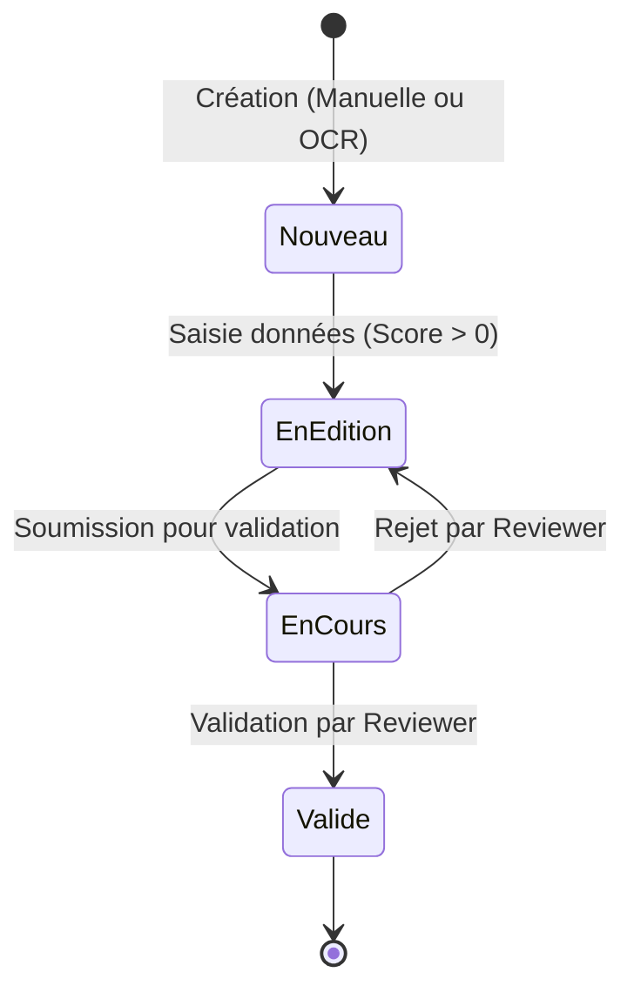

# 📜 Règles Fonctionnelles & Métier - Observations Nids

> **Source de Vérité Fonctionnelle**
> Ce document décrit le comportement attendu de l'application, les règles métier, les workflows et les contraintes de données.
>
> Version: 1.0.0 | Dernière mise à jour: Janvier 2026

---

## 📋 Table des matières

- [1. Acteurs et Rôles](#1-acteurs-et-rôles)
- [2. Entités Principales](#2-entités-principales)
- [3. Cycle de Vie d'une Fiche (Workflow)](#3-cycle-de-vie-dune-fiche-workflow)
- [4. Règles de Données & Cohérence](#4-règles-de-données--cohérence)
- [5. Processus OCR & Importation](#5-processus-ocr--importation)
- [6. Système de Verrouillage (Concurrence)](#6-système-de-verrouillage-concurrence)
- [7. Calcul de Complétude](#7-calcul-de-complétude)

---

## 1. Acteurs et Rôles

Le système distingue plusieurs types d'utilisateurs (`accounts.models.Utilisateur`).

| Rôle | Code BDD | Responsabilités | Permissions |
|------|----------|-----------------|-------------|
| **Observateur** | `observateur` | Saisie de ses propres fiches. | CRUD sur ses fiches (tant que non validées). Upload d'images. |
| **Reviewer** | `reviewer` | Correction et validation des fiches des autres. | Lecture globale. Édition des fiches en statut `en_cours`. Validation finale. |
| **Administrateur** | `admin` | Gestion technique et utilisateurs. | Accès complet Django Admin. Gestion des comptes utilisateurs. |
| **Système** | N/A | Processus automatiques (OCR, Imports). | Création de fiches via tâches asynchrones. |

### Attributs Utilisateur Clés
- **`est_valide`** : Un compte doit être validé par un administrateur avant de pouvoir se connecter.
- **`est_refuse`** : Marqueur explicite pour les comptes rejetés.
- **`email`** : Identifiant unique obligatoire.

---

## 2. Entités Principales

Le modèle de données est centré sur la `FicheObservation`.

### Structure d'une Fiche
Une fiche est un agrégat composé de plusieurs modèles liés :

1.  **`FicheObservation` (Racine)**
    *   Contient : Numéro fiche, Observateur (FK), Espèce (FK), Année.
    *   Création automatique des sous-objets lors du premier `save()`.

2.  **`Observation` (1:N)**
    *   Liste chronologique des visites au nid.
    *   Données : Date, Heure, Nombre d'œufs, Nombre de poussins.

3.  **`Localisation` (1:1)**
    *   Données : Commune, Lieu-dit, Coordonnées GPS.
    *   *Règle* : Commune obligatoire pour qu'une fiche soit considérée "complète".

4.  **`Nid` (1:1)**
    *   Description physique du nid (hauteur, support).

5.  **`ResumeObservation` (1:1)**
    *   Synthèse des données biologiques (dates clés, totaux).
    *   *Règle* : Contient des contraintes de cohérence strictes (voir section 4).

6.  **`EtatCorrection` (1:1)**
    *   Porte le statut du workflow et le score de complétude.

---

## 3. Cycle de Vie d'une Fiche (Workflow)

Le statut est géré par le champ `statut` du modèle `EtatCorrection`.

### Diagramme d'États

### Description des États

| Statut | Code | Description | Actions possibles |
|--------|------|-------------|-------------------|
| **Nouveau** | `nouveau` | Fiche vide ou vient d'être créée. | Saisie initiale. Suppression. |
| **En Édition** | `en_edition` | L'observateur remplit la fiche. | Modification par l'observateur. |
| **En Cours** | `en_cours` | Soumise à correction. | **Verrouillée** pour l'observateur. Éditable par Reviewer. |
| **Validée** | `valide` | Données certifiées conformes. | Lecture seule pour tous. Déverrouillage admin uniquement. |

---

## 4. Règles de Données & Cohérence

Des contraintes strictes (Check Constraints SQL) et validateurs Django garantissent l'intégrité biologique.

### Cohérence Biologique (`ResumeObservation`)

1.  **Logique des dates (Jour/Mois)** :
    *   Pour chaque événement (premier œuf, éclosion, envol), le jour et le mois doivent être **soit tous les deux NULL, soit tous les deux renseignés**.
    *   *Constraint* : `*_both_or_none`.

2.  **Logique des compteurs** :
    *   `nombre_oeufs_eclos` ≤ `nombre_oeufs_pondus`
    *   `nombre_oeufs_non_eclos` ≤ `nombre_oeufs_pondus`
    *   `nombre_poussins` ≤ `nombre_oeufs_eclos`
    *   *Ces règles s'appliquent uniquement si les valeurs ne sont pas NULL.*

### Règles de Saisie

*   **Observations** : Le nombre d'œufs et de poussins doit être ≥ 0 (Validator `MinValueValidator`).
*   **Localisation** : Une fiche sans commune/département ne marque pas de points de complétude.

### Gestion de l'Incertitude (Notation "5?")

**Fonctionnalité** : Les observateurs peuvent marquer les comptages comme "incertains" en ajoutant un point d'interrogation, répliquant ainsi la notation papier traditionnelle.

**Champs concernés** :
*   `nombre_oeufs` / `nombre_oeufs_incertain` (dans `Observation`)
*   `nombre_poussins` / `nombre_poussins_incertain` (dans `Observation`)

**Architecture** :
*   **Stockage** : Le nombre et le flag d'incertitude sont stockés séparément en base de données.
    *   `nombre_oeufs` : `IntegerField` (ex: `5`)
    *   `nombre_oeufs_incertain` : `BooleanField` (`True` si "5?", sinon `False`)
*   **Saisie** : L'utilisateur tape `5?` dans un champ texte. Le formulaire Django parse automatiquement :
    *   Extraction du nombre : `5`
    *   Détection du `?` : `nombre_oeufs_incertain = True`
*   **Affichage** :
    *   **En édition** : Le champ affiche `5?` avec une icône "?" jaune.
    *   **En lecture seule** : Affiche `5` suivi de l'icône "?" jaune si le flag est `True`.

**Règles de Validation** :
*   Format accepté : `\d+\??` (chiffres suivis optionnellement d'un "?")
*   Exemples valides : `5`, `5?`, `12`, `12?`
*   Exemples invalides : `?`, `5??`, `5a`, `a5`

**Intérêt métier** :
*   Traçabilité : Permet de distinguer les comptages certains des estimations.
*   Requêtes SQL simples : `SELECT * FROM observation WHERE nombre_oeufs_incertain = TRUE`
*   Cohérence papier/numérique : Fidélité au workflow terrain des ornithologues.

---

## 5. Processus OCR & Importation

Le système transforme des images papier en fiches structurées.

### Flux de Données

1.  **Upload** : Utilisateur téléverse une `ImageSource`.
2.  **Préparation** : Le système (ou opérateur) prépare l'image (fusion R/V, crop) -> `PreparationImage`.
3.  **Transcription** : Appel API Gemini -> `TranscriptionBrute` (JSON).
4.  **Candidature** :
    *   Identification de l'espèce (`EspeceCandidate`).
    *   Création d'une `ImportationEnCours`.
5.  **Création Fiche** :
    *   Une fois validé, l'import crée une `FicheObservation`.
    *   Statut initial : `nouveau` (puis calcul automatique du score).

### Modèle d'Évaluation OCR
Pour le mode "Pilote", une table `TranscriptionOCR` permet de comparer les sorties de différents modèles IA (Gemini Flash vs Pro) par rapport à une vérité terrain (Fiche corrigée manuellement).

---

## 6. Système de Verrouillage (Concurrence)

Pour éviter que deux reviewers corrigent la même fiche en même temps, un système de verrouillage explicite est en place.

### Mécanisme
*   Modèle : `EtatCorrection` champs `en_correction_par` et `date_debut_correction`.
*   **Verrouillage** : Automatique quand un reviewer ouvre une fiche en statut `en_cours`.
*   **Libération** :
    *   Manuelle (bouton "Libérer").
    *   Automatique après validation.
    *   **Timeout** : Configurable (défaut 5 jours). Si le délai est dépassé, n'importe quel reviewer peut reprendre la main.

---

## 7. Calcul de Complétude

Le système calcule un score de 0 à 100% pour guider l'utilisateur.
Méthode : `EtatCorrection.calculer_pourcentage_completion()`

**Critères (1 point chacun, total 8 points convertis en %) :**
1.  Observateur renseigné.
2.  Espèce renseignée.
3.  Localisation complète (Commune + Département).
4.  Au moins une `Observation` créée.
5.  `ResumeObservation` avec `nombre_oeufs_pondus` > 0.
6.  Détails du nid renseignés.
7.  Hauteur du nid renseignée.
8.  Image associée à la fiche.

*Règle* : Si le score passe de 0 à >0, le statut passe automatiquement de `nouveau` à `en_edition`.

---
**Fin du document functional_rules.md**
