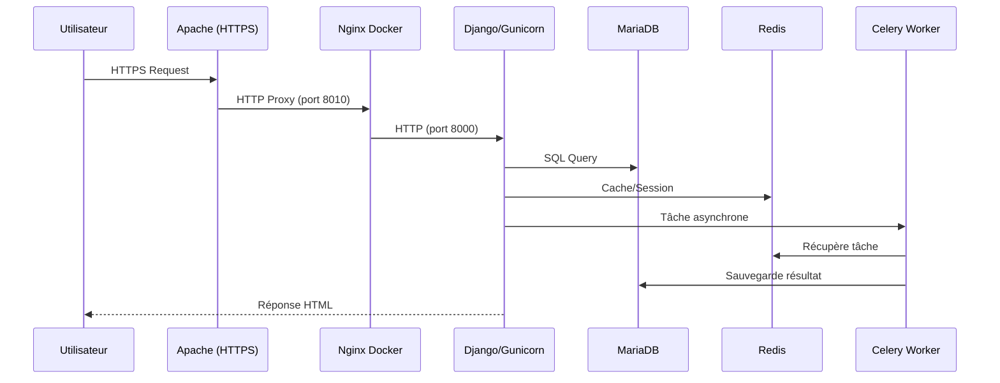

# 🏗️ Infrastructure - Observations Nids

> **Documentation technique complète de l'infrastructure du projet Observations Nids**
>
> Version: 1.1.0 | Dernière mise à jour: Janvier 2026

---

## 📋 Table des matières

- [Vue d'ensemble](#-vue-densemble)
- [Topologie réseau physique](#-topologie-réseau-physique)
- [Architecture Docker](#-architecture-docker)
- [Stack technique](#-stack-technique)
- [Services et interactions](#-services-et-interactions)
- [Structure des applications Django](#-structure-des-applications-django)
- [Configuration et variables d'environnement](#-configuration-et-variables-denvironnement)
- [Déploiement](#-déploiement)
- [Contraintes techniques critiques](#-contraintes-techniques-critiques)
- [Monitoring et maintenance](#-monitoring-et-maintenance)

---

## 🎯 Vue d'ensemble

### Architecture globale

```
Internet (HTTPS:443)
    ↓
┌─────────────────────────────────────────────────────────────────┐
│ Freebox (Routeur FAI)                                           │
│ - NAT/Redirection ports 80/443 → Raspberry Pi                   │
└─────────────────────────────────────────────────────────────────┘
    ↓ HTTPS (réseau local)
┌─────────────────────────────────────────────────────────────────┐
│ Raspberry Pi (Serveur Frontal)                                  │
│ - Apache Reverse Proxy                                          │
│ - SSL Termination (Let's Encrypt)                               │
│ - IP locale: 192.168.1.XXX                                      │
└─────────────────────────────────────────────────────────────────┘
    ↓ HTTP (réseau local, port 8010 + 5555)
┌─────────────────────────────────────────────────────────────────┐
│ PC Ubuntu (Serveur Applicatif)                                  │
│ - IP locale: 192.168.1.112                                      │
│ - Docker Compose Stack complète:                                │
│   ├── Nginx (reverse proxy interne + fichiers statiques)        │
│   ├── Django + Gunicorn (application web)                       │
│   ├── Celery Worker (tâches asynchrones)                        │
│   ├── Celery Beat (tâches planifiées)                           │
│   ├── Flower (monitoring Celery)                                │
│   ├── MariaDB (base de données)                                 │
│   ├── Redis (cache + broker Celery)                             │
│   └── phpMyAdmin (gestion BDD)                                  │
└─────────────────────────────────────────────────────────────────┘
```

**Flux de requête complète**:
1. Utilisateur → `https://pilote.observation-nids.meteo-poelley50.fr` (Internet, port 443)
2. Freebox → Redirection vers Raspberry Pi (réseau local)
3. Raspberry Pi → SSL Termination + Apache → Reverse Proxy vers `http://192.168.1.112:8010`
4. PC Ubuntu → Nginx Docker (port 8010) → Django Gunicorn (port 8000)
5. Django → MariaDB / Redis

**⚠️ Points critiques**:
- SSL s'arrête au Raspberry Pi (**SSL Termination**)
- Communication RPi ↔ PC Ubuntu en HTTP non chiffré (réseau local sécurisé)
- Header `X-Forwarded-Proto: https` transmis par Apache pour informer Django

### Environnements supportés

| Environnement | Description | Configuration |
|---------------|-------------|---------------|
| **Production** | Infrastructure physique complète | Freebox → RPi (Apache SSL) → PC Ubuntu (Docker), HTTPS, DEBUG=False |
| **Pilote** | Infrastructure physique complète (test) | Freebox → RPi (Apache SSL) → PC Ubuntu (Docker `/opt/.../pilote`), HTTPS, DEBUG=False |
| **Développement Windows** | Workstation locale Windows | PowerShell scripts, SQLite/MySQL local, DEBUG=True |
| **Développement Linux** | Workstation locale Linux | Scripts bash, SQLite/MySQL local, DEBUG=True |

---

## 🌐 Topologie réseau physique

### Vue d'ensemble des machines

L'infrastructure de production/pilote repose sur **3 équipements physiques distincts** communiquant via le réseau local domestique.

| Machine | Rôle | IP Locale | Système | Services |
|---------|------|-----------|---------|----------|
| **Freebox** | Routeur FAI + NAT | 192.168.1.1 (défaut) | Freebox OS | Redirection ports 80/443 |
| **Raspberry Pi** | Serveur frontal | 192.168.1.XXX | Raspberry Pi OS | Apache 2.4 + SSL |
| **PC Ubuntu** | Serveur applicatif | 192.168.1.112 | Ubuntu 20.04+ | Docker Compose |

### Machine 1: Freebox (Routeur FAI)

**Fonction**: Point d'entrée Internet et routeur NAT

**Configuration critique**:
- Redirection de port `80 (HTTP)` → Raspberry Pi
- Redirection de port `443 (HTTPS)` → Raspberry Pi
- Firewall: Tous les autres ports fermés depuis Internet

**Flux**:
```
Internet :443 → Freebox (NAT) → 192.168.1.XXX:443 (Raspberry Pi)
Internet :80  → Freebox (NAT) → 192.168.1.XXX:80 (Raspberry Pi)
```

### Machine 2: Raspberry Pi (Serveur Frontal)

**Fonction**: Reverse proxy SSL et point d'entrée applicatif

**Caractéristiques**:
- **OS**: Raspberry Pi OS (Debian-based)
- **IP locale**: 192.168.1.XXX (fixe, réservée dans la Freebox)
- **Services**:
  - Apache 2.4 (ports 80 et 443)
  - Let's Encrypt (renouvellement automatique certificats)

**Rôle dans l'architecture**:

1. **SSL Termination**: Le SSL est géré UNIQUEMENT sur le Raspberry Pi
   - Certificat Let's Encrypt pour `pilote.observation-nids.meteo-poelley50.fr`
   - Communication Internet ↔ RPi: HTTPS chiffré
   - Communication RPi ↔ PC Ubuntu: HTTP non chiffré (réseau local sécurisé)

2. **Reverse Proxy Apache**: Redirige les requêtes vers le PC Ubuntu
   - Backend principal: `http://192.168.1.112:8010/` (Nginx Docker)
   - Backend Flower: `http://192.168.1.112:5555/flower` (Celery monitoring)
   - WebSocket Flower: `ws://192.168.1.112:5555/flower/ws`

3. **Headers de sécurité**: Injection de headers HTTPS pour Django
   - `X-Forwarded-Proto: https` (indique à Django que la requête d'origine était HTTPS)
   - `X-Forwarded-For: <IP_CLIENT>` (préserve l'IP réelle du client)
   - HSTS, CSP, X-Content-Type-Options (sécurité navigateur)

**Configuration Apache** (`/etc/apache2/sites-available/pilote.observation-nids.meteo-poelley50.fr-le-ssl.conf`):

```apache
# Redirection HTTP → HTTPS
<VirtualHost *:80>
    ServerName pilote.observation-nids.meteo-poelley50.fr
    Redirect permanent / https://pilote.observation-nids.meteo-poelley50.fr/
</VirtualHost>

# SSL Termination + Reverse Proxy
<VirtualHost *:443>
  ServerName pilote.observation-nids.meteo-poelley50.fr
  DocumentRoot /var/empty

  # --- Headers sécurité ---
  Header always set Strict-Transport-Security "max-age=31536000; includeSubDomains; preload"
  Header always set X-Content-Type-Options "nosniff"
  Header always set Permissions-Policy "geolocation=(), microphone=(), camera=()"
  Header always unset X-Powered-By
  Header always unset Server
  Header always set Server "Web"

  # --- Configuration Reverse Proxy ---
  ProxyPreserveHost On
  ProxyRequests Off
  AllowEncodedSlashes NoDecode

  # CRITIQUE: Informer Django que la requête d'origine était HTTPS
  RequestHeader set X-Forwarded-Proto "https"
  RequestHeader add X-Forwarded-For "%{REMOTE_ADDR}s"

  # --- Backend Flower (Celery monitoring) ---
  ProxyPass        /flower http://192.168.1.112:5555/flower
  ProxyPassReverse /flower http://192.168.1.112:5555/flower
  ProxyPass        /flower/ws ws://192.168.1.112:5555/flower/ws
  ProxyPassReverse /flower/ws ws://192.168.1.112:5555/flower/ws

  # --- Backend Django (application principale) ---
  ProxyPass        / http://192.168.1.112:8010/ nocanon
  ProxyPassReverse / http://192.168.1.112:8010/

  # --- Certificats SSL (Let's Encrypt) ---
  Include /etc/letsencrypt/options-ssl-apache.conf
  SSLCertificateFile /etc/letsencrypt/live/pilote.observation-nids.meteo-poelley50.fr/fullchain.pem
  SSLCertificateKeyFile /etc/letsencrypt/live/pilote.observation-nids.meteo-poelley50.fr/privkey.pem

  # --- Logs ---
  ErrorLog  ${APACHE_LOG_DIR}/pilote_proxy_error.log
  CustomLog ${APACHE_LOG_DIR}/pilote_proxy_access.log combined
</VirtualHost>
```

**⚠️ Points d'attention**:
- Le Raspberry Pi ne contient **AUCUNE** donnée applicative (pas de BDD, pas de code Django)
- Il ne fait que du **routage** et du **chiffrement SSL**
- En cas de panne du RPi, l'application est inaccessible depuis Internet, mais reste fonctionnelle en local (accès direct au PC Ubuntu)

### Machine 3: PC Ubuntu (Serveur Applicatif)

**Fonction**: Serveur d'application complet avec Docker

**Caractéristiques**:
- **OS**: Ubuntu 20.04+ LTS
- **IP locale**: 192.168.1.112 (fixe, configurée dans `/etc/netplan/` ou équivalent)
- **Services**: Docker + Docker Compose

**Rôle dans l'architecture**:

1. **Hébergement de la stack Docker complète**:
   - Tous les 8 services Docker (nginx, web, db, redis, celery_worker, celery_beat, flower, phpmyadmin)
   - Code source de l'application Django
   - Base de données MariaDB (volumes persistants)
   - Fichiers media (images uploadées par utilisateurs)
   - Logs applicatifs

2. **Isolation réseau**:
   - Port `8010`: Nginx Docker (accessible depuis RPi uniquement)
   - Port `5555`: Flower (accessible depuis RPi uniquement)
   - Port `8081`: phpMyAdmin (accessible depuis réseau local uniquement, PAS via Internet)
   - Ports `3306`, `6379`, `8000`: Services internes Docker NON exposés sur l'hôte

3. **Répertoire d'installation**:
   - **Pilote**: `/opt/observations_nids_pilote/`
   - **Production**: `/opt/observations_nids_production/` (ou similaire)

**Ports exposés sur l'hôte Ubuntu**:

| Port | Service | Accessible depuis | Commentaire |
|------|---------|-------------------|-------------|
| `8010` | Nginx Docker | Raspberry Pi | Backend principal (HTTP) |
| `5555` | Flower | Raspberry Pi | Monitoring Celery (HTTP) |
| `8081` | phpMyAdmin | Réseau local | Admin BDD (HTTP) - JAMAIS via Internet |

**⚠️ Sécurité réseau**:
- Firewall UFW recommandé pour bloquer les ports sauf 8010 et 5555 depuis le réseau local
- MariaDB (3306) et Redis (6379) **NE DOIVENT JAMAIS** être exposés sur l'hôte
- phpMyAdmin accessible uniquement depuis le réseau local (usage admin uniquement)

### Communication inter-machines

#### RPi → PC Ubuntu (HTTP non chiffré)

**Protocole**: HTTP (port 8010 et 5555)

**Justification**:
- Le réseau local (192.168.1.0/24) est considéré comme sécurisé
- Pas de latence ajoutée par le chiffrement SSL
- SSL Termination centralisé sur le RPi facilite la gestion des certificats

**Flux de données**:
```
RPi Apache :443 (HTTPS)
    ↓
[Déchiffrement SSL]
    ↓
RPi → PC Ubuntu :8010 (HTTP)
    ↓
Nginx Docker → Gunicorn :8000 (HTTP interne Docker)
```

**Headers transmis** (critiques pour Django):
- `X-Forwarded-Proto: https` → Django reconnaît la requête comme HTTPS
- `X-Forwarded-For: <IP_CLIENT>` → Django connaît l'IP réelle du client
- `Host: pilote.observation-nids.meteo-poelley50.fr` → Django gère les hosts autorisés

#### Configuration Django correspondante

```python
# settings.py (déjà configuré)

# Faire confiance au header X-Forwarded-Proto envoyé par Apache (RPi)
SECURE_PROXY_SSL_HEADER = ('HTTP_X_FORWARDED_PROTO', 'https')

# Hosts autorisés (domaine public)
ALLOWED_HOSTS = ["pilote.observation-nids.meteo-poelley50.fr", "localhost"]

# CSRF Trusted Origins (DOIT inclure https:// car c'est ce que voit l'utilisateur)
CSRF_TRUSTED_ORIGINS = ["https://pilote.observation-nids.meteo-poelley50.fr"]
```

### Schéma réseau complet

```
┌─────────────────────────────────────────────────────────────────────────────┐
│                             INTERNET                                         │
│                    (Clients HTTPS publics)                                   │
└───────────────────────────────────┬─────────────────────────────────────────┘
                                    │ HTTPS :443
                                    │
┌───────────────────────────────────▼─────────────────────────────────────────┐
│ Freebox (192.168.1.1)                                                        │
│ ┌─────────────────────────────────────────────────────────────────────────┐ │
│ │ NAT / Firewall                                                          │ │
│ │ - Port 80  → 192.168.1.XXX:80  (RPi)                                    │ │
│ │ - Port 443 → 192.168.1.XXX:443 (RPi)                                    │ │
│ │ - Tous autres ports: FERMÉS                                             │ │
│ └─────────────────────────────────────────────────────────────────────────┘ │
└───────────────────────────────────┬─────────────────────────────────────────┘
                                    │ HTTPS :443
                                    │ (Réseau local 192.168.1.0/24)
┌───────────────────────────────────▼─────────────────────────────────────────┐
│ Raspberry Pi (192.168.1.XXX)                                                 │
│ ┌─────────────────────────────────────────────────────────────────────────┐ │
│ │ Apache 2.4 (Reverse Proxy + SSL Termination)                           │ │
│ │ - Écoute: 0.0.0.0:80, 0.0.0.0:443                                       │ │
│ │ - Certificat Let's Encrypt (pilote.observation-nids...)                 │ │
│ │ - Déchiffre HTTPS → HTTP                                                │ │
│ │ - Injecte headers: X-Forwarded-Proto, X-Forwarded-For                  │ │
│ │ - Proxy vers: http://192.168.1.112:8010 (Django)                        │ │
│ │ - Proxy vers: http://192.168.1.112:5555/flower (Celery)                │ │
│ └─────────────────────────────────────────────────────────────────────────┘ │
└───────────────────────────────────┬─────────────────────────────────────────┘
                                    │ HTTP :8010, :5555
                                    │ (Réseau local 192.168.1.0/24)
┌───────────────────────────────────▼─────────────────────────────────────────┐
│ PC Ubuntu (192.168.1.112)                                                    │
│ ┌─────────────────────────────────────────────────────────────────────────┐ │
│ │ Docker Compose (observations_network: bridge)                           │ │
│ │                                                                          │ │
│ │  ┌───────────────────────────────────────────────────────────────────┐  │ │
│ │  │ nginx:80 → 8010 (hôte)                                            │  │ │
│ │  │   ↓ Proxy vers web:8000                                           │  │ │
│ │  │   ↓ Sert /static/ et /media/                                      │  │ │
│ │  └───────────────────────────────────────────────────────────────────┘  │ │
│ │                          ↓                                               │ │
│ │  ┌───────────────────────────────────────────────────────────────────┐  │ │
│ │  │ web (Django + Gunicorn) :8000                                     │  │ │
│ │  │   ↓ Connecté à db:3306 (MariaDB)                                  │  │ │
│ │  │   ↓ Connecté à redis:6379 (Cache + Celery)                        │  │ │
│ │  └───────────────────────────────────────────────────────────────────┘  │ │
│ │                                                                          │ │
│ │  ┌─────────────────┐  ┌─────────────────┐  ┌──────────────────────┐    │ │
│ │  │ celery_worker   │  │ celery_beat     │  │ flower:5555 → 5555   │    │ │
│ │  │ (async tasks)   │  │ (scheduler)     │  │ (monitoring)         │    │ │
│ │  └─────────────────┘  └─────────────────┘  └──────────────────────┘    │ │
│ │                                                                          │ │
│ │  ┌─────────────────┐  ┌─────────────────┐  ┌──────────────────────┐    │ │
│ │  │ db (MariaDB)    │  │ redis           │  │ phpmyadmin:80 → 8081 │    │ │
│ │  │ :3306 (interne) │  │ :6379 (interne) │  │ (admin BDD local)    │    │ │
│ │  └─────────────────┘  └─────────────────┘  └──────────────────────┘    │ │
│ │                                                                          │ │
│ └─────────────────────────────────────────────────────────────────────────┘ │
│                                                                              │
│ Volumes persistants (hôte):                                                  │
│ - /var/lib/docker/volumes/docker_db_data                                     │
│ - /var/lib/docker/volumes/docker_redis_data                                  │
│ - /opt/observations_nids_pilote/media (bind mount)                           │
│ - /opt/observations_nids_pilote/logs (bind mount)                            │
└──────────────────────────────────────────────────────────────────────────────┘
```

### Points critiques à retenir

| Aspect | Configuration | Justification |
|--------|---------------|---------------|
| **SSL Termination** | Raspberry Pi uniquement | Centralisation gestion certificats Let's Encrypt |
| **Communication RPi ↔ Ubuntu** | HTTP non chiffré | Réseau local sécurisé, performance |
| **IP fixe Ubuntu** | 192.168.1.112 | Référencée dans config Apache (RPi) |
| **Exposition Internet** | Ports 80/443 uniquement | Sécurité: seul le RPi est exposé |
| **phpMyAdmin** | Réseau local uniquement | Jamais exposé sur Internet |
| **Ports Docker internes** | 3306, 6379, 8000 | Jamais exposés sur l'hôte Ubuntu |

### Scénarios de panne

| Panne | Impact | Workaround |
|-------|--------|------------|
| **Freebox down** | Site inaccessible depuis Internet | Accès direct via IP locale (192.168.1.112:8010) depuis LAN |
| **Raspberry Pi down** | Site inaccessible depuis Internet | Accès direct via IP locale (192.168.1.112:8010) depuis LAN |
| **PC Ubuntu down** | Tout est down (BDD, application) | Aucun workaround, redémarrer le serveur |
| **Docker down (Ubuntu)** | Application down, mais OS OK | `docker compose up -d` |
| **Container web down** | Application web down | `docker compose restart web` |

---

## 🐳 Architecture Docker

### Services définis

Le fichier `docker/docker-compose.yml` orchestre 8 services :

```yaml
services:
  db          # MariaDB 10.11 (base de données)
  redis       # Redis 7-alpine (cache + broker Celery)
  web         # Django 6.0 + Gunicorn (application)
  celery_worker    # Celery Worker (tâches async)
  celery_beat      # Celery Beat (scheduler)
  flower      # Flower (monitoring Celery)
  nginx       # Nginx Alpine (reverse proxy)
  phpmyadmin  # phpMyAdmin (admin BDD)
```

### Dockerfile

**Localisation**: `docker/Dockerfile`

**Image de base**: `python:3.12-slim-bookworm`

**Étapes clés**:
1. Installation des dépendances système (mysqlclient, Pillow, curl, netcat)
2. Création utilisateur non-root `django:django`
3. Installation des dépendances Python depuis `requirements-prod.txt`
4. Copie du code source
5. Exécution du script `docker-entrypoint.sh`

**Point d'entrée**: `/usr/local/bin/docker-entrypoint.sh`

### Script d'entrée (docker-entrypoint.sh)

**Fonctions**:
1. Attente MariaDB et Redis (healthcheck)
2. Application des migrations Django (`migrate --noinput`)
3. Collecte des fichiers statiques (`collectstatic --noinput`)
4. Création automatique du superuser (si variables définies)
5. Lancement de la commande spécifiée (Gunicorn, Celery, etc.)

### Réseau Docker

**Nom**: `observations_network`

**Type**: `bridge`

**Isolation**: Tous les services communiquent via ce réseau privé

### Volumes Docker

| Volume | Type | Contenu | Persistance |
|--------|------|---------|-------------|
| `db_data` | Named volume | Données MariaDB (`/var/lib/mysql`) | ✅ Persistant |
| `redis_data` | Named volume | Données Redis AOF (`/data`) | ✅ Persistant |
| `static_volume` | Named volume | Fichiers statiques Django | ✅ Persistant |
| `/opt/.../media` | Bind mount | Images uploadées par utilisateurs | ✅ Persistant (hôte) |
| `../logs` | Bind mount | Logs Django/Celery | ✅ Persistant (hôte) |

**⚠️ IMPORTANT**: Les volumes `media` et `logs` sont des bind mounts vers l'hôte, ce qui permet :
- Backup facile des images
- Consultation des logs sans entrer dans le conteneur
- Partage des médias entre services

### Ports exposés

| Service | Port interne | Port externe | Accessible depuis |
|---------|--------------|--------------|-------------------|
| **nginx** | 80 | 8010 | Réseau local / Reverse proxy |
| **web** | 8000 | - | Réseau Docker uniquement |
| **flower** | 5555 | 5555 | Réseau local / Reverse proxy |
| **phpmyadmin** | 80 | 8081 | Réseau local UNIQUEMENT |
| **db** | 3306 | - | Réseau Docker uniquement |
| **redis** | 6379 | - | Réseau Docker uniquement |

**🔒 Sécurité**: MariaDB et Redis ne sont JAMAIS exposés sur Internet, uniquement accessibles via le réseau Docker interne.

---

## 💻 Stack technique

### Backend

| Composant | Version | Rôle | Configuration |
|-----------|---------|------|---------------|
| **Python** | 3.12 | Langage principal | Bookworm (Debian 12) |
| **Django** | 6.0.1 | Framework web | WSGI via Gunicorn |
| **Gunicorn** | 23.0.0 | Serveur WSGI | 4 workers, timeout 120s |
| **Celery** | 5.6.2 | Tâches asynchrones | Pool eventlet (Windows), default (Linux) |
| **Flower** | 2.0.1 | Monitoring Celery | URL prefix `/flower` |

### Base de données

| Composant | Version | Configuration | Backup |
|-----------|---------|---------------|--------|
| **MariaDB** | 10.11 | UTF-8, InnoDB | Volume `db_data` |
| **Redis** | 7-alpine | AOF persistence | Volume `redis_data` |

### Infrastructure

| Composant | Version | Rôle |
|-----------|---------|------|
| **Nginx** | Alpine | Reverse proxy interne + fichiers statiques |
| **Apache** | 2.4+ | Reverse proxy externe (production) |
| **Docker** | 20.10+ | Conteneurisation |
| **Docker Compose** | 2.0+ | Orchestration |

### Services externes

| Service | Provider | Rôle | Configuration |
|---------|----------|------|---------------|
| **Gemini API** | Google | OCR transcription fiches papier | Variable `GEMINI_API_KEY` |

### Librairies Python principales

```txt
Django 6.0.1                 # Framework web
mysqlclient 2.2.7           # Connecteur MariaDB
celery 5.6.2                # Tâches asynchrones
redis 7.1.0                 # Client Redis
google-genai 1.57.0         # API Gemini
pillow 12.1.0               # Traitement images
gunicorn 23.0.0             # Serveur WSGI (prod)
whitenoise 6.11.0           # Fichiers statiques (prod)
django-csp 4.0              # Content Security Policy (prod)
eventlet 0.40.4             # Pool Celery Windows
```

---

## 🔄 Services et interactions

### Flux de données principal



### Service: web (Django + Gunicorn)

**Image**: Build depuis `docker/Dockerfile`

**Commande**:
```bash
gunicorn observations_nids.wsgi:application \
  --bind 0.0.0.0:8000 \
  --workers 4 \
  --timeout 120 \
  --access-logfile - \
  --error-logfile -
```

**Dépendances**:
- `db` (condition: `service_healthy`)
- `redis` (condition: `service_healthy`)

**Healthcheck**: `curl -f http://localhost:8000/health/`

**Volumes**:
- `static_volume:/app/staticfiles` (fichiers statiques Django)
- `/opt/.../media:/app/media` (images uploadées)
- `../logs:/app/logs` (logs applicatifs)

### Service: celery_worker

**Image**: Build depuis `docker/Dockerfile`

**Commande**:
```bash
celery -A observations_nids worker \
  --loglevel=info \
  --concurrency=2
```

**Rôle**: Exécute les tâches asynchrones (OCR Gemini, récupération liens oiseaux.net, traitement images, etc.)

**Dépendances**:
- `db`, `redis`, `web`

**⚠️ IMPORTANT**: Le worker doit être redémarré après modification du code Python pour prendre en compte les changements.

### Service: celery_beat

**Image**: Build depuis `docker/Dockerfile`

**Commande**:
```bash
celery -A observations_nids beat --loglevel=info
```

**Rôle**: Scheduler pour tâches planifiées (similaire à cron)

**Dépendances**:
- `db`, `redis`, `web`

### Service: flower

**Image**: Build depuis `docker/Dockerfile`

**Commande**:
```bash
celery -A observations_nids flower \
  --port=5555 \
  --url-prefix=flower
```

**Rôle**: Interface web de monitoring Celery

**Accès**:
- Direct: `http://localhost:5555` (développement)
- Reverse proxy: `https://domaine.com/flower` (production)

**⚠️ CRITIQUE**: L'option `--url-prefix=flower` est OBLIGATOIRE pour le fonctionnement derrière un reverse proxy Apache.

### Service: nginx

**Image**: `nginx:alpine`

**Configuration**:
- `docker/nginx/nginx.conf` (configuration globale)
- `docker/nginx/conf.d/default.conf` (configuration serveur)

**Rôle**:
1. Reverse proxy vers Django (port 8000)
2. Servir les fichiers statiques (`/static/`)
3. Servir les fichiers media (`/media/`)
4. Healthcheck endpoint (`/health/`)

**Optimisations**:
- Gzip compression
- Cache-Control headers (30 jours pour statiques, 7 jours pour media)
- Client max body size: 100M (uploads)

### Service: db (MariaDB)

**Image**: `mariadb:10.11`

**Configuration personnalisée**: `docker/mariadb/conf.d/`

**Healthcheck**:
```bash
mysqladmin ping -h localhost -u root -p${DB_ROOT_PASSWORD}
```

**Variables critiques**:
- `MYSQL_ROOT_PASSWORD`: Mot de passe root
- `MYSQL_DATABASE`: Nom de la base
- `MYSQL_USER`: Utilisateur applicatif
- `MYSQL_PASSWORD`: Mot de passe utilisateur

### Service: redis

**Image**: `redis:7-alpine`

**Commande**: `redis-server --appendonly yes`

**Rôle**:
1. Cache Django (sessions)
2. Broker Celery (file d'attente tâches)
3. Backend résultats Celery

**Persistence**: AOF (Append Only File) activé

**Healthcheck**: `redis-cli ping`

### Service: phpmyadmin

**Image**: `phpmyadmin:latest`

**Accès**: `http://localhost:8081` (réseau local UNIQUEMENT)

**⚠️ SÉCURITÉ**: Ne JAMAIS exposer phpMyAdmin sur Internet sans authentification additionnelle.

---

## 📦 Structure des applications Django

### Applications installées

```python
INSTALLED_APPS = [
    # Django core
    'django.contrib.admin',
    'django.contrib.auth',
    'django.contrib.contenttypes',
    'django.contrib.sessions',
    'django.contrib.messages',
    'django.contrib.staticfiles',
    'django.contrib.sites',
    'django.contrib.humanize',
    
    # Applications métier
    'accounts.apps.AccountsConfig',          # Utilisateurs
    'core.apps.CoreConfig',                  # Utilitaires
    'taxonomy.apps.TaxonomyConfig',          # Référentiel espèces
    'geo.apps.GeoConfig',                    # Géolocalisation
    'observations.apps.ObservationsConfig',  # Fiches observation
    'review.apps.ReviewConfig',              # Validation
    'ingest.apps.IngestConfig',              # Import JSON
    'audit.apps.AuditConfig',                # Historique
    'ocr.apps.OcrConfig',                    # Transcription OCR
    
    # Dépendances tierces
    'bootstrap4form',
    'crispy_forms',
    'crispy_bootstrap5',
    'rest_framework',
    'helpdesk',
    'helpdesk_custom.apps.HelpdeskCustomConfig',
    'django_filters',
]
```

### Responsabilités des applications

| Application | Modèles principaux | Rôle |
|-------------|-------------------|------|
| **accounts** | `Utilisateur`, `Notification` | Authentification, gestion utilisateurs |
| **observations** | `FicheObservation`, `Observation`, `Nid`, `EtatCorrection` | Cœur métier: gestion des fiches |
| **taxonomy** | `Ordre`, `Famille`, `Espece` | Référentiel taxonomique |
| **geo** | `CommuneFrance`, `AncienneCommune`, `Localisation` | Géolocalisation et communes |
| **review** | `Validation`, `HistoriqueValidation` | Workflow de validation |
| **audit** | `HistoriqueModification` | Traçabilité des modifications |
| **ingest** | `TranscriptionBrute`, `EspeceCandidate`, `ImportationEnCours` | Import de données JSON |
| **ocr** | `TranscriptionOCR` | Transcription OCR via Gemini API |
| **core** | `Constantes`, modèles abstraits | Utilitaires partagés |
| **helpdesk** | Tickets, Queues | Système de tickets support |

### Relations inter-applications

```
observations (centre)
    ├── depends on: taxonomy (espèce)
    ├── depends on: geo (localisation)
    ├── depends on: accounts (observateur)
    ├── monitored by: audit (historique)
    └── validated by: review

ingest
    ├── creates: observations
    └── uses: ocr (transcription)

ocr
    └── external: Google Gemini API
```

### URLs principales

| Pattern | Application | Rôle |
|---------|-------------|------|
| `/` | observations | Page d'accueil |
| `/admin/` | django.contrib.admin | Interface admin Django |
| `/accounts/` | accounts | Authentification (login/logout) |
| `/ingest/` | ingest | Import de fiches JSON |
| `/geo/` | geo | Recherche communes |
| `/taxonomy/` | taxonomy | Gestion espèces |
| `/ocr/` | ocr | Transcription OCR |
| `/helpdesk/` | helpdesk | Système de tickets |
| `/health/` | observations_nids | Healthcheck Docker |

---

## ⚙️ Configuration et variables d'environnement

### Fichiers de configuration

| Fichier | Environnement | Rôle |
|---------|---------------|------|
| `observations_nids/settings.py` | Tous | Configuration Django principale |
| `observations_nids/config.py` | Tous | Validation variables avec Pydantic |
| `observations_nids/settings_local.py` | Développement | Surcharge locale (gitignored) |
| `.env` | Tous | Variables d'environnement (gitignored) |
| `docker/.env` | Docker | Variables pour docker-compose |
| `.env.example` | Référence | Template de configuration |

### Configuration Pydantic (config.py)

Le projet utilise **Pydantic Settings** pour valider les variables d'environnement au démarrage.

**Avantages**:
- Validation des types
- Valeurs par défaut sécurisées
- Parsing JSON automatique (ALLOWED_HOSTS, CSRF_TRUSTED_ORIGINS)
- Documentation des variables

**Classes**:
```python
DatabaseSettings      # Configuration base de données
CelerySettings       # Configuration Celery
Settings             # Configuration globale
```

### Variables d'environnement critiques

#### Django Core

```bash
# Secret key (OBLIGATOIRE en production)
SECRET_KEY=django-insecure-build-time-key-do-not-use-in-production

# Mode debug (TOUJOURS False en production)
DEBUG=False

# Environnement (production, pilote, development)
ENVIRONMENT=production

# Hosts autorisés (format JSON recommandé pour Docker)
ALLOWED_HOSTS='["domaine.com","www.domaine.com","localhost"]'

# CSRF trusted origins (OBLIGATOIRE depuis Django 4.0+ derrière reverse proxy)
# Doit inclure le protocole (http:// ou https://)
CSRF_TRUSTED_ORIGINS='["https://domaine.com","https://www.domaine.com"]'
```

**⚠️ CONTRAINTE CRITIQUE - Format ALLOWED_HOSTS**:

Le format JSON est **obligatoire** avec Docker car le format CSV pose des problèmes de parsing avec docker-compose (les virgules sont mal interprétées).

```bash
# ❌ Format CSV (problématique avec Docker)
ALLOWED_HOSTS=localhost,127.0.0.1,domaine.com

# ✅ Format JSON (recommandé)
ALLOWED_HOSTS='["localhost","127.0.0.1","domaine.com"]'
```

#### Base de données

```bash
# MariaDB (production / Docker)
DB_NAME=observations_nids
DB_USER=observations_user
DB_PASSWORD=mot-de-passe-fort
DB_HOST=db                    # Nom du service Docker
DB_PORT=3306

# Root password (admin BDD)
DB_ROOT_PASSWORD=mot-de-passe-root-fort
```

#### Redis / Celery

```bash
# Redis (automatique avec Docker)
REDIS_HOST=redis
REDIS_PORT=6379

# Celery (calculé automatiquement depuis REDIS_HOST/REDIS_PORT)
CELERY_BROKER_URL=redis://redis:6379/0
CELERY_RESULT_BACKEND=redis://redis:6379/0
```

#### Superuser Django

```bash
# Création automatique au premier démarrage
DJANGO_SUPERUSER_USERNAME=admin
DJANGO_SUPERUSER_EMAIL=admin@example.com
DJANGO_SUPERUSER_PASSWORD=mot-de-passe-admin-fort
```

#### Services externes

```bash
# Google Gemini API (OCR)
GEMINI_API_KEY=AIza...

# Email (optionnel)
EMAIL_BACKEND=django.core.mail.backends.smtp.EmailBackend
EMAIL_HOST=smtp.gmail.com
EMAIL_PORT=587
EMAIL_USE_TLS=True
EMAIL_HOST_USER=email@example.com
EMAIL_HOST_PASSWORD=mot-de-passe-app
DEFAULT_FROM_EMAIL=noreply@domaine.com
ADMIN_EMAIL=admin@domaine.com
```

#### Logging

```bash
# Niveau de log (DEBUG, INFO, WARNING, ERROR)
LOG_LEVEL=INFO

# Répertoire des logs (pour Docker)
DJANGO_LOG_DIR=/app/logs
```

#### Sécurité (production)

```bash
# SSL/HTTPS
SECURE_SSL_REDIRECT=True
SESSION_COOKIE_SECURE=True
CSRF_COOKIE_SECURE=True
```

#### Debug

```bash
# Django Debug Toolbar (développement uniquement)
USE_DEBUG_TOOLBAR=False
```

### Configuration reverse proxy (CSRF + HTTPS)

**⚠️ CONTRAINTE CRITIQUE**: Depuis Django 4.0+, la configuration CSRF est OBLIGATOIRE derrière un reverse proxy.

#### Problème

Quand Django est derrière un reverse proxy HTTPS (Apache), Django reçoit les requêtes en HTTP. Sans configuration, Django rejette les requêtes POST avec une erreur **403 CSRF Forbidden**.

#### Solution 1: Configuration Django

```python
# settings.py (déjà configuré)
SECURE_PROXY_SSL_HEADER = ('HTTP_X_FORWARDED_PROTO', 'https')
```

Cela permet à Django de faire confiance au header `X-Forwarded-Proto` envoyé par Apache.

#### Solution 2: Configuration Apache

```apache
<VirtualHost *:443>
  ServerName domaine.com

  ProxyPreserveHost On
  ProxyRequests Off

  # CRITIQUE: Indiquer HTTPS au backend
  RequestHeader set X-Forwarded-Proto "https"
  RequestHeader add X-Forwarded-For "%{REMOTE_ADDR}s"

  ProxyPass        / http://serveur-docker:8010/
  ProxyPassReverse / http://serveur-docker:8010/

  SSLEngine on
  SSLCertificateFile /path/to/cert.pem
  SSLCertificateKeyFile /path/to/key.pem
</VirtualHost>
```

#### Solution 3: Variables .env

```bash
# Doit inclure le protocole que voit l'utilisateur (HTTPS)
CSRF_TRUSTED_ORIGINS='["https://domaine.com","https://www.domaine.com"]'

# PAS le protocole interne Docker (HTTP)
# ❌ CSRF_TRUSTED_ORIGINS='["http://localhost:8010"]'
```

### Content Security Policy (CSP)

Le projet utilise `django-csp` pour sécuriser les contenus externes (CDN).

```python
# settings.py
CSP_SCRIPT_SRC = (
    "'self'",
    "'unsafe-inline'",           # Scripts inline (templates)
    "https://cdn.jsdelivr.net",  # Bootstrap, Chart.js
)

CSP_STYLE_SRC = (
    "'self'",
    "'unsafe-inline'",           # Styles inline
    "https://cdn.jsdelivr.net",  # Bootstrap
    "https://cdnjs.cloudflare.com",  # Font Awesome
)

CSP_FONT_SRC = (
    "'self'",
    "https://cdnjs.cloudflare.com",  # Font Awesome fonts
)
```

---

## 🚀 Déploiement

### Déploiement Docker (Production / Pilote)

#### Prérequis

- Ubuntu 20.04+ (ou distribution Linux moderne)
- Docker >= 20.10
- Docker Compose >= 2.0
- 4 GB RAM minimum (8 GB recommandé)
- 20 GB disque minimum

#### Installation complète (première installation)

```bash
# 1. Clone du dépôt
cd /opt
sudo git clone https://github.com/jmFschneider/Observations_Nids.git observations_nids_pilote
sudo chown -R $USER:$USER observations_nids_pilote

# 2. Configuration
cd observations_nids_pilote/docker
cp .env.example .env
nano .env  # Éditer les variables

# 3. Build des images Docker
docker compose build

# 4. Démarrage des services
docker compose up -d

# 5. Vérification
docker compose ps
docker compose logs -f
```

#### Méthode recommandée: Build en deux étapes

**Première installation**:
```bash
# 1. Build (séparer pour meilleur débogage)
docker compose build

# 2. Démarrage
docker compose up -d

# 3. Logs
docker compose logs -f
```

**Mises à jour futures**:
```bash
# Récupérer les modifications
git pull

# Rebuild sélectif selon modifications
docker compose build web celery_worker celery_beat

# Redémarrage
docker compose up -d web celery_worker celery_beat
```

#### Commandes de gestion

```bash
# Démarrer tous les services
docker compose up -d

# Arrêter tous les services
docker compose down

# Redémarrer un service
docker compose restart web

# Voir les logs
docker compose logs -f web

# Exécuter une commande Django
docker compose exec web python manage.py migrate
docker compose exec web python manage.py shell

# Accès shell conteneur
docker compose exec web bash

# Voir les services actifs
docker compose ps
```

#### Healthchecks

Tous les services critiques ont des healthchecks:

```yaml
db:
  healthcheck:
    test: ["CMD", "mysqladmin", "ping", "-h", "localhost"]
    interval: 10s
    timeout: 5s
    retries: 5

redis:
  healthcheck:
    test: ["CMD", "redis-cli", "ping"]
    interval: 10s
    timeout: 5s
    retries: 5

web:
  healthcheck:
    test: ["CMD", "curl", "-f", "http://localhost:8000/health/"]
    interval: 30s
    timeout: 10s
    retries: 3
    start_period: 40s

nginx:
  healthcheck:
    test: ["CMD", "wget", "--quiet", "--tries=1", "--spider", "http://localhost/health/"]
    interval: 30s
    timeout: 10s
    retries: 3
```

### Déploiement Apache/WSGI (Production alternative)

#### Configuration Apache

**Fichier**: `/etc/apache2/sites-available/observations-nids.conf`

```apache
<VirtualHost *:80>
    ServerName observation-nids.meteo-poelley50.fr
    ServerAdmin webmaster@localhost
    DocumentRoot /var/www/html

    WSGIDaemonProcess Observations_Nids \
        python-home=/var/www/html/Observations_Nids/.venv \
        python-path=/var/www/html/Observations_Nids
    WSGIProcessGroup Observations_Nids
    WSGIScriptAlias / /var/www/html/Observations_Nids/observations_nids/wsgi.py

    Alias /static/ /var/www/html/Observations_Nids/staticfiles/
    <Directory /var/www/html/Observations_Nids/staticfiles>
        Require all granted
    </Directory>

    Alias /media/ /var/www/html/Observations_Nids/media/
    <Directory /var/www/html/Observations_Nids/media>
        Require all granted
    </Directory>

    <Directory /var/www/html/Observations_Nids/observations_nids>
        <Files wsgi.py>
            Require all granted
        </Files>
    </Directory>

    # Redirection HTTP vers HTTPS
    RewriteEngine on
    RewriteCond %{SERVER_NAME} =observation-nids.meteo-poelley50.fr
    RewriteRule ^ https://%{SERVER_NAME}%{REQUEST_URI} [END,NE,R=permanent]
</VirtualHost>
```

#### Services systemd (Celery)

**Localisation**: `deployment/celery-worker.service` et `deployment/celery-beat.service`

**Installation**:
```bash
# Copie des fichiers service
sudo cp deployment/celery-worker.service /etc/systemd/system/
sudo cp deployment/celery-beat.service /etc/systemd/system/

# Recharge systemd
sudo systemctl daemon-reload

# Activation et démarrage
sudo systemctl enable celery-worker celery-beat
sudo systemctl start celery-worker celery-beat

# Vérification
sudo systemctl status celery-worker celery-beat
```

**Configuration Celery Worker**:
```ini
[Service]
User=www-data
Group=www-data
WorkingDirectory=/var/www/html/Observations_Nids
EnvironmentFile=/var/www/html/Observations_Nids/.env

ExecStart=/var/www/html/Observations_Nids/.venv/bin/celery -A observations_nids worker \
    --loglevel=info \
    --concurrency=2 \
    --max-tasks-per-child=100 \
    --logfile=/var/www/html/Observations_Nids/logs/celery-worker.log \
    --pidfile=/run/celery/worker.pid

Restart=always
MemoryLimit=512M
CPUQuota=150%
```

### Développement Windows (PowerShell)

**Script**: `Start-DevStack.ps1`

**Fonctionnalités**:
1. Démarre Redis (si installé localement)
2. Lance Django (`python manage.py runserver`)
3. Lance Celery Worker (`celery -A observations_nids worker --pool=eventlet`)
4. Lance Flower (`celery -A observations_nids flower`)
5. Ouvre Flower dans le navigateur

**Configuration**:
```powershell
$ProjectDir   = "C:\Projets\observations_nids"
$VenvActivate = "$ProjectDir\.venv\Scripts\Activate.ps1"
$RedisExe     = "C:\Programmes non installes\Redis\redis-server.exe"
```

**Utilisation**:
```powershell
# Démarrage complet
.\Start-DevStack.ps1

# Arrêt
.\Stop-DevStack.ps1
```

**⚠️ CONTRAINTE WINDOWS**: Celery nécessite le pool `eventlet` sur Windows (gevent ne fonctionne pas).

```python
# observations_nids/celery.py
if os.name == 'nt':
    app.conf.worker_concurrency = 1
    app.conf.worker_pool = 'solo'
```

### Développement Linux (bash)

Configuration similaire à Windows, mais avec bash scripts et pool Celery standard.

---

## ⚠️ Contraintes techniques critiques

### 1. Rebuild Docker après modification du code

**PROBLÈME**: Le code source est **copié** dans l'image Docker lors du `build`. Un simple `git pull` ne met PAS à jour le code dans les conteneurs.

**SOLUTION**: Rebuild obligatoire après modification

| Type de modification | Services à rebuild | Commande |
|---------------------|-------------------|----------|
| Templates HTML | `web` | `docker compose build web && docker compose up -d web` |
| Code Python | `web`, `celery_worker`, `celery_beat` | `docker compose build web celery_worker celery_beat && docker compose up -d` |
| Requirements Python | Tous | `docker compose build && docker compose up -d` |
| Dockerfile | Tous | `docker compose build --no-cache && docker compose up -d` |
| docker-compose.yml | Tous (config) | `docker compose up -d` (pas de rebuild) |
| .env | Tous | `docker compose down && docker compose up -d` (pas de rebuild) |

**Workflow recommandé**:
```bash
# 1. Récupérer modifications
git pull

# 2. Identifier fichiers modifiés
git diff HEAD@{1} HEAD --name-only

# 3. Rebuild sélectif
docker compose build web celery_worker celery_beat

# 4. Redémarrage
docker compose up -d web celery_worker celery_beat

# 5. Vérification
docker compose logs -f web celery_worker
```

### 2. Migrations Django (pilot → ocr)

**CONTEXTE**: L'application `pilot` a été renommée en `ocr`. Des migrations spéciales gèrent ce renommage.

**MIGRATIONS CRITIQUES**:
- `0004_rename_pilot_tables_to_ocr.py`: Renomme les tables SQL
- `0005_update_related_name.py`: Met à jour les related_name

**PROCESSUS DE MISE À JOUR**:
```bash
# 1. Backup OBLIGATOIRE
docker compose exec db mysqldump -u root -p observations_nids > backup.sql

# 2. Vérifier tables existantes
docker compose exec db mysql -u root -p observations_nids -e "SHOW TABLES LIKE 'pilot_%';"

# 3. Appliquer migrations dans l'ordre
docker compose run --rm web python manage.py migrate ocr 0001_initial
docker compose run --rm web python manage.py migrate ocr 0002_alter_transcriptionocr_fiche
docker compose run --rm web python manage.py migrate ocr 0003_update_gemini_models
docker compose run --rm web python manage.py migrate ocr 0004_rename_pilot_tables_to_ocr
docker compose run --rm web python manage.py migrate ocr 0005_update_related_name
docker compose run --rm web python manage.py migrate

# 4. Vérification
docker compose exec web python manage.py showmigrations
```

**SI TABLES N'EXISTENT PAS**: Faire un fake
```bash
docker compose run --rm web python manage.py migrate ocr 0004_rename_pilot_tables_to_ocr --fake
docker compose run --rm web python manage.py migrate ocr 0005_update_related_name --fake
```

### 3. Format JSON pour ALLOWED_HOSTS (Docker)

**PROBLÈME**: Docker Compose mal interprète les virgules dans le format CSV.

```bash
# ❌ NE FONCTIONNE PAS
ALLOWED_HOSTS=localhost,127.0.0.1,domaine.com

# ✅ FORMAT OBLIGATOIRE
ALLOWED_HOSTS='["localhost","127.0.0.1","domaine.com"]'
```

**VALIDATION PYDANTIC**: Le fichier `config.py` gère automatiquement les deux formats, mais JSON est recommandé.

```python
@validator("ALLOWED_HOSTS", pre=True)
def validate_allowed_hosts(cls, v):
    if isinstance(v, str):
        try:
            return json.loads(v)  # Parse JSON
        except json.JSONDecodeError:
            return [host.strip() for host in v.split(",")]  # Fallback CSV
    return v
```

### 4. CSRF_TRUSTED_ORIGINS obligatoire derrière reverse proxy

**PROBLÈME**: Django 4.0+ refuse les requêtes POST si l'origine n'est pas dans `CSRF_TRUSTED_ORIGINS`.

**SOLUTION**: Configurer dans `.env`

```bash
# DOIT inclure le protocole (http:// ou https://)
CSRF_TRUSTED_ORIGINS='["https://domaine.com","https://www.domaine.com"]'
```

**ET** configurer Apache pour envoyer le header `X-Forwarded-Proto`

```apache
RequestHeader set X-Forwarded-Proto "https"
```

**Django settings.py** (déjà configuré):
```python
SECURE_PROXY_SSL_HEADER = ('HTTP_X_FORWARDED_PROTO', 'https')
```

### 5. Flower --url-prefix obligatoire pour reverse proxy

**PROBLÈME**: Sans `--url-prefix`, Flower génère des URLs incorrectes derrière un reverse proxy.

```bash
# ❌ NE FONCTIONNE PAS derrière reverse proxy
celery -A observations_nids flower --port=5555

# ✅ CONFIGURATION OBLIGATOIRE
celery -A observations_nids flower --port=5555 --url-prefix=flower
```

**Configuration Apache**:
```apache
ProxyPass /flower http://localhost:5555/flower
ProxyPassReverse /flower http://localhost:5555/flower
```

**docker-compose.yml** (déjà configuré):
```yaml
flower:
  command: celery -A observations_nids flower --port=5555 --url-prefix=flower
```

### 6. Celery pool eventlet sur Windows

**PROBLÈME**: Le pool par défaut de Celery (prefork) ne fonctionne pas sur Windows.

**SOLUTION**: Utiliser `eventlet` ou `solo`

```bash
# Windows
celery -A observations_nids worker --pool=eventlet

# Ou dans celery.py
if os.name == 'nt':
    app.conf.worker_concurrency = 1
    app.conf.worker_pool = 'solo'
```

**DÉPENDANCE**: `eventlet` doit être dans `requirements-dev.txt`

### 7. Volumes media bind mount vers hôte

**PROBLÈME**: Les images uploadées doivent persister et être accessibles depuis plusieurs services (web, celery_worker).

**SOLUTION**: Bind mount vers l'hôte

```yaml
volumes:
  # ✅ Bind mount (partagé entre services et persistant sur hôte)
  - /opt/observations_nids_pilote/media:/app/media
  
  # ❌ Volume Docker nommé (isolé, difficile à backup)
  # - media_volume:/app/media
```

**AVANTAGE**:
- Backup facile (dossier sur l'hôte)
- Partagé entre web et celery_worker
- Consultation directe depuis l'hôte

### 8. WhiteNoise en production uniquement

**PROBLÈME**: En développement, Django sert les fichiers statiques. WhiteNoise n'est utile qu'en production.

**SOLUTION**: Installation conditionnelle

```python
# settings.py
try:
    import whitenoise
    MIDDLEWARE.insert(1, 'whitenoise.middleware.WhiteNoiseMiddleware')
    STORAGES = {
        "staticfiles": {
            "BACKEND": "whitenoise.storage.CompressedManifestStaticFilesStorage",
        },
    }
except ImportError:
    pass  # WhiteNoise non installé en dev
```

**DÉPENDANCES**:
- `requirements-prod.txt`: inclut `whitenoise`
- `requirements-dev.txt`: N'inclut PAS `whitenoise`

### 9. Logs UTF-8 sur Windows

**PROBLÈME**: Windows utilise cp1252 par défaut, causant des erreurs avec les caractères français (œ, é, etc.)

**SOLUTION**: Handler personnalisé

```python
# settings.py
class UTF8StreamHandler(logging.StreamHandler):
    def emit(self, record):
        try:
            msg = self.format(record)
            stream = self.stream
            try:
                stream.write(msg + self.terminator)
                self.flush()
            except UnicodeEncodeError:
                if hasattr(stream, 'buffer'):
                    encoded_msg = (msg + self.terminator).encode('utf-8', errors='replace')
                    stream.buffer.write(encoded_msg)
                    stream.buffer.flush()
        except Exception:
            self.handleError(record)
```

### 10. SECRET_KEY par défaut pour Docker build

**PROBLÈME**: Pydantic nécessite une valeur pour `SECRET_KEY` au moment du build Docker, mais le `.env` n'est pas encore disponible.

**SOLUTION**: Valeur par défaut non sécurisée dans `config.py`

```python
class Settings(BaseSettings):
    SECRET_KEY: str = "django-insecure-build-time-key-do-not-use-in-production"
```

**⚠️ CRITIQUE**: Cette valeur DOIT être overridée dans `.env` en production.

### 11. Redis résultats Celery limités à 150-200 entrées

**PROBLÈME**: Redis a une limite de mémoire. Les résultats de tâches avec beaucoup de données (listes, dicts) peuvent saturer la mémoire.

**SOLUTION**: Limiter les résultats stockés

```python
# Dans les tâches Celery
@shared_task(bind=True)
def ma_tache(self):
    resultats = traiter_donnees()
    
    # ❌ Stocker 1000 entrées (trop)
    # return resultats
    
    # ✅ Limiter à 100 entrées et sauvegarder le reste en BDD
    resultats_limites = resultats[:100]
    sauvegarder_en_bdd(resultats)
    return resultats_limites
```

**ALTERNATIVE**: Utiliser la base de données pour stocker les résultats volumineux

```python
from django_celery_results.models import TaskResult
```

### 12. Déviations de Nommage Legacy (Legacy Naming Quirks)

**⚠️ CRITIQUE**: Une divergence existe entre les noms des dossiers (minuscules) et les noms enregistrés dans les tables internes de Django (`django_migrations`, `django_content_type`).

**ÉTAT DE FAIT (NE PAS CORRIGER)** :
Certaines applications historiques sont enregistrées avec une **Majuscule** en base de données.

| Dossier (Codebase) | Nom BDD (`app_label`) | Note |
|-------------------|----------------------|------|
| `observations/` | **`Observations`** | Divergence |
| `ingest/` | **`Importation`** | Divergence majeure (Nom + Casse) |
| `accounts/` | **`Administration`** | Divergence majeure (Nom + Casse) |
| `admin/` | `admin` | Standard |

**CONSÉQUENCES** :
1. **Migrations** : Ne jamais tenter de renommer ces applications dans la BDD sans une procédure de migration lourde.
2. **SQL Brut** : Si vous devez écrire du SQL brut sur `django_migrations`, utilisez les noms avec Majuscule.
3. **Commandes Django** : `python manage.py makemigrations observations` fonctionne (Django gère le mapping), mais soyez vigilants sur les dépendances circulaires.

---

## 📊 Monitoring et maintenance

### Monitoring en temps réel

| Outil | URL | Informations |
|-------|-----|--------------|
| **Flower** | `http://localhost:5555` | Tâches Celery, workers, progression |
| **phpMyAdmin** | `http://localhost:8081` | Base de données, requêtes SQL |
| **Django Admin** | `/admin/` | Utilisateurs, contenus, logs |
| **Docker logs** | `docker compose logs -f` | Logs tous services |

### Logs

**Emplacements**:
```bash
# Logs Django
logs/django_debug.log         # Logs rotatifs (5x5MB)

# Logs Celery
logs/celery-worker.log        # Worker
logs/celery-beat.log          # Beat

# Logs Docker (stdout)
docker compose logs web
docker compose logs celery_worker
docker compose logs nginx
```

**Configuration rotation**:
```python
# settings.py
'file': {
    'class': 'logging.handlers.RotatingFileHandler',
    'filename': os.path.join(LOG_DIR, 'django_debug.log'),
    'maxBytes': 5 * 1024 * 1024,  # 5 MB
    'backupCount': 5,             # 5 fichiers
    'encoding': 'utf-8',
}
```

### Commandes Celery utiles

```bash
# Voir workers actifs
docker compose exec celery_worker celery -A observations_nids inspect active

# Voir tâches planifiées
docker compose exec celery_beat celery -A observations_nids inspect scheduled

# Voir tâches enregistrées
docker compose exec celery_worker celery -A observations_nids inspect registered

# Purger toutes les tâches (ATTENTION: destructif)
docker compose exec celery_worker celery -A observations_nids purge

# Statistiques workers
docker compose exec celery_worker celery -A observations_nids inspect stats
```

### Backup

#### Base de données

```bash
# Backup complet
docker compose exec db mysqldump \
  -u root -p${DB_ROOT_PASSWORD} \
  observations_nids > backup_$(date +%Y%m%d_%H%M%S).sql

# Restauration
docker compose exec -T db mysql \
  -u root -p${DB_ROOT_PASSWORD} \
  observations_nids < backup_20260122_120000.sql
```

#### Volumes Docker

```bash
# Arrêter services
docker compose down

# Backup volumes
sudo tar -czf volumes_backup_$(date +%Y%m%d).tar.gz \
  /var/lib/docker/volumes/docker_db_data \
  /var/lib/docker/volumes/docker_redis_data \
  /var/lib/docker/volumes/docker_static_volume

# Redémarrer
docker compose up -d
```

#### Médias

```bash
# Backup dossier media (bind mount)
tar -czf media_backup_$(date +%Y%m%d).tar.gz \
  /opt/observations_nids_pilote/media/
```

### Nettoyage Docker

```bash
# Supprimer images inutilisées
docker image prune -a

# Supprimer volumes non utilisés (ATTENTION: perte de données)
docker volume prune

# Nettoyage complet (ATTENTION: supprime TOUT)
docker system prune -a --volumes
```

### Mise à jour du projet

**Workflow recommandé**:
```bash
# 1. Backup
docker compose exec db mysqldump -u root -p${DB_ROOT_PASSWORD} observations_nids > backup.sql
tar -czf media_backup.tar.gz /opt/observations_nids_pilote/media/

# 2. Récupérer modifications
git pull

# 3. Identifier modifications
git diff HEAD@{1} HEAD --name-only

# 4. Rebuild services concernés
docker compose build web celery_worker celery_beat

# 5. Redémarrer
docker compose up -d web celery_worker celery_beat

# 6. Appliquer migrations
docker compose exec web python manage.py migrate

# 7. Collecter statiques
docker compose exec web python manage.py collectstatic --noinput

# 8. Vérifier
docker compose ps
docker compose logs -f web celery_worker
```

### Healthchecks manuels

```bash
# Django
curl http://localhost:8010/health/

# Redis
docker compose exec redis redis-cli ping

# MariaDB
docker compose exec db mysqladmin ping -h localhost -u root -p${DB_ROOT_PASSWORD}

# Celery
docker compose exec celery_worker celery -A observations_nids inspect ping
```

### Performance

**Optimisations appliquées**:

| Optimisation | Implémentation |
|-------------|----------------|
| **Cache sessions** | Redis |
| **Cache résultats Celery** | Redis |
| **Compression Gzip** | Nginx |
| **Cache-Control headers** | Nginx (30j statiques, 7j media) |
| **Pagination** | Django (20-50 éléments) |
| **Lazy loading** | `select_related()`, `prefetch_related()` |
| **Tâches asynchrones** | Celery (OCR, imports, etc.) |
| **WhiteNoise** | Compression + cache fichiers statiques (prod) |

**Limites ressources (Raspberry Pi)**:
```ini
# deployment/celery-worker.service
MemoryLimit=512M
CPUQuota=150%
LimitNOFILE=65536
```

---

## 📝 Checklist déploiement production

### Sécurité

- [ ] `DEBUG=False`
- [ ] `SECRET_KEY` unique et aléatoire (50+ caractères)
- [ ] Mots de passe forts partout (DB, admin, etc.)
- [ ] `ALLOWED_HOSTS` correctement configuré
- [ ] `CSRF_TRUSTED_ORIGINS` correctement configuré avec HTTPS
- [ ] `SECURE_SSL_REDIRECT=True`
- [ ] `SESSION_COOKIE_SECURE=True`
- [ ] `CSRF_COOKIE_SECURE=True`
- [ ] Certificats SSL valides
- [ ] phpMyAdmin NON exposé sur Internet
- [ ] Ports Docker protégés par firewall (sauf 8010)

### Configuration

- [ ] `.env` créé depuis `.env.example`
- [ ] Variables d'environnement validées
- [ ] Base de données créée et accessible
- [ ] Redis accessible
- [ ] Migrations appliquées
- [ ] Superuser créé
- [ ] Fichiers statiques collectés
- [ ] Dossier media avec bonnes permissions

### Services

- [ ] Tous les conteneurs `Up` (`docker compose ps`)
- [ ] Healthchecks OK pour tous les services
- [ ] Logs sans erreurs (`docker compose logs`)
- [ ] Site accessible via navigateur
- [ ] Admin Django accessible
- [ ] Flower accessible (si configuré)
- [ ] Celery worker actif
- [ ] Celery beat actif

### Monitoring

- [ ] Logs rotatifs configurés
- [ ] Backup automatique configuré
- [ ] Monitoring (Flower, logs) accessible
- [ ] Notifications email configurées (optionnel)

### Documentation

- [ ] Équipe informée de l'architecture
- [ ] Credentials documentés (coffre-fort)
- [ ] Procédures de backup documentées
- [ ] Procédures de rollback documentées

---

## 🔗 Ressources

### Documentation externe

- [Django 6.0 Documentation](https://docs.djangoproject.com/en/6.0/)
- [Celery Documentation](https://docs.celeryq.dev/)
- [Docker Compose Reference](https://docs.docker.com/compose/)
- [Nginx Documentation](https://nginx.org/en/docs/)
- [MariaDB Documentation](https://mariadb.com/kb/en/)

### Documentation interne

- [docker/README.md](../docker/README.md) - Guide Docker complet
- [docs/guides/architecture.md](../docs/guides/architecture.md) - Architecture applicative
- [docs/deploiement/deploiement_docker.md](../docs/deploiement/deploiement_docker.md) - Déploiement
- [deployment/README.md](../deployment/README.md) - Celery systemd

### Scripts utiles

| Script | Rôle |
|--------|------|
| `Start-DevStack.ps1` | Démarrer stack développement Windows |
| `Stop-DevStack.ps1` | Arrêter stack développement Windows |
| `deployment/deploy_celery.sh` | Déployer Celery systemd (Linux) |
| `scripts/sync_prod_to_pilote.sh` | Synchroniser prod → pilote |

---

## 📄 Changelog

### Janvier 2026

- ✅ Migration pilot → ocr
- ✅ Ajout Flower monitoring
- ✅ Configuration CSP pour CDN
- ✅ Amélioration healthchecks Docker
- ✅ Documentation infrastructure complète

### Décembre 2025

- ✅ Migration Django 6.0
- ✅ Configuration Pydantic Settings
- ✅ Amélioration gestion CSRF
- ✅ Déploiement Docker Compose

---

**Fin du document infrastructure.md**

*Ce document doit être mis à jour à chaque modification majeure de l'infrastructure.*
